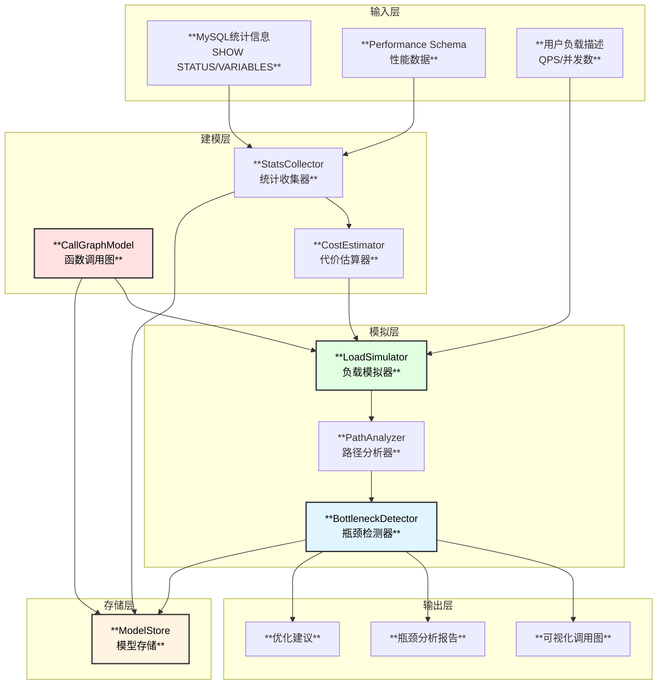
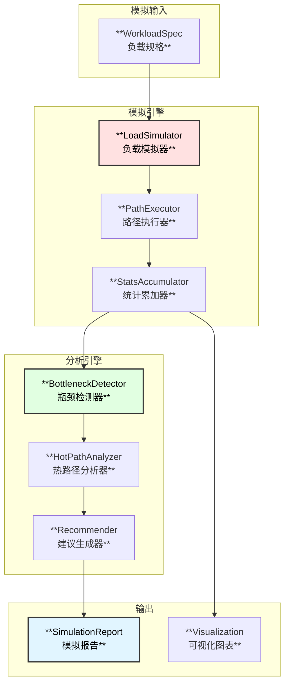

# MySQL内核专家Agent - 模拟功能设计

## 1. 模拟功能概述

模拟功能是MySQL内核专家Agent的核心特性之一，通过构建MySQL内核函数调用图模型，结合统计信息，实现负载模拟和瓶颈分析。

### 1.1 核心能力

| 能力 | 描述 | 应用场景 |
|------|------|----------|
| **函数调用图建模** | 构建可扩展的函数调用关系图 | 理解代码执行路径 |
| **统计信息集成** | 集成MySQL内核统计指标 | 性能分析基础 |
| **负载模拟** | 模拟不同负载下的执行路径 | 预测性能瓶颈 |
| **瓶颈分析** | 识别性能热点和瓶颈 | 优化建议 |
| **模型持久化** | 存储模型供复用 | 历史对比分析 |

### 1.2 系统架构



## 2. 函数调用图模型

### 2.1 模型数据结构

```go
// SimulationModel 模拟模型
type SimulationModel struct {
    ID          string                 `json:"id"`
    Name        string                 `json:"name"`
    Description string                 `json:"description"`
    Version     string                 `json:"version"`
    CreatedAt   time.Time              `json:"created_at"`
    UpdatedAt   time.Time              `json:"updated_at"`
    
    // 图结构
    Graph       *SimulationGraph       `json:"graph"`
    
    // 统计配置
    StatsConfig *StatsConfig           `json:"stats_config"`
    
    // 元数据
    Metadata    map[string]interface{} `json:"metadata"`
}

// SimulationGraph 模拟图
type SimulationGraph struct {
    Nodes       map[string]*SimNode    `json:"nodes"`
    Edges       map[string]*SimEdge    `json:"edges"`
    
    // 入口点
    EntryPoints []string               `json:"entry_points"`
    
    // 统计汇总
    TotalNodes  int                    `json:"total_nodes"`
    TotalEdges  int                    `json:"total_edges"`
    MaxDepth    int                    `json:"max_depth"`
}

// SimNode 模拟节点 (函数)
type SimNode struct {
    ID            string              `json:"id"`
    Name          string              `json:"name"`
    QualifiedName string              `json:"qualified_name"`
    FilePath      string              `json:"file_path"`
    Line          int                 `json:"line"`
    Module        string              `json:"module"`
    Subsystem     string              `json:"subsystem"`
    
    // 节点类型
    NodeType      NodeType            `json:"node_type"`
    
    // 代价模型
    CostModel     *NodeCostModel      `json:"cost_model"`
    
    // 统计信息
    Stats         *NodeStats          `json:"stats"`
    
    // 可视化属性
    Visual        *NodeVisual         `json:"visual"`
}

// NodeType 节点类型
type NodeType string
const (
    NodeTypeEntry       NodeType = "entry"        // 入口函数
    NodeTypeCore        NodeType = "core"         // 核心处理函数
    NodeTypeIO          NodeType = "io"           // IO操作函数
    NodeTypeLock        NodeType = "lock"         // 锁相关函数
    NodeTypeMemory      NodeType = "memory"       // 内存操作函数
    NodeTypeNetwork     NodeType = "network"      // 网络操作函数
    NodeTypeInternal    NodeType = "internal"     // 内部函数
)

// NodeCostModel 节点代价模型
type NodeCostModel struct {
    BaseCPUCost     float64           `json:"base_cpu_cost"`      // 基础CPU代价
    BaseMemoryCost  float64           `json:"base_memory_cost"`   // 基础内存代价
    BaseIOCost      float64           `json:"base_io_cost"`       // 基础IO代价
    BaseLockCost    float64           `json:"base_lock_cost"`     // 基础锁代价
    
    // 缩放因子
    ScaleFactors    map[string]float64 `json:"scale_factors"`     // 变量 -> 缩放因子
    
    // 并发影响
    ConcurrencyFactor float64         `json:"concurrency_factor"` // 并发影响因子
}

// NodeStats 节点统计信息
type NodeStats struct {
    // 执行统计
    CallCount       int64             `json:"call_count"`         // 调用次数
    TotalExecTime   time.Duration     `json:"total_exec_time"`    // 总执行时间
    AvgExecTime     time.Duration     `json:"avg_exec_time"`      // 平均执行时间
    MaxExecTime     time.Duration     `json:"max_exec_time"`      // 最大执行时间
    P99ExecTime     time.Duration     `json:"p99_exec_time"`      // P99执行时间
    
    // 资源统计
    MemoryAlloc     int64             `json:"memory_alloc"`       // 内存分配
    IOBytes         int64             `json:"io_bytes"`           // IO字节数
    IOOps           int64             `json:"io_ops"`             // IO操作数
    
    // 锁统计
    LockWaitTime    time.Duration     `json:"lock_wait_time"`     // 锁等待时间
    LockCount       int64             `json:"lock_count"`         // 锁次数
    
    // 热度
    HotScore        float64           `json:"hot_score"`          // 热度分数
    IsHotPath       bool              `json:"is_hot_path"`        // 是否热路径
}

// SimEdge 模拟边 (调用关系)
type SimEdge struct {
    ID          string              `json:"id"`
    FromNode    string              `json:"from_node"`
    ToNode      string              `json:"to_node"`
    
    // 调用属性
    CallType    CallType            `json:"call_type"`
    Frequency   int64               `json:"frequency"`           // 调用频率
    Probability float64             `json:"probability"`         // 调用概率
    
    // 条件
    Condition   string              `json:"condition,omitempty"` // 调用条件
    
    // 代价
    EdgeCost    float64             `json:"edge_cost"`           // 边的代价
}

// CallType 调用类型
type CallType string
const (
    CallTypeDirect    CallType = "direct"     // 直接调用
    CallTypeVirtual   CallType = "virtual"    // 虚函数调用
    CallTypeCallback  CallType = "callback"   // 回调
    CallTypeAsync     CallType = "async"      // 异步调用
)
```

### 2.2 图可视化设计

```go
// NodeVisual 节点可视化属性
type NodeVisual struct {
    Color       string              `json:"color"`
    Size        float64             `json:"size"`       // 基于调用次数
    Label       string              `json:"label"`
    Tooltip     string              `json:"tooltip"`
    Level       int                 `json:"level"`      // 层级 (用于缩放)
    Group       string              `json:"group"`      // 分组 (模块)
}

// 根据节点类型和热度生成颜色
func (n *SimNode) GenerateVisual() *NodeVisual {
    visual := &NodeVisual{
        Label:   n.Name,
        Group:   n.Module,
    }
    
    // 颜色映射
    switch n.NodeType {
    case NodeTypeEntry:
        visual.Color = "#ff6b6b"  // 红色 - 入口
    case NodeTypeIO:
        visual.Color = "#4ecdc4"  // 青色 - IO
    case NodeTypeLock:
        visual.Color = "#ffe66d"  // 黄色 - 锁
    case NodeTypeMemory:
        visual.Color = "#95e1d3"  // 绿色 - 内存
    default:
        visual.Color = "#dfe6e9"  // 灰色 - 普通
    }
    
    // 如果是热路径，加深颜色
    if n.Stats != nil && n.Stats.IsHotPath {
        visual.Color = darkenColor(visual.Color, 0.2)
    }
    
    // 大小基于调用次数
    if n.Stats != nil {
        visual.Size = math.Log10(float64(n.Stats.CallCount + 1)) * 10
    } else {
        visual.Size = 10
    }
    
    // 生成提示信息
    visual.Tooltip = n.generateTooltip()
    
    return visual
}
```

## 3. 统计信息收集

### 3.1 MySQL统计指标映射

```go
// StatsConfig 统计配置
type StatsConfig struct {
    // MySQL状态变量映射
    StatusMapping   map[string]*StatusMapping   `json:"status_mapping"`
    
    // Performance Schema映射
    PerfSchemaMapping map[string]*PerfSchemaMapping `json:"perf_schema_mapping"`
    
    // 自定义指标
    CustomMetrics   []CustomMetric              `json:"custom_metrics"`
}

// StatusMapping 状态变量映射
type StatusMapping struct {
    MySQLVariable   string    `json:"mysql_variable"`     // MySQL变量名
    NodePattern     string    `json:"node_pattern"`       // 节点匹配模式
    MetricType      string    `json:"metric_type"`        // 指标类型
    ScaleFactor     float64   `json:"scale_factor"`       // 缩放因子
}

// 预定义的MySQL状态变量到函数的映射
var DefaultStatusMappings = map[string]*StatusMapping{
    // 连接相关
    "Connections": {
        MySQLVariable: "Connections",
        NodePattern:   "handle_connection",
        MetricType:    "call_count",
        ScaleFactor:   1.0,
    },
    "Threads_connected": {
        MySQLVariable: "Threads_connected",
        NodePattern:   "thd_*",
        MetricType:    "active_count",
        ScaleFactor:   1.0,
    },
    
    // 查询相关
    "Queries": {
        MySQLVariable: "Queries",
        NodePattern:   "mysql_execute_command",
        MetricType:    "call_count",
        ScaleFactor:   1.0,
    },
    "Com_select": {
        MySQLVariable: "Com_select",
        NodePattern:   "Sql_cmd_select::execute",
        MetricType:    "call_count",
        ScaleFactor:   1.0,
    },
    "Com_insert": {
        MySQLVariable: "Com_insert",
        NodePattern:   "Sql_cmd_insert::execute",
        MetricType:    "call_count",
        ScaleFactor:   1.0,
    },
    
    // InnoDB相关
    "Innodb_buffer_pool_reads": {
        MySQLVariable: "Innodb_buffer_pool_reads",
        NodePattern:   "buf_read_page",
        MetricType:    "io_ops",
        ScaleFactor:   1.0,
    },
    "Innodb_buffer_pool_write_requests": {
        MySQLVariable: "Innodb_buffer_pool_write_requests",
        NodePattern:   "buf_flush_*",
        MetricType:    "io_ops",
        ScaleFactor:   1.0,
    },
    "Innodb_row_lock_waits": {
        MySQLVariable: "Innodb_row_lock_waits",
        NodePattern:   "lock_rec_lock",
        MetricType:    "lock_wait",
        ScaleFactor:   1.0,
    },
    "Innodb_row_lock_time": {
        MySQLVariable: "Innodb_row_lock_time",
        NodePattern:   "lock_rec_lock",
        MetricType:    "lock_time",
        ScaleFactor:   1.0,
    },
    
    // Redo Log相关
    "Innodb_log_writes": {
        MySQLVariable: "Innodb_log_writes",
        NodePattern:   "log_write_up_to",
        MetricType:    "io_ops",
        ScaleFactor:   1.0,
    },
}

// StatsCollector 统计收集器
type StatsCollector struct {
    config *StatsConfig
}

// CollectFromMySQL 从MySQL收集统计信息
func (c *StatsCollector) CollectFromMySQL(dsn string) (*CollectedStats, error) {
    db, err := sql.Open("mysql", dsn)
    if err != nil {
        return nil, err
    }
    defer db.Close()
    
    stats := &CollectedStats{
        Timestamp:   time.Now(),
        StatusVars:  make(map[string]int64),
        PerfMetrics: make(map[string]interface{}),
    }
    
    // 收集状态变量
    rows, err := db.Query("SHOW GLOBAL STATUS")
    if err != nil {
        return nil, err
    }
    for rows.Next() {
        var name, value string
        rows.Scan(&name, &value)
        if v, err := strconv.ParseInt(value, 10, 64); err == nil {
            stats.StatusVars[name] = v
        }
    }
    
    // 收集Performance Schema数据
    if c.config.PerfSchemaMapping != nil {
        for metric, mapping := range c.config.PerfSchemaMapping {
            value, err := c.queryPerfSchema(db, mapping.Query)
            if err == nil {
                stats.PerfMetrics[metric] = value
            }
        }
    }
    
    return stats, nil
}

// ApplyToModel 将统计信息应用到模型
func (c *StatsCollector) ApplyToModel(stats *CollectedStats, model *SimulationModel) error {
    for varName, mapping := range c.config.StatusMapping {
        value, exists := stats.StatusVars[varName]
        if !exists {
            continue
        }
        
        // 查找匹配的节点
        matchedNodes := model.Graph.FindNodesByPattern(mapping.NodePattern)
        
        // 分配统计值
        for _, node := range matchedNodes {
            scaledValue := float64(value) * mapping.ScaleFactor / float64(len(matchedNodes))
            c.applyMetricToNode(node, mapping.MetricType, scaledValue)
        }
    }
    
    return nil
}
```

### 3.2 Performance Schema集成

```go
// PerfSchemaMapping Performance Schema映射
type PerfSchemaMapping struct {
    Query       string            `json:"query"`
    NodeMapping map[string]string `json:"node_mapping"`  // column -> node_field
}

// 预定义的Performance Schema查询
var PerfSchemaQueries = map[string]*PerfSchemaMapping{
    "function_latency": {
        Query: `
            SELECT DIGEST_TEXT, COUNT_STAR, SUM_TIMER_WAIT/1000000000 as total_time_ms,
                   AVG_TIMER_WAIT/1000000000 as avg_time_ms
            FROM performance_schema.events_statements_summary_by_digest
            ORDER BY SUM_TIMER_WAIT DESC
            LIMIT 100
        `,
        NodeMapping: map[string]string{
            "DIGEST_TEXT": "pattern",
            "COUNT_STAR":  "call_count",
            "total_time_ms": "total_exec_time",
            "avg_time_ms": "avg_exec_time",
        },
    },
    "wait_events": {
        Query: `
            SELECT EVENT_NAME, COUNT_STAR, SUM_TIMER_WAIT/1000000000 as total_wait_ms
            FROM performance_schema.events_waits_summary_global_by_event_name
            WHERE COUNT_STAR > 0
            ORDER BY SUM_TIMER_WAIT DESC
            LIMIT 100
        `,
        NodeMapping: map[string]string{
            "EVENT_NAME": "wait_type",
            "COUNT_STAR": "wait_count",
            "total_wait_ms": "wait_time",
        },
    },
    "mutex_contention": {
        Query: `
            SELECT EVENT_NAME, COUNT_STAR, SUM_TIMER_WAIT/1000000000 as contention_ms
            FROM performance_schema.events_waits_summary_global_by_event_name
            WHERE EVENT_NAME LIKE 'wait/synch/mutex%'
            ORDER BY SUM_TIMER_WAIT DESC
            LIMIT 50
        `,
        NodeMapping: map[string]string{
            "EVENT_NAME": "mutex_name",
            "COUNT_STAR": "contention_count",
            "contention_ms": "contention_time",
        },
    },
}
```

## 4. 负载模拟引擎

### 4.1 模拟器设计



### 4.2 负载规格定义

```go
// WorkloadSpec 负载规格
type WorkloadSpec struct {
    Name        string                `json:"name"`
    Description string                `json:"description"`
    
    // 负载类型
    Type        WorkloadType          `json:"type"`
    
    // 负载参数
    QPS         int                   `json:"qps"`              // 每秒查询数
    Concurrency int                   `json:"concurrency"`      // 并发数
    Duration    time.Duration         `json:"duration"`         // 持续时间
    
    // SQL类型分布
    SQLDistribution map[string]float64 `json:"sql_distribution"` // SELECT: 0.7, INSERT: 0.2, UPDATE: 0.1
    
    // 表大小配置
    TableSizes  map[string]int64      `json:"table_sizes"`      // table_name: row_count
    
    // 索引配置
    IndexUsage  map[string]float64    `json:"index_usage"`      // index_name: usage_ratio
    
    // 缓存配置
    BufferPoolHitRatio float64        `json:"buffer_pool_hit_ratio"`
    
    // 自定义入口点
    EntryPoints []EntryPointSpec      `json:"entry_points"`
}

type WorkloadType string
const (
    WorkloadTypeOLTP    WorkloadType = "oltp"      // 在线事务处理
    WorkloadTypeOLAP    WorkloadType = "olap"      // 在线分析处理
    WorkloadTypeMixed   WorkloadType = "mixed"     // 混合负载
    WorkloadTypeCustom  WorkloadType = "custom"    // 自定义
)

type EntryPointSpec struct {
    FunctionName string              `json:"function_name"`
    CallCount    int64               `json:"call_count"`
    Parameters   map[string]interface{} `json:"parameters"`
}

// LoadSimulator 负载模拟器
type LoadSimulator struct {
    model       *SimulationModel
    costModel   *CostModel
    executor    *PathExecutor
    accumulator *StatsAccumulator
}

func NewLoadSimulator(model *SimulationModel) *LoadSimulator {
    return &LoadSimulator{
        model:       model,
        costModel:   NewCostModel(model),
        executor:    NewPathExecutor(model),
        accumulator: NewStatsAccumulator(),
    }
}

// Simulate 执行模拟
func (s *LoadSimulator) Simulate(ctx context.Context, spec *WorkloadSpec) (*SimulationResult, error) {
    result := &SimulationResult{
        Spec:      spec,
        StartTime: time.Now(),
        NodeStats: make(map[string]*SimulatedNodeStats),
        EdgeStats: make(map[string]*SimulatedEdgeStats),
    }
    
    // 1. 确定入口点和调用次数
    entryPoints := s.determineEntryPoints(spec)
    
    // 2. 对每个入口点执行路径模拟
    for _, entry := range entryPoints {
        for i := int64(0); i < entry.CallCount; i++ {
            // 执行一次路径模拟
            pathResult := s.executor.Execute(ctx, entry.FunctionName, spec)
            
            // 累加统计
            s.accumulator.Accumulate(pathResult)
        }
    }
    
    // 3. 计算最终统计
    result.NodeStats = s.accumulator.GetNodeStats()
    result.EdgeStats = s.accumulator.GetEdgeStats()
    result.EndTime = time.Now()
    
    // 4. 分析瓶颈
    result.Bottlenecks = s.analyzeBottlenecks(result)
    
    // 5. 生成热路径
    result.HotPaths = s.identifyHotPaths(result)
    
    return result, nil
}

// determineEntryPoints 确定入口点
func (s *LoadSimulator) determineEntryPoints(spec *WorkloadSpec) []EntryPointSpec {
    entries := make([]EntryPointSpec, 0)
    
    // 根据SQL类型分布计算入口点
    totalCalls := int64(spec.QPS) * int64(spec.Duration.Seconds())
    
    for sqlType, ratio := range spec.SQLDistribution {
        callCount := int64(float64(totalCalls) * ratio)
        
        funcName := s.sqlTypeToFunction(sqlType)
        entries = append(entries, EntryPointSpec{
            FunctionName: funcName,
            CallCount:    callCount,
        })
    }
    
    // 添加自定义入口点
    entries = append(entries, spec.EntryPoints...)
    
    return entries
}

// sqlTypeToFunction SQL类型到函数映射
func (s *LoadSimulator) sqlTypeToFunction(sqlType string) string {
    mapping := map[string]string{
        "SELECT": "Sql_cmd_select::execute",
        "INSERT": "Sql_cmd_insert::execute",
        "UPDATE": "Sql_cmd_update::execute",
        "DELETE": "Sql_cmd_delete::execute",
        "COMMIT": "trans_commit",
        "BEGIN":  "trans_begin",
    }
    return mapping[sqlType]
}
```

### 4.3 路径执行器

```go
// PathExecutor 路径执行器
type PathExecutor struct {
    model     *SimulationModel
    costModel *CostModel
    rng       *rand.Rand
}

// PathResult 路径执行结果
type PathResult struct {
    Path      []*PathNode
    TotalCost *PathCost
}

type PathNode struct {
    NodeID    string
    Cost      *NodeCost
    Children  []*PathNode
}

type PathCost struct {
    CPUTime    time.Duration
    MemoryUsed int64
    IOTime     time.Duration
    LockTime   time.Duration
    TotalTime  time.Duration
}

// Execute 执行一次路径模拟
func (e *PathExecutor) Execute(ctx context.Context, entryFunc string, spec *WorkloadSpec) *PathResult {
    result := &PathResult{
        Path:      make([]*PathNode, 0),
        TotalCost: &PathCost{},
    }
    
    // 从入口函数开始DFS遍历
    entryNode := e.model.Graph.Nodes[entryFunc]
    if entryNode == nil {
        return result
    }
    
    visited := make(map[string]bool)
    e.traverse(entryNode, spec, result, visited, 0)
    
    return result
}

// traverse 遍历执行
func (e *PathExecutor) traverse(node *SimNode, spec *WorkloadSpec, 
    result *PathResult, visited map[string]bool, depth int) {
    
    if depth > 100 { // 防止过深递归
        return
    }
    
    if visited[node.ID] {
        return
    }
    visited[node.ID] = true
    
    // 计算节点代价
    nodeCost := e.costModel.CalculateNodeCost(node, spec)
    
    pathNode := &PathNode{
        NodeID: node.ID,
        Cost:   nodeCost,
    }
    result.Path = append(result.Path, pathNode)
    
    // 累加总代价
    result.TotalCost.CPUTime += nodeCost.CPUTime
    result.TotalCost.MemoryUsed += nodeCost.MemoryUsed
    result.TotalCost.IOTime += nodeCost.IOTime
    result.TotalCost.LockTime += nodeCost.LockTime
    
    // 获取出边
    edges := e.model.Graph.GetOutEdges(node.ID)
    
    for _, edge := range edges {
        // 根据概率决定是否执行
        if e.rng.Float64() < edge.Probability {
            childNode := e.model.Graph.Nodes[edge.ToNode]
            if childNode != nil {
                e.traverse(childNode, spec, result, visited, depth+1)
            }
        }
    }
}

// CostModel 代价模型
type CostModel struct {
    model *SimulationModel
}

// CalculateNodeCost 计算节点代价
func (c *CostModel) CalculateNodeCost(node *SimNode, spec *WorkloadSpec) *NodeCost {
    cost := &NodeCost{}
    
    if node.CostModel == nil {
        return cost
    }
    
    cm := node.CostModel
    
    // 基础代价
    cost.CPUTime = time.Duration(cm.BaseCPUCost * float64(time.Microsecond))
    cost.MemoryUsed = int64(cm.BaseMemoryCost)
    cost.IOTime = time.Duration(cm.BaseIOCost * float64(time.Microsecond))
    cost.LockTime = time.Duration(cm.BaseLockCost * float64(time.Microsecond))
    
    // 应用缩放因子
    for varName, factor := range cm.ScaleFactors {
        switch varName {
        case "table_size":
            if size, ok := spec.TableSizes["default"]; ok {
                scaledFactor := math.Log10(float64(size + 1))
                cost.CPUTime = time.Duration(float64(cost.CPUTime) * scaledFactor * factor)
                cost.IOTime = time.Duration(float64(cost.IOTime) * scaledFactor * factor)
            }
        case "buffer_pool_miss":
            missRatio := 1.0 - spec.BufferPoolHitRatio
            cost.IOTime = time.Duration(float64(cost.IOTime) * (1 + missRatio*10) * factor)
        }
    }
    
    // 并发影响
    if spec.Concurrency > 1 && cm.ConcurrencyFactor > 0 {
        concurrencyPenalty := 1 + cm.ConcurrencyFactor*math.Log10(float64(spec.Concurrency))
        cost.LockTime = time.Duration(float64(cost.LockTime) * concurrencyPenalty)
    }
    
    return cost
}
```

## 5. 瓶颈分析

### 5.1 瓶颈检测器

```go
// BottleneckDetector 瓶颈检测器
type BottleneckDetector struct {
    thresholds *BottleneckThresholds
}

type BottleneckThresholds struct {
    CPUHotRatio      float64  // CPU热点阈值 (占比)
    IOHotRatio       float64  // IO热点阈值
    LockHotRatio     float64  // 锁热点阈值
    MemoryHotRatio   float64  // 内存热点阈值
    MinCallCount     int64    // 最小调用次数
}

var DefaultThresholds = &BottleneckThresholds{
    CPUHotRatio:    0.1,   // 占总CPU时间10%以上
    IOHotRatio:     0.15,  // 占总IO时间15%以上
    LockHotRatio:   0.2,   // 占总锁时间20%以上
    MemoryHotRatio: 0.1,
    MinCallCount:   100,
}

// Bottleneck 瓶颈信息
type Bottleneck struct {
    Type        BottleneckType
    NodeID      string
    NodeName    string
    Severity    BottleneckSeverity
    Metric      string
    Value       float64
    Percentage  float64
    Description string
    Suggestion  string
}

type BottleneckType string
const (
    BottleneckCPU    BottleneckType = "cpu"
    BottleneckIO     BottleneckType = "io"
    BottleneckLock   BottleneckType = "lock"
    BottleneckMemory BottleneckType = "memory"
)

type BottleneckSeverity string
const (
    SeverityCritical BottleneckSeverity = "critical"
    SeverityHigh     BottleneckSeverity = "high"
    SeverityMedium   BottleneckSeverity = "medium"
    SeverityLow      BottleneckSeverity = "low"
)

// Detect 检测瓶颈
func (d *BottleneckDetector) Detect(result *SimulationResult) []Bottleneck {
    bottlenecks := make([]Bottleneck, 0)
    
    // 计算总量
    totals := d.calculateTotals(result)
    
    // 检测各类瓶颈
    for nodeID, stats := range result.NodeStats {
        if stats.CallCount < d.thresholds.MinCallCount {
            continue
        }
        
        // CPU瓶颈
        if cpuRatio := float64(stats.CPUTime) / float64(totals.TotalCPUTime); cpuRatio > d.thresholds.CPUHotRatio {
            bottlenecks = append(bottlenecks, Bottleneck{
                Type:       BottleneckCPU,
                NodeID:     nodeID,
                NodeName:   stats.NodeName,
                Severity:   d.calculateSeverity(cpuRatio),
                Metric:     "cpu_time",
                Value:      float64(stats.CPUTime),
                Percentage: cpuRatio * 100,
                Description: fmt.Sprintf("函数 %s 占用 %.2f%% 的CPU时间", stats.NodeName, cpuRatio*100),
                Suggestion: d.generateSuggestion(BottleneckCPU, stats),
            })
        }
        
        // IO瓶颈
        if ioRatio := float64(stats.IOTime) / float64(totals.TotalIOTime); ioRatio > d.thresholds.IOHotRatio {
            bottlenecks = append(bottlenecks, Bottleneck{
                Type:       BottleneckIO,
                NodeID:     nodeID,
                NodeName:   stats.NodeName,
                Severity:   d.calculateSeverity(ioRatio),
                Metric:     "io_time",
                Value:      float64(stats.IOTime),
                Percentage: ioRatio * 100,
                Description: fmt.Sprintf("函数 %s 占用 %.2f%% 的IO时间", stats.NodeName, ioRatio*100),
                Suggestion: d.generateSuggestion(BottleneckIO, stats),
            })
        }
        
        // 锁瓶颈
        if lockRatio := float64(stats.LockTime) / float64(totals.TotalLockTime); lockRatio > d.thresholds.LockHotRatio {
            bottlenecks = append(bottlenecks, Bottleneck{
                Type:       BottleneckLock,
                NodeID:     nodeID,
                NodeName:   stats.NodeName,
                Severity:   d.calculateSeverity(lockRatio),
                Metric:     "lock_time",
                Value:      float64(stats.LockTime),
                Percentage: lockRatio * 100,
                Description: fmt.Sprintf("函数 %s 占用 %.2f%% 的锁等待时间", stats.NodeName, lockRatio*100),
                Suggestion: d.generateSuggestion(BottleneckLock, stats),
            })
        }
    }
    
    // 按严重程度排序
    sort.Slice(bottlenecks, func(i, j int) bool {
        return bottlenecks[i].Percentage > bottlenecks[j].Percentage
    })
    
    return bottlenecks
}

// generateSuggestion 生成优化建议
func (d *BottleneckDetector) generateSuggestion(bType BottleneckType, stats *SimulatedNodeStats) string {
    suggestions := map[BottleneckType][]string{
        BottleneckCPU: {
            "检查是否可以添加合适的索引减少扫描行数",
            "考虑使用查询缓存或应用层缓存",
            "检查是否有不必要的数据类型转换",
        },
        BottleneckIO: {
            "增加Buffer Pool大小以提高缓存命中率",
            "检查是否有大量随机IO，考虑优化访问模式",
            "考虑使用SSD存储",
        },
        BottleneckLock: {
            "检查事务是否可以更快提交",
            "考虑使用乐观锁或降低隔离级别",
            "检查是否存在锁升级情况",
        },
        BottleneckMemory: {
            "检查是否有内存泄漏",
            "优化大对象的生命周期",
            "考虑使用对象池",
        },
    }
    
    if ss, ok := suggestions[bType]; ok && len(ss) > 0 {
        return ss[0]
    }
    return "需要进一步分析"
}
```

## 6. 模型存储

### 6.1 存储接口

```go
// ModelStore 模型存储接口
type ModelStore interface {
    Save(ctx context.Context, model *SimulationModel) error
    Load(ctx context.Context, id string) (*SimulationModel, error)
    List(ctx context.Context, filter ModelFilter) ([]*ModelMetadata, error)
    Delete(ctx context.Context, id string) error
    
    // 版本管理
    SaveVersion(ctx context.Context, model *SimulationModel, version string) error
    LoadVersion(ctx context.Context, id, version string) (*SimulationModel, error)
    ListVersions(ctx context.Context, id string) ([]string, error)
}

type ModelFilter struct {
    Name      string
    CreatedAfter time.Time
    CreatedBefore time.Time
    Tags      []string
    Limit     int
    Offset    int
}

type ModelMetadata struct {
    ID          string
    Name        string
    Description string
    Version     string
    CreatedAt   time.Time
    UpdatedAt   time.Time
    NodeCount   int
    EdgeCount   int
    Tags        []string
}
```

### 6.2 SQLite实现

```go
// SQLiteModelStore SQLite模型存储
type SQLiteModelStore struct {
    db *sql.DB
}

func NewSQLiteModelStore(dbPath string) (*SQLiteModelStore, error) {
    db, err := sql.Open("sqlite3", dbPath)
    if err != nil {
        return nil, err
    }
    
    store := &SQLiteModelStore{db: db}
    if err := store.initSchema(); err != nil {
        return nil, err
    }
    
    return store, nil
}

func (s *SQLiteModelStore) initSchema() error {
    schema := `
    CREATE TABLE IF NOT EXISTS simulation_models (
        id TEXT PRIMARY KEY,
        name TEXT NOT NULL,
        description TEXT,
        version TEXT,
        graph_data BLOB,
        stats_config TEXT,
        metadata TEXT,
        node_count INTEGER,
        edge_count INTEGER,
        created_at TIMESTAMP DEFAULT CURRENT_TIMESTAMP,
        updated_at TIMESTAMP DEFAULT CURRENT_TIMESTAMP
    );
    
    CREATE INDEX IF NOT EXISTS idx_model_name ON simulation_models(name);
    CREATE INDEX IF NOT EXISTS idx_model_created ON simulation_models(created_at);
    
    CREATE TABLE IF NOT EXISTS model_versions (
        model_id TEXT,
        version TEXT,
        graph_data BLOB,
        created_at TIMESTAMP DEFAULT CURRENT_TIMESTAMP,
        PRIMARY KEY (model_id, version)
    );
    
    CREATE TABLE IF NOT EXISTS model_tags (
        model_id TEXT,
        tag TEXT,
        PRIMARY KEY (model_id, tag)
    );
    `
    _, err := s.db.Exec(schema)
    return err
}

func (s *SQLiteModelStore) Save(ctx context.Context, model *SimulationModel) error {
    graphData, err := json.Marshal(model.Graph)
    if err != nil {
        return err
    }
    
    statsConfig, _ := json.Marshal(model.StatsConfig)
    metadata, _ := json.Marshal(model.Metadata)
    
    _, err = s.db.ExecContext(ctx, `
        INSERT OR REPLACE INTO simulation_models 
        (id, name, description, version, graph_data, stats_config, metadata, node_count, edge_count, updated_at)
        VALUES (?, ?, ?, ?, ?, ?, ?, ?, ?, CURRENT_TIMESTAMP)
    `, model.ID, model.Name, model.Description, model.Version,
        graphData, statsConfig, metadata,
        model.Graph.TotalNodes, model.Graph.TotalEdges)
    
    return err
}

func (s *SQLiteModelStore) Load(ctx context.Context, id string) (*SimulationModel, error) {
    row := s.db.QueryRowContext(ctx, `
        SELECT id, name, description, version, graph_data, stats_config, metadata, created_at, updated_at
        FROM simulation_models WHERE id = ?
    `, id)
    
    var model SimulationModel
    var graphData, statsConfig, metadata []byte
    
    err := row.Scan(&model.ID, &model.Name, &model.Description, &model.Version,
        &graphData, &statsConfig, &metadata, &model.CreatedAt, &model.UpdatedAt)
    if err != nil {
        return nil, err
    }
    
    model.Graph = &SimulationGraph{}
    json.Unmarshal(graphData, model.Graph)
    
    model.StatsConfig = &StatsConfig{}
    json.Unmarshal(statsConfig, model.StatsConfig)
    
    model.Metadata = make(map[string]interface{})
    json.Unmarshal(metadata, &model.Metadata)
    
    return &model, nil
}
```

## 7. 可视化输出

### 7.1 调用图可视化

```go
// GraphVisualizer 图可视化器
type GraphVisualizer struct {
    style *VisualizationStyle
}

type VisualizationStyle struct {
    NodeColors    map[NodeType]string
    EdgeColors    map[CallType]string
    HotPathColor  string
    FontFamily    string
    FontSize      int
}

var DefaultStyle = &VisualizationStyle{
    NodeColors: map[NodeType]string{
        NodeTypeEntry:    "#ff6b6b",
        NodeTypeCore:     "#4ecdc4",
        NodeTypeIO:       "#45b7d1",
        NodeTypeLock:     "#f9ca24",
        NodeTypeMemory:   "#6c5ce7",
        NodeTypeInternal: "#dfe6e9",
    },
    EdgeColors: map[CallType]string{
        CallTypeDirect:   "#333333",
        CallTypeVirtual:  "#e17055",
        CallTypeCallback: "#00b894",
        CallTypeAsync:    "#0984e3",
    },
    HotPathColor: "#e74c3c",
    FontFamily:   "Arial",
    FontSize:     12,
}

// GenerateMermaid 生成Mermaid图
func (v *GraphVisualizer) GenerateMermaid(result *SimulationResult, options *VisualOptions) string {
    var sb strings.Builder
    
    sb.WriteString("graph TD\n")
    
    // 分组节点
    modules := v.groupByModule(result)
    
    for module, nodes := range modules {
        sb.WriteString(fmt.Sprintf("    subgraph \"%s\"\n", module))
        
        for _, nodeID := range nodes {
            stats := result.NodeStats[nodeID]
            node := result.Model.Graph.Nodes[nodeID]
            
            // 节点定义
            label := fmt.Sprintf("**%s**<br/>调用: %d<br/>时间: %.2fms",
                node.Name, stats.CallCount, float64(stats.TotalTime)/float64(time.Millisecond))
            
            sb.WriteString(fmt.Sprintf("        %s[%s]\n", nodeID, label))
            
            // 节点样式
            color := v.style.NodeColors[node.NodeType]
            if stats.IsHotPath {
                color = v.style.HotPathColor
            }
            sb.WriteString(fmt.Sprintf("        style %s fill:%s,stroke:#333,stroke-width:2px,color:#000\n",
                nodeID, color))
        }
        
        sb.WriteString("    end\n")
    }
    
    // 添加边
    for _, edge := range result.Model.Graph.Edges {
        edgeStyle := ""
        if result.EdgeStats[edge.ID] != nil && result.EdgeStats[edge.ID].IsHotPath {
            edgeStyle = "stroke:#e74c3c,stroke-width:3px"
        }
        
        if edgeStyle != "" {
            sb.WriteString(fmt.Sprintf("    %s -->|%d| %s\n", edge.FromNode, edge.Frequency, edge.ToNode))
            sb.WriteString(fmt.Sprintf("    linkStyle %d %s\n", edge.Index, edgeStyle))
        } else {
            sb.WriteString(fmt.Sprintf("    %s --> %s\n", edge.FromNode, edge.ToNode))
        }
    }
    
    return sb.String()
}

// GenerateReport 生成分析报告
func (v *GraphVisualizer) GenerateReport(result *SimulationResult) string {
    var sb strings.Builder
    
    sb.WriteString("# 负载模拟分析报告\n\n")
    
    // 概述
    sb.WriteString("## 1. 概述\n\n")
    sb.WriteString(fmt.Sprintf("- **负载类型**: %s\n", result.Spec.Type))
    sb.WriteString(fmt.Sprintf("- **QPS**: %d\n", result.Spec.QPS))
    sb.WriteString(fmt.Sprintf("- **并发数**: %d\n", result.Spec.Concurrency))
    sb.WriteString(fmt.Sprintf("- **模拟时长**: %v\n", result.Spec.Duration))
    sb.WriteString("\n")
    
    // 调用图
    sb.WriteString("## 2. 函数调用图\n\n")
    sb.WriteString("```mermaid\n")
    sb.WriteString(v.GenerateMermaid(result, nil))
    sb.WriteString("```\n\n")
    
    // 瓶颈分析
    sb.WriteString("## 3. 瓶颈分析\n\n")
    if len(result.Bottlenecks) == 0 {
        sb.WriteString("未检测到明显瓶颈。\n\n")
    } else {
        sb.WriteString("| 类型 | 函数 | 严重程度 | 占比 | 建议 |\n")
        sb.WriteString("|------|------|----------|------|------|\n")
        for _, b := range result.Bottlenecks {
            sb.WriteString(fmt.Sprintf("| %s | %s | %s | %.2f%% | %s |\n",
                b.Type, b.NodeName, b.Severity, b.Percentage, b.Suggestion))
        }
        sb.WriteString("\n")
    }
    
    // 热路径
    sb.WriteString("## 4. 热路径分析\n\n")
    for i, path := range result.HotPaths {
        sb.WriteString(fmt.Sprintf("### 热路径 %d\n\n", i+1))
        sb.WriteString("```\n")
        for j, node := range path.Nodes {
            indent := strings.Repeat("  ", j)
            sb.WriteString(fmt.Sprintf("%s└── %s (%.2fms)\n", indent, node.Name,
                float64(node.Time)/float64(time.Millisecond)))
        }
        sb.WriteString("```\n\n")
    }
    
    // 优化建议
    sb.WriteString("## 5. 优化建议\n\n")
    suggestions := v.generateSuggestions(result)
    for i, s := range suggestions {
        sb.WriteString(fmt.Sprintf("%d. %s\n", i+1, s))
    }
    
    return sb.String()
}
```

## 8. 模拟API

### 8.1 Tool接口

```go
// SimulationTool 模拟工具
var SimulationToolInfo = &schema.ToolInfo{
    Name: "simulate_load",
    Desc: `模拟MySQL负载并分析性能瓶颈。
    
功能：
- 根据负载规格模拟函数调用
- 识别CPU/IO/锁瓶颈
- 生成调用图可视化
- 提供优化建议

输入参数：
- workload_type: 负载类型 (oltp/olap/mixed/custom)
- qps: 每秒查询数
- concurrency: 并发数
- sql_distribution: SQL类型分布
- mysql_stats: MySQL统计信息 (可选)`,
    ParamsOneOf: schema.NewParamsOneOfByParams(map[string]*schema.ParameterInfo{
        "workload_type": {Type: schema.String, Required: true},
        "qps": {Type: schema.Integer, Required: true},
        "concurrency": {Type: schema.Integer, Required: true},
        "sql_distribution": {Type: schema.Object},
        "mysql_stats": {Type: schema.Object},
        "output_format": {Type: schema.String, Desc: "report/diagram/json"},
    }),
}

type SimulationToolImpl struct {
    modelStore *SQLiteModelStore
    simulator  *LoadSimulator
    visualizer *GraphVisualizer
}

func (t *SimulationToolImpl) InvokableRun(ctx context.Context, args string, opts ...tool.Option) (string, error) {
    var params struct {
        WorkloadType    string             `json:"workload_type"`
        QPS             int                `json:"qps"`
        Concurrency     int                `json:"concurrency"`
        SQLDistribution map[string]float64 `json:"sql_distribution"`
        MySQLStats      map[string]int64   `json:"mysql_stats"`
        OutputFormat    string             `json:"output_format"`
    }
    
    if err := json.Unmarshal([]byte(args), &params); err != nil {
        return "", err
    }
    
    // 加载模型
    model, err := t.modelStore.Load(ctx, "default")
    if err != nil {
        return "", fmt.Errorf("加载模型失败: %w", err)
    }
    
    // 应用MySQL统计信息
    if params.MySQLStats != nil {
        collector := &StatsCollector{config: DefaultStatsConfig}
        collector.ApplyToModel(&CollectedStats{StatusVars: params.MySQLStats}, model)
    }
    
    // 构建负载规格
    spec := &WorkloadSpec{
        Type:            WorkloadType(params.WorkloadType),
        QPS:             params.QPS,
        Concurrency:     params.Concurrency,
        SQLDistribution: params.SQLDistribution,
        Duration:        time.Minute, // 模拟1分钟
    }
    
    // 执行模拟
    simulator := NewLoadSimulator(model)
    result, err := simulator.Simulate(ctx, spec)
    if err != nil {
        return "", fmt.Errorf("模拟执行失败: %w", err)
    }
    
    // 生成输出
    switch params.OutputFormat {
    case "diagram":
        return t.visualizer.GenerateMermaid(result, nil), nil
    case "json":
        data, _ := json.MarshalIndent(result, "", "  ")
        return string(data), nil
    default:
        return t.visualizer.GenerateReport(result), nil
    }
}
```
