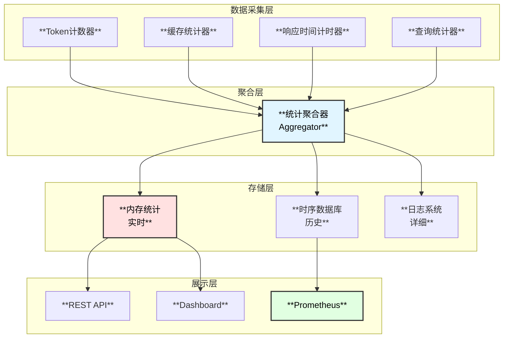

# MySQL内核专家Agent - 统计模块设计

## 1. 统计系统概述

统计模块负责收集、分析和展示Agent运行过程中的各种指标，包括Token消耗、缓存命中率、响应时间等，用于优化系统性能和控制成本。



## 2. Token统计系统

### 2.1 Token计数配置

```go
// TokenStatsConfig Token统计配置
type TokenStatsConfig struct {
    Enabled           bool              `yaml:"enabled"`
    CountMethod       TokenCountMethod  `yaml:"count_method"`       // 计数方法
    ModelTokenizers   map[string]string `yaml:"model_tokenizers"`   // 模型对应的tokenizer
    
    // 预算控制
    BudgetEnabled     bool              `yaml:"budget_enabled"`
    DailyBudget       int64             `yaml:"daily_budget"`       // 每日Token预算
    SessionBudget     int64             `yaml:"session_budget"`     // 每会话Token预算
    AlertThreshold    float64           `yaml:"alert_threshold"`    // 告警阈值 (0.0-1.0)
    
    // 存储配置
    PersistEnabled    bool              `yaml:"persist_enabled"`
    PersistInterval   time.Duration     `yaml:"persist_interval"`
    RetentionDays     int               `yaml:"retention_days"`
}

type TokenCountMethod string
const (
    TokenCountMethodEstimate  TokenCountMethod = "estimate"   // 估算 (快速)
    TokenCountMethodTiktoken  TokenCountMethod = "tiktoken"   // OpenAI tiktoken
    TokenCountMethodModel     TokenCountMethod = "model"      // 模型返回
)
```

### 2.2 Token统计器实现

```go
// TokenStats Token统计
type TokenStats struct {
    config    *TokenStatsConfig
    tokenizer Tokenizer
    mu        sync.RWMutex
    
    // 实时统计
    current   *TokenUsage
    sessions  map[string]*TokenUsage
    
    // 历史统计
    history   *TokenHistory
    
    // 预算跟踪
    budget    *BudgetTracker
}

// TokenUsage Token使用情况
type TokenUsage struct {
    InputTokens      int64             `json:"input_tokens"`
    OutputTokens     int64             `json:"output_tokens"`
    TotalTokens      int64             `json:"total_tokens"`
    CachedTokens     int64             `json:"cached_tokens"`       // 缓存命中节省的Token
    
    // 分类统计
    ByModel          map[string]int64  `json:"by_model"`
    ByOperation      map[string]int64  `json:"by_operation"`
    ByAgent          map[string]int64  `json:"by_agent"`
    
    // 成本估算
    EstimatedCost    float64           `json:"estimated_cost_usd"`
    
    StartTime        time.Time         `json:"start_time"`
    LastUpdateTime   time.Time         `json:"last_update_time"`
}

// TokenEvent Token事件
type TokenEvent struct {
    SessionID    string            `json:"session_id"`
    RequestID    string            `json:"request_id"`
    Model        string            `json:"model"`
    Operation    string            `json:"operation"`
    Agent        string            `json:"agent"`
    InputTokens  int64             `json:"input_tokens"`
    OutputTokens int64             `json:"output_tokens"`
    CachedTokens int64             `json:"cached_tokens"`
    Timestamp    time.Time         `json:"timestamp"`
    Metadata     map[string]string `json:"metadata,omitempty"`
}

func NewTokenStats(config *TokenStatsConfig) (*TokenStats, error) {
    tokenizer, err := createTokenizer(config)
    if err != nil {
        return nil, err
    }
    
    stats := &TokenStats{
        config:    config,
        tokenizer: tokenizer,
        current:   &TokenUsage{
            ByModel:     make(map[string]int64),
            ByOperation: make(map[string]int64),
            ByAgent:     make(map[string]int64),
            StartTime:   time.Now(),
        },
        sessions:  make(map[string]*TokenUsage),
        history:   NewTokenHistory(config.RetentionDays),
        budget:    NewBudgetTracker(config),
    }
    
    // 启动定期持久化
    if config.PersistEnabled {
        go stats.persistLoop()
    }
    
    return stats, nil
}

// RecordTokenUsage 记录Token使用
func (s *TokenStats) RecordTokenUsage(event *TokenEvent) error {
    s.mu.Lock()
    defer s.mu.Unlock()
    
    total := event.InputTokens + event.OutputTokens
    
    // 更新全局统计
    s.current.InputTokens += event.InputTokens
    s.current.OutputTokens += event.OutputTokens
    s.current.TotalTokens += total
    s.current.CachedTokens += event.CachedTokens
    s.current.ByModel[event.Model] += total
    s.current.ByOperation[event.Operation] += total
    s.current.ByAgent[event.Agent] += total
    s.current.LastUpdateTime = time.Now()
    
    // 更新成本估算
    s.current.EstimatedCost += s.estimateCost(event)
    
    // 更新会话统计
    if event.SessionID != "" {
        session, ok := s.sessions[event.SessionID]
        if !ok {
            session = &TokenUsage{
                ByModel:     make(map[string]int64),
                ByOperation: make(map[string]int64),
                ByAgent:     make(map[string]int64),
                StartTime:   time.Now(),
            }
            s.sessions[event.SessionID] = session
        }
        session.InputTokens += event.InputTokens
        session.OutputTokens += event.OutputTokens
        session.TotalTokens += total
        session.CachedTokens += event.CachedTokens
        session.LastUpdateTime = time.Now()
    }
    
    // 检查预算
    if s.config.BudgetEnabled {
        if err := s.budget.CheckAndAlert(s.current.TotalTokens); err != nil {
            return err
        }
    }
    
    // 记录历史
    s.history.Record(event)
    
    return nil
}

// CountTokens 计算文本的Token数
func (s *TokenStats) CountTokens(text string, model string) (int64, error) {
    switch s.config.CountMethod {
    case TokenCountMethodEstimate:
        // 简单估算: 每4个字符约1个token (英文)
        // 中文每1.5个字符约1个token
        return estimateTokens(text), nil
    case TokenCountMethodTiktoken:
        return s.tokenizer.Count(text, model)
    default:
        return estimateTokens(text), nil
    }
}

// estimateTokens 估算Token数
func estimateTokens(text string) int64 {
    // 简单启发式算法
    englishChars := 0
    chineseChars := 0
    
    for _, r := range text {
        if r >= 0x4e00 && r <= 0x9fff {
            chineseChars++
        } else {
            englishChars++
        }
    }
    
    // 英文约4字符/token，中文约1.5字符/token
    return int64(englishChars/4 + chineseChars*2/3)
}

// estimateCost 估算成本
func (s *TokenStats) estimateCost(event *TokenEvent) float64 {
    // 模型价格表 (USD per 1K tokens)
    prices := map[string]struct{ input, output float64 }{
        "gpt-4-turbo":         {0.01, 0.03},
        "gpt-4":               {0.03, 0.06},
        "gpt-3.5-turbo":       {0.0005, 0.0015},
        "claude-3-opus":       {0.015, 0.075},
        "claude-3-sonnet":     {0.003, 0.015},
        "qwen-turbo":          {0.002, 0.006},
        "qwen-plus":           {0.004, 0.012},
        "deepseek-chat":       {0.0014, 0.0028},
        "glm-4":               {0.01, 0.01},
    }
    
    price, ok := prices[event.Model]
    if !ok {
        // 默认价格
        price = struct{ input, output float64 }{0.01, 0.03}
    }
    
    return float64(event.InputTokens)*price.input/1000 + 
           float64(event.OutputTokens)*price.output/1000
}

// GetUsage 获取使用统计
func (s *TokenStats) GetUsage() *TokenUsage {
    s.mu.RLock()
    defer s.mu.RUnlock()
    
    // 返回副本
    usage := *s.current
    usage.ByModel = make(map[string]int64)
    usage.ByOperation = make(map[string]int64)
    usage.ByAgent = make(map[string]int64)
    
    for k, v := range s.current.ByModel {
        usage.ByModel[k] = v
    }
    for k, v := range s.current.ByOperation {
        usage.ByOperation[k] = v
    }
    for k, v := range s.current.ByAgent {
        usage.ByAgent[k] = v
    }
    
    return &usage
}

// GetSessionUsage 获取会话使用统计
func (s *TokenStats) GetSessionUsage(sessionID string) *TokenUsage {
    s.mu.RLock()
    defer s.mu.RUnlock()
    
    if session, ok := s.sessions[sessionID]; ok {
        usage := *session
        return &usage
    }
    return nil
}
```

### 2.3 预算控制器

```go
// BudgetTracker 预算跟踪器
type BudgetTracker struct {
    config        *TokenStatsConfig
    dailyUsage    int64
    alertSent     bool
    lastResetDate string
    mu            sync.RWMutex
}

func NewBudgetTracker(config *TokenStatsConfig) *BudgetTracker {
    return &BudgetTracker{
        config:        config,
        lastResetDate: time.Now().Format("2006-01-02"),
    }
}

// CheckAndAlert 检查预算并告警
func (b *BudgetTracker) CheckAndAlert(totalTokens int64) error {
    b.mu.Lock()
    defer b.mu.Unlock()
    
    // 检查是否需要重置
    today := time.Now().Format("2006-01-02")
    if today != b.lastResetDate {
        b.dailyUsage = 0
        b.alertSent = false
        b.lastResetDate = today
    }
    
    b.dailyUsage = totalTokens
    
    // 检查是否超预算
    if b.config.DailyBudget > 0 && b.dailyUsage > b.config.DailyBudget {
        return ErrDailyBudgetExceeded
    }
    
    // 检查是否需要告警
    if !b.alertSent && b.config.DailyBudget > 0 {
        threshold := float64(b.config.DailyBudget) * b.config.AlertThreshold
        if float64(b.dailyUsage) > threshold {
            b.alertSent = true
            // 发送告警
            b.sendAlert()
        }
    }
    
    return nil
}

func (b *BudgetTracker) sendAlert() {
    // TODO: 实现告警发送 (邮件、Slack、钉钉等)
    log.Warn("Token budget alert", 
        "daily_usage", b.dailyUsage,
        "daily_budget", b.config.DailyBudget,
        "threshold", b.config.AlertThreshold)
}

// GetBudgetStatus 获取预算状态
func (b *BudgetTracker) GetBudgetStatus() *BudgetStatus {
    b.mu.RLock()
    defer b.mu.RUnlock()
    
    return &BudgetStatus{
        DailyBudget:    b.config.DailyBudget,
        DailyUsage:     b.dailyUsage,
        DailyRemaining: b.config.DailyBudget - b.dailyUsage,
        UsagePercent:   float64(b.dailyUsage) / float64(b.config.DailyBudget) * 100,
        AlertSent:      b.alertSent,
    }
}

type BudgetStatus struct {
    DailyBudget    int64   `json:"daily_budget"`
    DailyUsage     int64   `json:"daily_usage"`
    DailyRemaining int64   `json:"daily_remaining"`
    UsagePercent   float64 `json:"usage_percent"`
    AlertSent      bool    `json:"alert_sent"`
}
```

## 3. 缓存命中统计

### 3.1 缓存统计配置

```go
// CacheStatsConfig 缓存统计配置
type CacheStatsConfig struct {
    Enabled          bool          `yaml:"enabled"`
    DetailLevel      DetailLevel   `yaml:"detail_level"`       // 详细程度
    HistogramBuckets []float64     `yaml:"histogram_buckets"`  // 延迟直方图桶
    
    // 报告配置
    ReportInterval   time.Duration `yaml:"report_interval"`
    ReportEnabled    bool          `yaml:"report_enabled"`
}

type DetailLevel string
const (
    DetailLevelBasic    DetailLevel = "basic"    // 基础: 命中/未命中
    DetailLevelStandard DetailLevel = "standard" // 标准: 分层统计
    DetailLevelDetailed DetailLevel = "detailed" // 详细: 包含延迟分布
)
```

### 3.2 缓存统计实现

```go
// CacheStatsCollector 缓存统计收集器
type CacheStatsCollector struct {
    config *CacheStatsConfig
    
    // 各层缓存统计
    l1Stats  *LayerStats
    l2Stats  *LayerStats
    l3Stats  *LayerStats
    
    // 内存统计
    memoryStats *MemoryStats
    
    // 延迟统计
    latency *LatencyStats
    
    mu sync.RWMutex
}

// LayerStats 层级统计
type LayerStats struct {
    Name         string        `json:"name"`
    Hits         atomic.Int64  `json:"hits"`
    Misses       atomic.Int64  `json:"misses"`
    Sets         atomic.Int64  `json:"sets"`
    Deletes      atomic.Int64  `json:"deletes"`
    Evictions    atomic.Int64  `json:"evictions"`
    BytesRead    atomic.Int64  `json:"bytes_read"`
    BytesWritten atomic.Int64  `json:"bytes_written"`
    
    // 延迟统计
    GetLatency   *LatencyHistogram `json:"get_latency"`
    SetLatency   *LatencyHistogram `json:"set_latency"`
}

// LatencyHistogram 延迟直方图
type LatencyHistogram struct {
    Buckets []float64       `json:"buckets"`
    Counts  []atomic.Int64  `json:"counts"`
    Sum     atomic.Int64    `json:"sum"`
    Count   atomic.Int64    `json:"count"`
}

func NewCacheStatsCollector(config *CacheStatsConfig) *CacheStatsCollector {
    collector := &CacheStatsCollector{
        config:      config,
        l1Stats:     newLayerStats("L1", config.HistogramBuckets),
        l2Stats:     newLayerStats("L2", config.HistogramBuckets),
        l3Stats:     newLayerStats("L3", config.HistogramBuckets),
        memoryStats: &MemoryStats{},
        latency:     &LatencyStats{},
    }
    
    if config.ReportEnabled {
        go collector.reportLoop()
    }
    
    return collector
}

func newLayerStats(name string, buckets []float64) *LayerStats {
    return &LayerStats{
        Name:       name,
        GetLatency: newLatencyHistogram(buckets),
        SetLatency: newLatencyHistogram(buckets),
    }
}

// RecordHit 记录命中
func (c *CacheStatsCollector) RecordHit(layer string, latency time.Duration, bytes int64) {
    stats := c.getLayerStats(layer)
    if stats == nil {
        return
    }
    
    stats.Hits.Add(1)
    stats.BytesRead.Add(bytes)
    stats.GetLatency.Observe(latency.Seconds())
}

// RecordMiss 记录未命中
func (c *CacheStatsCollector) RecordMiss(layer string, latency time.Duration) {
    stats := c.getLayerStats(layer)
    if stats == nil {
        return
    }
    
    stats.Misses.Add(1)
    stats.GetLatency.Observe(latency.Seconds())
}

// RecordSet 记录写入
func (c *CacheStatsCollector) RecordSet(layer string, latency time.Duration, bytes int64) {
    stats := c.getLayerStats(layer)
    if stats == nil {
        return
    }
    
    stats.Sets.Add(1)
    stats.BytesWritten.Add(bytes)
    stats.SetLatency.Observe(latency.Seconds())
}

// RecordEviction 记录淘汰
func (c *CacheStatsCollector) RecordEviction(layer string) {
    stats := c.getLayerStats(layer)
    if stats == nil {
        return
    }
    
    stats.Evictions.Add(1)
}

func (c *CacheStatsCollector) getLayerStats(layer string) *LayerStats {
    switch layer {
    case "L1", "l1":
        return c.l1Stats
    case "L2", "l2":
        return c.l2Stats
    case "L3", "l3":
        return c.l3Stats
    default:
        return nil
    }
}

// GetReport 获取统计报告
func (c *CacheStatsCollector) GetReport() *CacheStatsReport {
    return &CacheStatsReport{
        L1:          c.getLayerReport(c.l1Stats),
        L2:          c.getLayerReport(c.l2Stats),
        L3:          c.getLayerReport(c.l3Stats),
        Overall:     c.getOverallReport(),
        GeneratedAt: time.Now(),
    }
}

func (c *CacheStatsCollector) getLayerReport(stats *LayerStats) *LayerReport {
    hits := stats.Hits.Load()
    misses := stats.Misses.Load()
    total := hits + misses
    
    hitRate := float64(0)
    if total > 0 {
        hitRate = float64(hits) / float64(total) * 100
    }
    
    return &LayerReport{
        Name:         stats.Name,
        Hits:         hits,
        Misses:       misses,
        HitRate:      hitRate,
        Sets:         stats.Sets.Load(),
        Evictions:    stats.Evictions.Load(),
        BytesRead:    stats.BytesRead.Load(),
        BytesWritten: stats.BytesWritten.Load(),
        AvgGetLatency: stats.GetLatency.Average(),
        AvgSetLatency: stats.SetLatency.Average(),
        P99GetLatency: stats.GetLatency.Percentile(0.99),
    }
}

func (c *CacheStatsCollector) getOverallReport() *OverallReport {
    totalHits := c.l1Stats.Hits.Load() + c.l2Stats.Hits.Load() + c.l3Stats.Hits.Load()
    totalMisses := c.l3Stats.Misses.Load() // 只有最后一层的miss算真正的miss
    total := totalHits + totalMisses
    
    hitRate := float64(0)
    if total > 0 {
        hitRate = float64(totalHits) / float64(total) * 100
    }
    
    return &OverallReport{
        TotalHits:      totalHits,
        TotalMisses:    totalMisses,
        OverallHitRate: hitRate,
        TokensSaved:    c.calculateTokensSaved(totalHits),
    }
}

func (c *CacheStatsCollector) calculateTokensSaved(hits int64) int64 {
    // 假设每次缓存命中平均节省500 tokens
    return hits * 500
}

// CacheStatsReport 缓存统计报告
type CacheStatsReport struct {
    L1          *LayerReport   `json:"l1"`
    L2          *LayerReport   `json:"l2"`
    L3          *LayerReport   `json:"l3"`
    Overall     *OverallReport `json:"overall"`
    GeneratedAt time.Time      `json:"generated_at"`
}

type LayerReport struct {
    Name          string  `json:"name"`
    Hits          int64   `json:"hits"`
    Misses        int64   `json:"misses"`
    HitRate       float64 `json:"hit_rate_percent"`
    Sets          int64   `json:"sets"`
    Evictions     int64   `json:"evictions"`
    BytesRead     int64   `json:"bytes_read"`
    BytesWritten  int64   `json:"bytes_written"`
    AvgGetLatency float64 `json:"avg_get_latency_ms"`
    AvgSetLatency float64 `json:"avg_set_latency_ms"`
    P99GetLatency float64 `json:"p99_get_latency_ms"`
}

type OverallReport struct {
    TotalHits      int64   `json:"total_hits"`
    TotalMisses    int64   `json:"total_misses"`
    OverallHitRate float64 `json:"overall_hit_rate_percent"`
    TokensSaved    int64   `json:"tokens_saved"`
}
```

## 4. 统一统计聚合

### 4.1 统计管理器

```go
// StatsManager 统计管理器
type StatsManager struct {
    config     *StatsConfig
    
    tokenStats *TokenStats
    cacheStats *CacheStatsCollector
    queryStats *QueryStatsCollector
    agentStats *AgentStatsCollector
    
    // Prometheus导出器
    exporter   *PrometheusExporter
    
    // 报告生成器
    reporter   *StatsReporter
}

// StatsConfig 统计配置
type StatsConfig struct {
    Token         TokenStatsConfig     `yaml:"token"`
    Cache         CacheStatsConfig     `yaml:"cache"`
    Query         QueryStatsConfig     `yaml:"query"`
    Agent         AgentStatsConfig     `yaml:"agent"`
    
    // Prometheus配置
    Prometheus    PrometheusConfig     `yaml:"prometheus"`
    
    // 报告配置
    Report        ReportConfig         `yaml:"report"`
}

type QueryStatsConfig struct {
    Enabled          bool          `yaml:"enabled"`
    SlowQueryThreshold time.Duration `yaml:"slow_query_threshold"`
    TopKQueries      int           `yaml:"top_k_queries"`
}

type AgentStatsConfig struct {
    Enabled          bool          `yaml:"enabled"`
    TrackToolUsage   bool          `yaml:"track_tool_usage"`
    TrackSubAgents   bool          `yaml:"track_sub_agents"`
}

type ReportConfig struct {
    Enabled          bool          `yaml:"enabled"`
    Interval         time.Duration `yaml:"interval"`
    Format           string        `yaml:"format"`  // "json" | "text" | "html"
    OutputPath       string        `yaml:"output_path"`
}

func NewStatsManager(config *StatsConfig) (*StatsManager, error) {
    manager := &StatsManager{
        config: config,
    }
    
    if config.Token.Enabled {
        tokenStats, err := NewTokenStats(&config.Token)
        if err != nil {
            return nil, err
        }
        manager.tokenStats = tokenStats
    }
    
    if config.Cache.Enabled {
        manager.cacheStats = NewCacheStatsCollector(&config.Cache)
    }
    
    if config.Query.Enabled {
        manager.queryStats = NewQueryStatsCollector(&config.Query)
    }
    
    if config.Agent.Enabled {
        manager.agentStats = NewAgentStatsCollector(&config.Agent)
    }
    
    if config.Prometheus.Enabled {
        manager.exporter = NewPrometheusExporter(&config.Prometheus)
        manager.registerMetrics()
    }
    
    if config.Report.Enabled {
        manager.reporter = NewStatsReporter(&config.Report)
        go manager.reportLoop()
    }
    
    return manager, nil
}

// RecordLLMCall 记录LLM调用
func (m *StatsManager) RecordLLMCall(event *LLMCallEvent) {
    if m.tokenStats != nil {
        m.tokenStats.RecordTokenUsage(&TokenEvent{
            SessionID:    event.SessionID,
            RequestID:    event.RequestID,
            Model:        event.Model,
            Operation:    event.Operation,
            Agent:        event.Agent,
            InputTokens:  event.InputTokens,
            OutputTokens: event.OutputTokens,
            CachedTokens: event.CachedTokens,
            Timestamp:    time.Now(),
        })
    }
    
    if m.agentStats != nil {
        m.agentStats.RecordAgentCall(event)
    }
}

// RecordCacheOperation 记录缓存操作
func (m *StatsManager) RecordCacheOperation(op *CacheOperation) {
    if m.cacheStats == nil {
        return
    }
    
    switch op.Type {
    case "hit":
        m.cacheStats.RecordHit(op.Layer, op.Latency, op.Bytes)
    case "miss":
        m.cacheStats.RecordMiss(op.Layer, op.Latency)
    case "set":
        m.cacheStats.RecordSet(op.Layer, op.Latency, op.Bytes)
    case "evict":
        m.cacheStats.RecordEviction(op.Layer)
    }
}

// RecordQuery 记录查询
func (m *StatsManager) RecordQuery(query *QueryEvent) {
    if m.queryStats != nil {
        m.queryStats.Record(query)
    }
}

// GetFullReport 获取完整报告
func (m *StatsManager) GetFullReport() *FullStatsReport {
    report := &FullStatsReport{
        GeneratedAt: time.Now(),
    }
    
    if m.tokenStats != nil {
        report.Token = m.tokenStats.GetUsage()
        report.Budget = m.tokenStats.budget.GetBudgetStatus()
    }
    
    if m.cacheStats != nil {
        report.Cache = m.cacheStats.GetReport()
    }
    
    if m.queryStats != nil {
        report.Query = m.queryStats.GetReport()
    }
    
    if m.agentStats != nil {
        report.Agent = m.agentStats.GetReport()
    }
    
    return report
}

type FullStatsReport struct {
    Token       *TokenUsage        `json:"token,omitempty"`
    Budget      *BudgetStatus      `json:"budget,omitempty"`
    Cache       *CacheStatsReport  `json:"cache,omitempty"`
    Query       *QueryStatsReport  `json:"query,omitempty"`
    Agent       *AgentStatsReport  `json:"agent,omitempty"`
    GeneratedAt time.Time          `json:"generated_at"`
}
```

## 5. Prometheus指标导出

### 5.1 指标定义

```go
// PrometheusExporter Prometheus导出器
type PrometheusExporter struct {
    config *PrometheusConfig
    
    // Token指标
    tokenInputTotal      *prometheus.CounterVec
    tokenOutputTotal     *prometheus.CounterVec
    tokenCostTotal       *prometheus.CounterVec
    tokenBudgetUsed      *prometheus.GaugeVec
    
    // 缓存指标
    cacheHitsTotal       *prometheus.CounterVec
    cacheMissesTotal     *prometheus.CounterVec
    cacheLatency         *prometheus.HistogramVec
    
    // 查询指标
    queryTotal           *prometheus.CounterVec
    queryLatency         *prometheus.HistogramVec
    
    // Agent指标
    agentCallsTotal      *prometheus.CounterVec
    agentLatency         *prometheus.HistogramVec
    agentErrors          *prometheus.CounterVec
}

type PrometheusConfig struct {
    Enabled       bool   `yaml:"enabled"`
    Port          int    `yaml:"port"`
    Path          string `yaml:"path"`
    Namespace     string `yaml:"namespace"`
    Subsystem     string `yaml:"subsystem"`
}

func NewPrometheusExporter(config *PrometheusConfig) *PrometheusExporter {
    namespace := config.Namespace
    if namespace == "" {
        namespace = "mysql_expert"
    }
    
    exporter := &PrometheusExporter{
        config: config,
        
        tokenInputTotal: prometheus.NewCounterVec(
            prometheus.CounterOpts{
                Namespace: namespace,
                Name:      "token_input_total",
                Help:      "Total input tokens consumed",
            },
            []string{"model", "agent"},
        ),
        
        tokenOutputTotal: prometheus.NewCounterVec(
            prometheus.CounterOpts{
                Namespace: namespace,
                Name:      "token_output_total",
                Help:      "Total output tokens generated",
            },
            []string{"model", "agent"},
        ),
        
        tokenCostTotal: prometheus.NewCounterVec(
            prometheus.CounterOpts{
                Namespace: namespace,
                Name:      "token_cost_usd_total",
                Help:      "Total estimated cost in USD",
            },
            []string{"model"},
        ),
        
        tokenBudgetUsed: prometheus.NewGaugeVec(
            prometheus.GaugeOpts{
                Namespace: namespace,
                Name:      "token_budget_used_percent",
                Help:      "Percentage of daily token budget used",
            },
            []string{},
        ),
        
        cacheHitsTotal: prometheus.NewCounterVec(
            prometheus.CounterOpts{
                Namespace: namespace,
                Name:      "cache_hits_total",
                Help:      "Total cache hits",
            },
            []string{"layer"},
        ),
        
        cacheMissesTotal: prometheus.NewCounterVec(
            prometheus.CounterOpts{
                Namespace: namespace,
                Name:      "cache_misses_total",
                Help:      "Total cache misses",
            },
            []string{"layer"},
        ),
        
        cacheLatency: prometheus.NewHistogramVec(
            prometheus.HistogramOpts{
                Namespace: namespace,
                Name:      "cache_operation_duration_seconds",
                Help:      "Cache operation latency",
                Buckets:   prometheus.ExponentialBuckets(0.0001, 2, 15),
            },
            []string{"layer", "operation"},
        ),
        
        queryTotal: prometheus.NewCounterVec(
            prometheus.CounterOpts{
                Namespace: namespace,
                Name:      "query_total",
                Help:      "Total queries executed",
            },
            []string{"type"},
        ),
        
        queryLatency: prometheus.NewHistogramVec(
            prometheus.HistogramOpts{
                Namespace: namespace,
                Name:      "query_duration_seconds",
                Help:      "Query latency",
                Buckets:   prometheus.ExponentialBuckets(0.001, 2, 15),
            },
            []string{"type"},
        ),
        
        agentCallsTotal: prometheus.NewCounterVec(
            prometheus.CounterOpts{
                Namespace: namespace,
                Name:      "agent_calls_total",
                Help:      "Total agent invocations",
            },
            []string{"agent", "tool"},
        ),
        
        agentLatency: prometheus.NewHistogramVec(
            prometheus.HistogramOpts{
                Namespace: namespace,
                Name:      "agent_duration_seconds",
                Help:      "Agent execution latency",
                Buckets:   prometheus.ExponentialBuckets(0.1, 2, 15),
            },
            []string{"agent"},
        ),
        
        agentErrors: prometheus.NewCounterVec(
            prometheus.CounterOpts{
                Namespace: namespace,
                Name:      "agent_errors_total",
                Help:      "Total agent errors",
            },
            []string{"agent", "error_type"},
        ),
    }
    
    return exporter
}

// Register 注册指标
func (e *PrometheusExporter) Register(reg prometheus.Registerer) {
    reg.MustRegister(
        e.tokenInputTotal,
        e.tokenOutputTotal,
        e.tokenCostTotal,
        e.tokenBudgetUsed,
        e.cacheHitsTotal,
        e.cacheMissesTotal,
        e.cacheLatency,
        e.queryTotal,
        e.queryLatency,
        e.agentCallsTotal,
        e.agentLatency,
        e.agentErrors,
    )
}

// Serve 启动HTTP服务
func (e *PrometheusExporter) Serve() error {
    http.Handle(e.config.Path, promhttp.Handler())
    return http.ListenAndServe(fmt.Sprintf(":%d", e.config.Port), nil)
}
```

## 6. 统计可视化

### 6.1 统计报告格式

```go
// StatsReporter 统计报告生成器
type StatsReporter struct {
    config  *ReportConfig
    manager *StatsManager
}

// GenerateReport 生成报告
func (r *StatsReporter) GenerateReport(stats *FullStatsReport) (string, error) {
    switch r.config.Format {
    case "json":
        return r.generateJSON(stats)
    case "text":
        return r.generateText(stats)
    case "html":
        return r.generateHTML(stats)
    default:
        return r.generateText(stats)
    }
}

func (r *StatsReporter) generateText(stats *FullStatsReport) (string, error) {
    var sb strings.Builder
    
    sb.WriteString("═══════════════════════════════════════════════════════\n")
    sb.WriteString("           MySQL内核专家Agent 统计报告\n")
    sb.WriteString("═══════════════════════════════════════════════════════\n")
    sb.WriteString(fmt.Sprintf("生成时间: %s\n\n", stats.GeneratedAt.Format("2006-01-02 15:04:05")))
    
    // Token统计
    if stats.Token != nil {
        sb.WriteString("【Token使用统计】\n")
        sb.WriteString("───────────────────────────────────────────────────────\n")
        sb.WriteString(fmt.Sprintf("  输入Token:    %d\n", stats.Token.InputTokens))
        sb.WriteString(fmt.Sprintf("  输出Token:    %d\n", stats.Token.OutputTokens))
        sb.WriteString(fmt.Sprintf("  总Token:      %d\n", stats.Token.TotalTokens))
        sb.WriteString(fmt.Sprintf("  缓存节省:     %d\n", stats.Token.CachedTokens))
        sb.WriteString(fmt.Sprintf("  预估成本:     $%.4f\n", stats.Token.EstimatedCost))
        sb.WriteString("\n")
        
        sb.WriteString("  按模型分布:\n")
        for model, tokens := range stats.Token.ByModel {
            sb.WriteString(fmt.Sprintf("    - %s: %d\n", model, tokens))
        }
        sb.WriteString("\n")
    }
    
    // 预算状态
    if stats.Budget != nil {
        sb.WriteString("【预算状态】\n")
        sb.WriteString("───────────────────────────────────────────────────────\n")
        sb.WriteString(fmt.Sprintf("  每日预算:     %d\n", stats.Budget.DailyBudget))
        sb.WriteString(fmt.Sprintf("  已使用:       %d (%.1f%%)\n", 
            stats.Budget.DailyUsage, stats.Budget.UsagePercent))
        sb.WriteString(fmt.Sprintf("  剩余:         %d\n", stats.Budget.DailyRemaining))
        sb.WriteString("\n")
    }
    
    // 缓存统计
    if stats.Cache != nil {
        sb.WriteString("【缓存命中统计】\n")
        sb.WriteString("───────────────────────────────────────────────────────\n")
        sb.WriteString(fmt.Sprintf("  整体命中率:   %.1f%%\n", stats.Cache.Overall.OverallHitRate))
        sb.WriteString(fmt.Sprintf("  Token节省:    %d\n", stats.Cache.Overall.TokensSaved))
        sb.WriteString("\n")
        sb.WriteString("  分层统计:\n")
        for _, layer := range []*LayerReport{stats.Cache.L1, stats.Cache.L2, stats.Cache.L3} {
            sb.WriteString(fmt.Sprintf("    %s: 命中率 %.1f%%, 命中 %d, 未命中 %d\n",
                layer.Name, layer.HitRate, layer.Hits, layer.Misses))
        }
        sb.WriteString("\n")
    }
    
    sb.WriteString("═══════════════════════════════════════════════════════\n")
    
    return sb.String(), nil
}

func (r *StatsReporter) generateHTML(stats *FullStatsReport) (string, error) {
    tmpl := `
<!DOCTYPE html>
<html>
<head>
    <title>MySQL内核专家Agent 统计报告</title>
    <style>
        body { font-family: Arial, sans-serif; margin: 20px; background: #f5f5f5; }
        .container { max-width: 1200px; margin: 0 auto; }
        .card { background: white; border-radius: 8px; padding: 20px; margin: 10px 0; box-shadow: 0 2px 4px rgba(0,0,0,0.1); }
        .card h2 { color: #333; border-bottom: 2px solid #4CAF50; padding-bottom: 10px; }
        .stat-row { display: flex; justify-content: space-between; margin: 10px 0; }
        .stat-label { color: #666; }
        .stat-value { font-weight: bold; color: #333; }
        .progress-bar { background: #e0e0e0; border-radius: 4px; height: 20px; overflow: hidden; }
        .progress-fill { background: #4CAF50; height: 100%; transition: width 0.3s; }
        .alert { background: #fff3cd; border: 1px solid #ffc107; border-radius: 4px; padding: 10px; margin: 10px 0; }
        table { width: 100%; border-collapse: collapse; }
        th, td { padding: 10px; text-align: left; border-bottom: 1px solid #ddd; }
        th { background: #f5f5f5; }
    </style>
</head>
<body>
    <div class="container">
        <h1>MySQL内核专家Agent 统计报告</h1>
        <p>生成时间: {{.GeneratedAt.Format "2006-01-02 15:04:05"}}</p>
        
        {{if .Token}}
        <div class="card">
            <h2>Token使用统计</h2>
            <div class="stat-row">
                <span class="stat-label">总Token消耗</span>
                <span class="stat-value">{{.Token.TotalTokens}}</span>
            </div>
            <div class="stat-row">
                <span class="stat-label">预估成本</span>
                <span class="stat-value">${{printf "%.4f" .Token.EstimatedCost}}</span>
            </div>
        </div>
        {{end}}
        
        {{if .Cache}}
        <div class="card">
            <h2>缓存命中统计</h2>
            <div class="stat-row">
                <span class="stat-label">整体命中率</span>
                <span class="stat-value">{{printf "%.1f%%" .Cache.Overall.OverallHitRate}}</span>
            </div>
            <div class="progress-bar">
                <div class="progress-fill" style="width: {{.Cache.Overall.OverallHitRate}}%"></div>
            </div>
        </div>
        {{end}}
    </div>
</body>
</html>
`
    t, err := template.New("report").Parse(tmpl)
    if err != nil {
        return "", err
    }
    
    var buf bytes.Buffer
    if err := t.Execute(&buf, stats); err != nil {
        return "", err
    }
    
    return buf.String(), nil
}
```
