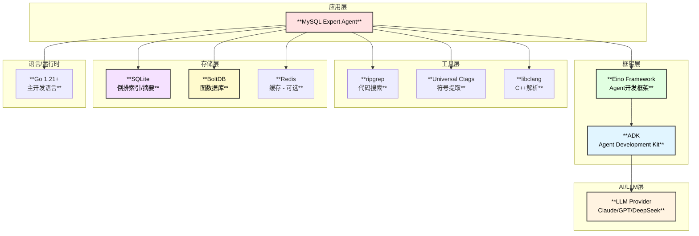

# MySQL内核专家Agent - 技术选型

## 1. 技术栈总览



## 2. 核心技术选型详解

### 2.1 Agent框架 - Eino

| 特性 | 说明 | 优势 |
|------|------|------|
| **ChatModelAgent** | 基于LLM的Agent实现 | 成熟的ReAct循环实现 |
| **Supervisor模式** | 多Agent协作 | 支持层级Agent管理 |
| **Skill机制** | 技能扩展 | 动态加载专业知识 |
| **Tool抽象** | 工具接口 | 统一的工具调用规范 |
| **Checkpoint** | 状态持久化 | 支持中断恢复 |

**选择理由**：
- 原生Go实现，与项目技术栈一致
- 丰富的Agent模式支持 (ReAct, Supervisor, Deep)
- 完善的中间件机制
- 支持流式输出

### 2.2 LLM Provider

| Provider | 模型 | 特点 | 推荐场景 |
|----------|------|------|----------|
| **Claude** | claude-3-opus | 长上下文、代码理解强 | 复杂代码分析 |
| **DeepSeek** | deepseek-coder | 代码专精、性价比高 | 日常代码搜索 |
| **GPT-4** | gpt-4-turbo | 通用能力强 | 文档生成 |

**推荐配置**：
```go
// 主分析模型 - 使用Claude
type ModelConfig struct {
    PrimaryModel   string // claude-3-opus
    SecondaryModel string // deepseek-coder
    FallbackModel  string // gpt-4-turbo
}
```

### 2.3 代码搜索 - ripgrep

| 特性 | ripgrep | grep | ag |
|------|---------|------|----|
| **性能** | ⭐⭐⭐⭐⭐ | ⭐⭐ | ⭐⭐⭐⭐ |
| **Unicode支持** | ✅ | 部分 | ✅ |
| **gitignore** | ✅ | ❌ | ✅ |
| **并行搜索** | ✅ | ❌ | ✅ |
| **正则支持** | 完整 | 完整 | 完整 |

**选择理由**：
- 极快的搜索速度 (比grep快10-100倍)
- 原生支持.gitignore
- 支持并行搜索
- 丰富的输出格式

**Go封装**：
```go
// ripgrep封装
type RipgrepRunner struct {
    binPath     string
    defaultArgs []string
}

func (r *RipgrepRunner) Search(pattern string, opts SearchOptions) ([]SearchResult, error) {
    args := []string{
        "--json",           // JSON输出
        "--line-number",    // 显示行号
        "--column",         // 显示列号
        "--context", strconv.Itoa(opts.ContextLines),
        "--type", opts.FileType,
    }
    // ...执行ripgrep
}
```

### 2.4 C/C++解析 - libclang

| 工具 | 精确度 | 速度 | 复杂度 |
|------|--------|------|--------|
| **libclang** | ⭐⭐⭐⭐⭐ | ⭐⭐⭐ | 高 |
| **tree-sitter** | ⭐⭐⭐⭐ | ⭐⭐⭐⭐⭐ | 中 |
| **Universal Ctags** | ⭐⭐⭐ | ⭐⭐⭐⭐⭐ | 低 |
| **正则匹配** | ⭐⭐ | ⭐⭐⭐⭐⭐ | 低 |

**混合策略**：
```go
// 混合解析策略
type CodeParser struct {
    ctags    *CtagsRunner     // 快速符号提取
    clang    *ClangAnalyzer   // 精确AST分析
    treesit  *TreeSitterParser // 快速语法分析
}

func (p *CodeParser) Parse(file string, level ParseLevel) (*ParseResult, error) {
    switch level {
    case ParseLevelSymbols:
        return p.ctags.ExtractSymbols(file)
    case ParseLevelAST:
        return p.clang.ParseAST(file)
    case ParseLevelQuick:
        return p.treesit.QuickParse(file)
    }
}
```

### 2.5 存储方案

#### 2.5.1 SQLite - 倒排索引/函数摘要

| 特性 | 说明 |
|------|------|
| **嵌入式** | 无需独立部署 |
| **事务支持** | ACID事务 |
| **全文搜索** | FTS5扩展 |
| **JSON支持** | JSON1扩展 |

**表结构设计**：
```sql
-- 倒排索引表
CREATE TABLE inverted_index (
    term TEXT NOT NULL,
    doc_id TEXT NOT NULL,
    positions TEXT,  -- JSON array of positions
    tf REAL,
    PRIMARY KEY (term, doc_id)
);

CREATE INDEX idx_term ON inverted_index(term);

-- 函数摘要表
CREATE TABLE function_summary (
    id TEXT PRIMARY KEY,
    name TEXT NOT NULL,
    file_path TEXT NOT NULL,
    line_start INTEGER,
    line_end INTEGER,
    signature TEXT,
    description TEXT,
    complexity INTEGER,
    tags TEXT,  -- JSON object
    created_at TIMESTAMP DEFAULT CURRENT_TIMESTAMP
);

CREATE INDEX idx_func_name ON function_summary(name);
CREATE INDEX idx_func_file ON function_summary(file_path);

-- 全文搜索
CREATE VIRTUAL TABLE function_fts USING fts5(
    name, signature, description,
    content='function_summary',
    content_rowid='rowid'
);
```

#### 2.5.2 BoltDB - 调用图存储

| 特性 | 说明 |
|------|------|
| **KV存储** | 高效的键值存储 |
| **嵌入式** | 纯Go实现 |
| **B+树** | 有序遍历 |
| **事务** | 支持ACID |

**数据模型**：
```go
// BoltDB Buckets
const (
    BucketNodes     = "nodes"     // 节点存储
    BucketEdges     = "edges"     // 边存储
    BucketCallers   = "callers"   // 调用者索引
    BucketCallees   = "callees"   // 被调用者索引
    BucketModules   = "modules"   // 模块索引
)

// 节点存储格式
type NodeData struct {
    ID       string          `json:"id"`
    Name     string          `json:"name"`
    File     string          `json:"file"`
    Line     int             `json:"line"`
    Module   string          `json:"module"`
    Stats    *FunctionStats  `json:"stats,omitempty"`
}

// 边存储格式
type EdgeData struct {
    From      string    `json:"from"`
    To        string    `json:"to"`
    CallSite  Position  `json:"call_site"`
    Frequency int64     `json:"frequency"`
}
```

### 2.6 缓存方案

| 场景 | 方案 | TTL |
|------|------|-----|
| **索引查询** | 内存LRU | 30min |
| **函数摘要** | SQLite + 内存 | 持久化 |
| **调用图子图** | 内存LRU | 10min |
| **LLM响应** | 可选Redis | 1h |

**Go实现**：
```go
// 多级缓存
type MultiLevelCache struct {
    l1 *lru.Cache        // L1: 内存LRU
    l2 *sql.DB           // L2: SQLite
    l3 *redis.Client     // L3: Redis (可选)
}

func (c *MultiLevelCache) Get(key string) (interface{}, bool) {
    // L1 lookup
    if v, ok := c.l1.Get(key); ok {
        return v, true
    }
    // L2 lookup
    if v, err := c.getFromSQLite(key); err == nil {
        c.l1.Add(key, v)
        return v, true
    }
    // L3 lookup (if enabled)
    if c.l3 != nil {
        if v, err := c.l3.Get(ctx, key).Result(); err == nil {
            c.l1.Add(key, v)
            return v, true
        }
    }
    return nil, false
}
```

## 3. 并发模型

### 3.1 Go并发原语选择

| 场景 | 方案 | 理由 |
|------|------|------|
| **多文件并行搜索** | `errgroup.Group` | 统一错误处理 |
| **生产者-消费者** | Channel | 解耦处理流程 |
| **结果聚合** | `sync.WaitGroup` | 简单同步 |
| **共享状态** | `sync.RWMutex` | 读多写少场景 |
| **单例初始化** | `sync.Once` | 线程安全初始化 |

### 3.2 Worker Pool实现

```go
// WorkerPool 工作池
type WorkerPool struct {
    workers   int
    taskQueue chan Task
    results   chan Result
    wg        sync.WaitGroup
}

type Task struct {
    ID      string
    Execute func(ctx context.Context) (interface{}, error)
}

type Result struct {
    TaskID string
    Value  interface{}
    Error  error
}

func (p *WorkerPool) Start(ctx context.Context) {
    for i := 0; i < p.workers; i++ {
        p.wg.Add(1)
        go p.worker(ctx)
    }
}

func (p *WorkerPool) worker(ctx context.Context) {
    defer p.wg.Done()
    for {
        select {
        case task, ok := <-p.taskQueue:
            if !ok {
                return
            }
            val, err := task.Execute(ctx)
            p.results <- Result{TaskID: task.ID, Value: val, Error: err}
        case <-ctx.Done():
            return
        }
    }
}
```

## 4. 依赖管理

### 4.1 Go模块依赖

```go
// go.mod
module github.com/cloudwego/eino/vdocsMysql

go 1.21

require (
    github.com/cloudwego/eino v0.x.x        // Eino框架
    github.com/bytedance/sonic v1.x.x       // JSON处理
    github.com/mattn/go-sqlite3 v1.x.x      // SQLite
    go.etcd.io/bbolt v1.x.x                 // BoltDB
    github.com/hashicorp/golang-lru v0.x.x  // LRU缓存
    golang.org/x/sync v0.x.x                // errgroup
    gopkg.in/yaml.v3 v3.x.x                 // YAML配置
)
```

### 4.2 外部工具依赖

| 工具 | 版本 | 安装方式 |
|------|------|----------|
| ripgrep | 13.0+ | `brew install ripgrep` |
| Universal Ctags | 5.9+ | `brew install universal-ctags` |
| libclang | 14.0+ | `brew install llvm` |

## 5. 配置管理

```yaml
# config.yaml
mysql_expert:
  # 源码配置
  source:
    path: "/path/to/percona-server"
    include_patterns:
      - "*.cc"
      - "*.h"
      - "*.cpp"
    exclude_patterns:
      - "*/unittest/*"
      - "*/test/*"
  
  # 索引配置
  index:
    path: "/path/to/index"
    rebuild_on_start: false
    parallel_workers: 8
  
  # LLM配置
  llm:
    provider: "claude"
    model: "claude-3-opus"
    api_key_env: "CLAUDE_API_KEY"
    max_tokens: 8192
    temperature: 0.1
  
  # Agent配置
  agent:
    max_iterations: 20
    max_concurrent_agents: 5
    timeout: 300s
  
  # 输出配置
  output:
    mode: "document"  # summary | document
    include_diagrams: true
    include_code_refs: true
  
  # 缓存配置
  cache:
    enabled: true
    ttl: 30m
    max_size: 1000
```

## 6. 部署方案

### 6.1 本地部署

```bash
# 构建
go build -o mysql-expert ./cmd/main.go

# 初始化索引
./mysql-expert init --source=/path/to/percona-server

# 启动服务
./mysql-expert serve --config=config.yaml
```

### 6.2 Docker部署

```dockerfile
FROM golang:1.21-alpine AS builder

WORKDIR /app
COPY . .
RUN go build -o mysql-expert ./cmd/main.go

FROM alpine:3.18

# 安装外部工具
RUN apk add --no-cache ripgrep universal-ctags

COPY --from=builder /app/mysql-expert /usr/local/bin/
COPY config.yaml /etc/mysql-expert/

ENTRYPOINT ["mysql-expert"]
CMD ["serve", "--config=/etc/mysql-expert/config.yaml"]
```

## 7. 性能指标

| 指标 | 目标值 | 测量方式 |
|------|--------|----------|
| **索引构建时间** | < 5min | 完整percona-server |
| **grep搜索延迟** | < 100ms | 单次搜索 |
| **索引查询延迟** | < 10ms | 倒排索引查询 |
| **调用图查询** | < 50ms | 深度3的子图 |
| **端到端响应** | < 30s | 复杂问题分析 |
| **并发处理能力** | 10 req/s | 同时处理请求数 |
