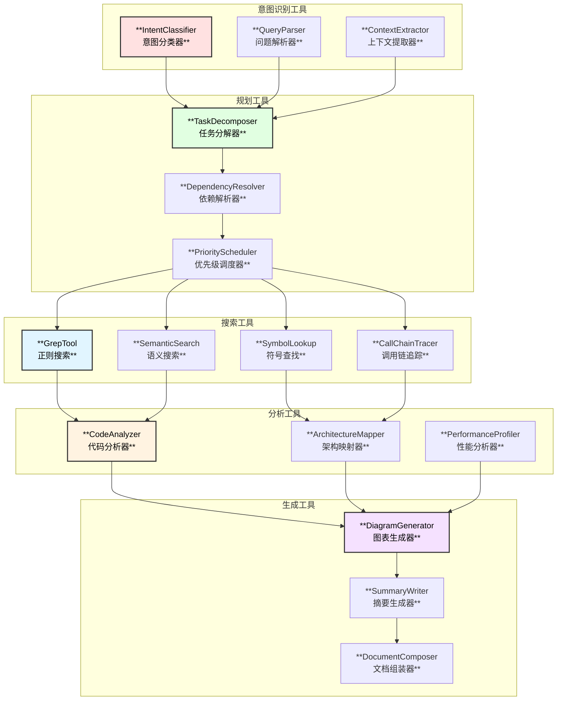
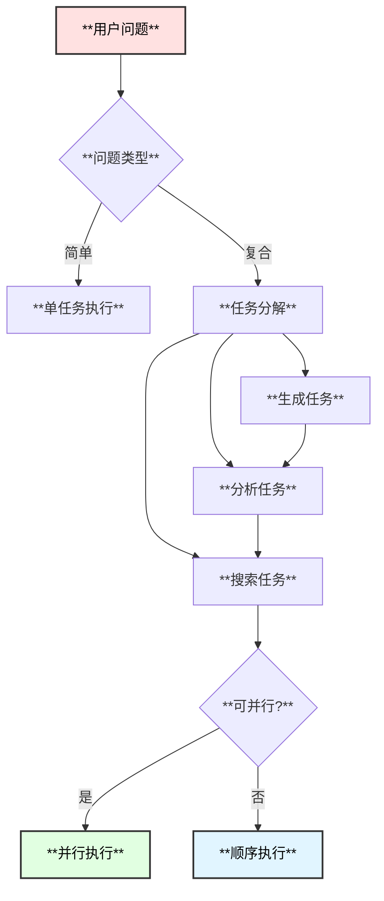
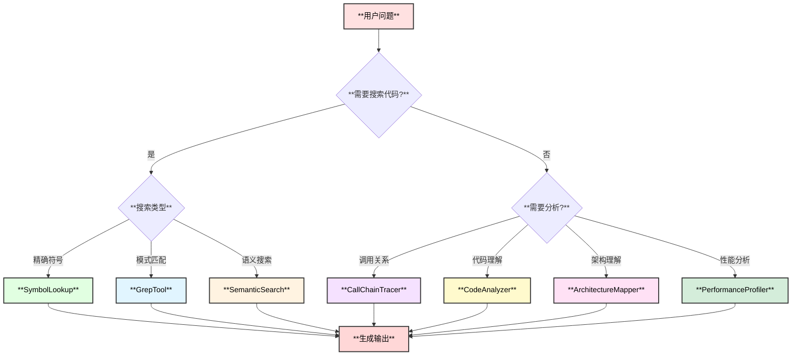

# MySQL内核专家Agent - 思维工具使用方案

## 1. 思维工具总览



## 2. 意图识别工具

### 2.1 IntentClassifier - 意图分类器

**功能**：识别用户问题的类型，确定处理策略

**意图分类**：

| 意图类型 | 描述 | 示例问题 | 处理策略 |
|----------|------|----------|----------|
| `CODE_SEARCH` | 代码搜索 | "找到处理SELECT语句的函数" | GrepTool + IndexSearch |
| `EXPLAIN_MECHANISM` | 机制解释 | "InnoDB如何实现MVCC" | CallChainTracer + ArchitectureMapper |
| `CALL_CHAIN` | 调用链分析 | "mysql_execute_command的调用链" | CallChainTracer |
| `PERFORMANCE` | 性能分析 | "查询执行的瓶颈在哪里" | PerformanceProfiler + SimulationTool |
| `ARCHITECTURE` | 架构理解 | "MySQL的线程模型是什么" | ArchitectureMapper |
| `SIMULATION` | 负载模拟 | "模拟高并发SELECT场景" | SimulationTool |

**实现**：

```go
// IntentClassifier 意图分类器
type IntentClassifier struct {
    llm        model.ChatModel
    rules      []IntentRule
    confidence float64
}

type IntentRule struct {
    Keywords    []string
    Patterns    []*regexp.Regexp
    Intent      IntentType
    Confidence  float64
}

// 意图分类流程
func (c *IntentClassifier) Classify(ctx context.Context, query string) (*IntentResult, error) {
    // Step 1: 规则匹配 (快速路径)
    if result := c.ruleBasedClassify(query); result != nil && result.Confidence > 0.8 {
        return result, nil
    }
    
    // Step 2: LLM分类 (准确路径)
    prompt := buildIntentPrompt(query)
    response, err := c.llm.Generate(ctx, []*schema.Message{
        schema.SystemMessage(intentSystemPrompt),
        schema.UserMessage(prompt),
    })
    if err != nil {
        return nil, err
    }
    
    return parseIntentResponse(response.Content)
}

// 意图分类提示词
const intentSystemPrompt = `你是一个MySQL内核专家助手的意图识别器。
根据用户问题，识别以下意图类型：
1. CODE_SEARCH - 需要搜索代码
2. EXPLAIN_MECHANISM - 需要解释原理/机制
3. CALL_CHAIN - 需要分析函数调用链
4. PERFORMANCE - 需要分析性能
5. ARCHITECTURE - 需要理解架构
6. SIMULATION - 需要模拟负载

返回JSON格式：{"intent": "类型", "confidence": 0.9, "entities": {...}}`
```

### 2.2 QueryParser - 问题解析器

**功能**：解析用户问题中的关键实体

**实体类型**：

| 实体类型 | 描述 | 示例 |
|----------|------|------|
| `FUNCTION_NAME` | 函数名 | mysql_execute_command |
| `FILE_PATH` | 文件路径 | sql/sql_parse.cc |
| `MODULE_NAME` | 模块名 | InnoDB, Parser, Optimizer |
| `CONCEPT` | 概念术语 | MVCC, Redo Log, B+树 |
| `SQL_TYPE` | SQL类型 | SELECT, INSERT, UPDATE |
| `METRIC` | 性能指标 | QPS, 延迟, 内存 |

**实现**：

```go
// QueryParser 问题解析器
type QueryParser struct {
    entityRecognizer *EntityRecognizer
    contextBuilder   *ContextBuilder
}

type ParsedQuery struct {
    Original    string
    Entities    []Entity
    Context     *QueryContext
    SubQueries  []string    // 分解后的子问题
}

type Entity struct {
    Type   EntityType
    Value  string
    Start  int
    End    int
    Meta   map[string]interface{}
}

type QueryContext struct {
    Module      string      // 相关模块
    Scope       string      // 搜索范围
    Depth       int         // 分析深度
    OutputType  OutputType  // 期望输出
}

func (p *QueryParser) Parse(ctx context.Context, query string) (*ParsedQuery, error) {
    // 实体识别
    entities := p.entityRecognizer.Recognize(query)
    
    // 上下文构建
    context := p.contextBuilder.Build(query, entities)
    
    // 问题分解
    subQueries := p.decompose(query, entities)
    
    return &ParsedQuery{
        Original:   query,
        Entities:   entities,
        Context:    context,
        SubQueries: subQueries,
    }, nil
}
```

## 3. 规划工具

### 3.1 TaskDecomposer - 任务分解器

**功能**：将复杂问题分解为可执行的子任务

**分解策略**：



**实现**：

```go
// TaskDecomposer 任务分解器
type TaskDecomposer struct {
    templates map[IntentType]*TaskTemplate
}

type TaskTemplate struct {
    Intent     IntentType
    Steps      []StepTemplate
    Parallel   [][]int  // 可并行的步骤组
}

type StepTemplate struct {
    Name        string
    Agent       string   // 执行的Agent
    Tool        string   // 使用的工具
    InputFrom   []string // 输入来源
    Required    bool     // 是否必需
}

// 分解示例 - CALL_CHAIN意图
var callChainTemplate = &TaskTemplate{
    Intent: IntentCallChain,
    Steps: []StepTemplate{
        {Name: "locate_function", Agent: "CodeSearchAgent", Tool: "SymbolLookup"},
        {Name: "find_callers", Agent: "FunctionAnalyzer", Tool: "CallGraphTool"},
        {Name: "find_callees", Agent: "FunctionAnalyzer", Tool: "CallGraphTool"},
        {Name: "get_context", Agent: "ArchitectureAgent", Tool: "ModuleMapper"},
        {Name: "generate_diagram", Agent: "DocumentAgent", Tool: "DiagramGenerator"},
    },
    Parallel: [][]int{{1, 2}, {3}}, // Step 1,2可并行; Step 3单独
}

func (d *TaskDecomposer) Decompose(intent IntentType, query *ParsedQuery) (*ExecutionPlan, error) {
    template := d.templates[intent]
    if template == nil {
        return nil, fmt.Errorf("no template for intent: %v", intent)
    }
    
    plan := &ExecutionPlan{
        Intent: intent,
        Steps:  make([]PlanStep, 0),
    }
    
    for i, st := range template.Steps {
        step := PlanStep{
            ID:        fmt.Sprintf("step_%d", i),
            Name:      st.Name,
            Agent:     st.Agent,
            Tool:      st.Tool,
            InputFrom: st.InputFrom,
        }
        // 注入实体参数
        step.Params = d.injectParams(st, query)
        plan.Steps = append(plan.Steps, step)
    }
    
    plan.ParallelGroups = template.Parallel
    return plan, nil
}
```

### 3.2 DependencyResolver - 依赖解析器

**功能**：解析任务间的依赖关系，确定执行顺序

```go
// DependencyResolver 依赖解析器
type DependencyResolver struct{}

type TaskGraph struct {
    Nodes map[string]*TaskNode
    Edges map[string][]string  // from -> [to1, to2, ...]
}

type TaskNode struct {
    ID          string
    Task        *PlanStep
    InDegree    int
    OutDegree   int
    Dependencies []string
}

func (r *DependencyResolver) Resolve(plan *ExecutionPlan) (*TaskGraph, error) {
    graph := &TaskGraph{
        Nodes: make(map[string]*TaskNode),
        Edges: make(map[string][]string),
    }
    
    // 构建图
    for _, step := range plan.Steps {
        node := &TaskNode{
            ID:   step.ID,
            Task: &step,
        }
        graph.Nodes[step.ID] = node
        
        for _, dep := range step.InputFrom {
            graph.Edges[dep] = append(graph.Edges[dep], step.ID)
            node.InDegree++
        }
    }
    
    // 验证无环
    if r.hasCycle(graph) {
        return nil, errors.New("circular dependency detected")
    }
    
    return graph, nil
}

// 拓扑排序获取执行顺序
func (r *DependencyResolver) TopologicalSort(graph *TaskGraph) ([][]string, error) {
    // 返回可并行执行的层级
    layers := make([][]string, 0)
    inDegree := make(map[string]int)
    
    for id, node := range graph.Nodes {
        inDegree[id] = node.InDegree
    }
    
    for len(inDegree) > 0 {
        layer := make([]string, 0)
        for id, deg := range inDegree {
            if deg == 0 {
                layer = append(layer, id)
            }
        }
        
        if len(layer) == 0 {
            return nil, errors.New("cannot resolve dependencies")
        }
        
        for _, id := range layer {
            delete(inDegree, id)
            for _, next := range graph.Edges[id] {
                inDegree[next]--
            }
        }
        
        layers = append(layers, layer)
    }
    
    return layers, nil
}
```

## 4. 搜索工具

### 4.1 GrepTool - 正则搜索工具

**使用场景**：
- 精确的文本/符号搜索
- 代码模式匹配
- 快速定位

**Tool定义**：

```go
// GrepTool Schema
var GrepToolInfo = &schema.ToolInfo{
    Name: "grep_code",
    Desc: `在MySQL源码中搜索代码。支持正则表达式。
适用场景：
- 搜索函数定义/调用
- 搜索特定代码模式
- 搜索关键字/变量名

注意：
- 对于精确符号查找，优先使用symbol_lookup工具
- 对于语义搜索，使用semantic_search工具`,
    ParamsOneOf: schema.NewParamsOneOfByParams(map[string]*schema.ParameterInfo{
        "pattern": {
            Type:     schema.String,
            Required: true,
            Desc:     "搜索模式，支持正则表达式",
        },
        "file_types": {
            Type: schema.Array,
            Desc: "文件类型过滤，如 [\"cc\", \"h\"]",
        },
        "directories": {
            Type: schema.Array,
            Desc: "目录过滤，如 [\"sql/\", \"storage/innobase/\"]",
        },
        "context_lines": {
            Type: schema.Integer,
            Desc: "上下文行数，默认3",
        },
        "max_results": {
            Type: schema.Integer,
            Desc: "最大结果数，默认50",
        },
    }),
}
```

**使用示例**：

```json
// 搜索函数定义
{
    "pattern": "^\\s*void\\s+mysql_execute_command\\s*\\(",
    "file_types": ["cc"],
    "context_lines": 5
}

// 搜索函数调用
{
    "pattern": "mysql_execute_command\\s*\\(",
    "directories": ["sql/"],
    "max_results": 100
}
```

### 4.2 SemanticSearch - 语义搜索工具

**使用场景**：
- 概念性搜索
- 模糊匹配
- 跨文件关联搜索

**Tool定义**：

```go
// SemanticSearch Schema
var SemanticSearchToolInfo = &schema.ToolInfo{
    Name: "semantic_search",
    Desc: `基于语义的代码搜索，适用于概念性问题。
使用倒排索引和函数摘要进行搜索。

适用场景：
- 搜索实现某功能的代码
- 搜索相关概念/机制
- 跨文件的关联搜索`,
    ParamsOneOf: schema.NewParamsOneOfByParams(map[string]*schema.ParameterInfo{
        "query": {
            Type:     schema.String,
            Required: true,
            Desc:     "搜索查询，描述要查找的内容",
        },
        "scope": {
            Type: schema.String,
            Desc: "搜索范围：function | file | module",
        },
        "filters": {
            Type: schema.Object,
            Desc: "过滤条件，如 {\"module\": \"innodb\", \"type\": \"function\"}",
        },
    }),
}
```

### 4.3 SymbolLookup - 符号查找工具

**使用场景**：
- 查找函数/变量定义
- 查找类型声明
- 符号定位

**Tool定义**：

```go
// SymbolLookup Schema
var SymbolLookupToolInfo = &schema.ToolInfo{
    Name: "symbol_lookup",
    Desc: `精确查找符号（函数、变量、类型）的定义位置。
基于ctags/clang构建的符号表。

返回信息：
- 符号类型（function/variable/type/macro）
- 定义位置（文件:行号）
- 签名/声明
- 所属模块`,
    ParamsOneOf: schema.NewParamsOneOfByParams(map[string]*schema.ParameterInfo{
        "symbol": {
            Type:     schema.String,
            Required: true,
            Desc:     "符号名称",
        },
        "type": {
            Type: schema.String,
            Desc: "符号类型：function | variable | type | macro | any",
        },
        "fuzzy": {
            Type: schema.Boolean,
            Desc: "是否模糊匹配，默认false",
        },
    }),
}
```

### 4.4 CallChainTracer - 调用链追踪工具

**使用场景**：
- 分析函数调用关系
- 追踪执行路径
- 理解代码流程

**Tool定义**：

```go
// CallChainTracer Schema
var CallChainTracerToolInfo = &schema.ToolInfo{
    Name: "trace_call_chain",
    Desc: `追踪函数的调用链，包括调用者和被调用者。
基于预构建的调用图。

输出格式：
- 函数调用树
- 每个函数的位置信息
- 调用频率（如果有统计信息）`,
    ParamsOneOf: schema.NewParamsOneOfByParams(map[string]*schema.ParameterInfo{
        "function": {
            Type:     schema.String,
            Required: true,
            Desc:     "起始函数名",
        },
        "direction": {
            Type:     schema.String,
            Required: true,
            Desc:     "追踪方向：callers（调用者）| callees（被调用）| both",
        },
        "max_depth": {
            Type: schema.Integer,
            Desc: "最大追踪深度，默认5",
        },
        "filter_modules": {
            Type: schema.Array,
            Desc: "过滤特定模块",
        },
        "include_stats": {
            Type: schema.Boolean,
            Desc: "是否包含统计信息",
        },
    }),
}
```

## 5. 分析工具

### 5.1 CodeAnalyzer - 代码分析器

**功能**：深度分析代码片段

```go
// CodeAnalyzer Schema
var CodeAnalyzerToolInfo = &schema.ToolInfo{
    Name: "analyze_code",
    Desc: `深度分析代码片段，理解其功能和逻辑。
结合LLM进行代码理解。

分析内容：
- 函数功能描述
- 参数说明
- 返回值说明
- 关键逻辑步骤
- 涉及的数据结构`,
    ParamsOneOf: schema.NewParamsOneOfByParams(map[string]*schema.ParameterInfo{
        "file": {
            Type:     schema.String,
            Required: true,
            Desc:     "文件路径",
        },
        "start_line": {
            Type:     schema.Integer,
            Required: true,
            Desc:     "起始行",
        },
        "end_line": {
            Type:     schema.Integer,
            Required: true,
            Desc:     "结束行",
        },
        "analysis_type": {
            Type: schema.String,
            Desc: "分析类型：summary | detailed | step_by_step",
        },
    }),
}
```

### 5.2 ArchitectureMapper - 架构映射器

**功能**：理解模块关系和架构

```go
// ArchitectureMapper Schema
var ArchitectureMapperToolInfo = &schema.ToolInfo{
    Name: "map_architecture",
    Desc: `分析和映射MySQL架构组件关系。

分析内容：
- 模块依赖关系
- 组件边界
- 接口定义
- 数据流向`,
    ParamsOneOf: schema.NewParamsOneOfByParams(map[string]*schema.ParameterInfo{
        "component": {
            Type:     schema.String,
            Required: true,
            Desc:     "组件/模块名称",
        },
        "scope": {
            Type: schema.String,
            Desc: "分析范围：internal | dependencies | full",
        },
        "output_format": {
            Type: schema.String,
            Desc: "输出格式：text | diagram | both",
        },
    }),
}
```

## 6. 生成工具

### 6.1 DiagramGenerator - 图表生成器

**功能**：生成各类Mermaid图表

```go
// DiagramGenerator Schema
var DiagramGeneratorToolInfo = &schema.ToolInfo{
    Name: "generate_diagram",
    Desc: `生成Mermaid格式的图表。

支持图表类型：
- flowchart: 流程图
- sequence: 时序图
- classDiagram: 类图
- callchain: 调用链图
- architecture: 架构图`,
    ParamsOneOf: schema.NewParamsOneOfByParams(map[string]*schema.ParameterInfo{
        "type": {
            Type:     schema.String,
            Required: true,
            Desc:     "图表类型",
        },
        "data": {
            Type:     schema.Object,
            Required: true,
            Desc:     "图表数据",
        },
        "style": {
            Type: schema.String,
            Desc: "样式配置：default | dark | light",
        },
    }),
}

// 图表生成示例
func (g *DiagramGenerator) GenerateCallChain(chain *CallChain) string {
    var sb strings.Builder
    sb.WriteString("graph TD\n")
    
    for i, node := range chain.Functions {
        nodeID := fmt.Sprintf("N%d", i)
        // 节点定义
        sb.WriteString(fmt.Sprintf("    %s[**%s**<br/>%s:%d]\n",
            nodeID, node.Name, node.File, node.Line))
        
        // 样式
        color := g.style.NodeColors[node.Module]
        sb.WriteString(fmt.Sprintf("    style %s fill:%s,stroke:#333,stroke-width:2px,color:#000\n",
            nodeID, color))
        
        // 边
        if i > 0 {
            sb.WriteString(fmt.Sprintf("    N%d --> %s\n", i-1, nodeID))
        }
    }
    
    return sb.String()
}
```

## 7. 工具选择决策树



## 8. 工具组合模式

### 8.1 调用链分析模式

```
1. SymbolLookup(function_name) -> 定位函数
2. CallChainTracer(function, "both", 5) -> 获取调用链
3. CodeAnalyzer(关键函数) -> 分析关键代码
4. DiagramGenerator("callchain", data) -> 生成图表
```

### 8.2 原理解释模式

```
1. SemanticSearch(concept) -> 搜索相关代码
2. SymbolLookup(关键函数) -> 定位关键函数
3. CodeAnalyzer(代码片段) -> 理解代码逻辑
4. ArchitectureMapper(module) -> 理解架构
5. DiagramGenerator("sequence", data) -> 生成时序图
```

### 8.3 性能分析模式

```
1. SymbolLookup(function) -> 定位热点函数
2. CallChainTracer(function, "callees", 3) -> 获取被调用函数
3. PerformanceProfiler(functions) -> 分析性能瓶颈
4. SimulationTool(workload) -> 模拟负载
5. DiagramGenerator("flowchart", data) -> 生成流程图
```
