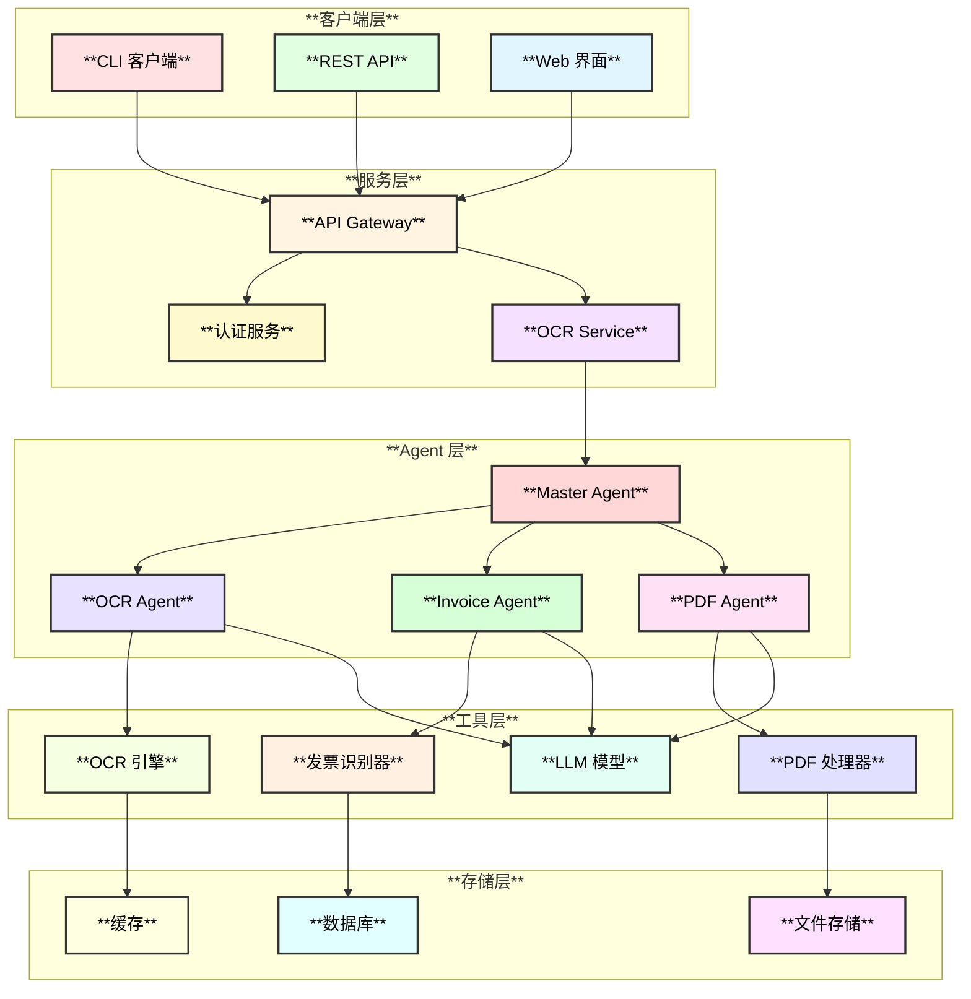
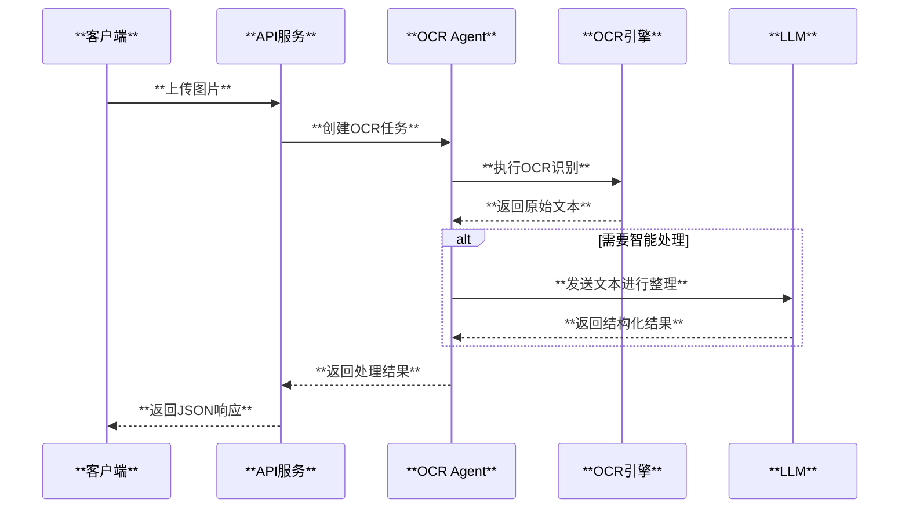
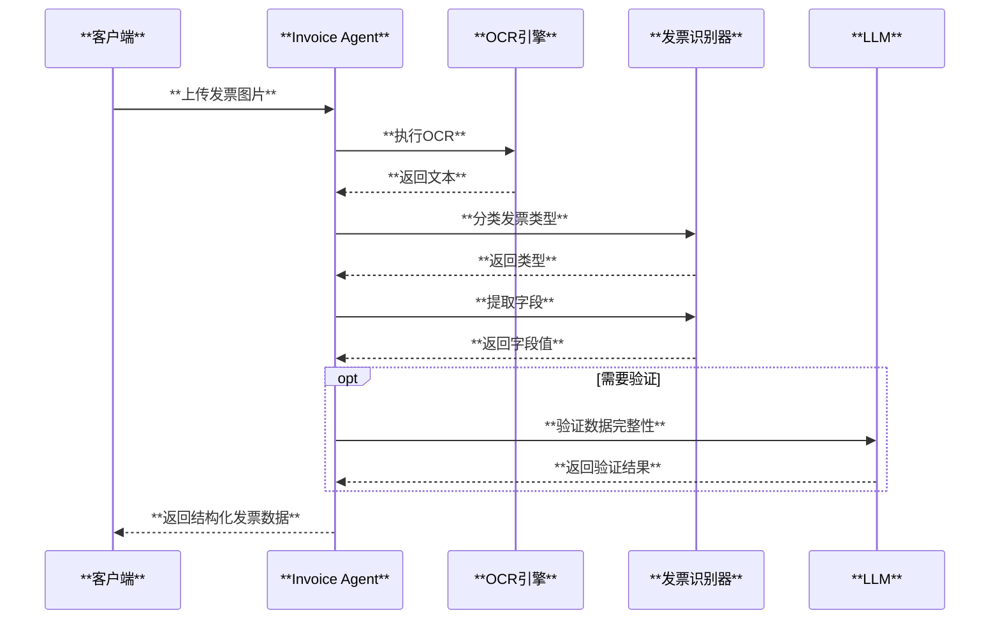

# OCR Agent 架构设计

## 1. 系统概述

OCR Agent 是一个基于 eino 框架开发的智能OCR识别系统，能够识别和提取图片、PDF、发票等文档中的信息，并输出结构化数据。

## 2. 架构图



## 3. 核心组件

### 3.1 Agent 层

| 组件 | 职责 | 技术实现 |
|------|------|---------|
| **Master Agent** | 任务调度、子Agent协调 | eino adk.Agent |
| **OCR Agent** | 图片OCR识别 | Tesseract / 云OCR API |
| **Invoice Agent** | 发票识别和结构化 | 正则 + LLM |
| **PDF Agent** | PDF文档处理 | poppler-utils |

### 3.2 工具层

| 工具 | 功能 | 实现方式 |
|------|------|---------|
| **OCR引擎** | 文字识别 | Tesseract / 百度OCR / 腾讯OCR |
| **PDF处理器** | PDF解析、图片提取 | pdftotext, pdftoppm, pdfimages |
| **发票识别器** | 发票分类、字段提取 | 正则表达式 + LLM |
| **LLM模型** | 智能分析、摘要生成 | DeepSeek / Qwen / OpenAI |

## 4. 处理流程

### 4.1 图片OCR流程



### 4.2 发票识别流程



## 5. 数据模型

### 5.1 OCR结果

```go
type OCRResult struct {
    Text       string      `json:"text"`
    Confidence float64     `json:"confidence"`
    Blocks     []TextBlock `json:"blocks"`
    Language   string      `json:"language"`
    Duration   time.Duration `json:"duration"`
    Metadata   map[string]interface{} `json:"metadata"`
}
```

### 5.2 发票数据

```go
type Invoice struct {
    Type       InvoiceType        `json:"type"`
    Confidence float64            `json:"confidence"`
    Fields     map[string]string  `json:"fields"`
    Items      []InvoiceItem      `json:"items"`
    RawText    string             `json:"raw_text"`
}
```

### 5.3 处理结果

```go
type ProcessResult struct {
    TaskType       TaskType        `json:"task_type"`
    DocumentType   DocumentType    `json:"document_type"`
    Text           string          `json:"text"`
    Summary        string          `json:"summary"`
    StructuredData *StructuredData `json:"structured_data"`
    Duration       time.Duration   `json:"duration"`
    ProcessedAt    time.Time       `json:"processed_at"`
}
```

## 6. 支持的发票类型

| 类型 | 说明 | 提取字段 |
|------|------|---------|
| **增值税普通发票** | vat_invoice | 发票代码、号码、日期、金额、税额等 |
| **增值税专用发票** | vat_special_invoice | 含购销方完整信息 |
| **火车票** | train_ticket | 出发/到达站、日期、座位、金额 |
| **出租车发票** | taxi_receipt | 日期、金额、里程 |
| **机票** | air_ticket | 航班号、出发/到达、日期 |
| **酒店发票** | hotel_invoice | 酒店名、日期、金额 |
| **过路费发票** | toll_invoice | 入/出口、金额 |

## 7. 扩展性设计

### 7.1 OCR引擎插件化

```go
type OCREngine interface {
    Recognize(ctx context.Context, imageData []byte, opts *RecognizeOptions) (*OCRResult, error)
    RecognizeFile(ctx context.Context, filePath string, opts *RecognizeOptions) (*OCRResult, error)
    Close() error
}
```

### 7.2 LLM提供商适配

```go
type LLMProvider interface {
    Generate(ctx context.Context, messages []*schema.Message) (*schema.Message, error)
    Stream(ctx context.Context, messages []*schema.Message) (*schema.StreamReader, error)
}
```

### 7.3 输出格式扩展

```go
type Formatter interface {
    Format(result *ProcessResult, format OutputFormat) (string, error)
    FormatAndSave(result *ProcessResult, format OutputFormat, filename string) error
}
```

## 8. 部署架构

### 8.1 Kubernetes部署

```
┌─────────────────────────────────────────────────────────────────┐
│                        Kubernetes Cluster                        │
├─────────────────────────────────────────────────────────────────┤
│  ┌──────────────┐   ┌──────────────┐   ┌──────────────┐        │
│  │  Ingress     │   │  Service     │   │  ConfigMap   │        │
│  │  Controller  │   │  (ClusterIP) │   │  (config)    │        │
│  └──────────────┘   └──────────────┘   └──────────────┘        │
│          │                  │                                   │
│          ▼                  ▼                                   │
│  ┌──────────────────────────────────────────────────────────┐  │
│  │                    Deployment                              │  │
│  │  ┌─────────┐  ┌─────────┐  ┌─────────┐  ┌─────────┐     │  │
│  │  │ Pod 1   │  │ Pod 2   │  │ Pod 3   │  │ ...     │     │  │
│  │  └─────────┘  └─────────┘  └─────────┘  └─────────┘     │  │
│  └──────────────────────────────────────────────────────────┘  │
│          │                                                      │
│          ▼                                                      │
│  ┌──────────────┐   ┌──────────────┐   ┌──────────────┐        │
│  │  Secret      │   │  PVC         │   │  HPA         │        │
│  │  (API Keys)  │   │  (Storage)   │   │  (AutoScale) │        │
│  └──────────────┘   └──────────────┘   └──────────────┘        │
└─────────────────────────────────────────────────────────────────┘
```

## 9. 性能优化

### 9.1 并发控制

- 使用信号量限制并发OCR任务数
- 配置最大并发数：`ocr.max_concurrency`

### 9.2 缓存策略

- L1缓存：内存LRU缓存，快速响应相同请求
- L2缓存：可选Redis缓存，支持分布式部署

### 9.3 资源限制

- 图片最大尺寸：4096x4096
- 文件最大大小：100MB
- PDF最大页数：100页

## 10. 安全考虑

### 10.1 API安全

- 请求大小限制
- 速率限制
- 文件类型校验

### 10.2 数据安全

- API密钥通过Secret管理
- 临时文件及时清理
- 非root用户运行

### 10.3 网络安全

- NetworkPolicy限制网络访问
- TLS加密传输
- CORS配置
