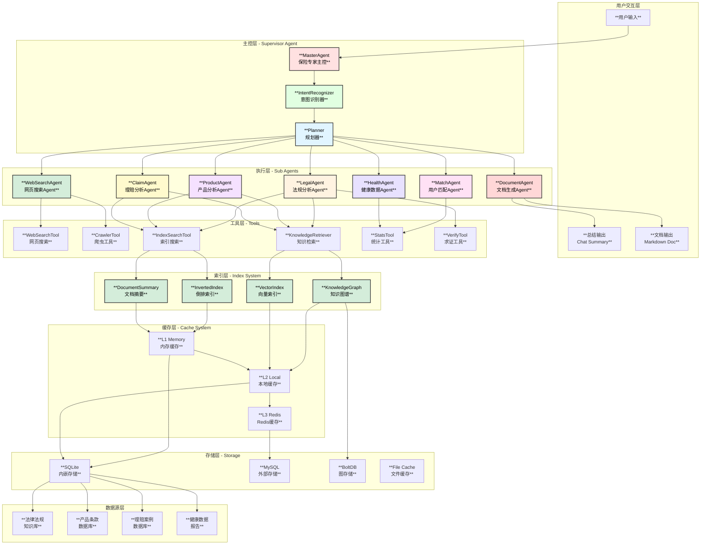
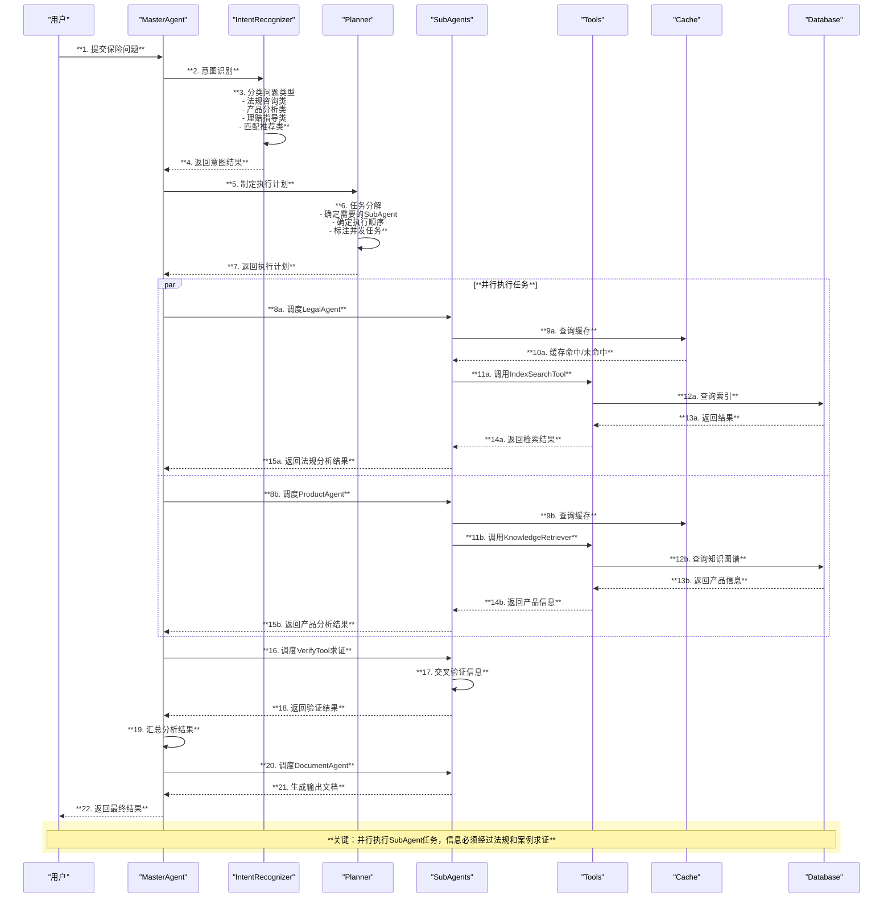
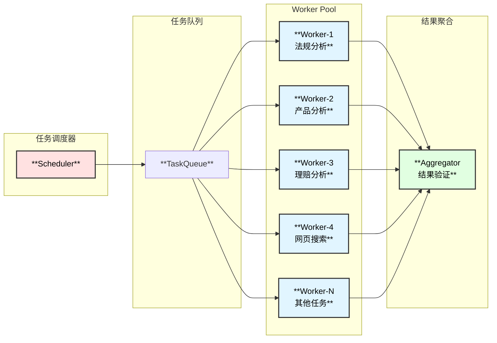
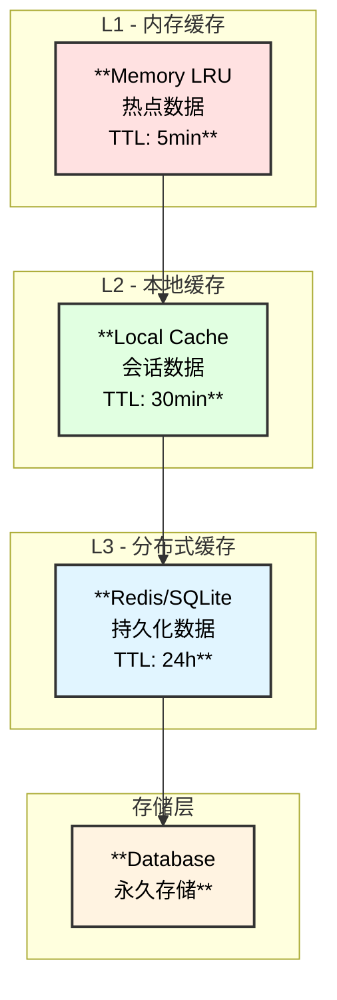
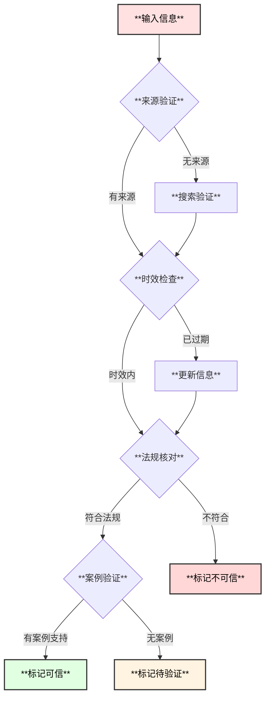
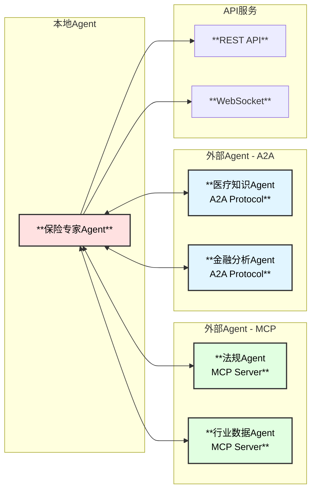
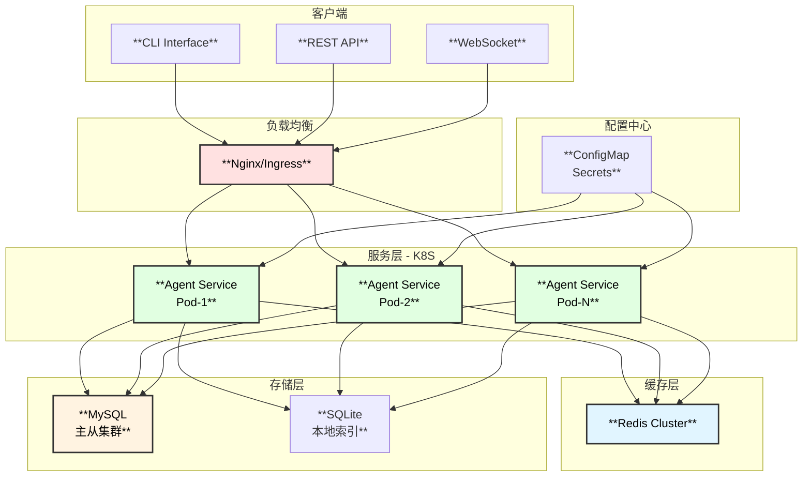

# 保险专家Agent - 整体架构设计

## 1. 系统概述

保险专家Agent是一个基于eino框架开发的智能保险顾问系统，以保险相关的法律法规、保险产品条款、理赔案例等为依据，从专业角度解答用户的保险问题。系统采用多Agent协作架构，结合网页搜索、知识索引、负载并发等技术，提供深度的保险专业分析能力。

### 1.1 核心能力

| 能力 | 描述 | 应用场景 |
|------|------|----------|
| **法规知识库** | 构建保险法律法规知识体系 | 合规性检查、政策解读 |
| **产品分析** | 保险产品条款解析与对比 | 产品设计、条款分析 |
| **理赔案例** | 理赔案例检索与分析 | 理赔指导、风险评估 |
| **用户匹配** | 用户需求与产品匹配分析 | 个性化推荐 |
| **健康数据分析** | 疾病与健康行业数据分析 | 风险评估、产品定价 |
| **网页搜索** | 实时获取最新保险资讯 | 市场动态、政策更新 |

## 2. 整体架构图



## 3. 核心组件说明

### 3.1 主控层 (Supervisor Agent)

| 组件 | 功能 | 技术实现 |
|------|------|----------|
| **MasterAgent** | 协调所有子Agent，管理对话上下文 | `adk.ChatModelAgent` + `supervisor.New` |
| **IntentRecognizer** | 识别用户意图，分类问题类型 | LLM + 规则引擎 |
| **Planner** | 制定执行计划，分配任务 | `adk.prebuilt.deep` 任务规划 |

### 3.2 执行层 (Sub Agents)

| Agent | 职责 | 并发支持 | 依赖数据源 |
|-------|------|----------|-----------|
| **LegalAgent** | 法律法规分析、合规检查 | ✅ 并发检索 | 法律法规知识库 |
| **ProductAgent** | 产品条款分析、条款对比 | ✅ 并发分析 | 产品条款数据库 |
| **ClaimAgent** | 理赔案例分析、流程指导 | ✅ 并发查询 | 理赔案例数据库 |
| **MatchAgent** | 用户需求匹配、个性化推荐 | ✅ 并发计算 | 用户画像、产品库 |
| **HealthAgent** | 健康数据分析、风险评估 | ✅ 并发统计 | 健康数据报告 |
| **WebSearchAgent** | 网页搜索、信息爬取 | ✅ 并发爬取 | 互联网 |
| **DocumentAgent** | 文档生成、图表渲染 | - | - |

### 3.3 工具层 (Tools)

```go
// 工具接口定义
type Tool interface {
    Info(ctx context.Context) (*schema.ToolInfo, error)
    InvokableRun(ctx context.Context, args string, opts ...tool.Option) (string, error)
}
```

| 工具 | 功能 | 性能优化 |
|------|------|----------|
| **WebSearchTool** | 网页搜索、实时资讯获取 | 并发搜索+缓存 |
| **CrawlerTool** | 网页爬取、内容提取 | 智能限流+去重 |
| **IndexSearchTool** | 索引查询、快速检索 | 倒排索引+缓存 |
| **KnowledgeRetriever** | 知识检索、语义搜索 | 向量索引+知识图谱 |
| **StatsTool** | 统计分析、数据汇总 | 增量计算 |
| **VerifyTool** | 信息求证、来源验证 | 多源校验 |

## 4. 数据流架构



## 5. 并发执行架构

### 5.1 并发模型



### 5.2 并发策略

| 场景 | 并发策略 | 实现方式 |
|------|----------|----------|
| 多知识库检索 | Fan-out/Fan-in | `errgroup.Group` |
| 多产品对比分析 | Pipeline | Channel + Goroutine |
| 知识图谱遍历 | BFS/DFS并行 | WorkerPool |
| 网页批量爬取 | MapReduce | 分片处理 |
| 信息交叉验证 | 并行验证 | `sync.WaitGroup` |

## 6. 缓存架构

### 6.1 多级缓存设计



### 6.2 缓存策略

| 缓存层 | 数据类型 | TTL | 淘汰策略 |
|--------|----------|-----|----------|
| L1 Memory | 热点查询、常用法规 | 5min | LRU |
| L2 Local | 会话上下文、用户画像 | 30min | LFU |
| L3 Redis | 索引结果、产品信息 | 24h | TTL |
| Database | 原始数据、历史记录 | 永久 | - |

### 6.3 记忆系统

```go
// 记忆系统设计
type MemorySystem struct {
    ShortTerm   *ShortTermMemory   // 短期记忆：当前会话上下文
    LongTerm    *LongTermMemory    // 长期记忆：用户偏好、历史查询
    Episodic    *EpisodicMemory    // 情景记忆：历史问答对
    Semantic    *SemanticMemory    // 语义记忆：知识图谱缓存
}
```

## 7. 输出格式设计

### 7.1 总结输出 (Summary Mode)

```
【问题】: 用户问题简述
【结论】: 1-2句核心结论
【法律依据】: 相关法规条款
【产品建议】: 推荐产品及理由
【风险提示】: 潜在风险说明
【参考来源】: 信息来源链接
```

### 7.2 文档输出 (Document Mode)

```markdown
# 主题标题

## 1. 问题概述
简要说明用户问题...

## 2. 法律法规分析
### 2.1 相关法规
[法规条款及解读]

### 2.2 合规性分析
[合规检查结果]

## 3. 产品分析
### 3.1 产品对比表
[产品对比mermaid表格]

### 3.2 推荐产品
[推荐理由及分析]

## 4. 理赔案例参考
[相关案例及分析]

## 5. 风险评估
[风险分析图表]

## 6. 结论与建议
结论及专业建议...

## 7. 参考来源
- 法规来源
- 产品来源
- 案例来源
```

## 8. 信息求证机制

### 8.1 求证流程



### 8.2 时效标注

| 信息类型 | 时效周期 | 更新策略 |
|----------|----------|----------|
| 法律法规 | 发布日期起有效 | 政策发布时更新 |
| 产品条款 | 产品有效期内 | 产品更新时同步 |
| 理赔案例 | 永久有效 | 定期补充新案例 |
| 健康数据 | 年度/季度 | 定期更新 |
| 网页信息 | 7天 | 定期刷新 |

## 9. Agent交互架构

### 9.1 交互协议



## 10. 扩展性设计

### 10.1 插件机制

- **新Agent注册**: 通过 `adk.SetSubAgents` 动态添加
- **新Tool注册**: 通过 `ToolsConfig.Tools` 扩展
- **新Skill注册**: 通过 `skill.Backend` 接口扩展
- **新数据源**: 通过 `DataSource` 接口扩展

### 10.2 配置化

```yaml
insurance_expert:
  # 数据源配置
  data_sources:
    legal_db: "/path/to/legal"
    product_db: "/path/to/products"
    claim_db: "/path/to/claims"
    
  # 索引配置
  index:
    path: "/path/to/index"
    rebuild_on_start: false
    
  # Agent配置
  agent:
    max_concurrent: 10
    output_mode: "document"  # summary | document
    verify_mode: true        # 启用求证
    
  # 模型路由配置
  model_routing:
    simple_query: "glm-4-flash"
    complex_analysis: "gpt-4-turbo"
    reasoning: "claude-3-opus"
```

## 11. 部署架构


