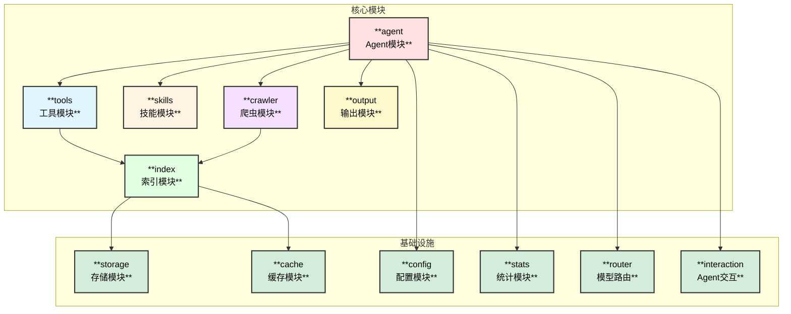
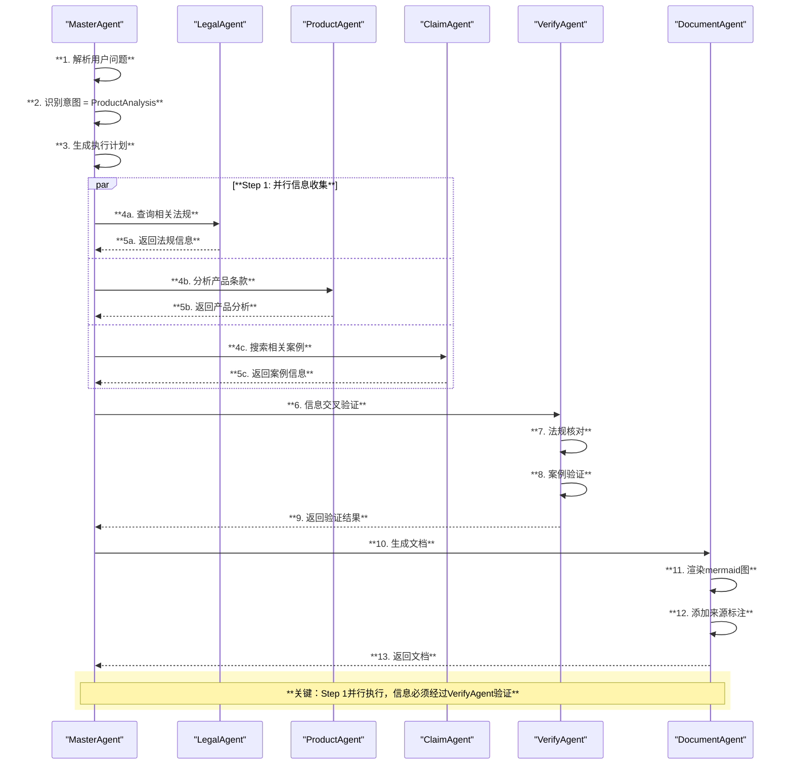
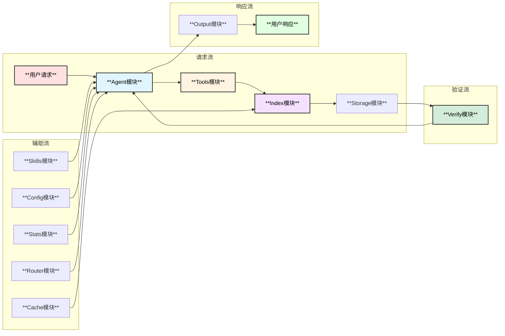

# 保险专家Agent - 模块设计

## 1. 模块总览



## 2. Agent模块 (`agent/`)

### 2.1 模块结构

```
agent/
├── master/             # 主控Agent
│   ├── master.go       # MasterAgent实现
│   ├── intent.go       # 意图识别
│   └── planner.go      # 任务规划
├── legal/              # 法规分析Agent
│   └── legal_agent.go
├── product/            # 产品分析Agent
│   └── product_agent.go
├── claim/              # 理赔分析Agent
│   └── claim_agent.go
├── match/              # 用户匹配Agent
│   └── match_agent.go
├── health/             # 健康数据Agent
│   └── health_agent.go
├── websearch/          # 网页搜索Agent
│   └── websearch_agent.go
├── document/           # 文档生成Agent
│   └── document_agent.go
├── verify/             # 信息求证Agent
│   └── verify_agent.go
└── factory.go          # Agent工厂
```

### 2.2 MasterAgent 设计

```go
// MasterAgent 主控Agent，协调所有子Agent
type MasterAgent struct {
    name        string
    description string
    chatModel   model.ToolCallingChatModel
    subAgents   []adk.Agent
    config      *MasterConfig
    memory      *memory.MemorySystem
    verifier    *verify.Verifier
}

type MasterConfig struct {
    DataSources   map[string]string         // 数据源路径
    IndexPath     string                    // 索引路径
    OutputMode    OutputMode                // 输出模式
    MaxConcurrent int                       // 最大并发数
    VerifyMode    bool                      // 启用求证
    Middlewares   []adk.AgentMiddleware     // 中间件
}

// 意图类型
type IntentType int
const (
    IntentLegalConsult   IntentType = iota  // 法规咨询
    IntentProductAnalysis                    // 产品分析
    IntentClaimGuidance                      // 理赔指导
    IntentUserMatch                          // 用户匹配
    IntentHealthData                         // 健康数据
    IntentGeneralQuery                       // 通用查询
)

// 规划结果
type ExecutionPlan struct {
    Intent      IntentType
    Steps       []PlanStep
    Parallel    [][]int       // 可并行的步骤组
    VerifySteps []int         // 需要求证的步骤
    Priority    int
}

type PlanStep struct {
    AgentName   string
    Task        string
    DependsOn   []string       // 依赖的步骤
    DataSources []string       // 需要的数据源
    NeedVerify  bool           // 是否需要求证
    Timeout     time.Duration
}
```

### 2.3 SubAgent 接口设计

```go
// SubAgent 子Agent接口
type SubAgent interface {
    adk.Agent
    
    // CanHandle 判断是否能处理该意图
    CanHandle(ctx context.Context, intent IntentType) bool
    
    // GetCapabilities 返回Agent能力描述
    GetCapabilities() []string
    
    // GetDataSources 返回依赖的数据源
    GetDataSources() []string
}

// LegalAgent 法规分析Agent
type LegalAgent struct {
    *adk.ChatModelAgent
    indexTool   *IndexSearchTool
    verifyTool  *VerifyTool
    legalDB     *storage.LegalDatabase
}

// ProductAgent 产品分析Agent
type ProductAgent struct {
    *adk.ChatModelAgent
    indexTool    *IndexSearchTool
    productDB    *storage.ProductDatabase
    compareTool  *CompareTool
}

// ClaimAgent 理赔分析Agent
type ClaimAgent struct {
    *adk.ChatModelAgent
    caseSearch   *CaseSearchTool
    claimDB      *storage.ClaimDatabase
    workflow     *ClaimWorkflow
}

// MatchAgent 用户匹配Agent
type MatchAgent struct {
    *adk.ChatModelAgent
    matchEngine  *MatchEngine
    userProfile  *UserProfiler
    productDB    *storage.ProductDatabase
}

// HealthAgent 健康数据Agent
type HealthAgent struct {
    *adk.ChatModelAgent
    healthDB     *storage.HealthDatabase
    riskCalc     *RiskCalculator
    statsEngine  *StatsEngine
}

// WebSearchAgent 网页搜索Agent
type WebSearchAgent struct {
    *adk.ChatModelAgent
    searchTool   *WebSearchTool
    crawlerTool  *CrawlerTool
    cacheStore   *cache.WebCache
}

// VerifyAgent 信息求证Agent
type VerifyAgent struct {
    *adk.ChatModelAgent
    legalVerify  *LegalVerifier
    caseVerify   *CaseVerifier
    sourceVerify *SourceVerifier
}
```

### 2.4 Agent协作流程



## 3. 索引模块 (`index/`)

### 3.1 模块结构

```
index/
├── builder/            # 索引构建器
│   ├── builder.go      # 主构建器
│   ├── parser.go       # 文档解析器
│   └── worker.go       # 并行Worker
├── inverted/           # 倒排索引
│   ├── index.go        # 倒排索引实现
│   ├── tokenizer.go    # 分词器
│   └── chinese.go      # 中文分词
├── summary/            # 文档摘要
│   ├── extractor.go    # 摘要提取器
│   └── summary.go      # 摘要存储
├── vector/             # 向量索引
│   ├── embedding.go    # 向量嵌入
│   └── faiss.go        # FAISS索引
├── knowledge/          # 知识图谱
│   ├── graph.go        # 图数据结构
│   ├── builder.go      # 图构建器
│   └── query.go        # 图查询
├── timeliness/         # 时效管理
│   ├── tracker.go      # 时效追踪
│   └── updater.go      # 自动更新
└── storage/            # 存储适配
    ├── sqlite.go       # SQLite存储
    ├── mysql.go        # MySQL存储
    └── boltdb.go       # BoltDB存储
```

### 3.2 倒排索引设计

```go
// InvertedIndex 倒排索引
type InvertedIndex struct {
    db        storage.Database
    tokenizer Tokenizer
    cache     *cache.IndexCache
}

// 索引记录
type IndexRecord struct {
    Term      string      // 词项
    DocID     string      // 文档ID
    DocType   DocType     // 文档类型：法规/产品/案例
    Positions []Position  // 出现位置
    TF        float64     // 词频
    Timestamp time.Time   // 时效标记
}

type Position struct {
    Section int    // 章节
    Para    int    // 段落
    Offset  int    // 偏移
    Length  int    // 长度
}

type DocType string
const (
    DocTypeLegal   DocType = "legal"    // 法律法规
    DocTypeProduct DocType = "product"  // 产品条款
    DocTypeClaim   DocType = "claim"    // 理赔案例
    DocTypeHealth  DocType = "health"   // 健康数据
    DocTypeWeb     DocType = "web"      // 网页内容
)

// 查询接口
func (idx *InvertedIndex) Search(query string, opts SearchOptions) ([]SearchResult, error)
func (idx *InvertedIndex) SearchByType(query string, docType DocType) ([]SearchResult, error)
func (idx *InvertedIndex) SearchWithTimeFilter(query string, after time.Time) ([]SearchResult, error)
```

### 3.3 文档摘要设计

```go
// DocumentSummary 文档摘要
type DocumentSummary struct {
    ID          string            // 文档唯一标识
    Title       string            // 文档标题
    DocType     DocType           // 文档类型
    Source      string            // 来源
    FilePath    string            // 文件路径
    Abstract    string            // 摘要
    Keywords    []string          // 关键词
    Entities    []Entity          // 实体信息
    PublishDate time.Time         // 发布日期
    ValidUntil  *time.Time        // 有效期
    UpdatedAt   time.Time         // 更新时间
    Metadata    map[string]string // 元数据
}

// Entity 实体信息
type Entity struct {
    Type  string  // 实体类型：保险公司/产品名/疾病名/法规名
    Value string  // 实体值
    Score float64 // 置信度
}

// DocumentSummaryStore 文档摘要存储
type DocumentSummaryStore interface {
    Add(summary *DocumentSummary) error
    Get(id string) (*DocumentSummary, error)
    Search(query SummaryQuery) ([]*DocumentSummary, error)
    ListByType(docType DocType) ([]*DocumentSummary, error)
    ListExpired(before time.Time) ([]*DocumentSummary, error)
}

// SummaryQuery 摘要查询
type SummaryQuery struct {
    Keywords    []string
    DocType     DocType
    Source      string
    DateRange   *DateRange
    ValidOnly   bool
}
```

### 3.4 知识图谱设计

```go
// KnowledgeGraph 保险知识图谱
type KnowledgeGraph struct {
    db       *bolt.DB
    nodes    map[string]*KGNode
    edges    map[string][]*KGEdge
}

type KGNode struct {
    ID       string
    Type     NodeType    // 保险公司/产品/疾病/法规/条款
    Name     string
    Props    map[string]interface{}
    Validity *ValidityInfo
}

type NodeType string
const (
    NodeTypeCompany   NodeType = "company"   // 保险公司
    NodeTypeProduct   NodeType = "product"   // 保险产品
    NodeTypeDisease   NodeType = "disease"   // 疾病
    NodeTypeLaw       NodeType = "law"       // 法规
    NodeTypeClause    NodeType = "clause"    // 条款
    NodeTypeBenefit   NodeType = "benefit"   // 保障项目
    NodeTypeExclusion NodeType = "exclusion" // 除外责任
)

type KGEdge struct {
    ID       string
    FromNode string
    ToNode   string
    RelType  RelationType  // 关系类型
    Props    map[string]interface{}
}

type RelationType string
const (
    RelTypeOffers     RelationType = "offers"      // 公司-提供->产品
    RelTypeCovers     RelationType = "covers"      // 产品-覆盖->疾病
    RelTypeExcludes   RelationType = "excludes"    // 产品-除外->疾病
    RelTypeRegulates  RelationType = "regulates"   // 法规-监管->产品
    RelTypeContains   RelationType = "contains"    // 产品-包含->条款
    RelTypeRelatedTo  RelationType = "related_to"  // 通用关联
)

// ValidityInfo 有效性信息
type ValidityInfo struct {
    ValidFrom  time.Time
    ValidUntil *time.Time
    Status     string  // active, deprecated, expired
    UpdatedAt  time.Time
}

// KnowledgeGraph 查询接口
func (g *KnowledgeGraph) GetNode(id string) (*KGNode, error)
func (g *KnowledgeGraph) FindNodes(nodeType NodeType, query string) ([]*KGNode, error)
func (g *KnowledgeGraph) GetRelated(nodeID string, relType RelationType, depth int) ([]*KGNode, error)
func (g *KnowledgeGraph) FindPath(fromID, toID string) ([][]*KGNode, error)
func (g *KnowledgeGraph) GetSubgraph(rootID string, depth int) (*KnowledgeGraph, error)
```

## 4. 工具模块 (`tools/`)

### 4.1 模块结构

```
tools/
├── websearch/          # 网页搜索工具
│   ├── search.go       # 搜索实现
│   └── providers/      # 搜索引擎适配
│       ├── bing.go
│       ├── google.go
│       └── baidu.go
├── crawler/            # 爬虫工具
│   ├── crawler.go      # 爬虫实现
│   ├── parser.go       # 内容解析
│   └── limiter.go      # 限流器
├── index_search/       # 索引搜索工具
│   └── search.go
├── knowledge/          # 知识检索工具
│   └── retriever.go
├── verify/             # 求证工具
│   ├── verify.go
│   ├── legal.go        # 法规验证
│   └── source.go       # 来源验证
├── compare/            # 产品对比工具
│   └── compare.go
├── match/              # 匹配工具
│   └── match.go
├── stats/              # 统计工具
│   └── stats_tool.go
└── factory.go          # 工具工厂
```

### 4.2 WebSearchTool 设计

```go
// WebSearchTool 网页搜索工具
type WebSearchTool struct {
    providers   []SearchProvider
    cache       *cache.WebCache
    limiter     *rate.Limiter
    concurrency int
}

type SearchProvider interface {
    Name() string
    Search(ctx context.Context, query string, opts SearchOptions) ([]SearchResult, error)
}

type WebSearchOptions struct {
    Query         string
    MaxResults    int
    TimeRange     string      // day, week, month, year
    Site          string      // 限制站点
    FileType      string      // 文件类型
    Language      string      // 语言
    Region        string      // 地区
}

type WebSearchResult struct {
    Title       string
    URL         string
    Snippet     string
    Source      string
    PublishDate *time.Time
    Relevance   float64
}

func (t *WebSearchTool) Info(ctx context.Context) (*schema.ToolInfo, error) {
    return &schema.ToolInfo{
        Name: "web_search",
        Desc: `搜索互联网获取最新保险资讯和信息。
适用场景：
- 搜索最新保险政策和法规
- 获取保险公司和产品信息
- 查找保险行业新闻和动态

注意：搜索结果需要经过求证验证`,
        ParamsOneOf: schema.NewParamsOneOfByParams(map[string]*schema.ParameterInfo{
            "query": {Type: schema.String, Required: true, Desc: "搜索关键词"},
            "max_results": {Type: schema.Integer, Desc: "最大结果数，默认10"},
            "time_range": {Type: schema.String, Desc: "时间范围：day/week/month/year"},
            "site": {Type: schema.String, Desc: "限制搜索站点"},
        }),
    }, nil
}
```

### 4.3 CrawlerTool 设计

```go
// CrawlerTool 网页爬虫工具
type CrawlerTool struct {
    client      *http.Client
    parser      *ContentParser
    limiter     *rate.Limiter
    userAgents  []string
    cache       *cache.WebCache
}

type CrawlOptions struct {
    URL           string
    Depth         int       // 爬取深度
    MaxPages      int       // 最大页面数
    FollowLinks   bool      // 是否跟踪链接
    ExtractImages bool      // 是否提取图片
    Timeout       time.Duration
}

type CrawlResult struct {
    URL         string
    Title       string
    Content     string
    Links       []string
    Images      []string
    Metadata    map[string]string
    CrawledAt   time.Time
    Expiry      time.Time     // 缓存过期时间
}

func (t *CrawlerTool) Info(ctx context.Context) (*schema.ToolInfo, error) {
    return &schema.ToolInfo{
        Name: "crawl_page",
        Desc: `爬取网页内容，提取文本和结构化信息。
适用场景：
- 爬取保险产品详情页
- 提取法规条款全文
- 获取案例详细信息

注意：遵守robots.txt，合理控制爬取频率`,
        ParamsOneOf: schema.NewParamsOneOfByParams(map[string]*schema.ParameterInfo{
            "url": {Type: schema.String, Required: true, Desc: "网页URL"},
            "extract_links": {Type: schema.Boolean, Desc: "是否提取链接"},
            "depth": {Type: schema.Integer, Desc: "爬取深度，默认1"},
        }),
    }, nil
}
```

### 4.4 VerifyTool 设计

```go
// VerifyTool 信息求证工具
type VerifyTool struct {
    legalVerifier  *LegalVerifier
    sourceVerifier *SourceVerifier
    caseVerifier   *CaseVerifier
    cache          *cache.VerifyCache
}

type VerifyRequest struct {
    Content     string            // 待验证内容
    ContentType VerifyContentType // 内容类型
    Sources     []string          // 声称的来源
    Claims      []string          // 关键声明
}

type VerifyContentType string
const (
    VerifyTypeLegal    VerifyContentType = "legal"    // 法规相关
    VerifyTypeProduct  VerifyContentType = "product"  // 产品相关
    VerifyTypeClaim    VerifyContentType = "claim"    // 理赔相关
    VerifyTypeHealth   VerifyContentType = "health"   // 健康数据
    VerifyTypeGeneral  VerifyContentType = "general"  // 通用信息
)

type VerifyResult struct {
    Verified    bool              // 是否验证通过
    Confidence  float64           // 置信度
    Details     []VerifyDetail    // 验证详情
    Warnings    []string          // 警告信息
    Sources     []VerifiedSource  // 验证来源
}

type VerifyDetail struct {
    Claim       string    // 声明
    Status      string    // verified/unverified/partial
    Evidence    string    // 证据
    Source      string    // 来源
    Timeliness  string    // 时效性：current/outdated/unknown
}

type VerifiedSource struct {
    URL         string
    Title       string
    Authority   string    // 权威性：official/authoritative/general
    ValidDate   time.Time
}

func (t *VerifyTool) Info(ctx context.Context) (*schema.ToolInfo, error) {
    return &schema.ToolInfo{
        Name: "verify_info",
        Desc: `验证信息的准确性和时效性。
验证内容：
- 法规条款的准确性和时效性
- 产品信息的真实性
- 理赔案例的有效性
- 来源的权威性

返回验证结果和证据来源`,
        ParamsOneOf: schema.NewParamsOneOfByParams(map[string]*schema.ParameterInfo{
            "content": {Type: schema.String, Required: true, Desc: "待验证内容"},
            "content_type": {Type: schema.String, Desc: "内容类型：legal/product/claim/health"},
            "sources": {Type: schema.Array, Desc: "声称的来源"},
        }),
    }, nil
}
```

## 5. 技能模块 (`skills/`)

### 5.1 模块结构

```
skills/
├── backend.go          # Skill Backend实现
├── loader.go           # Skill加载器
├── insurance/          # 保险专用Skills
│   ├── legal.md        # 法规分析技能
│   ├── product.md      # 产品分析技能
│   ├── claim.md        # 理赔处理技能
│   ├── health.md       # 健康数据技能
│   └── match.md        # 用户匹配技能
├── industry/           # 行业知识Skills
│   ├── company.md      # 保险公司信息
│   ├── regulation.md   # 监管要求
│   └── trends.md       # 行业趋势
└── templates/          # 模板Skills
    ├── analysis.md     # 分析模板
    ├── comparison.md   # 对比模板
    └── report.md       # 报告模板
```

### 5.2 Skill 定义格式

```yaml
---
name: insurance_legal_analysis
description: 保险法规分析技能，用于解读和分析保险相关法律法规
---

## 核心法规
- 《中华人民共和国保险法》
- 《保险公司管理规定》
- 《人身保险产品信息披露管理办法》
- 《健康保险管理办法》

## 关键条款检索模式
- 投保人权利: "投保人.*权利|投保人.*义务"
- 保险责任: "保险责任|承保范围|保障范围"
- 除外责任: "除外责任|责任免除|不承担.*责任"
- 理赔流程: "理赔|赔偿|给付|报案"

## 常见问题模式
- 犹豫期相关: 查找《人身保险新型产品信息披露管理办法》
- 等待期相关: 查找《健康保险管理办法》第十七条
- 如实告知: 查找《保险法》第十六条

## 验证要求
- 所有法规引用必须注明具体条款
- 时效性：确认法规是否有更新版本
- 适用性：确认法规是否适用于具体场景
```

### 5.3 SkillBackend 实现

```go
// InsuranceSkillBackend 保险专用Skill后端
type InsuranceSkillBackend struct {
    skillDir  string
    cache     map[string]*skill.Skill
    templates map[string]*template.Template
}

func (b *InsuranceSkillBackend) List(ctx context.Context) ([]skill.FrontMatter, error) {
    // 返回所有可用的保险Skills
}

func (b *InsuranceSkillBackend) Get(ctx context.Context, name string) (skill.Skill, error) {
    // 返回指定的Skill内容
}

// Skill中间件配置
func NewInsuranceSkillMiddleware(ctx context.Context, skillDir string) (adk.AgentMiddleware, error) {
    backend := &InsuranceSkillBackend{skillDir: skillDir}
    return skill.New(ctx, &skill.Config{
        Backend:    backend,
        UseChinese: true,
    })
}
```

## 6. 输出模块 (`output/`)

### 6.1 模块结构

```
output/
├── formatter/          # 格式化器
│   ├── summary.go      # 总结格式
│   └── document.go     # 文档格式
├── diagram/            # 图表生成
│   ├── mermaid.go      # Mermaid图表
│   ├── table.go        # 表格生成
│   └── chart.go        # 数据图表
├── template/           # 模板
│   ├── summary.tmpl
│   ├── document.tmpl
│   └── comparison.tmpl
├── verify/             # 验证标注
│   └── annotation.go   # 来源标注
└── renderer.go         # 渲染器
```

### 6.2 输出格式器设计

```go
// OutputFormatter 输出格式化器接口
type OutputFormatter interface {
    Format(ctx context.Context, result *AnalysisResult) (string, error)
}

// SummaryFormatter 总结格式化器
type SummaryFormatter struct {
    maxLength   int
    verifyMode  bool
}

func (f *SummaryFormatter) Format(ctx context.Context, result *AnalysisResult) (string, error) {
    // 生成简短总结，包含核心结论和来源标注
}

// DocumentFormatter 文档格式化器
type DocumentFormatter struct {
    diagramGenerator *MermaidGenerator
    tableGenerator   *TableGenerator
    templateEngine   *template.Template
    verifyAnnotator  *VerifyAnnotator
}

func (f *DocumentFormatter) Format(ctx context.Context, result *AnalysisResult) (string, error) {
    // 生成完整文档，包含mermaid图表和来源验证标注
}

// AnalysisResult 分析结果
type AnalysisResult struct {
    Question      string
    Intent        IntentType
    Summary       string
    Details       string
    LegalRefs     []LegalReference
    ProductRefs   []ProductReference
    CaseRefs      []CaseReference
    VerifyResults []VerifyResult
    Diagrams      []Diagram
    Metadata      map[string]interface{}
}

type LegalReference struct {
    LawName     string
    Article     string
    Content     string
    VerifyStatus string
    Source      string
}

type ProductReference struct {
    ProductName string
    Company     string
    Clause      string
    ValidDate   time.Time
    Source      string
}

type CaseReference struct {
    CaseID      string
    Summary     string
    Outcome     string
    Relevance   float64
    Source      string
}

type Diagram struct {
    Type    DiagramType  // Comparison | Flow | Timeline | Structure
    Title   string
    Content string       // Mermaid代码
}
```

### 6.3 Mermaid图表生成

```go
// MermaidGenerator Mermaid图表生成器
type MermaidGenerator struct {
    styleConfig *MermaidStyle
}

type MermaidStyle struct {
    NodeColors     map[string]string  // 节点颜色
    EdgeStyle      string             // 边样式
    FontWeight     string             // 字体粗细
    BackgroundColor string            // 背景色
}

// 默认样式 (符合tech.md要求)
var DefaultMermaidStyle = &MermaidStyle{
    NodeColors: map[string]string{
        "product":   "#ffe1e1",
        "legal":     "#e1ffe1",
        "claim":     "#e1f5ff",
        "health":    "#fff3e1",
        "verified":  "#d4edda",
        "warning":   "#fff3cd",
        "error":     "#f8d7da",
    },
    EdgeStyle:       "stroke:#333,stroke-width:2px",
    FontWeight:      "bold",
    BackgroundColor: "#f5f5f5",
}

// GenerateComparisonTable 生成产品对比表
func (g *MermaidGenerator) GenerateComparisonTable(products []ProductInfo) string

// GenerateFlowchart 生成流程图
func (g *MermaidGenerator) GenerateFlowchart(steps []FlowStep) string

// GenerateTimeline 生成时间线
func (g *MermaidGenerator) GenerateTimeline(events []TimelineEvent) string

// GenerateStructure 生成结构图
func (g *MermaidGenerator) GenerateStructure(nodes []StructureNode) string
```

## 7. 模块间交互


