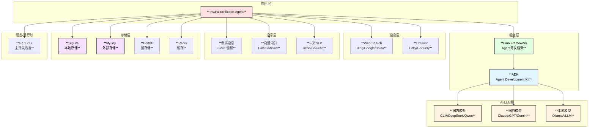

# 保险专家Agent - 技术选型

## 1. 技术栈总览



## 2. 核心技术选型详解

### 2.1 Agent框架 - Eino

| 特性 | 说明 | 优势 |
|------|------|------|
| **ChatModelAgent** | 基于LLM的Agent实现 | 成熟的ReAct循环实现 |
| **Supervisor模式** | 多Agent协作 | 支持层级Agent管理 |
| **Skill机制** | 技能扩展 | 动态加载专业知识 |
| **Tool抽象** | 工具接口 | 统一的工具调用规范 |
| **Checkpoint** | 状态持久化 | 支持中断恢复 |

**选择理由**：
- 原生Go实现，与项目技术栈一致
- 丰富的Agent模式支持 (ReAct, Supervisor, Deep)
- 完善的中间件机制
- 支持流式输出

### 2.2 LLM Provider - 多模型支持

#### 2.2.1 中国大陆模型

| Provider | 模型 | 特点 | 推荐场景 |
|----------|------|------|----------|
| **智谱AI** | GLM-4/GLM-4-Flash | 中文理解强、速度快 | 日常对话、简单分析 |
| **DeepSeek** | DeepSeek-V3/Coder | 性价比高、推理强 | 复杂分析、代码生成 |
| **通义千问** | Qwen-Max/Qwen-Plus | 长上下文、多语言 | 文档分析、翻译 |
| **百度文心** | ERNIE-4.0 | 中文优化、知识丰富 | 知识问答 |
| **讯飞星火** | Spark-4.0 | 中文专精 | 专业领域 |
| **Moonshot** | Kimi | 超长上下文 | 长文档分析 |
| **MiniMax** | abab6.5 | 多模态 | 图文分析 |
| **零一万物** | Yi-Large | 开源友好 | 私有部署 |

#### 2.2.2 国外模型

| Provider | 模型 | 特点 | 推荐场景 |
|----------|------|------|----------|
| **OpenAI** | GPT-4-Turbo/GPT-4o | 综合能力最强 | 复杂推理 |
| **Anthropic** | Claude-3-Opus/Sonnet | 安全性高、长上下文 | 深度分析 |
| **Google** | Gemini-1.5-Pro | 多模态强 | 图文理解 |

#### 2.2.3 本地模型

| 方案 | 模型 | 特点 | 推荐场景 |
|------|------|------|----------|
| **Ollama** | Llama3/Qwen2 | 易部署、免费 | 开发测试、敏感数据 |
| **vLLM** | 多模型支持 | 高性能推理 | 生产环境 |
| **LocalAI** | 多模型兼容 | OpenAI兼容 | 快速集成 |

### 2.3 模型路由策略

```go
// ModelRouter 模型路由器
type ModelRouter struct {
    providers map[string]model.ToolCallingChatModel
    config    *RoutingConfig
}

type RoutingConfig struct {
    Strategy string                    // simple/cost/quality/smart
    Scenes   map[string]*SceneConfig
}

type SceneConfig struct {
    Scene     string    // 场景名称
    Primary   string    // 首选模型
    Fallback  []string  // 备选模型
    MaxTokens int
}

// 场景路由配置示例
var DefaultSceneConfig = map[string]*SceneConfig{
    "simple_query": {
        Scene:     "简单查询",
        Primary:   "glm-4-flash",     // 快速响应
        Fallback:  []string{"qwen-plus", "deepseek-chat"},
        MaxTokens: 2000,
    },
    "legal_analysis": {
        Scene:     "法规分析",
        Primary:   "gpt-4-turbo",     // 准确性优先
        Fallback:  []string{"claude-3-sonnet", "glm-4"},
        MaxTokens: 8000,
    },
    "complex_reasoning": {
        Scene:     "复杂推理",
        Primary:   "claude-3-opus",   // 推理能力最强
        Fallback:  []string{"gpt-4-turbo", "deepseek-reasoner"},
        MaxTokens: 16000,
    },
    "document_generation": {
        Scene:     "文档生成",
        Primary:   "gpt-4-turbo",
        Fallback:  []string{"qwen-max", "glm-4"},
        MaxTokens: 8000,
    },
    "long_context": {
        Scene:     "长文档分析",
        Primary:   "kimi-moonshot",   // 超长上下文
        Fallback:  []string{"claude-3-opus", "gemini-1.5-pro"},
        MaxTokens: 128000,
    },
}
```

### 2.4 网页搜索与爬虫

#### 2.4.1 搜索引擎选择

| 引擎 | 优势 | 限制 | 推荐场景 |
|------|------|------|----------|
| **Bing** | API友好、中文支持好 | 需要API Key | 主要搜索引擎 |
| **Google** | 结果质量高 | 需要代理 | 国际信息 |
| **百度** | 中文最全 | API限制多 | 国内信息 |

#### 2.4.2 爬虫框架选择

| 框架 | 优势 | 使用场景 |
|------|------|----------|
| **Colly** | 高性能、功能完整 | 大规模爬取 |
| **Goquery** | 轻量、DOM解析强 | 单页面解析 |
| **Rod** | 无头浏览器 | 动态页面 |

**Go封装**：
```go
// 爬虫封装
type Crawler struct {
    collector   *colly.Collector
    limiter     *rate.Limiter
    cache       *cache.WebCache
    userAgents  []string
}

func (c *Crawler) Crawl(ctx context.Context, url string, opts CrawlOptions) (*CrawlResult, error) {
    // 检查缓存
    if cached, ok := c.cache.Get(url); ok {
        return cached, nil
    }
    
    // 限流
    c.limiter.Wait(ctx)
    
    // 执行爬取
    result := &CrawlResult{URL: url}
    c.collector.OnHTML("body", func(e *colly.HTMLElement) {
        result.Title = e.ChildText("title")
        result.Content = e.Text
    })
    
    c.collector.Visit(url)
    
    // 存入缓存
    c.cache.Set(url, result, opts.CacheTTL)
    
    return result, nil
}
```

### 2.5 索引与搜索

#### 2.5.1 倒排索引

| 方案 | 优势 | 使用场景 |
|------|------|----------|
| **Bleve** | 纯Go、功能完整 | 全文搜索 |
| **自研索引** | 定制性强 | 特殊需求 |

#### 2.5.2 向量索引

| 方案 | 优势 | 使用场景 |
|------|------|----------|
| **FAISS** | 高性能、成熟 | 大规模向量 |
| **Milvus** | 分布式、易扩展 | 生产环境 |
| **Annoy** | 内存友好 | 小规模场景 |

#### 2.5.3 中文分词

| 方案 | 优势 | 使用场景 |
|------|------|----------|
| **GoJieba** | 纯Go、性能好 | 通用分词 |
| **Jieba** | 词库丰富 | 高精度需求 |
| **自定义词典** | 保险领域专用 | 专业术语 |

```go
// 中文分词器
type ChineseTokenizer struct {
    jieba       *gojieba.Jieba
    customDict  map[string]int  // 保险专业词典
}

func (t *ChineseTokenizer) Tokenize(text string) []string {
    // 使用jieba分词
    words := t.jieba.Cut(text, true)
    
    // 处理保险专业术语
    words = t.handleInsuranceTerms(words)
    
    return words
}

// 保险专业词典示例
var InsuranceDict = map[string]int{
    "犹豫期":     10,
    "等待期":     10,
    "免赔额":     10,
    "保险责任":   10,
    "除外责任":   10,
    "投保人":     10,
    "被保险人":   10,
    "受益人":     10,
    "保险金额":   10,
    "保险费":     10,
    "如实告知":   10,
    "理赔":       10,
    "退保":       10,
    "续保":       10,
}
```

### 2.6 存储方案

#### 2.6.1 SQLite - 本地嵌入式存储

| 特性 | 说明 |
|------|------|
| **嵌入式** | 无需独立部署 |
| **事务支持** | ACID事务 |
| **全文搜索** | FTS5扩展 |
| **JSON支持** | JSON1扩展 |

**表结构设计**：
```sql
-- 倒排索引表
CREATE TABLE inverted_index (
    term TEXT NOT NULL,
    doc_id TEXT NOT NULL,
    doc_type TEXT NOT NULL,
    positions TEXT,  -- JSON array
    tf REAL,
    timestamp DATETIME,
    PRIMARY KEY (term, doc_id)
);

CREATE INDEX idx_term ON inverted_index(term);
CREATE INDEX idx_doc_type ON inverted_index(doc_type);

-- 文档摘要表
CREATE TABLE document_summary (
    id TEXT PRIMARY KEY,
    title TEXT NOT NULL,
    doc_type TEXT NOT NULL,
    source TEXT,
    abstract TEXT,
    keywords TEXT,  -- JSON array
    publish_date DATETIME,
    valid_until DATETIME,
    updated_at TIMESTAMP DEFAULT CURRENT_TIMESTAMP
);

CREATE INDEX idx_doc_type ON document_summary(doc_type);
CREATE INDEX idx_valid ON document_summary(valid_until);

-- 全文搜索
CREATE VIRTUAL TABLE document_fts USING fts5(
    title, abstract, keywords,
    content='document_summary',
    content_rowid='rowid'
);
```

#### 2.6.2 MySQL - 外部持久化存储

| 特性 | 说明 |
|------|------|
| **分布式** | 支持主从复制 |
| **高性能** | 大规模数据 |
| **全文搜索** | InnoDB FTS |

#### 2.6.3 BoltDB - 图存储

| 特性 | 说明 |
|------|------|
| **KV存储** | 高效的键值存储 |
| **嵌入式** | 纯Go实现 |
| **B+树** | 有序遍历 |
| **事务** | 支持ACID |

### 2.7 缓存方案

| 场景 | 方案 | TTL |
|------|------|-----|
| **热点查询** | 内存LRU | 5min |
| **会话上下文** | 内存/Redis | 30min |
| **索引结果** | SQLite/Redis | 24h |
| **网页缓存** | SQLite | 7d |
| **LLM响应** | Redis | 1h |

**Go实现**：
```go
// 多级缓存
type MultiLevelCache struct {
    l1 *lru.Cache        // L1: 内存LRU
    l2 *sql.DB           // L2: SQLite
    l3 *redis.Client     // L3: Redis (可选)
    stats *CacheStats
}

func (c *MultiLevelCache) Get(ctx context.Context, key string) (interface{}, bool) {
    // L1 lookup
    if v, ok := c.l1.Get(key); ok {
        c.stats.L1Hits++
        return v, true
    }
    c.stats.L1Misses++
    
    // L2 lookup
    if v, err := c.getFromSQLite(ctx, key); err == nil {
        c.l1.Add(key, v)
        c.stats.L2Hits++
        return v, true
    }
    c.stats.L2Misses++
    
    // L3 lookup (if enabled)
    if c.l3 != nil {
        if v, err := c.l3.Get(ctx, key).Result(); err == nil {
            c.l1.Add(key, v)
            c.stats.L3Hits++
            return v, true
        }
        c.stats.L3Misses++
    }
    
    return nil, false
}
```

## 3. 并发模型

### 3.1 Go并发原语选择

| 场景 | 方案 | 理由 |
|------|------|------|
| **多Agent并行** | `errgroup.Group` | 统一错误处理 |
| **生产者-消费者** | Channel | 解耦处理流程 |
| **结果聚合** | `sync.WaitGroup` | 简单同步 |
| **共享状态** | `sync.RWMutex` | 读多写少场景 |
| **单例初始化** | `sync.Once` | 线程安全初始化 |

### 3.2 Worker Pool实现

```go
// WorkerPool 工作池
type WorkerPool struct {
    workers   int
    taskQueue chan Task
    results   chan Result
    wg        sync.WaitGroup
}

type Task struct {
    ID       string
    AgentName string
    Execute  func(ctx context.Context) (interface{}, error)
}

type Result struct {
    TaskID string
    Value  interface{}
    Error  error
}

func (p *WorkerPool) Start(ctx context.Context) {
    for i := 0; i < p.workers; i++ {
        p.wg.Add(1)
        go p.worker(ctx)
    }
}

func (p *WorkerPool) worker(ctx context.Context) {
    defer p.wg.Done()
    for {
        select {
        case task, ok := <-p.taskQueue:
            if !ok {
                return
            }
            val, err := task.Execute(ctx)
            p.results <- Result{TaskID: task.ID, Value: val, Error: err}
        case <-ctx.Done():
            return
        }
    }
}
```

## 4. Agent交互协议

### 4.1 MCP协议支持

```go
// MCP Server 实现
type MCPServer struct {
    name        string
    version     string
    tools       map[string]tool.BaseTool
    resources   map[string]Resource
    transport   Transport
}

// MCP Client 实现
type MCPClient struct {
    servers map[string]*MCPServerConnection
    timeout time.Duration
}

func (c *MCPClient) CallTool(ctx context.Context, serverName, toolName string, args interface{}) (interface{}, error) {
    server := c.servers[serverName]
    return server.InvokeTool(ctx, toolName, args)
}
```

### 4.2 A2A协议支持

```go
// A2A Server 实现
type A2AServer struct {
    agent    adk.Agent
    address  string
    tls      *tls.Config
}

// A2A Client 实现
type A2AClient struct {
    agents  map[string]*A2AAgentConnection
    timeout time.Duration
}

func (c *A2AClient) SendTask(ctx context.Context, agentName string, task *A2ATask) (*A2AResult, error) {
    agent := c.agents[agentName]
    return agent.Execute(ctx, task)
}
```

## 5. 依赖管理

### 5.1 Go模块依赖

```go
// go.mod
module github.com/cloudwego/eino/vdocsbaoxian

go 1.21

require (
    github.com/cloudwego/eino v0.x.x        // Eino框架
    github.com/bytedance/sonic v1.x.x       // JSON处理
    github.com/mattn/go-sqlite3 v1.x.x      // SQLite
    go.etcd.io/bbolt v1.x.x                 // BoltDB
    github.com/hashicorp/golang-lru v0.x.x  // LRU缓存
    github.com/redis/go-redis/v9 v9.x.x     // Redis
    github.com/gocolly/colly/v2 v2.x.x      // 爬虫
    github.com/PuerkitoBio/goquery v1.x.x   // HTML解析
    github.com/yanyiwu/gojieba v1.x.x       // 中文分词
    github.com/blevesearch/bleve/v2 v2.x.x  // 全文搜索
    golang.org/x/sync v0.x.x                // errgroup
    golang.org/x/time v0.x.x                // rate限流
    gopkg.in/yaml.v3 v3.x.x                 // YAML配置
)
```

### 5.2 外部工具依赖

| 工具 | 版本 | 安装方式 | 用途 |
|------|------|----------|------|
| Redis | 7.0+ | Docker/包管理 | 分布式缓存 |
| MySQL | 8.0+ | Docker/包管理 | 外部存储 |

## 6. 配置管理

```yaml
# config.yaml
insurance_expert:
  # 日志配置
  log:
    level: info
    format: json
  
  # 数据源配置
  data_sources:
    legal_db: "/data/legal"
    product_db: "/data/products"
    claim_db: "/data/claims"
    health_db: "/data/health"
  
  # 索引配置
  index:
    path: "/data/index"
    rebuild_on_start: false
    parallel_workers: 8
    chinese_dict: "/data/dict/insurance.txt"
  
  # 缓存配置
  cache:
    l1:
      enabled: true
      max_size: 10000
      ttl: 5m
    l2:
      enabled: true
      backend: sqlite
      path: "/data/cache/l2.db"
      ttl: 30m
    l3:
      enabled: true
      backend: redis
      addresses: ["redis:6379"]
      ttl: 24h
  
  # 存储配置
  storage:
    primary: sqlite
    sqlite:
      path: "/data/insurance_expert.db"
    mysql:
      host_env: MYSQL_HOST
      port: 3306
      user: insurance
      password_env: MYSQL_PASSWORD
      database: insurance_expert
  
  # LLM配置
  llm:
    default_provider: zhipu
    default_model: glm-4
    providers:
      zhipu:
        name: 智谱AI
        type: zhipu
        enabled: true
        api_key_env: ZHIPU_API_KEY
        models:
          glm-4:
            enabled: true
            max_context_length: 128000
          glm-4-flash:
            enabled: true
            max_context_length: 128000
      deepseek:
        name: DeepSeek
        type: deepseek
        enabled: true
        api_key_env: DEEPSEEK_API_KEY
      openai:
        name: OpenAI
        type: openai
        enabled: true
        api_key_env: OPENAI_API_KEY
        http_proxy_env: HTTP_PROXY
      anthropic:
        name: Anthropic
        type: anthropic
        enabled: true
        api_key_env: ANTHROPIC_API_KEY
      ollama:
        name: Ollama
        type: ollama
        enabled: true
        base_url: "http://localhost:11434"
    routing:
      enabled: true
      strategy: smart
      scene_mapping:
        simple_query:
          preferred: ["glm-4-flash", "qwen-plus"]
        legal_analysis:
          preferred: ["gpt-4-turbo", "claude-3-sonnet"]
        complex_reasoning:
          preferred: ["claude-3-opus", "gpt-4-turbo"]
  
  # Agent配置
  agent:
    max_iterations: 20
    max_concurrent_agents: 10
    timeout: 5m
    verify_mode: true
  
  # 输出配置
  output:
    mode: document
    include_diagrams: true
    include_sources: true
    verify_annotations: true
  
  # 统计配置
  stats:
    token:
      enabled: true
      daily_budget: 1000000
      alert_threshold: 0.8
    cache:
      enabled: true
      report_interval: 5m
    prometheus:
      enabled: true
      port: 9090
      path: /metrics
  
  # Agent交互配置
  interaction:
    mcp_server:
      enabled: true
      transport: stdio
    rest_server:
      enabled: true
      address: ":8080"
```

## 7. 部署方案

### 7.1 本地部署

```bash
# 构建
go build -o insurance-expert ./cmd/main.go

# 初始化索引
./insurance-expert init --data=/path/to/data

# 启动服务
./insurance-expert serve --config=config.yaml
```

### 7.2 Docker部署

```dockerfile
FROM golang:1.21-alpine AS builder

WORKDIR /app
COPY . .
RUN go build -o insurance-expert ./cmd/main.go

FROM alpine:3.18

# 安装依赖
RUN apk add --no-cache ca-certificates tzdata

COPY --from=builder /app/insurance-expert /usr/local/bin/
COPY config.yaml /etc/insurance-expert/

ENTRYPOINT ["insurance-expert"]
CMD ["serve", "--config=/etc/insurance-expert/config.yaml"]
```

### 7.3 K8S部署

详见 `k8s/` 目录下的部署配置文件。

## 8. 性能指标

| 指标 | 目标值 | 测量方式 |
|------|--------|----------|
| **索引构建时间** | < 5min | 完整知识库 |
| **索引查询延迟** | < 10ms | 单次查询 |
| **缓存命中率** | > 70% | L1+L2+L3 |
| **网页爬取速度** | 10 pages/s | 并发爬取 |
| **端到端响应** | < 30s | 复杂问题分析 |
| **并发处理能力** | 10 req/s | 同时处理请求数 |
