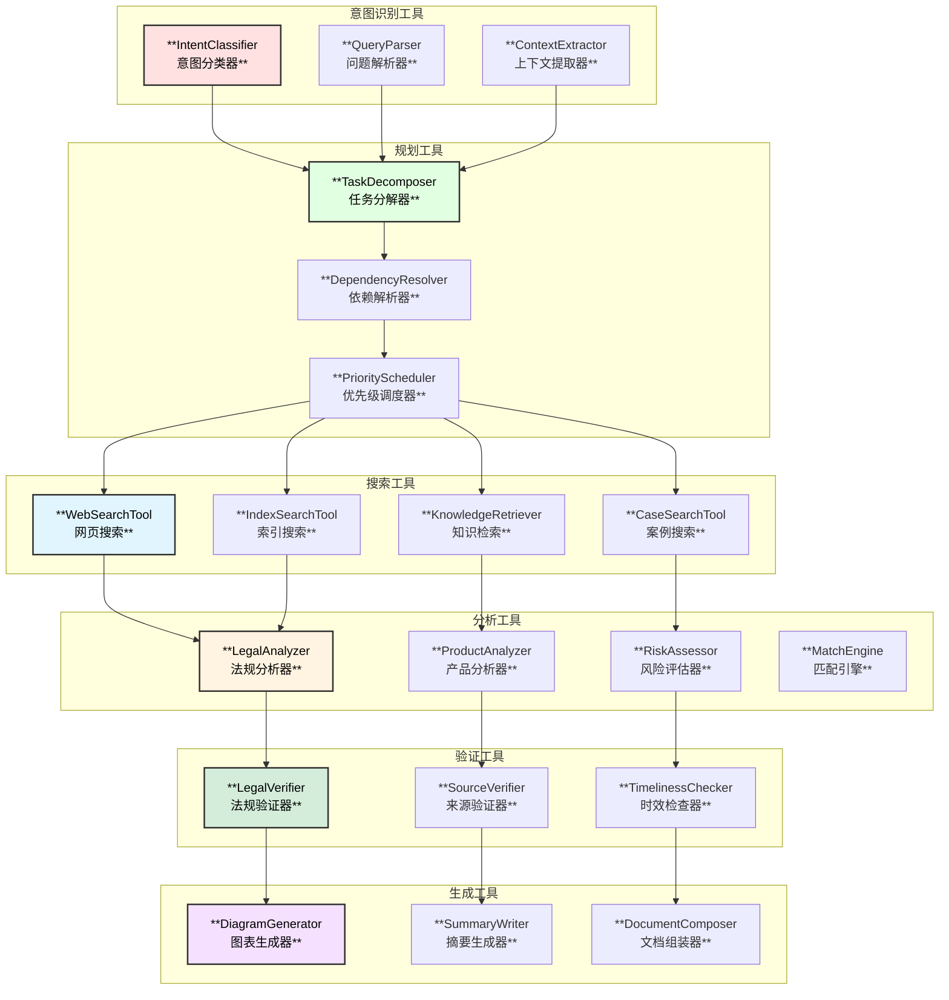
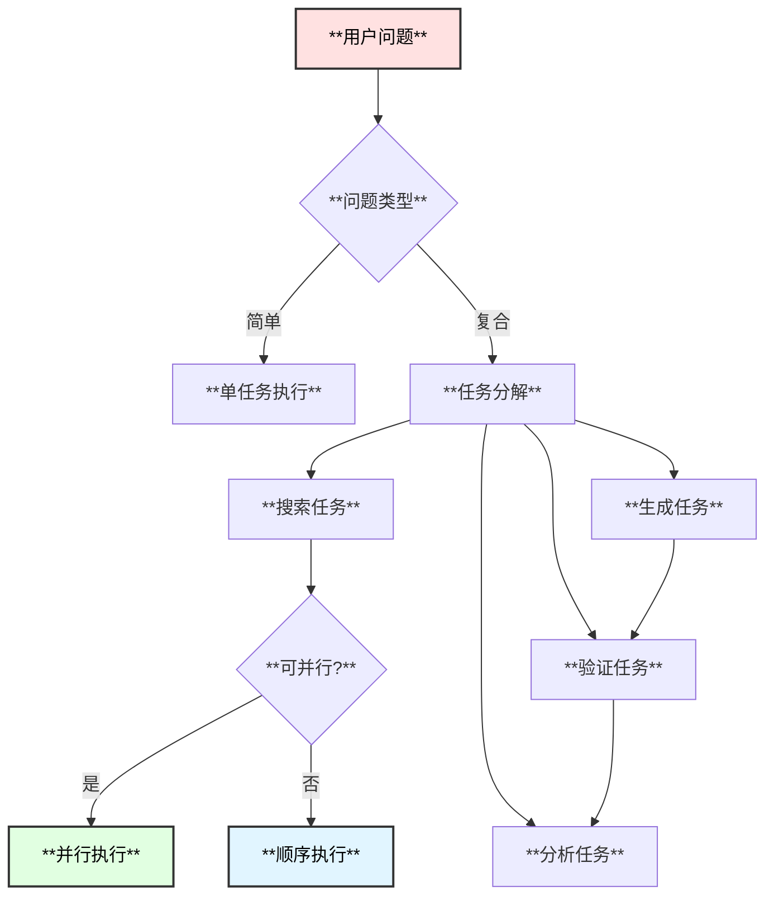
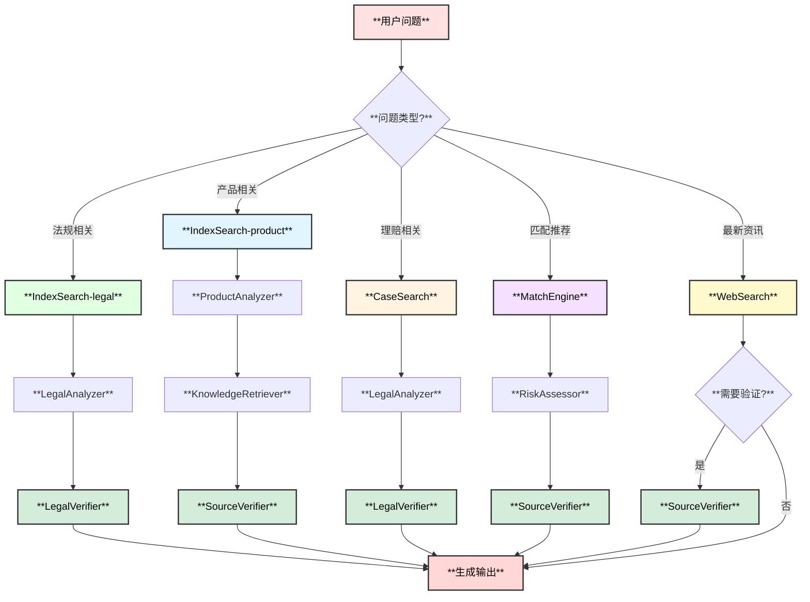
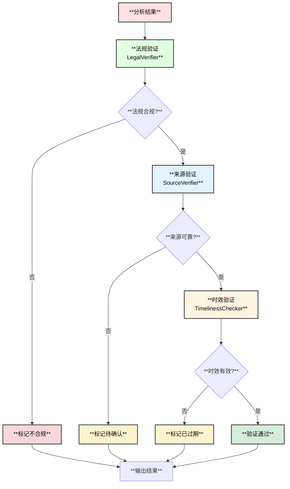

# 保险专家Agent - 思维工具使用方案

## 1. 思维工具总览



## 2. 意图识别工具

### 2.1 IntentClassifier - 意图分类器

**功能**：识别用户问题的类型，确定处理策略

**意图分类**：

| 意图类型 | 描述 | 示例问题 | 处理策略 |
|----------|------|----------|----------|
| `LEGAL_CONSULT` | 法规咨询 | "保险法对犹豫期是怎么规定的" | LegalAgent + VerifyAgent |
| `PRODUCT_ANALYSIS` | 产品分析 | "这款重疾险的条款有什么问题" | ProductAgent + LegalAgent |
| `CLAIM_GUIDANCE` | 理赔指导 | "得了甲状腺癌怎么理赔" | ClaimAgent + CaseSearch |
| `USER_MATCH` | 用户匹配 | "30岁女性买什么保险合适" | MatchAgent + ProductAgent |
| `HEALTH_DATA` | 健康数据 | "高血压患者能买什么保险" | HealthAgent + ProductAgent |
| `COMPARISON` | 产品对比 | "对比这两款重疾险" | ProductAgent + DiagramGenerator |
| `GENERAL_QUERY` | 通用查询 | "什么是保险等待期" | WebSearchAgent + VerifyAgent |

**实现**：

```go
// IntentClassifier 意图分类器
type IntentClassifier struct {
    llm        model.ChatModel
    rules      []IntentRule
    confidence float64
}

type IntentRule struct {
    Keywords    []string
    Patterns    []*regexp.Regexp
    Intent      IntentType
    Confidence  float64
}

// 保险领域意图规则
var InsuranceIntentRules = []IntentRule{
    {
        Keywords:   []string{"保险法", "法规", "规定", "条例", "合法"},
        Intent:     IntentLegalConsult,
        Confidence: 0.8,
    },
    {
        Keywords:   []string{"产品", "条款", "保障", "责任", "除外"},
        Intent:     IntentProductAnalysis,
        Confidence: 0.7,
    },
    {
        Keywords:   []string{"理赔", "报案", "赔付", "索赔", "材料"},
        Intent:     IntentClaimGuidance,
        Confidence: 0.9,
    },
    {
        Keywords:   []string{"推荐", "适合", "应该买", "怎么选"},
        Intent:     IntentUserMatch,
        Confidence: 0.8,
    },
    {
        Keywords:   []string{"疾病", "病史", "健康", "带病投保"},
        Intent:     IntentHealthData,
        Confidence: 0.7,
    },
    {
        Keywords:   []string{"对比", "比较", "区别", "哪个好"},
        Intent:     IntentComparison,
        Confidence: 0.9,
    },
}

// 意图分类流程
func (c *IntentClassifier) Classify(ctx context.Context, query string) (*IntentResult, error) {
    // Step 1: 规则匹配 (快速路径)
    if result := c.ruleBasedClassify(query); result != nil && result.Confidence > 0.8 {
        return result, nil
    }
    
    // Step 2: LLM分类 (准确路径)
    prompt := buildInsuranceIntentPrompt(query)
    response, err := c.llm.Generate(ctx, []*schema.Message{
        schema.SystemMessage(insuranceIntentSystemPrompt),
        schema.UserMessage(prompt),
    })
    if err != nil {
        return nil, err
    }
    
    return parseIntentResponse(response.Content)
}

// 保险领域意图识别提示词
const insuranceIntentSystemPrompt = `你是一个保险领域的意图识别专家。
根据用户问题，识别以下意图类型：

1. LEGAL_CONSULT - 法规咨询：涉及保险法律法规、监管规定
2. PRODUCT_ANALYSIS - 产品分析：保险产品条款分析、保障内容解读
3. CLAIM_GUIDANCE - 理赔指导：理赔流程、理赔材料、赔付标准
4. USER_MATCH - 用户匹配：保险推荐、需求分析、产品选择
5. HEALTH_DATA - 健康数据：疾病与保险关系、健康告知、带病投保
6. COMPARISON - 产品对比：多产品比较、优劣分析
7. GENERAL_QUERY - 通用查询：保险基础概念、术语解释

同时提取关键实体：
- 保险公司名称
- 产品名称
- 疾病名称
- 法规名称
- 金额/期限

返回JSON格式：
{
  "intent": "类型",
  "confidence": 0.9,
  "entities": {
    "companies": [],
    "products": [],
    "diseases": [],
    "laws": [],
    "amounts": []
  },
  "sub_intents": []
}`
```

### 2.2 QueryParser - 问题解析器

**功能**：解析用户问题中的关键实体

**实体类型**：

| 实体类型 | 描述 | 示例 |
|----------|------|------|
| `COMPANY` | 保险公司 | 平安、中国人寿、太平洋 |
| `PRODUCT` | 保险产品 | 平安福、健康百分百 |
| `DISEASE` | 疾病名称 | 甲状腺癌、糖尿病、高血压 |
| `LAW` | 法规名称 | 保险法、健康保险管理办法 |
| `CLAUSE` | 条款名称 | 等待期、免赔额、犹豫期 |
| `AMOUNT` | 金额 | 保额50万、保费3000元 |
| `PERIOD` | 期限 | 保障期30年、缴费期20年 |
| `PERSON` | 人员关系 | 投保人、被保险人、受益人 |

**实现**：

```go
// QueryParser 问题解析器
type QueryParser struct {
    entityRecognizer *InsuranceEntityRecognizer
    contextBuilder   *ContextBuilder
}

type ParsedQuery struct {
    Original    string
    Entities    []Entity
    Context     *QueryContext
    SubQueries  []string    // 分解后的子问题
}

type Entity struct {
    Type   EntityType
    Value  string
    Start  int
    End    int
    Meta   map[string]interface{}
}

type QueryContext struct {
    InsuranceType  string      // 险种：人寿/健康/财产/车险
    Scenario       string      // 场景：投保/理赔/退保/续保
    UserProfile    *UserProfile // 用户画像
    Urgency        string      // 紧急程度
    OutputType     OutputType  // 期望输出
}

type UserProfile struct {
    Age         int
    Gender      string
    Occupation  string
    HealthStatus string
    Budget      float64
}

func (p *QueryParser) Parse(ctx context.Context, query string) (*ParsedQuery, error) {
    // 实体识别
    entities := p.entityRecognizer.Recognize(query)
    
    // 上下文构建
    context := p.contextBuilder.Build(query, entities)
    
    // 问题分解
    subQueries := p.decompose(query, entities)
    
    return &ParsedQuery{
        Original:   query,
        Entities:   entities,
        Context:    context,
        SubQueries: subQueries,
    }, nil
}
```

## 3. 规划工具

### 3.1 TaskDecomposer - 任务分解器

**功能**：将复杂问题分解为可执行的子任务

**分解策略**：



**实现**：

```go
// TaskDecomposer 任务分解器
type TaskDecomposer struct {
    templates map[IntentType]*TaskTemplate
}

type TaskTemplate struct {
    Intent     IntentType
    Steps      []StepTemplate
    Parallel   [][]int  // 可并行的步骤组
}

type StepTemplate struct {
    Name        string
    Agent       string   // 执行的Agent
    Tool        string   // 使用的工具
    InputFrom   []string // 输入来源
    Required    bool     // 是否必需
    NeedVerify  bool     // 是否需要验证
}

// 分解示例 - PRODUCT_ANALYSIS意图
var productAnalysisTemplate = &TaskTemplate{
    Intent: IntentProductAnalysis,
    Steps: []StepTemplate{
        {Name: "search_legal", Agent: "LegalAgent", Tool: "IndexSearch", Required: true},
        {Name: "analyze_product", Agent: "ProductAgent", Tool: "ProductAnalyzer", Required: true},
        {Name: "search_cases", Agent: "ClaimAgent", Tool: "CaseSearch", Required: false},
        {Name: "verify_info", Agent: "VerifyAgent", Tool: "VerifyTool", Required: true, NeedVerify: true},
        {Name: "generate_doc", Agent: "DocumentAgent", Tool: "DiagramGenerator", Required: true},
    },
    Parallel: [][]int{{0, 1, 2}, {3}, {4}}, // 0,1,2可并行; 3单独验证; 4生成文档
}

// 分解示例 - CLAIM_GUIDANCE意图
var claimGuidanceTemplate = &TaskTemplate{
    Intent: IntentClaimGuidance,
    Steps: []StepTemplate{
        {Name: "search_product", Agent: "ProductAgent", Tool: "IndexSearch", Required: true},
        {Name: "search_cases", Agent: "ClaimAgent", Tool: "CaseSearch", Required: true},
        {Name: "analyze_workflow", Agent: "ClaimAgent", Tool: "WorkflowAnalyzer", Required: true},
        {Name: "verify_legal", Agent: "VerifyAgent", Tool: "LegalVerifier", Required: true, NeedVerify: true},
        {Name: "generate_guide", Agent: "DocumentAgent", Tool: "DocumentComposer", Required: true},
    },
    Parallel: [][]int{{0, 1}, {2}, {3}, {4}},
}

func (d *TaskDecomposer) Decompose(intent IntentType, query *ParsedQuery) (*ExecutionPlan, error) {
    template := d.templates[intent]
    if template == nil {
        return nil, fmt.Errorf("no template for intent: %v", intent)
    }
    
    plan := &ExecutionPlan{
        Intent: intent,
        Steps:  make([]PlanStep, 0),
    }
    
    for i, st := range template.Steps {
        step := PlanStep{
            ID:        fmt.Sprintf("step_%d", i),
            Name:      st.Name,
            Agent:     st.Agent,
            Tool:      st.Tool,
            InputFrom: st.InputFrom,
            NeedVerify: st.NeedVerify,
        }
        // 注入实体参数
        step.Params = d.injectParams(st, query)
        plan.Steps = append(plan.Steps, step)
    }
    
    plan.ParallelGroups = template.Parallel
    return plan, nil
}
```

## 4. 搜索工具

### 4.1 WebSearchTool - 网页搜索工具

**使用场景**：
- 搜索最新保险政策和法规
- 获取保险公司和产品信息
- 查找保险行业新闻和动态

**Tool定义**：

```go
// WebSearchTool Schema
var WebSearchToolInfo = &schema.ToolInfo{
    Name: "web_search",
    Desc: `在互联网上搜索保险相关信息。
适用场景：
- 搜索最新保险政策和法规更新
- 获取保险公司和产品的最新信息
- 查找保险行业新闻和市场动态

注意：
- 搜索结果需要经过验证
- 优先使用官方来源`,
    ParamsOneOf: schema.NewParamsOneOfByParams(map[string]*schema.ParameterInfo{
        "query": {
            Type:     schema.String,
            Required: true,
            Desc:     "搜索关键词",
        },
        "site": {
            Type: schema.String,
            Desc: "限制搜索站点，如 site:gov.cn 限制官方来源",
        },
        "time_range": {
            Type: schema.String,
            Desc: "时间范围：day/week/month/year",
        },
        "max_results": {
            Type: schema.Integer,
            Desc: "最大结果数，默认10",
        },
    }),
}
```

### 4.2 IndexSearchTool - 索引搜索工具

**使用场景**：
- 检索法律法规条款
- 搜索保险产品信息
- 查找理赔案例

**Tool定义**：

```go
// IndexSearchTool Schema
var IndexSearchToolInfo = &schema.ToolInfo{
    Name: "index_search",
    Desc: `在本地索引中搜索保险知识库内容。
索引包含：
- 法律法规库
- 产品条款库
- 理赔案例库
- 健康数据库

优先使用此工具进行专业信息检索`,
    ParamsOneOf: schema.NewParamsOneOfByParams(map[string]*schema.ParameterInfo{
        "query": {
            Type:     schema.String,
            Required: true,
            Desc:     "搜索查询",
        },
        "doc_type": {
            Type: schema.String,
            Desc: "文档类型：legal/product/claim/health",
        },
        "filters": {
            Type: schema.Object,
            Desc: "过滤条件，如 {\"company\": \"平安\", \"valid\": true}",
        },
        "max_results": {
            Type: schema.Integer,
            Desc: "最大结果数，默认20",
        },
    }),
}
```

### 4.3 KnowledgeRetriever - 知识检索工具

**使用场景**：
- 知识图谱查询
- 关联信息检索
- 语义相似搜索

**Tool定义**：

```go
// KnowledgeRetriever Schema
var KnowledgeRetrieverToolInfo = &schema.ToolInfo{
    Name: "knowledge_retrieve",
    Desc: `在保险知识图谱中检索关联信息。
支持查询：
- 保险公司->产品列表
- 产品->覆盖疾病
- 疾病->相关产品
- 法规->适用产品

用于发现实体间的关联关系`,
    ParamsOneOf: schema.NewParamsOneOfByParams(map[string]*schema.ParameterInfo{
        "entity": {
            Type:     schema.String,
            Required: true,
            Desc:     "查询实体",
        },
        "entity_type": {
            Type: schema.String,
            Desc: "实体类型：company/product/disease/law",
        },
        "relation": {
            Type: schema.String,
            Desc: "关系类型：offers/covers/excludes/regulates",
        },
        "depth": {
            Type: schema.Integer,
            Desc: "查询深度，默认2",
        },
    }),
}
```

### 4.4 CaseSearchTool - 案例搜索工具

**使用场景**：
- 搜索理赔案例
- 查找类似案例参考
- 分析理赔结果

**Tool定义**：

```go
// CaseSearchTool Schema
var CaseSearchToolInfo = &schema.ToolInfo{
    Name: "case_search",
    Desc: `搜索保险理赔案例。
案例信息包括：
- 案例背景
- 理赔过程
- 最终结果
- 关键判定因素

用于参考类似案例的处理方式`,
    ParamsOneOf: schema.NewParamsOneOfByParams(map[string]*schema.ParameterInfo{
        "keywords": {
            Type:     schema.String,
            Required: true,
            Desc:     "搜索关键词",
        },
        "disease": {
            Type: schema.String,
            Desc: "相关疾病",
        },
        "product_type": {
            Type: schema.String,
            Desc: "产品类型：重疾/医疗/意外/寿险",
        },
        "outcome": {
            Type: schema.String,
            Desc: "理赔结果：success/reject/partial",
        },
        "max_results": {
            Type: schema.Integer,
            Desc: "最大结果数，默认10",
        },
    }),
}
```

## 5. 分析工具

### 5.1 LegalAnalyzer - 法规分析器

**功能**：分析保险相关法律法规

```go
// LegalAnalyzer Schema
var LegalAnalyzerToolInfo = &schema.ToolInfo{
    Name: "analyze_legal",
    Desc: `分析保险相关法律法规。
分析内容：
- 条款解读
- 适用范围
- 时效性检查
- 与其他法规关联`,
    ParamsOneOf: schema.NewParamsOneOfByParams(map[string]*schema.ParameterInfo{
        "law_name": {
            Type:     schema.String,
            Required: true,
            Desc:     "法规名称",
        },
        "article": {
            Type: schema.String,
            Desc: "具体条款，如 '第十六条'",
        },
        "context": {
            Type: schema.String,
            Desc: "分析上下文/场景",
        },
    }),
}
```

### 5.2 ProductAnalyzer - 产品分析器

**功能**：分析保险产品条款

```go
// ProductAnalyzer Schema
var ProductAnalyzerToolInfo = &schema.ToolInfo{
    Name: "analyze_product",
    Desc: `分析保险产品条款。
分析内容：
- 保障责任
- 除外责任
- 等待期/犹豫期
- 赔付条件
- 免赔额
- 产品亮点/不足`,
    ParamsOneOf: schema.NewParamsOneOfByParams(map[string]*schema.ParameterInfo{
        "product_name": {
            Type:     schema.String,
            Required: true,
            Desc:     "产品名称",
        },
        "company": {
            Type: schema.String,
            Desc: "保险公司",
        },
        "focus_areas": {
            Type: schema.Array,
            Desc: "重点分析领域：责任/除外/等待期/理赔",
        },
    }),
}
```

### 5.3 RiskAssessor - 风险评估器

**功能**：评估投保风险

```go
// RiskAssessor Schema
var RiskAssessorToolInfo = &schema.ToolInfo{
    Name: "assess_risk",
    Desc: `评估投保或理赔风险。
评估内容：
- 健康风险评估
- 核保风险预测
- 理赔可能性分析`,
    ParamsOneOf: schema.NewParamsOneOfByParams(map[string]*schema.ParameterInfo{
        "user_profile": {
            Type:     schema.Object,
            Required: true,
            Desc:     "用户信息：{age, gender, health_conditions, occupation}",
        },
        "product_type": {
            Type: schema.String,
            Desc: "产品类型",
        },
        "assessment_type": {
            Type: schema.String,
            Desc: "评估类型：underwriting/claim",
        },
    }),
}
```

### 5.4 MatchEngine - 匹配引擎

**功能**：用户需求与产品匹配

```go
// MatchEngine Schema
var MatchEngineToolInfo = &schema.ToolInfo{
    Name: "match_products",
    Desc: `根据用户需求匹配保险产品。
匹配维度：
- 保障需求匹配
- 预算匹配
- 健康条件匹配
- 风险偏好匹配`,
    ParamsOneOf: schema.NewParamsOneOfByParams(map[string]*schema.ParameterInfo{
        "user_profile": {
            Type:     schema.Object,
            Required: true,
            Desc:     "用户画像",
        },
        "requirements": {
            Type: schema.Object,
            Desc: "需求描述：{coverage_types, budget, priority}",
        },
        "exclude_companies": {
            Type: schema.Array,
            Desc: "排除的公司",
        },
        "max_results": {
            Type: schema.Integer,
            Desc: "最大返回数",
        },
    }),
}
```

## 6. 验证工具

### 6.1 LegalVerifier - 法规验证器

**功能**：验证信息的法规合规性

```go
// LegalVerifier Schema
var LegalVerifierToolInfo = &schema.ToolInfo{
    Name: "verify_legal",
    Desc: `验证信息的法规合规性。
验证内容：
- 引用法规的准确性
- 条款解读的正确性
- 时效性检查`,
    ParamsOneOf: schema.NewParamsOneOfByParams(map[string]*schema.ParameterInfo{
        "content": {
            Type:     schema.String,
            Required: true,
            Desc:     "待验证内容",
        },
        "claimed_law": {
            Type: schema.String,
            Desc: "声称引用的法规",
        },
        "claimed_article": {
            Type: schema.String,
            Desc: "声称引用的条款",
        },
    }),
}
```

### 6.2 SourceVerifier - 来源验证器

**功能**：验证信息来源的可靠性

```go
// SourceVerifier Schema
var SourceVerifierToolInfo = &schema.ToolInfo{
    Name: "verify_source",
    Desc: `验证信息来源的可靠性。
验证维度：
- 来源权威性
- 信息时效性
- 内容一致性`,
    ParamsOneOf: schema.NewParamsOneOfByParams(map[string]*schema.ParameterInfo{
        "content": {
            Type:     schema.String,
            Required: true,
            Desc:     "待验证内容",
        },
        "claimed_source": {
            Type: schema.String,
            Desc: "声称的来源",
        },
        "verify_depth": {
            Type: schema.String,
            Desc: "验证深度：basic/standard/deep",
        },
    }),
}
```

### 6.3 TimelinessChecker - 时效检查器

**功能**：检查信息的时效性

```go
// TimelinessChecker Schema
var TimelinessCheckerToolInfo = &schema.ToolInfo{
    Name: "check_timeliness",
    Desc: `检查信息的时效性。
检查内容：
- 法规是否有更新版本
- 产品是否仍在售
- 数据是否过期`,
    ParamsOneOf: schema.NewParamsOneOfByParams(map[string]*schema.ParameterInfo{
        "content_type": {
            Type:     schema.String,
            Required: true,
            Desc:     "内容类型：legal/product/claim/health",
        },
        "content_id": {
            Type:     schema.String,
            Required: true,
            Desc:     "内容标识",
        },
        "reference_date": {
            Type: schema.String,
            Desc: "参考日期，默认当前",
        },
    }),
}
```

## 7. 工具选择决策树



## 8. 工具组合模式

### 8.1 法规咨询模式

```
1. IndexSearch(query, type="legal") -> 检索法规
2. LegalAnalyzer(law, article) -> 分析条款
3. KnowledgeRetriever(law, relation="regulates") -> 获取关联
4. LegalVerifier(content) -> 验证准确性
5. TimelinessChecker(type="legal", id) -> 检查时效
6. DocumentComposer(results) -> 生成文档
```

### 8.2 产品分析模式

```
1. IndexSearch(product, type="product") -> 检索产品
2. ProductAnalyzer(product, focus_areas) -> 分析产品
3. IndexSearch(query, type="legal") -> 检索相关法规
4. CaseSearch(keywords, product_type) -> 搜索案例
5. SourceVerifier(content) -> 验证信息
6. DiagramGenerator(type="comparison") -> 生成对比图
```

### 8.3 理赔指导模式

```
1. IndexSearch(product, type="product") -> 检索产品条款
2. CaseSearch(disease, outcome) -> 搜索类似案例
3. LegalAnalyzer(claim_process) -> 分析法规要求
4. LegalVerifier(content) -> 验证流程
5. DocumentComposer(results, template="claim_guide") -> 生成指南
```

### 8.4 用户匹配模式

```
1. MatchEngine(user_profile, requirements) -> 产品匹配
2. ProductAnalyzer(matched_products) -> 分析推荐产品
3. RiskAssessor(user_profile) -> 评估风险
4. KnowledgeRetriever(products, relation="covers") -> 获取覆盖信息
5. SourceVerifier(content) -> 验证产品信息
6. DiagramGenerator(type="comparison") -> 生成对比
```

### 8.5 健康数据分析模式

```
1. IndexSearch(disease, type="health") -> 检索健康数据
2. KnowledgeRetriever(disease, relation="related_to") -> 获取关联
3. IndexSearch(query, type="product") -> 检索可投保产品
4. RiskAssessor(health_conditions) -> 评估投保风险
5. SourceVerifier(content) -> 验证数据
6. DocumentComposer(results) -> 生成分析报告
```

## 9. 求证机制

### 9.1 三重验证流程



### 9.2 验证结果标注

| 验证状态 | 标识 | 说明 |
|----------|------|------|
| ✅ 已验证 | `[verified]` | 通过全部验证 |
| ⚠️ 待确认 | `[unverified]` | 未能找到确切来源 |
| ❌ 不合规 | `[non-compliant]` | 与法规冲突 |
| 🕐 已过期 | `[outdated]` | 信息已过时效 |
| 🔄 更新中 | `[updating]` | 正在获取最新信息 |
