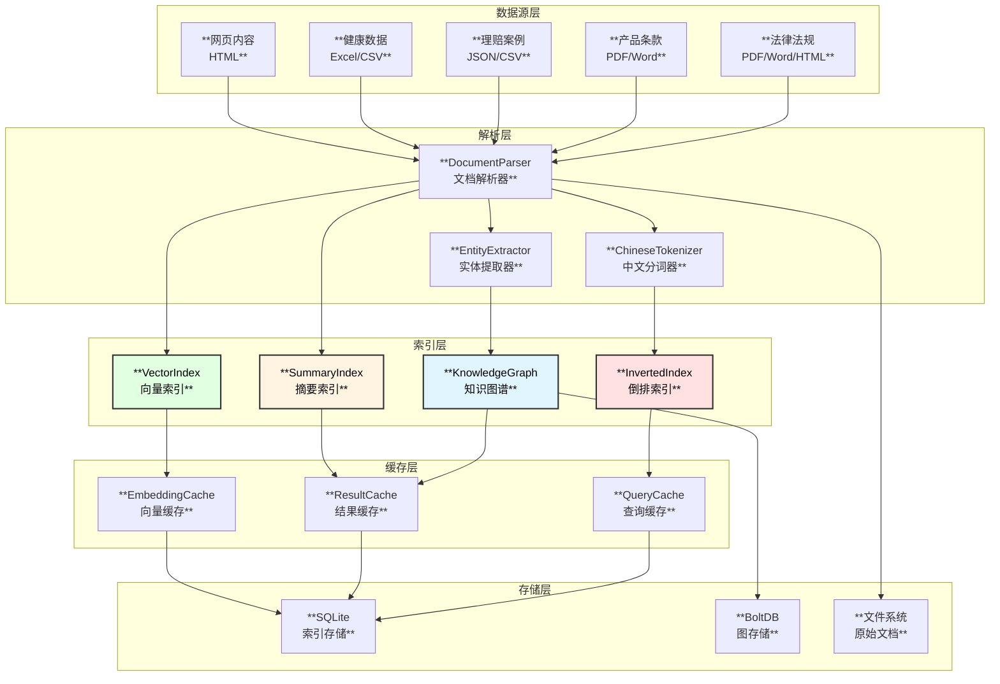

# 保险专家Agent - 索引系统设计

## 1. 索引系统概述

索引系统是保险专家Agent的核心基础设施，负责管理和检索法律法规、产品条款、理赔案例、健康数据等知识库内容。系统采用多级索引架构，结合倒排索引、向量索引、知识图谱等技术，实现高效的信息检索和语义搜索能力。

### 1.1 系统架构



## 2. 倒排索引设计

### 2.1 数据结构

```go
// InvertedIndex 倒排索引
type InvertedIndex struct {
    db          storage.Database
    tokenizer   *ChineseTokenizer
    cache       *cache.IndexCache
    stats       *IndexStats
}

// IndexRecord 索引记录
type IndexRecord struct {
    Term        string           `json:"term"`          // 词项
    DocID       string           `json:"doc_id"`        // 文档ID
    DocType     DocType          `json:"doc_type"`      // 文档类型
    Positions   []Position       `json:"positions"`     // 出现位置
    TF          float64          `json:"tf"`            // 词频
    IDF         float64          `json:"idf"`           // 逆文档频率
    Timestamp   time.Time        `json:"timestamp"`     // 索引时间
    ValidUntil  *time.Time       `json:"valid_until"`   // 有效期
}

// Position 位置信息
type Position struct {
    Section     int              `json:"section"`       // 章节号
    Paragraph   int              `json:"paragraph"`     // 段落号
    Sentence    int              `json:"sentence"`      // 句子号
    Offset      int              `json:"offset"`        // 字符偏移
    Length      int              `json:"length"`        // 长度
    Context     string           `json:"context"`       // 上下文
}

// DocType 文档类型
type DocType string
const (
    DocTypeLegal    DocType = "legal"     // 法律法规
    DocTypeProduct  DocType = "product"   // 产品条款
    DocTypeClaim    DocType = "claim"     // 理赔案例
    DocTypeHealth   DocType = "health"    // 健康数据
    DocTypeWeb      DocType = "web"       // 网页内容
)
```

### 2.2 中文分词器

```go
// ChineseTokenizer 中文分词器
type ChineseTokenizer struct {
    jieba       *gojieba.Jieba
    customDict  map[string]int      // 自定义词典
    stopWords   map[string]bool     // 停用词
}

// 保险领域专业词典
var InsuranceDict = map[string]int{
    // 法规术语
    "保险法":       100,
    "保险条例":     100,
    "健康保险管理办法": 100,
    
    // 产品术语
    "犹豫期":       100,
    "等待期":       100,
    "免赔额":       100,
    "保险责任":     100,
    "除外责任":     100,
    "保额":         100,
    "保费":         100,
    
    // 人员术语
    "投保人":       100,
    "被保险人":     100,
    "受益人":       100,
    "保险人":       100,
    
    // 操作术语
    "投保":         100,
    "理赔":         100,
    "退保":         100,
    "续保":         100,
    "核保":         100,
    
    // 险种术语
    "重疾险":       100,
    "医疗险":       100,
    "寿险":         100,
    "意外险":       100,
    "年金险":       100,
    
    // 疾病术语
    "甲状腺癌":     100,
    "原位癌":       100,
    "恶性肿瘤":     100,
    "心肌梗塞":     100,
    "脑中风":       100,
}

// NewChineseTokenizer 创建中文分词器
func NewChineseTokenizer(dictPath string) (*ChineseTokenizer, error) {
    jieba := gojieba.NewJieba()
    
    t := &ChineseTokenizer{
        jieba:      jieba,
        customDict: make(map[string]int),
        stopWords:  loadStopWords(),
    }
    
    // 加载自定义词典
    for word, freq := range InsuranceDict {
        t.customDict[word] = freq
        jieba.AddWord(word)
    }
    
    // 加载外部词典
    if dictPath != "" {
        t.loadExternalDict(dictPath)
    }
    
    return t, nil
}

// Tokenize 分词
func (t *ChineseTokenizer) Tokenize(text string) []Token {
    // 使用jieba分词
    words := t.jieba.Cut(text, true)
    
    tokens := make([]Token, 0)
    offset := 0
    
    for _, word := range words {
        // 跳过停用词
        if t.stopWords[word] {
            offset += len(word)
            continue
        }
        
        // 跳过单字符（非专业术语）
        if utf8.RuneCountInString(word) == 1 && t.customDict[word] == 0 {
            offset += len(word)
            continue
        }
        
        token := Token{
            Term:   word,
            Offset: offset,
            Length: len(word),
        }
        
        // 标记专业术语
        if _, ok := t.customDict[word]; ok {
            token.IsProfessional = true
        }
        
        tokens = append(tokens, token)
        offset += len(word)
    }
    
    return tokens
}
```

### 2.3 索引构建

```go
// IndexBuilder 索引构建器
type IndexBuilder struct {
    index       *InvertedIndex
    tokenizer   *ChineseTokenizer
    workers     int
    batchSize   int
    stats       *BuildStats
}

// Build 构建索引
func (b *IndexBuilder) Build(ctx context.Context, sources []DataSource) error {
    // 创建工作池
    taskChan := make(chan *Document, b.workers*2)
    resultChan := make(chan *IndexBatch, b.workers)
    errChan := make(chan error, 1)
    
    // 启动worker
    var wg sync.WaitGroup
    for i := 0; i < b.workers; i++ {
        wg.Add(1)
        go func() {
            defer wg.Done()
            b.indexWorker(ctx, taskChan, resultChan, errChan)
        }()
    }
    
    // 启动批量写入
    go b.batchWriter(ctx, resultChan)
    
    // 解析文档并分发任务
    for _, source := range sources {
        docs, err := b.parseSource(ctx, source)
        if err != nil {
            return err
        }
        
        for _, doc := range docs {
            select {
            case taskChan <- doc:
            case err := <-errChan:
                return err
            case <-ctx.Done():
                return ctx.Err()
            }
        }
    }
    
    close(taskChan)
    wg.Wait()
    close(resultChan)
    
    return nil
}

// indexWorker 索引工作协程
func (b *IndexBuilder) indexWorker(ctx context.Context, tasks <-chan *Document, 
    results chan<- *IndexBatch, errors chan<- error) {
    
    batch := &IndexBatch{
        Records: make([]*IndexRecord, 0, b.batchSize),
    }
    
    for doc := range tasks {
        // 分词
        tokens := b.tokenizer.Tokenize(doc.Content)
        
        // 计算词频
        termFreq := make(map[string]int)
        termPositions := make(map[string][]Position)
        
        for _, token := range tokens {
            termFreq[token.Term]++
            termPositions[token.Term] = append(termPositions[token.Term], Position{
                Section:   doc.Section,
                Paragraph: doc.Paragraph,
                Offset:    token.Offset,
                Length:    token.Length,
                Context:   extractContext(doc.Content, token.Offset, 50),
            })
        }
        
        // 创建索引记录
        totalTerms := len(tokens)
        for term, freq := range termFreq {
            record := &IndexRecord{
                Term:       term,
                DocID:      doc.ID,
                DocType:    doc.Type,
                Positions:  termPositions[term],
                TF:         float64(freq) / float64(totalTerms),
                Timestamp:  time.Now(),
                ValidUntil: doc.ValidUntil,
            }
            batch.Records = append(batch.Records, record)
        }
        
        // 批量发送
        if len(batch.Records) >= b.batchSize {
            results <- batch
            batch = &IndexBatch{
                Records: make([]*IndexRecord, 0, b.batchSize),
            }
        }
    }
    
    // 发送剩余记录
    if len(batch.Records) > 0 {
        results <- batch
    }
}
```

### 2.4 索引查询

```go
// Search 搜索
func (idx *InvertedIndex) Search(ctx context.Context, query string, opts SearchOptions) (*SearchResult, error) {
    // 检查缓存
    cacheKey := buildCacheKey(query, opts)
    if cached, ok := idx.cache.Get(cacheKey); ok {
        idx.stats.CacheHits++
        return cached.(*SearchResult), nil
    }
    idx.stats.CacheMisses++
    
    // 分词
    tokens := idx.tokenizer.Tokenize(query)
    if len(tokens) == 0 {
        return &SearchResult{}, nil
    }
    
    // 检索每个词项
    docScores := make(map[string]*DocScore)
    
    for _, token := range tokens {
        records, err := idx.getRecords(ctx, token.Term, opts)
        if err != nil {
            return nil, err
        }
        
        for _, record := range records {
            // 应用时效过滤
            if opts.ValidOnly && record.ValidUntil != nil && record.ValidUntil.Before(time.Now()) {
                continue
            }
            
            // 应用类型过滤
            if opts.DocType != "" && record.DocType != opts.DocType {
                continue
            }
            
            // 计算BM25分数
            score := idx.calculateBM25(record, len(tokens))
            
            // 专业术语加权
            if token.IsProfessional {
                score *= 1.5
            }
            
            if existing, ok := docScores[record.DocID]; ok {
                existing.Score += score
                existing.MatchedTerms = append(existing.MatchedTerms, token.Term)
            } else {
                docScores[record.DocID] = &DocScore{
                    DocID:        record.DocID,
                    DocType:      record.DocType,
                    Score:        score,
                    MatchedTerms: []string{token.Term},
                    Positions:    record.Positions,
                }
            }
        }
    }
    
    // 排序
    results := make([]*DocScore, 0, len(docScores))
    for _, ds := range docScores {
        results = append(results, ds)
    }
    sort.Slice(results, func(i, j int) bool {
        return results[i].Score > results[j].Score
    })
    
    // 限制结果数
    if opts.MaxResults > 0 && len(results) > opts.MaxResults {
        results = results[:opts.MaxResults]
    }
    
    result := &SearchResult{
        Query:   query,
        Results: results,
        Total:   len(docScores),
    }
    
    // 写入缓存
    idx.cache.Set(cacheKey, result, opts.CacheTTL)
    
    return result, nil
}

// calculateBM25 计算BM25分数
func (idx *InvertedIndex) calculateBM25(record *IndexRecord, queryLen int) float64 {
    k1 := 1.2
    b := 0.75
    
    tf := record.TF
    idf := record.IDF
    
    // 简化的BM25计算
    score := idf * (tf * (k1 + 1)) / (tf + k1*(1-b+b*float64(queryLen)))
    
    return score
}
```

## 3. 向量索引设计

### 3.1 数据结构

```go
// VectorIndex 向量索引
type VectorIndex struct {
    embedder    Embedder
    index       VectorStore
    cache       *cache.EmbeddingCache
    dimension   int
}

// Embedder 向量嵌入接口
type Embedder interface {
    Embed(ctx context.Context, texts []string) ([][]float32, error)
    Dimension() int
}

// VectorStore 向量存储接口
type VectorStore interface {
    Add(ctx context.Context, id string, vector []float32, metadata map[string]interface{}) error
    Search(ctx context.Context, vector []float32, k int, filter map[string]interface{}) ([]VectorResult, error)
    Delete(ctx context.Context, id string) error
}

// VectorResult 向量搜索结果
type VectorResult struct {
    ID         string
    Score      float32
    Metadata   map[string]interface{}
}
```

### 3.2 向量嵌入

```go
// OpenAIEmbedder OpenAI向量嵌入
type OpenAIEmbedder struct {
    client    *openai.Client
    model     string
    dimension int
}

func NewOpenAIEmbedder(apiKey, model string) *OpenAIEmbedder {
    return &OpenAIEmbedder{
        client:    openai.NewClient(apiKey),
        model:     model,
        dimension: 1536, // text-embedding-3-small
    }
}

func (e *OpenAIEmbedder) Embed(ctx context.Context, texts []string) ([][]float32, error) {
    resp, err := e.client.CreateEmbeddings(ctx, openai.EmbeddingRequest{
        Input: texts,
        Model: openai.EmbeddingModel(e.model),
    })
    if err != nil {
        return nil, err
    }
    
    vectors := make([][]float32, len(resp.Data))
    for i, data := range resp.Data {
        vectors[i] = data.Embedding
    }
    
    return vectors, nil
}

// LocalEmbedder 本地向量嵌入（使用Ollama）
type LocalEmbedder struct {
    baseURL   string
    model     string
    dimension int
}

func (e *LocalEmbedder) Embed(ctx context.Context, texts []string) ([][]float32, error) {
    vectors := make([][]float32, len(texts))
    
    for i, text := range texts {
        resp, err := e.callOllama(ctx, text)
        if err != nil {
            return nil, err
        }
        vectors[i] = resp.Embedding
    }
    
    return vectors, nil
}
```

### 3.3 语义搜索

```go
// SemanticSearch 语义搜索
func (idx *VectorIndex) SemanticSearch(ctx context.Context, query string, opts SemanticSearchOptions) (*SemanticSearchResult, error) {
    // 检查缓存
    cacheKey := buildCacheKey(query, opts)
    if cached, ok := idx.cache.GetEmbedding(cacheKey); ok {
        // 直接使用缓存的向量进行搜索
        return idx.searchWithVector(ctx, cached, opts)
    }
    
    // 生成查询向量
    vectors, err := idx.embedder.Embed(ctx, []string{query})
    if err != nil {
        return nil, err
    }
    queryVector := vectors[0]
    
    // 缓存查询向量
    idx.cache.SetEmbedding(cacheKey, queryVector, time.Hour)
    
    return idx.searchWithVector(ctx, queryVector, opts)
}

func (idx *VectorIndex) searchWithVector(ctx context.Context, vector []float32, opts SemanticSearchOptions) (*SemanticSearchResult, error) {
    // 构建过滤条件
    filter := make(map[string]interface{})
    if opts.DocType != "" {
        filter["doc_type"] = opts.DocType
    }
    if opts.ValidOnly {
        filter["valid"] = true
    }
    
    // 向量搜索
    results, err := idx.index.Search(ctx, vector, opts.MaxResults, filter)
    if err != nil {
        return nil, err
    }
    
    return &SemanticSearchResult{
        Results: results,
    }, nil
}
```

## 4. 知识图谱设计

### 4.1 数据结构

```go
// KnowledgeGraph 保险知识图谱
type KnowledgeGraph struct {
    db       *bolt.DB
    cache    *cache.GraphCache
}

// KGNode 图节点
type KGNode struct {
    ID          string                 `json:"id"`
    Type        NodeType               `json:"type"`
    Name        string                 `json:"name"`
    Properties  map[string]interface{} `json:"properties"`
    Validity    *ValidityInfo          `json:"validity"`
    CreatedAt   time.Time              `json:"created_at"`
    UpdatedAt   time.Time              `json:"updated_at"`
}

// NodeType 节点类型
type NodeType string
const (
    NodeTypeCompany    NodeType = "company"    // 保险公司
    NodeTypeProduct    NodeType = "product"    // 保险产品
    NodeTypeDisease    NodeType = "disease"    // 疾病
    NodeTypeLaw        NodeType = "law"        // 法规
    NodeTypeClause     NodeType = "clause"     // 条款
    NodeTypeBenefit    NodeType = "benefit"    // 保障项目
    NodeTypeExclusion  NodeType = "exclusion"  // 除外责任
    NodeTypeClaimCase  NodeType = "claim_case" // 理赔案例
)

// KGEdge 图边
type KGEdge struct {
    ID          string                 `json:"id"`
    FromNode    string                 `json:"from_node"`
    ToNode      string                 `json:"to_node"`
    RelType     RelationType           `json:"rel_type"`
    Properties  map[string]interface{} `json:"properties"`
    Weight      float64                `json:"weight"`
    CreatedAt   time.Time              `json:"created_at"`
}

// RelationType 关系类型
type RelationType string
const (
    RelTypeOffers       RelationType = "offers"        // 公司-提供->产品
    RelTypeCovers       RelationType = "covers"        // 产品-覆盖->疾病
    RelTypeExcludes     RelationType = "excludes"      // 产品-除外->疾病
    RelTypeRegulates    RelationType = "regulates"     // 法规-监管->产品
    RelTypeContains     RelationType = "contains"      // 产品-包含->条款/保障
    RelTypeRelatedTo    RelationType = "related_to"    // 通用关联
    RelTypeSimilarTo    RelationType = "similar_to"    // 产品相似
    RelTypeReferTo      RelationType = "refer_to"      // 案例-参考->法规
    RelTypeAppliesTo    RelationType = "applies_to"    // 法规-适用->险种
)

// ValidityInfo 有效性信息
type ValidityInfo struct {
    ValidFrom   time.Time  `json:"valid_from"`
    ValidUntil  *time.Time `json:"valid_until"`
    Status      string     `json:"status"` // active, deprecated, expired
    EffectDate  *time.Time `json:"effect_date"`
    UpdatedAt   time.Time  `json:"updated_at"`
}
```

### 4.2 图构建

```go
// GraphBuilder 图构建器
type GraphBuilder struct {
    graph       *KnowledgeGraph
    entityExt   *EntityExtractor
    relExtract  *RelationExtractor
}

// Build 构建知识图谱
func (b *GraphBuilder) Build(ctx context.Context, sources []DataSource) error {
    for _, source := range sources {
        switch source.Type {
        case DocTypeLegal:
            if err := b.buildLegalSubgraph(ctx, source); err != nil {
                return err
            }
        case DocTypeProduct:
            if err := b.buildProductSubgraph(ctx, source); err != nil {
                return err
            }
        case DocTypeClaim:
            if err := b.buildClaimSubgraph(ctx, source); err != nil {
                return err
            }
        }
    }
    
    // 建立跨领域关联
    return b.buildCrossRelations(ctx)
}

// buildProductSubgraph 构建产品子图
func (b *GraphBuilder) buildProductSubgraph(ctx context.Context, source DataSource) error {
    docs, err := b.parseSource(ctx, source)
    if err != nil {
        return err
    }
    
    for _, doc := range docs {
        // 创建产品节点
        productNode := &KGNode{
            ID:   generateID(NodeTypeProduct, doc.ID),
            Type: NodeTypeProduct,
            Name: doc.Title,
            Properties: map[string]interface{}{
                "company":     doc.Metadata["company"],
                "category":    doc.Metadata["category"],
                "launch_date": doc.Metadata["launch_date"],
            },
            Validity: &ValidityInfo{
                ValidFrom:  doc.PublishDate,
                ValidUntil: doc.ExpireDate,
                Status:     "active",
            },
        }
        
        if err := b.graph.AddNode(ctx, productNode); err != nil {
            return err
        }
        
        // 提取并创建保障项目节点
        benefits := b.entityExt.ExtractBenefits(doc.Content)
        for _, benefit := range benefits {
            benefitNode := &KGNode{
                ID:   generateID(NodeTypeBenefit, benefit.Name),
                Type: NodeTypeBenefit,
                Name: benefit.Name,
                Properties: map[string]interface{}{
                    "amount":    benefit.Amount,
                    "condition": benefit.Condition,
                },
            }
            
            b.graph.AddNode(ctx, benefitNode)
            b.graph.AddEdge(ctx, &KGEdge{
                FromNode: productNode.ID,
                ToNode:   benefitNode.ID,
                RelType:  RelTypeContains,
            })
        }
        
        // 提取并创建疾病关联
        diseases := b.entityExt.ExtractDiseases(doc.Content)
        for _, disease := range diseases {
            diseaseNode := &KGNode{
                ID:   generateID(NodeTypeDisease, disease.Name),
                Type: NodeTypeDisease,
                Name: disease.Name,
            }
            
            b.graph.AddNode(ctx, diseaseNode)
            
            relType := RelTypeCovers
            if disease.IsExcluded {
                relType = RelTypeExcludes
            }
            
            b.graph.AddEdge(ctx, &KGEdge{
                FromNode: productNode.ID,
                ToNode:   diseaseNode.ID,
                RelType:  relType,
                Properties: map[string]interface{}{
                    "condition": disease.Condition,
                },
            })
        }
        
        // 关联保险公司
        companyID := generateID(NodeTypeCompany, doc.Metadata["company"].(string))
        b.graph.AddEdge(ctx, &KGEdge{
            FromNode: companyID,
            ToNode:   productNode.ID,
            RelType:  RelTypeOffers,
        })
    }
    
    return nil
}
```

### 4.3 图查询

```go
// GetRelatedNodes 获取关联节点
func (g *KnowledgeGraph) GetRelatedNodes(ctx context.Context, nodeID string, relType RelationType, depth int) ([]*KGNode, error) {
    // 检查缓存
    cacheKey := fmt.Sprintf("related:%s:%s:%d", nodeID, relType, depth)
    if cached, ok := g.cache.Get(cacheKey); ok {
        return cached.([]*KGNode), nil
    }
    
    // BFS遍历
    visited := make(map[string]bool)
    result := make([]*KGNode, 0)
    queue := []struct {
        nodeID string
        level  int
    }{{nodeID, 0}}
    
    for len(queue) > 0 {
        current := queue[0]
        queue = queue[1:]
        
        if current.level > depth {
            continue
        }
        
        if visited[current.nodeID] {
            continue
        }
        visited[current.nodeID] = true
        
        // 获取当前节点
        node, err := g.GetNode(ctx, current.nodeID)
        if err != nil {
            continue
        }
        
        if current.level > 0 {
            result = append(result, node)
        }
        
        // 获取相关边
        edges, err := g.GetEdges(ctx, current.nodeID, relType)
        if err != nil {
            continue
        }
        
        for _, edge := range edges {
            targetID := edge.ToNode
            if edge.ToNode == current.nodeID {
                targetID = edge.FromNode
            }
            
            if !visited[targetID] {
                queue = append(queue, struct {
                    nodeID string
                    level  int
                }{targetID, current.level + 1})
            }
        }
    }
    
    // 写入缓存
    g.cache.Set(cacheKey, result, 10*time.Minute)
    
    return result, nil
}

// FindPath 查找路径
func (g *KnowledgeGraph) FindPath(ctx context.Context, fromID, toID string, maxDepth int) ([][]*KGNode, error) {
    paths := make([][]*KGNode, 0)
    
    // 双向BFS
    visitedFrom := make(map[string]*KGNode)
    visitedTo := make(map[string]*KGNode)
    parentFrom := make(map[string]string)
    parentTo := make(map[string]string)
    
    queueFrom := []string{fromID}
    queueTo := []string{toID}
    
    for depth := 0; depth < maxDepth && (len(queueFrom) > 0 || len(queueTo) > 0); depth++ {
        // 从起点扩展
        newQueueFrom := make([]string, 0)
        for _, nodeID := range queueFrom {
            if _, ok := visitedFrom[nodeID]; ok {
                continue
            }
            
            node, _ := g.GetNode(ctx, nodeID)
            visitedFrom[nodeID] = node
            
            // 检查是否相遇
            if _, ok := visitedTo[nodeID]; ok {
                path := g.buildPath(nodeID, parentFrom, parentTo)
                paths = append(paths, path)
            }
            
            // 获取邻居
            edges, _ := g.GetEdges(ctx, nodeID, "")
            for _, edge := range edges {
                neighbor := edge.ToNode
                if edge.ToNode == nodeID {
                    neighbor = edge.FromNode
                }
                if _, ok := visitedFrom[neighbor]; !ok {
                    newQueueFrom = append(newQueueFrom, neighbor)
                    parentFrom[neighbor] = nodeID
                }
            }
        }
        queueFrom = newQueueFrom
        
        // 类似地从终点扩展...
    }
    
    return paths, nil
}
```

## 5. 文档摘要索引

### 5.1 数据结构

```go
// SummaryIndex 摘要索引
type SummaryIndex struct {
    db    storage.Database
    cache *cache.SummaryCache
}

// DocumentSummary 文档摘要
type DocumentSummary struct {
    ID           string            `json:"id"`
    Title        string            `json:"title"`
    DocType      DocType           `json:"doc_type"`
    Source       string            `json:"source"`
    SourceURL    string            `json:"source_url"`
    Abstract     string            `json:"abstract"`
    Keywords     []string          `json:"keywords"`
    Entities     []Entity          `json:"entities"`
    PublishDate  time.Time         `json:"publish_date"`
    ValidUntil   *time.Time        `json:"valid_until"`
    UpdatedAt    time.Time         `json:"updated_at"`
    Metadata     map[string]string `json:"metadata"`
    
    // 时效追踪
    Timeliness   TimelinessInfo    `json:"timeliness"`
}

// TimelinessInfo 时效信息
type TimelinessInfo struct {
    LastChecked  time.Time  `json:"last_checked"`
    NextCheck    time.Time  `json:"next_check"`
    Status       string     `json:"status"` // current, outdated, unknown
    LatestVersion string    `json:"latest_version"`
    UpdateAvailable bool    `json:"update_available"`
}
```

### 5.2 摘要生成

```go
// SummaryExtractor 摘要提取器
type SummaryExtractor struct {
    llm          model.ChatModel
    entityExt    *EntityExtractor
    keywordExt   *KeywordExtractor
}

// Extract 提取摘要
func (e *SummaryExtractor) Extract(ctx context.Context, doc *Document) (*DocumentSummary, error) {
    // 提取关键词
    keywords := e.keywordExt.Extract(doc.Content)
    
    // 提取实体
    entities := e.entityExt.Extract(doc.Content)
    
    // 生成摘要
    abstract, err := e.generateAbstract(ctx, doc)
    if err != nil {
        return nil, err
    }
    
    summary := &DocumentSummary{
        ID:          doc.ID,
        Title:       doc.Title,
        DocType:     doc.Type,
        Source:      doc.Source,
        SourceURL:   doc.SourceURL,
        Abstract:    abstract,
        Keywords:    keywords,
        Entities:    entities,
        PublishDate: doc.PublishDate,
        ValidUntil:  doc.ValidUntil,
        UpdatedAt:   time.Now(),
        Metadata:    doc.Metadata,
        Timeliness: TimelinessInfo{
            LastChecked: time.Now(),
            NextCheck:   calculateNextCheck(doc.Type),
            Status:      "current",
        },
    }
    
    return summary, nil
}

// generateAbstract 生成摘要
func (e *SummaryExtractor) generateAbstract(ctx context.Context, doc *Document) (string, error) {
    prompt := fmt.Sprintf(`请为以下%s文档生成一个简洁的摘要（不超过200字）：

标题：%s

内容：
%s

要求：
1. 突出核心要点
2. 保留关键数据和条款
3. 使用专业术语
`, docTypeNames[doc.Type], doc.Title, truncate(doc.Content, 4000))

    response, err := e.llm.Generate(ctx, []*schema.Message{
        schema.UserMessage(prompt),
    })
    if err != nil {
        return "", err
    }
    
    return response.Content, nil
}

// 根据文档类型计算下次检查时间
func calculateNextCheck(docType DocType) time.Time {
    now := time.Now()
    switch docType {
    case DocTypeLegal:
        return now.Add(30 * 24 * time.Hour) // 法规：每月检查
    case DocTypeProduct:
        return now.Add(7 * 24 * time.Hour)  // 产品：每周检查
    case DocTypeWeb:
        return now.Add(24 * time.Hour)      // 网页：每天检查
    default:
        return now.Add(7 * 24 * time.Hour)
    }
}
```

## 6. 时效管理

### 6.1 时效追踪器

```go
// TimelinessTracker 时效追踪器
type TimelinessTracker struct {
    db        storage.Database
    crawler   *Crawler
    checker   *UpdateChecker
    scheduler *cron.Cron
}

// StartTracking 开始追踪
func (t *TimelinessTracker) StartTracking(ctx context.Context) error {
    // 定期检查法规更新
    t.scheduler.AddFunc("0 0 * * *", func() { // 每天检查
        t.checkLegalUpdates(ctx)
    })
    
    // 定期检查产品更新
    t.scheduler.AddFunc("0 */6 * * *", func() { // 每6小时检查
        t.checkProductUpdates(ctx)
    })
    
    // 定期检查网页时效
    t.scheduler.AddFunc("0 * * * *", func() { // 每小时检查
        t.checkWebTimeliness(ctx)
    })
    
    t.scheduler.Start()
    return nil
}

// checkLegalUpdates 检查法规更新
func (t *TimelinessTracker) checkLegalUpdates(ctx context.Context) error {
    // 获取所有法规文档
    docs, err := t.db.ListByType(ctx, DocTypeLegal)
    if err != nil {
        return err
    }
    
    for _, doc := range docs {
        // 检查是否需要更新
        if doc.Timeliness.NextCheck.After(time.Now()) {
            continue
        }
        
        // 搜索最新版本
        searchQuery := fmt.Sprintf("%s 最新版本 site:gov.cn", doc.Title)
        results, err := t.crawler.Search(ctx, searchQuery)
        if err != nil {
            continue
        }
        
        // 检查是否有更新
        for _, result := range results {
            if isNewerVersion(doc, result) {
                doc.Timeliness.UpdateAvailable = true
                doc.Timeliness.LatestVersion = result.Title
                doc.Timeliness.Status = "outdated"
                
                // 触发更新通知
                t.notifyUpdate(ctx, doc, result)
            }
        }
        
        // 更新检查时间
        doc.Timeliness.LastChecked = time.Now()
        doc.Timeliness.NextCheck = calculateNextCheck(doc.DocType)
        
        t.db.UpdateSummary(ctx, doc)
    }
    
    return nil
}

// MarkExpired 标记过期
func (t *TimelinessTracker) MarkExpired(ctx context.Context, docID string, reason string) error {
    doc, err := t.db.GetSummary(ctx, docID)
    if err != nil {
        return err
    }
    
    doc.Timeliness.Status = "expired"
    doc.Metadata["expire_reason"] = reason
    doc.UpdatedAt = time.Now()
    
    return t.db.UpdateSummary(ctx, doc)
}
```

## 7. 存储层设计

### 7.1 存储接口

```go
// Database 存储接口
type Database interface {
    // 索引记录
    AddIndexRecord(ctx context.Context, record *IndexRecord) error
    GetIndexRecords(ctx context.Context, term string, opts QueryOptions) ([]*IndexRecord, error)
    DeleteIndexRecords(ctx context.Context, docID string) error
    
    // 文档摘要
    AddSummary(ctx context.Context, summary *DocumentSummary) error
    GetSummary(ctx context.Context, id string) (*DocumentSummary, error)
    UpdateSummary(ctx context.Context, summary *DocumentSummary) error
    ListByType(ctx context.Context, docType DocType) ([]*DocumentSummary, error)
    ListExpired(ctx context.Context) ([]*DocumentSummary, error)
    
    // 向量
    AddVector(ctx context.Context, id string, vector []float32, metadata map[string]interface{}) error
    SearchVectors(ctx context.Context, vector []float32, k int, filter map[string]interface{}) ([]VectorResult, error)
    
    // 事务
    BeginTx(ctx context.Context) (Transaction, error)
}

// Transaction 事务接口
type Transaction interface {
    Commit() error
    Rollback() error
}
```

### 7.2 SQLite实现

```go
// SQLiteStorage SQLite存储实现
type SQLiteStorage struct {
    db      *sql.DB
    stmts   map[string]*sql.Stmt
}

// NewSQLiteStorage 创建SQLite存储
func NewSQLiteStorage(path string) (*SQLiteStorage, error) {
    db, err := sql.Open("sqlite3", path+"?_journal_mode=WAL&_synchronous=NORMAL")
    if err != nil {
        return nil, err
    }
    
    storage := &SQLiteStorage{
        db:    db,
        stmts: make(map[string]*sql.Stmt),
    }
    
    if err := storage.initSchema(); err != nil {
        return nil, err
    }
    
    if err := storage.prepareStatements(); err != nil {
        return nil, err
    }
    
    return storage, nil
}

// initSchema 初始化表结构
func (s *SQLiteStorage) initSchema() error {
    schema := `
    -- 倒排索引表
    CREATE TABLE IF NOT EXISTS inverted_index (
        term TEXT NOT NULL,
        doc_id TEXT NOT NULL,
        doc_type TEXT NOT NULL,
        positions TEXT,
        tf REAL,
        idf REAL,
        timestamp DATETIME,
        valid_until DATETIME,
        PRIMARY KEY (term, doc_id)
    );
    
    CREATE INDEX IF NOT EXISTS idx_term ON inverted_index(term);
    CREATE INDEX IF NOT EXISTS idx_doc_type ON inverted_index(doc_type);
    CREATE INDEX IF NOT EXISTS idx_valid ON inverted_index(valid_until);
    
    -- 文档摘要表
    CREATE TABLE IF NOT EXISTS document_summary (
        id TEXT PRIMARY KEY,
        title TEXT NOT NULL,
        doc_type TEXT NOT NULL,
        source TEXT,
        source_url TEXT,
        abstract TEXT,
        keywords TEXT,
        entities TEXT,
        publish_date DATETIME,
        valid_until DATETIME,
        timeliness TEXT,
        metadata TEXT,
        created_at TIMESTAMP DEFAULT CURRENT_TIMESTAMP,
        updated_at TIMESTAMP DEFAULT CURRENT_TIMESTAMP
    );
    
    CREATE INDEX IF NOT EXISTS idx_summary_type ON document_summary(doc_type);
    CREATE INDEX IF NOT EXISTS idx_summary_valid ON document_summary(valid_until);
    
    -- 全文搜索虚拟表
    CREATE VIRTUAL TABLE IF NOT EXISTS summary_fts USING fts5(
        title, abstract, keywords,
        content='document_summary',
        content_rowid='rowid'
    );
    
    -- 向量索引表
    CREATE TABLE IF NOT EXISTS vector_index (
        id TEXT PRIMARY KEY,
        vector BLOB NOT NULL,
        metadata TEXT,
        created_at TIMESTAMP DEFAULT CURRENT_TIMESTAMP
    );
    `
    
    _, err := s.db.Exec(schema)
    return err
}
```

## 8. 缓存策略

### 8.1 多级缓存

```go
// MultiLevelIndexCache 多级索引缓存
type MultiLevelIndexCache struct {
    l1      *lru.Cache           // L1: 内存LRU
    l2      *SQLiteCache         // L2: SQLite
    stats   *CacheStats
}

// Get 获取缓存
func (c *MultiLevelIndexCache) Get(key string) (interface{}, bool) {
    // L1查找
    if v, ok := c.l1.Get(key); ok {
        c.stats.L1Hits++
        return v, true
    }
    c.stats.L1Misses++
    
    // L2查找
    if v, ok := c.l2.Get(key); ok {
        c.stats.L2Hits++
        // 回填L1
        c.l1.Add(key, v)
        return v, true
    }
    c.stats.L2Misses++
    
    return nil, false
}

// Set 设置缓存
func (c *MultiLevelIndexCache) Set(key string, value interface{}, ttl time.Duration) {
    // 写入L1
    c.l1.Add(key, value)
    
    // 写入L2（持久化）
    c.l2.Set(key, value, ttl)
}

// GetStats 获取缓存统计
func (c *MultiLevelIndexCache) GetStats() *CacheStats {
    return c.stats
}
```

## 9. 性能优化

### 9.1 索引压缩

```go
// CompressIndex 压缩索引
func (idx *InvertedIndex) Compress(ctx context.Context) error {
    // 1. 合并小文件
    if err := idx.mergeSmallFiles(ctx); err != nil {
        return err
    }
    
    // 2. 删除过期记录
    if err := idx.deleteExpired(ctx); err != nil {
        return err
    }
    
    // 3. 重建IDF
    if err := idx.rebuildIDF(ctx); err != nil {
        return err
    }
    
    // 4. 优化存储
    if err := idx.vacuum(ctx); err != nil {
        return err
    }
    
    return nil
}
```

### 9.2 并行索引构建

```go
// ParallelBuild 并行构建索引
func (b *IndexBuilder) ParallelBuild(ctx context.Context, sources []DataSource, workers int) error {
    g, ctx := errgroup.WithContext(ctx)
    
    taskChan := make(chan *Document, workers*2)
    
    // 启动workers
    for i := 0; i < workers; i++ {
        g.Go(func() error {
            for doc := range taskChan {
                if err := b.indexDocument(ctx, doc); err != nil {
                    return err
                }
            }
            return nil
        })
    }
    
    // 分发任务
    g.Go(func() error {
        defer close(taskChan)
        for _, source := range sources {
            docs, err := b.parseSource(ctx, source)
            if err != nil {
                return err
            }
            for _, doc := range docs {
                select {
                case taskChan <- doc:
                case <-ctx.Done():
                    return ctx.Err()
                }
            }
        }
        return nil
    })
    
    return g.Wait()
}
```
