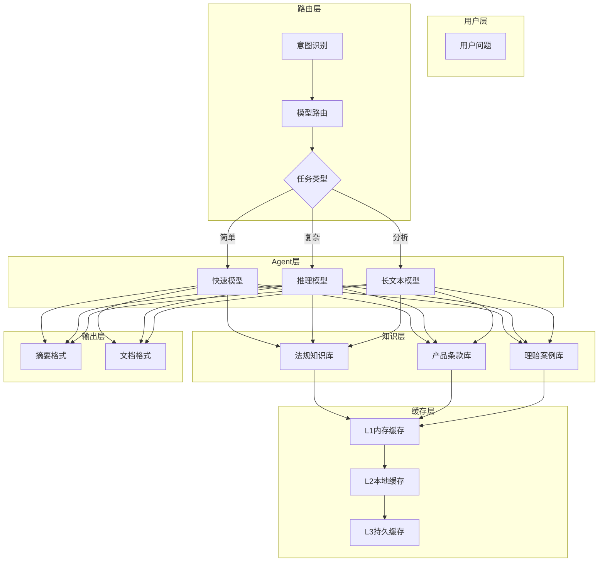
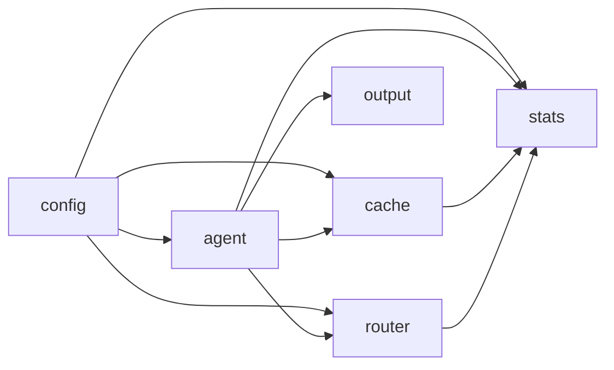

# 保险专家Agent项目总结

## 一、项目思路

### 1.1 核心架构



### 1.2 设计原则

| 原则 | 实践 |
|------|------|
| **配置外部化** | YAML配置 + 环境变量覆盖 |
| **多级缓存** | L1内存 → L2本地 → L3持久 |
| **智能路由** | 按任务类型选择最优模型 |
| **可观测性** | Token/缓存/性能全面统计 |
| **云原生** | Docker + K8S 一键部署 |

## 二、核心模块

### 2.1 模块关系



### 2.2 模块职责

| 模块 | 职责 | 核心类型 |
|------|------|---------|
| `config` | 配置管理 | Config, ProviderConfig |
| `agent` | Agent工厂 | AgentFactory, SubAgent |
| `cache` | 多级缓存 | LRUCache, MultiLevelCache |
| `router` | 模型路由 | Router, TaskType |
| `stats` | 统计监控 | Stats, Summary |
| `output` | 输出格式化 | Formatter, AnalysisResult |
| `storage` | 数据存储 | Storage, DocumentStore |
| `tools` | 工具集成 | WebSearch, Crawler |
| `skills` | 领域知识 | Markdown技能文档 |

## 三、关键问题与解决

### 3.1 问题清单

| # | 问题 | 原因 | 解决方案 |
|---|------|------|---------|
| 1 | Docker构建失败 | replace指向本地路径 | 从根目录构建，复制整个项目 |
| 2 | 跨平台编译失败 | ARM Mac编译amd64 | 不指定GOARCH，用原生架构 |
| 3 | Agent接口不匹配 | eino接口方法签名不同 | 仔细阅读接口，正确实现 |
| 4 | Docker daemon未运行 | colima未启动 | `colima start` |
| 5 | API Key安全 | 不能硬编码 | 环境变量 + 配置分离 |

### 3.2 关键代码修复

**问题1: Agent接口实现**
```go
// 错误：无ctx参数
func (a *Agent) Name() string

// 正确：有ctx参数
func (a *Agent) Name(ctx context.Context) string
```

**问题2: AsyncIterator创建**
```go
// 正确方式
iter, gen := adk.NewAsyncIteratorPair[*adk.AgentEvent]()
gen.Close()
return iter
```

**问题3: Docker构建**
```dockerfile
# 正确：从根目录复制整个项目
COPY . /build/eino
WORKDIR /build/eino/vdocsbaoxian
```

## 四、测试验证

### 4.1 测试覆盖

| 模块 | 测试数 | 状态 |
|------|--------|------|
| config | 13 | ✅ PASS |
| agent | 8 | ✅ PASS |
| cache | 9 | ✅ PASS |
| router | 12 | ✅ PASS |
| stats | 11 | ✅ PASS |
| output | 10 | ✅ PASS |
| interaction | 14 | ✅ PASS |

### 4.2 集成测试结果

```
✅ Config        - 配置加载正常
✅ Cache         - 多级缓存正常
✅ Router        - 模型选择正常
✅ Stats         - 统计功能正常
✅ Output        - 格式化正常
✅ DeepSeek API  - API调用正常 (~2-8秒)
✅ Insurance QA  - 问答正常
```

## 五、运行方式

### 5.1 本地运行

```bash
export DEEPSEEK_API_KEY=sk-xxx
cd vdocsbaoxian
./insurance-demo
```

### 5.2 Docker运行

```bash
docker run --rm -it \
  -e DEEPSEEK_API_KEY=sk-xxx \
  insurance-expert:latest
```

### 5.3 K8S部署

```bash
kubectl apply -f k8s/
```

## 六、可复用经验

### 6.1 架构模式

1. **配置模块**
   - DefaultConfig() 提供默认值
   - 敏感信息用 `XXX_env` 字段引用环境变量
   - 支持 LoadConfig/SaveConfig

2. **缓存模块**
   - 多级缓存自动回填
   - 统计回调解耦
   - TTL可配置

3. **路由模块**
   - 按任务类型路由
   - 支持成本/负载/优先级策略
   - 熔断降级机制

4. **统计模块**
   - 原子操作保证并发安全
   - 提供Summary聚合接口
   - 支持Token预算控制

5. **输出模块**
   - Formatter接口抽象
   - 支持摘要/文档两种格式
   - 内置Mermaid图表生成

### 6.2 开发清单

```
□ 设计阶段
  □ 领域知识来源
  □ 意图分类体系
  □ 子Agent职责
  □ 验证机制

□ 开发阶段
  □ 配置模块
  □ 缓存模块
  □ 路由模块
  □ 统计模块
  □ 输出模块
  □ 工具模块
  □ 技能模块

□ 测试阶段
  □ 单元测试
  □ 集成测试
  □ API测试

□ 部署阶段
  □ 本地脚本
  □ Docker镜像
  □ K8S配置
```

## 七、文件清单

```
vdocsbaoxian/
├── cmd/
│   ├── main.go           # 主程序
│   ├── demo/main.go      # 演示程序 ★
│   └── test/main.go      # 测试程序 ★
├── config/               # 配置模块 ★
├── agent/                # Agent模块 ★
├── cache/                # 缓存模块 ★
├── router/               # 路由模块 ★
├── stats/                # 统计模块 ★
├── output/               # 输出模块 ★
├── storage/              # 存储模块
├── interaction/          # 交互模块
├── tools/                # 工具模块
├── skills/               # 技能文档 ★
├── design/               # 设计文档 ★
├── k8s/                  # K8S配置 ★
├── Dockerfile            # Docker构建 ★
├── Makefile              # 构建脚本 ★
├── run_demo.sh           # 运行脚本 ★
├── insurance-demo        # 编译产物
└── insurance-test        # 测试产物
```

## 八、总结

### 成功要素

1. **模块化设计** - 各模块独立，便于复用和测试
2. **完善的配置** - 支持多环境、多模型、多存储
3. **多级缓存** - 有效减少Token消耗和响应时间
4. **智能路由** - 根据任务自动选择最优模型
5. **完善监控** - Token预算、缓存命中、性能指标
6. **云原生** - Docker/K8S一键部署

### 适用场景

- **法律专家** - 法规检索、案例分析
- **医疗专家** - 诊断建议、药品查询
- **金融专家** - 理财规划、风险评估
- **技术专家** - 代码分析、架构设计
- **客服专家** - 问题解答、工单处理

### 核心价值

> 将领域知识**结构化、工具化、可验证化**，
> 通过**多级缓存、智能路由、完善监控**实现高效可靠的专家Agent。
