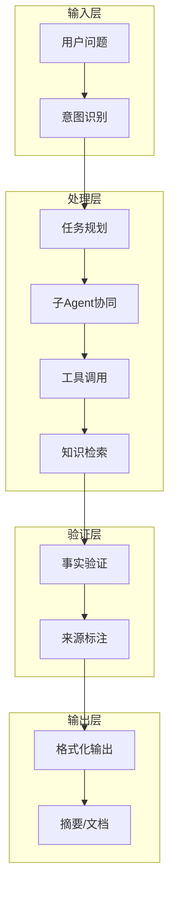

# 专家Agent开发技能手册

## 一、项目概述

### 1.1 核心思路

构建领域专家Agent的核心思路是**将领域知识结构化、工具化、可验证化**：



### 1.2 架构设计原则

| 原则 | 说明 | 实践 |
|------|------|------|
| **模块化** | 各功能独立，便于复用 | config/cache/stats等独立包 |
| **可配置** | 所有参数外部化 | YAML配置+环境变量 |
| **可观测** | 完善的监控统计 | Token/缓存/性能统计 |
| **可扩展** | 接口抽象，实现可替换 | Storage/Cache接口 |
| **可部署** | 支持多环境 | 本地/Docker/K8S |

## 二、核心模块设计

### 2.1 配置模块 (config)

**设计模式**: 分层配置 + 环境变量覆盖

```go
// 配置结构设计模式
type Config struct {
    Log         LogConfig         `yaml:"log"`
    Cache       CacheConfig       `yaml:"cache"`
    Storage     StorageConfig     `yaml:"storage"`
    LLM         LLMConfig         `yaml:"llm"`
    // ... 其他配置
}

// 环境变量覆盖模式
type ProviderConfig struct {
    APIKey    string `yaml:"api_key"`
    APIKeyEnv string `yaml:"api_key_env"` // 敏感信息用环境变量
}

// 加载配置时应用覆盖
func (c *Config) applyEnvOverrides() {
    for _, provider := range c.LLM.Providers {
        if provider.APIKeyEnv != "" {
            if apiKey := os.Getenv(provider.APIKeyEnv); apiKey != "" {
                provider.APIKey = apiKey
            }
        }
    }
}
```

**最佳实践**:
- 敏感信息（API Key、密码）使用环境变量
- 提供完整的DefaultConfig()
- 支持YAML热加载

### 2.2 缓存模块 (cache)

**设计模式**: 多级缓存 + 统计回调

```go
// 多级缓存设计
type MultiLevelCache struct {
    levels    []Cache
    statsFunc func(level int, hit bool) // 统计回调
}

// L1: 内存LRU (快速，容量小)
// L2: 本地SQLite/Redis (中等)
// L3: 持久化存储 (慢，容量大)

func (c *MultiLevelCache) Get(ctx context.Context, key string) (interface{}, bool) {
    for i, level := range c.levels {
        if value, ok := level.Get(ctx, key); ok {
            c.statsFunc(i+1, true) // 记录命中
            // 回填上层缓存
            for j := 0; j < i; j++ {
                c.levels[j].Set(ctx, key, value, 0)
            }
            return value, true
        }
        c.statsFunc(i+1, false) // 记录未命中
    }
    return nil, false
}
```

**缓存策略**:
| 层级 | 类型 | TTL | 容量 | 用途 |
|------|------|-----|------|------|
| L1 | 内存LRU | 5分钟 | 10000条 | 热点数据 |
| L2 | SQLite | 30分钟 | 无限 | 会话缓存 |
| L3 | 持久化 | 24小时 | 无限 | 历史缓存 |

### 2.3 模型路由 (router)

**设计模式**: 策略路由 + 熔断降级

```go
// 任务类型定义
type TaskType string
const (
    TaskTypeSimple     TaskType = "simple"     // 简单问答
    TaskTypeReasoning  TaskType = "reasoning"  // 复杂推理
    TaskTypeAnalysis   TaskType = "analysis"   // 文档分析
    TaskTypeVerify     TaskType = "verify"     // 事实验证
)

// 路由选择策略
func (r *Router) SelectModel(ctx context.Context, taskType TaskType) (*ModelConfig, error) {
    candidates := r.getCandidates(taskType)
    
    if r.config.CostOptimize {
        return r.selectByCost(candidates)     // 成本优先
    }
    if r.config.LoadBalance {
        return r.selectByLoad(candidates)     // 负载均衡
    }
    return r.selectByPriority(candidates)     // 优先级
}

// 熔断降级
func (r *Router) GetFallback(currentModel string) (*ModelConfig, error) {
    for _, name := range r.config.FallbackOrder {
        if state, exists := r.models[name]; exists && state.Available {
            return &state.Config, nil
        }
    }
    return nil, errors.New("no fallback available")
}
```

**模型路由策略**:
```yaml
task_routing:
  simple: ["deepseek-chat", "glm-4-flash"]      # 快速响应
  reasoning: ["deepseek-reasoner", "gpt-4"]     # 强推理
  analysis: ["claude-3", "gpt-4-turbo"]         # 长文本
  verify: ["deepseek-reasoner"]                 # 事实核查
```

### 2.4 统计模块 (stats)

**设计模式**: 原子计数 + 聚合查询

```go
type Stats struct {
    token *TokenStats
    cache *CacheStats
    agent *AgentStats
}

// 使用原子操作保证并发安全
func (s *Stats) RecordTokenUsage(provider string, input, output int64) {
    atomic.AddInt64(&s.token.TotalInputTokens, input)
    atomic.AddInt64(&s.token.TotalOutputTokens, output)
    // ...
}

// 聚合统计
type Summary struct {
    Uptime           time.Duration
    TokenStats       *TokenStats
    CacheStats       *CacheStats
    CacheHitRate     float64
    AgentStats       *AgentStats
    TokenBudgetUsage float64
}
```

**关键指标**:
- Token消耗（输入/输出/总计）
- 缓存命中率（L1/L2/L3）
- 查询成功率
- 平均响应时间
- 各子Agent调用统计

### 2.5 输出格式化 (output)

**设计模式**: 模板+Builder

```go
// 分析结果结构
type AnalysisResult struct {
    Query         string              // 问题
    Summary       string              // 摘要
    Details       string              // 详情
    LegalBasis    []LegalReference    // 法规依据
    ProductTerms  []ProductTerm       // 产品条款
    ClaimCases    []ClaimCase         // 理赔案例
    Diagrams      []Diagram           // 图表
    Tables        []Table             // 表格
    Confidence    float64             // 置信度
    Sources       []string            // 来源
}

// 两种输出格式
type Formatter interface {
    Format(result *AnalysisResult) (string, error)
}

// 1. 摘要格式 - 简短回答
type SummaryFormatter struct { maxLength int }

// 2. 文档格式 - 详细报告（含Mermaid图表）
type DocumentFormatter struct { config *OutputConfig }
```

**Mermaid图表生成**:
```go
func (g *DiagramGenerator) GenerateFlowchart(title string, nodes []string, edges [][2]string) *Diagram {
    var content strings.Builder
    content.WriteString("flowchart TD\n")
    for _, node := range nodes {
        content.WriteString(fmt.Sprintf("    %s\n", node))
    }
    for _, edge := range edges {
        content.WriteString(fmt.Sprintf("    %s --> %s\n", edge[0], edge[1]))
    }
    return &Diagram{Type: "flowchart", Title: title, Content: content.String()}
}
```

## 三、遇到的问题与解决方案

### 3.1 依赖管理问题

**问题**: go.mod使用replace指向本地路径，Docker构建时找不到依赖

**解决方案**: 
```dockerfile
# 从项目根目录构建，复制整个eino项目
WORKDIR /build
COPY . /build/eino
WORKDIR /build/eino/vdocsbaoxian
RUN go mod download
```

### 3.2 跨平台编译问题

**问题**: Mac ARM上构建amd64 Docker镜像失败

**解决方案**:
```dockerfile
# 不指定GOARCH，使用原生架构
RUN CGO_ENABLED=1 go build -ldflags "-s -w" -o /app ./cmd/demo/
```

### 3.3 接口定义匹配问题

**问题**: eino框架的Agent接口方法签名与自定义实现不匹配

**解决方案**: 仔细阅读框架接口定义，正确实现所有方法
```go
// eino的Agent接口
type Agent interface {
    Name(ctx context.Context) string         // 注意有ctx参数
    Description(ctx context.Context) string  // 注意有ctx参数
    Run(ctx context.Context, input *AgentInput, options ...AgentRunOption) *AsyncIterator[*AgentEvent]
}

// 创建AsyncIterator
iter, gen := adk.NewAsyncIteratorPair[*adk.AgentEvent]()
gen.Close() // 记得关闭
return iter
```

### 3.4 Docker连接问题

**问题**: Docker daemon未运行

**解决方案**: 
```bash
# Mac使用colima
colima start

# 或启动Docker Desktop
```

### 3.5 API Key安全问题

**问题**: 不能硬编码API Key

**解决方案**:
```go
// 配置中使用环境变量引用
type ProviderConfig struct {
    APIKeyEnv string `yaml:"api_key_env"`
}

// 运行时从环境变量读取
apiKey := os.Getenv("DEEPSEEK_API_KEY")
```

## 四、可复用代码模板

### 4.1 LLM API调用模板

```go
type LLMRequest struct {
    Model    string   `json:"model"`
    Messages []LLMMsg `json:"messages"`
    Stream   bool     `json:"stream"`
}

type LLMMsg struct {
    Role    string `json:"role"`
    Content string `json:"content"`
}

func callLLM(ctx context.Context, apiKey, baseURL, model, prompt string) (string, error) {
    reqBody := LLMRequest{
        Model: model,
        Messages: []LLMMsg{
            {Role: "system", Content: "你是专业的领域专家..."},
            {Role: "user", Content: prompt},
        },
        Stream: false,
    }

    jsonData, _ := json.Marshal(reqBody)
    req, _ := http.NewRequestWithContext(ctx, "POST", baseURL+"/chat/completions", 
        strings.NewReader(string(jsonData)))
    req.Header.Set("Content-Type", "application/json")
    req.Header.Set("Authorization", "Bearer "+apiKey)

    client := &http.Client{Timeout: 60 * time.Second}
    resp, err := client.Do(req)
    if err != nil {
        return "", err
    }
    defer resp.Body.Close()

    // 解析响应...
}
```

### 4.2 缓存装饰器模板

```go
func WithCache(cache Cache, fn func(ctx context.Context, key string) (interface{}, error)) func(ctx context.Context, key string) (interface{}, error) {
    return func(ctx context.Context, key string) (interface{}, error) {
        // 先查缓存
        if cached, ok := cache.Get(ctx, key); ok {
            return cached, nil
        }
        
        // 执行原函数
        result, err := fn(ctx, key)
        if err != nil {
            return nil, err
        }
        
        // 写入缓存
        cache.Set(ctx, key, result, 0)
        return result, nil
    }
}
```

### 4.3 统计装饰器模板

```go
func WithStats(stats *Stats, fn func(ctx context.Context) error) func(ctx context.Context) error {
    return func(ctx context.Context) error {
        start := time.Now()
        err := fn(ctx)
        duration := time.Since(start)
        
        stats.RecordQuery(err == nil, duration)
        return err
    }
}
```

## 五、专家Agent开发清单

### 5.1 设计阶段
- [ ] 确定领域知识来源（法规、文档、案例等）
- [ ] 设计意图分类体系
- [ ] 规划子Agent职责划分
- [ ] 设计验证机制

### 5.2 开发阶段
- [ ] 配置模块（YAML + 环境变量）
- [ ] 缓存模块（多级缓存）
- [ ] 模型路由（任务分发）
- [ ] 统计模块（Token/缓存/性能）
- [ ] 输出格式化（摘要/文档）
- [ ] 工具模块（搜索/爬虫/索引）
- [ ] 技能模块（领域知识）

### 5.3 测试阶段
- [ ] 单元测试（各模块）
- [ ] 集成测试（端到端）
- [ ] 性能测试（响应时间）
- [ ] API测试（LLM调用）

### 5.4 部署阶段
- [ ] 本地运行脚本
- [ ] Docker镜像构建
- [ ] K8S部署配置
- [ ] 监控告警配置

## 六、项目结构模板

```
expert-agent/
├── cmd/
│   ├── main.go          # 主入口
│   ├── demo/main.go     # 演示程序
│   └── test/main.go     # 测试程序
├── config/
│   ├── config.go        # 配置结构
│   └── config_test.go   # 配置测试
├── agent/
│   ├── interface.go     # Agent接口
│   ├── factory.go       # Agent工厂
│   └── factory_test.go  # 工厂测试
├── cache/
│   ├── cache.go         # 缓存实现
│   └── cache_test.go    # 缓存测试
├── router/
│   ├── router.go        # 模型路由
│   └── router_test.go   # 路由测试
├── stats/
│   ├── stats.go         # 统计模块
│   └── stats_test.go    # 统计测试
├── output/
│   ├── formatter.go     # 输出格式化
│   └── formatter_test.go # 格式化测试
├── storage/
│   └── storage.go       # 存储模块
├── tools/
│   ├── websearch/       # 网页搜索
│   └── crawler/         # 网页爬虫
├── skills/
│   └── domain/          # 领域技能文档
├── design/
│   ├── architecture.md  # 架构设计
│   ├── modules.md       # 模块设计
│   └── tech_selection.md # 技术选型
├── k8s/
│   ├── deployment.yaml  # K8S部署
│   └── configmap.yaml   # 配置映射
├── Dockerfile           # Docker构建
├── docker-compose.yaml  # Docker Compose
├── Makefile             # 构建脚本
├── go.mod               # Go模块
└── README.md            # 项目说明
```

## 七、总结

### 核心价值
1. **可复用架构** - 模块化设计，可快速适配其他领域
2. **完善的工程实践** - 配置、缓存、统计、测试一应俱全
3. **生产级部署** - Docker/K8S开箱即用

### 适用场景
- 法律专家Agent
- 医疗专家Agent
- 金融专家Agent
- 技术文档专家Agent
- 客服专家Agent

### 关键成功因素
1. **领域知识结构化** - 将知识转化为可检索的数据
2. **多级缓存策略** - 减少Token消耗，提高响应速度
3. **模型路由** - 根据任务复杂度选择合适模型
4. **事实验证** - 确保输出可追溯、可验证
5. **完善监控** - Token预算、缓存命中率、响应时间
