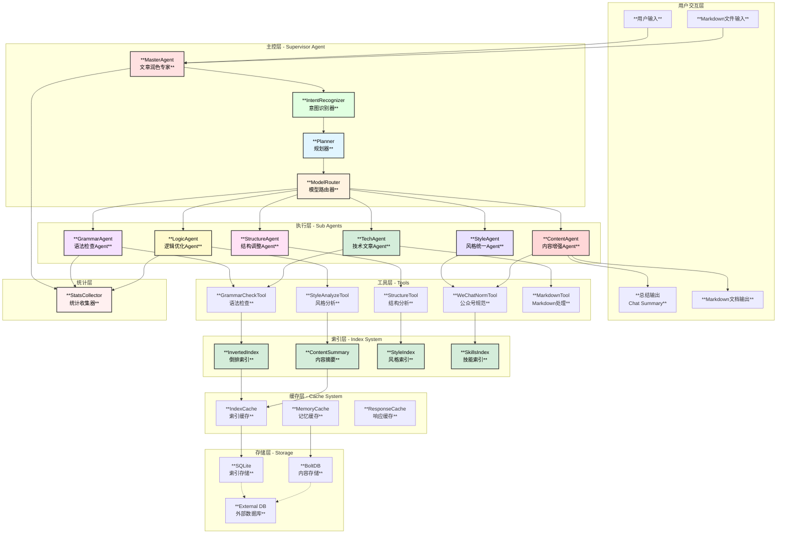
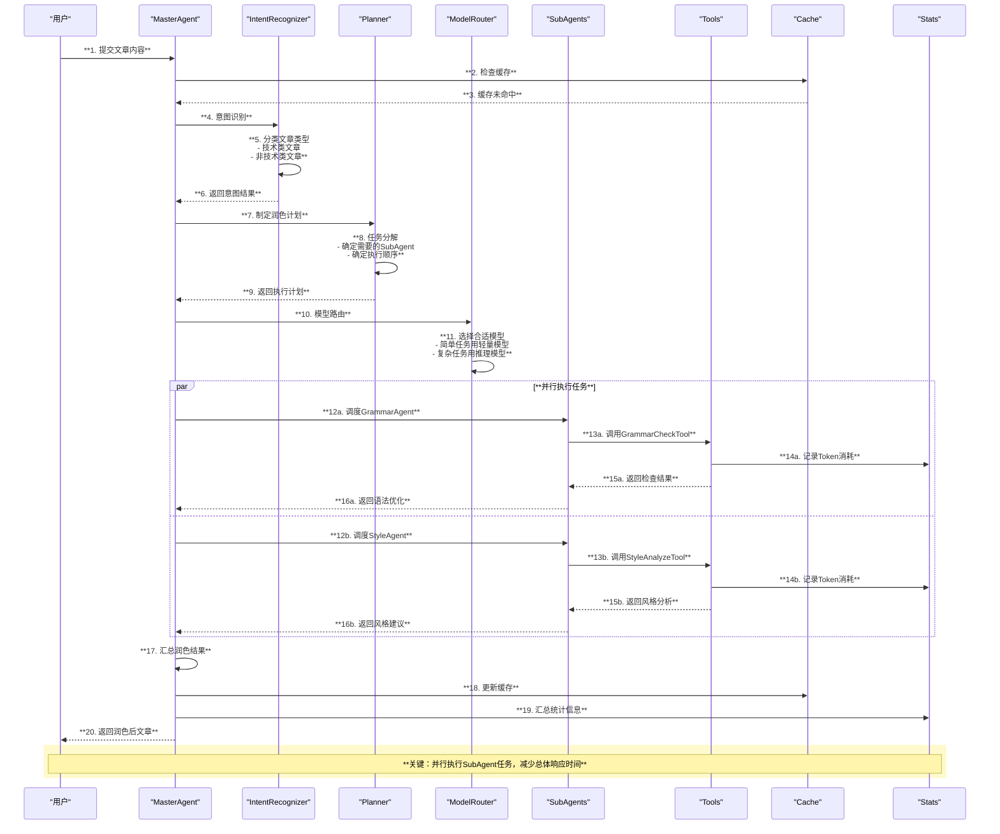
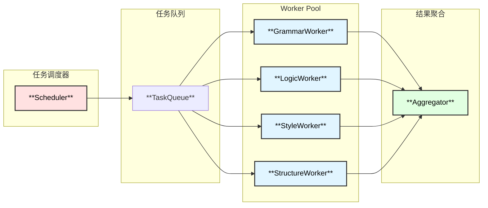
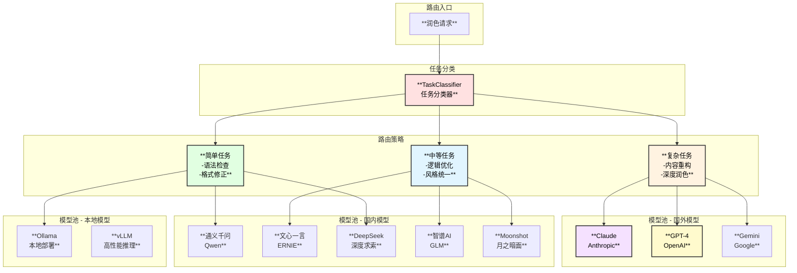
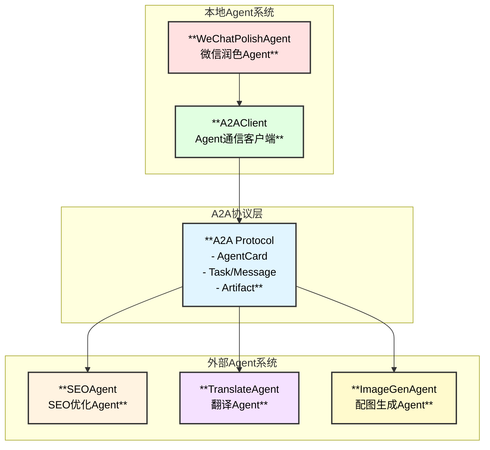
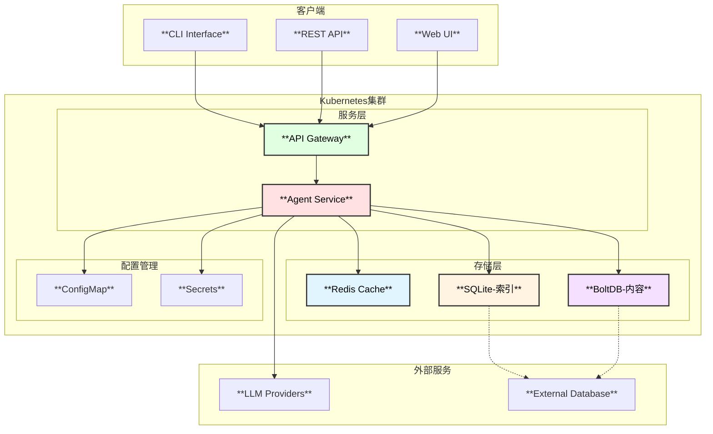

# 微信公众号文章润色专家Agent - 整体架构设计

## 1. 系统概述

微信公众号文章润色专家Agent是一个基于eino框架开发的智能文章处理系统，专门用于从专业角度润色微信公众号文章。系统采用多Agent协作架构，结合内容索引、并发处理、多轮交互等技术，提供专业的文章润色能力，包括语法检查、逻辑优化、结构调整、语言风格统一等功能。

### 1.1 核心特性

| 特性 | 描述 | 技术实现 |
|------|------|----------|
| **多类型文章支持** | 支持技术类和非技术类文章润色 | 意图识别 + 专业技能库 |
| **Markdown处理** | 支持指定路径的Markdown文件输入输出 | 文件系统中间件 |
| **多轮交互** | 支持用户上传内容后的多轮修改 | 会话状态管理 |
| **索引系统** | 倒排索引、摘要索引加速搜索 | SQLite + BoltDB |
| **并发处理** | SubAgent并发机制加速处理 | Supervisor模式 |
| **模型路由** | 支持国内外多种大模型 | 智能路由器 |
| **缓存系统** | 记忆系统 + 索引缓存减少Token | 多级缓存 |
| **统计模块** | Token统计、缓存命中统计 | 实时监控 |
| **Agent交互** | 支持与外部Agent交互 | A2A协议 |

## 2. 整体架构图



## 3. 核心组件说明

### 3.1 主控层 (Supervisor Agent)

| 组件 | 功能 | 技术实现 |
|------|------|----------|
| **MasterAgent** | 协调所有子Agent，管理对话上下文 | `adk.ChatModelAgent` + `supervisor.New` |
| **IntentRecognizer** | 识别用户意图，分类文章类型 | LLM + 规则引擎 |
| **Planner** | 制定润色计划，分配任务 | `adk.prebuilt.deep` 任务规划 |
| **ModelRouter** | 根据任务类型路由到合适的模型 | 智能路由策略 |

### 3.2 执行层 (Sub Agents)

| Agent | 职责 | 并发支持 |
|-------|------|----------|
| **GrammarAgent** | 语法检查、错别字纠正 | ✅ 段落并发 |
| **LogicAgent** | 逻辑分析、论点论据优化 | ✅ 章节并发 |
| **StructureAgent** | 结构调整、段落重组 | ✅ 并发分析 |
| **StyleAgent** | 风格统一、用词规范 | ✅ 并发检查 |
| **TechAgent** | 技术术语、代码块处理 | ✅ 代码并发 |
| **ContentAgent** | 内容增强、可读性优化 | - |

### 3.3 工具层 (Tools)

```go
// 工具接口定义
type Tool interface {
    Info(ctx context.Context) (*schema.ToolInfo, error)
    InvokableRun(ctx context.Context, args string, opts ...tool.Option) (string, error)
}
```

| 工具 | 功能 | 性能优化 |
|------|------|----------|
| **GrammarCheckTool** | 语法、拼写检查 | 批量处理 |
| **StyleAnalyzeTool** | 风格分析、一致性检查 | 索引加速 |
| **StructureTool** | 结构分析、大纲生成 | 缓存优化 |
| **WeChatNormTool** | 微信公众号规范检查 | 规则引擎 |
| **MarkdownTool** | Markdown解析和格式化 | 流式处理 |

## 4. 数据流架构



## 5. 并发执行架构

### 5.1 并发模型



### 5.2 并发策略

| 场景 | 并发策略 | 实现方式 |
|------|----------|----------|
| 多段落检查 | Fan-out/Fan-in | `errgroup.Group` |
| 多维度分析 | Pipeline | Channel + Goroutine |
| 风格遍历 | 并行分析 | WorkerPool |
| 索引构建 | MapReduce | 分片处理 |

## 6. 模型路由架构



## 7. Agent交互架构 (A2A)



## 8. 输出格式设计

### 8.1 总结输出 (Summary Mode)

```
【原文】: 文章原标题
【优化标题】: 优化后的标题
【主要修改】: 
  1. 语法修正: XX处
  2. 逻辑优化: XX处
  3. 风格统一: XX处
【Token消耗】: 输入XX / 输出XX
【缓存命中率】: XX%
```

### 8.2 文档输出 (Document Mode)

```markdown
# 润色后文章

## 原文对比
[差异对比视图]

## 修改说明
### 1. 语法修正
[具体修改列表]

### 2. 逻辑优化
[逻辑调整说明]

### 3. 结构调整
[结构变化图]

### 4. 风格统一
[风格建议]

## 统计信息
[Token消耗、处理时间等]
```

## 9. 部署架构



## 10. 扩展性设计

### 10.1 插件机制

- **新Agent注册**: 通过 `adk.SetSubAgents` 动态添加
- **新Tool注册**: 通过 `ToolsConfig.Tools` 扩展
- **新Skill注册**: 通过 `skill.Backend` 接口扩展
- **新模型注册**: 通过 `ModelRouter.Register` 添加

### 10.2 配置化

```yaml
wechat_polish:
  work_path: "/path/to/workspace"
  input_path: "/path/to/input"
  output_path: "/path/to/output"
  
  index:
    type: "sqlite"          # sqlite | external
    path: "/path/to/index"
    external_dsn: ""        # 外部数据库连接
  
  cache:
    enabled: true
    type: "memory"          # memory | redis
    ttl: 30m
    redis_url: ""
  
  models:
    primary: "deepseek"
    fallback: "qwen"
    local: "ollama"
    
  agents:
    - grammar
    - logic
    - structure
    - style
    - tech
    - content
    
  stats:
    enabled: true
    export_interval: 60s
```
