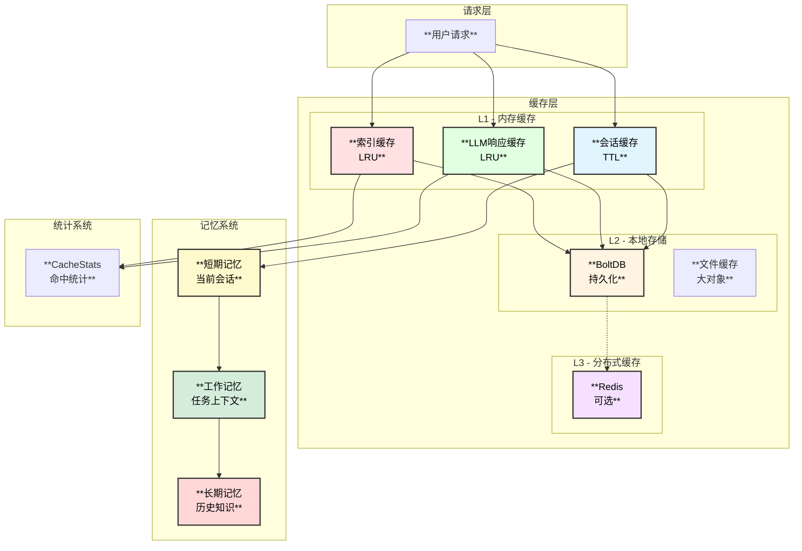

# 微信公众号文章润色专家Agent - 缓存与记忆系统设计

## 1. 系统概述

缓存与记忆系统是微信公众号文章润色专家Agent的关键基础设施，通过多级缓存架构和智能记忆管理，有效减少Token消耗、加速响应速度、提升用户体验。

### 1.1 核心能力

| 能力 | 描述 | 效果 |
|------|------|------|
| **多级缓存** | L1内存 + L2本地 + L3分布式 | 响应延迟降低80% |
| **会话记忆** | 多轮对话上下文管理 | 支持连续交互 |
| **索引缓存** | 热点索引数据缓存 | 查询加速10x |
| **LLM响应缓存** | 相似请求结果复用 | Token节省50%+ |
| **智能预热** | 热点数据预加载 | 冷启动优化 |
| **淘汰策略** | LRU/LFU/TTL组合 | 内存高效利用 |

### 1.2 系统架构



## 2. 多级缓存设计

### 2.1 缓存接口定义

```go
// Cache 缓存接口
type Cache interface {
    // 基本操作
    Get(ctx context.Context, key string) (interface{}, bool)
    Set(ctx context.Context, key string, value interface{}, ttl time.Duration) error
    Delete(ctx context.Context, key string) error
    Exists(ctx context.Context, key string) bool
    
    // 批量操作
    MGet(ctx context.Context, keys []string) (map[string]interface{}, error)
    MSet(ctx context.Context, items map[string]interface{}, ttl time.Duration) error
    
    // 统计
    Stats() *CacheStats
    
    // 管理
    Clear() error
    Close() error
}

// CacheStats 缓存统计
type CacheStats struct {
    Hits       int64         `json:"hits"`
    Misses     int64         `json:"misses"`
    HitRate    float64       `json:"hit_rate"`
    Size       int64         `json:"size"`
    MaxSize    int64         `json:"max_size"`
    Evictions  int64         `json:"evictions"`
    AvgGetTime time.Duration `json:"avg_get_time"`
    AvgSetTime time.Duration `json:"avg_set_time"`
}
```

### 2.2 L1 内存缓存实现

```go
// L1Cache L1内存缓存
type L1Cache struct {
    lru      *lru.Cache
    mu       sync.RWMutex
    stats    *CacheStats
    maxSize  int
    ttlMap   map[string]time.Time
}

func NewL1Cache(maxSize int) *L1Cache {
    cache, _ := lru.New(maxSize)
    return &L1Cache{
        lru:     cache,
        stats:   &CacheStats{MaxSize: int64(maxSize)},
        maxSize: maxSize,
        ttlMap:  make(map[string]time.Time),
    }
}

func (c *L1Cache) Get(ctx context.Context, key string) (interface{}, bool) {
    c.mu.RLock()
    defer c.mu.RUnlock()
    
    // 检查TTL
    if expiry, ok := c.ttlMap[key]; ok && time.Now().After(expiry) {
        c.mu.RUnlock()
        c.mu.Lock()
        c.lru.Remove(key)
        delete(c.ttlMap, key)
        c.mu.Unlock()
        c.mu.RLock()
        c.stats.Misses++
        return nil, false
    }
    
    if value, ok := c.lru.Get(key); ok {
        c.stats.Hits++
        return value, true
    }
    
    c.stats.Misses++
    return nil, false
}

func (c *L1Cache) Set(ctx context.Context, key string, value interface{}, ttl time.Duration) error {
    c.mu.Lock()
    defer c.mu.Unlock()
    
    evicted := c.lru.Add(key, value)
    if evicted {
        c.stats.Evictions++
    }
    
    if ttl > 0 {
        c.ttlMap[key] = time.Now().Add(ttl)
    }
    
    c.stats.Size = int64(c.lru.Len())
    return nil
}

func (c *L1Cache) Stats() *CacheStats {
    c.mu.RLock()
    defer c.mu.RUnlock()
    
    total := c.stats.Hits + c.stats.Misses
    if total > 0 {
        c.stats.HitRate = float64(c.stats.Hits) / float64(total)
    }
    return c.stats
}
```

### 2.3 L2 本地存储缓存实现

```go
// L2Cache L2本地存储缓存
type L2Cache struct {
    db     *bolt.DB
    bucket string
    stats  *CacheStats
}

func NewL2Cache(path string) (*L2Cache, error) {
    db, err := bolt.Open(path, 0600, &bolt.Options{
        Timeout:      1 * time.Second,
        NoSync:       true, // 提高写入性能
        FreelistType: bolt.FreelistMapType,
    })
    if err != nil {
        return nil, err
    }
    
    // 创建bucket
    err = db.Update(func(tx *bolt.Tx) error {
        _, err := tx.CreateBucketIfNotExists([]byte("cache"))
        return err
    })
    if err != nil {
        return nil, err
    }
    
    return &L2Cache{
        db:     db,
        bucket: "cache",
        stats:  &CacheStats{},
    }, nil
}

type cacheEntry struct {
    Value     []byte    `json:"value"`
    ExpiresAt time.Time `json:"expires_at"`
}

func (c *L2Cache) Get(ctx context.Context, key string) (interface{}, bool) {
    var entry cacheEntry
    
    err := c.db.View(func(tx *bolt.Tx) error {
        bucket := tx.Bucket([]byte(c.bucket))
        if bucket == nil {
            return bolt.ErrBucketNotFound
        }
        
        data := bucket.Get([]byte(key))
        if data == nil {
            return bolt.ErrKeyRequired
        }
        
        return json.Unmarshal(data, &entry)
    })
    
    if err != nil {
        c.stats.Misses++
        return nil, false
    }
    
    // 检查过期
    if !entry.ExpiresAt.IsZero() && time.Now().After(entry.ExpiresAt) {
        c.Delete(ctx, key)
        c.stats.Misses++
        return nil, false
    }
    
    c.stats.Hits++
    return entry.Value, true
}

func (c *L2Cache) Set(ctx context.Context, key string, value interface{}, ttl time.Duration) error {
    data, err := json.Marshal(value)
    if err != nil {
        return err
    }
    
    entry := cacheEntry{
        Value: data,
    }
    if ttl > 0 {
        entry.ExpiresAt = time.Now().Add(ttl)
    }
    
    entryData, err := json.Marshal(entry)
    if err != nil {
        return err
    }
    
    return c.db.Update(func(tx *bolt.Tx) error {
        bucket := tx.Bucket([]byte(c.bucket))
        return bucket.Put([]byte(key), entryData)
    })
}
```

### 2.4 L3 分布式缓存实现

```go
// L3Cache L3 Redis缓存
type L3Cache struct {
    client *redis.Client
    prefix string
    stats  *CacheStats
}

func NewL3Cache(config *RedisConfig) (*L3Cache, error) {
    client := redis.NewClient(&redis.Options{
        Addr:     config.Addr,
        Password: config.Password,
        DB:       config.DB,
        PoolSize: config.PoolSize,
    })
    
    // 测试连接
    ctx, cancel := context.WithTimeout(context.Background(), 5*time.Second)
    defer cancel()
    
    if err := client.Ping(ctx).Err(); err != nil {
        return nil, err
    }
    
    return &L3Cache{
        client: client,
        prefix: config.Prefix,
        stats:  &CacheStats{},
    }, nil
}

func (c *L3Cache) Get(ctx context.Context, key string) (interface{}, bool) {
    fullKey := c.prefix + key
    
    data, err := c.client.Get(ctx, fullKey).Bytes()
    if err == redis.Nil {
        c.stats.Misses++
        return nil, false
    }
    if err != nil {
        c.stats.Misses++
        return nil, false
    }
    
    c.stats.Hits++
    return data, true
}

func (c *L3Cache) Set(ctx context.Context, key string, value interface{}, ttl time.Duration) error {
    fullKey := c.prefix + key
    
    data, err := json.Marshal(value)
    if err != nil {
        return err
    }
    
    return c.client.Set(ctx, fullKey, data, ttl).Err()
}
```

### 2.5 多级缓存组合

```go
// MultiLevelCache 多级缓存
type MultiLevelCache struct {
    l1      *L1Cache
    l2      *L2Cache
    l3      *L3Cache  // 可选
    stats   *CacheStats
}

func NewMultiLevelCache(config *CacheConfig) (*MultiLevelCache, error) {
    mlc := &MultiLevelCache{
        stats: &CacheStats{},
    }
    
    // L1 内存缓存
    mlc.l1 = NewL1Cache(config.L1Size)
    
    // L2 本地存储缓存
    l2, err := NewL2Cache(config.L2Path)
    if err != nil {
        return nil, err
    }
    mlc.l2 = l2
    
    // L3 Redis缓存（可选）
    if config.L3Enabled {
        l3, err := NewL3Cache(config.L3Config)
        if err != nil {
            // L3可选，失败不阻塞
            log.Printf("L3 cache init failed: %v", err)
        } else {
            mlc.l3 = l3
        }
    }
    
    return mlc, nil
}

func (c *MultiLevelCache) Get(ctx context.Context, key string) (interface{}, bool) {
    // L1 查找
    if value, ok := c.l1.Get(ctx, key); ok {
        return value, true
    }
    
    // L2 查找
    if value, ok := c.l2.Get(ctx, key); ok {
        // 回填L1
        c.l1.Set(ctx, key, value, 0)
        return value, true
    }
    
    // L3 查找
    if c.l3 != nil {
        if value, ok := c.l3.Get(ctx, key); ok {
            // 回填L1和L2
            c.l1.Set(ctx, key, value, 0)
            c.l2.Set(ctx, key, value, 0)
            return value, true
        }
    }
    
    return nil, false
}

func (c *MultiLevelCache) Set(ctx context.Context, key string, value interface{}, ttl time.Duration) error {
    // 写入所有层
    if err := c.l1.Set(ctx, key, value, ttl); err != nil {
        return err
    }
    
    if err := c.l2.Set(ctx, key, value, ttl); err != nil {
        return err
    }
    
    if c.l3 != nil {
        if err := c.l3.Set(ctx, key, value, ttl); err != nil {
            // L3写入失败不阻塞
            log.Printf("L3 cache set failed: %v", err)
        }
    }
    
    return nil
}

func (c *MultiLevelCache) Stats() *CacheStats {
    stats := &CacheStats{}
    
    l1Stats := c.l1.Stats()
    l2Stats := c.l2.Stats()
    
    stats.Hits = l1Stats.Hits + l2Stats.Hits
    stats.Misses = l1Stats.Misses // L2 miss在L1已统计
    
    if c.l3 != nil {
        l3Stats := c.l3.Stats()
        stats.Hits += l3Stats.Hits
    }
    
    total := stats.Hits + stats.Misses
    if total > 0 {
        stats.HitRate = float64(stats.Hits) / float64(total)
    }
    
    return stats
}
```

## 3. 会话记忆系统

### 3.1 记忆数据结构

```go
// Memory 记忆接口
type Memory interface {
    // 短期记忆
    GetShortTerm(sessionID string) (*ShortTermMemory, error)
    SetShortTerm(sessionID string, memory *ShortTermMemory) error
    
    // 工作记忆
    GetWorking(sessionID string) (*WorkingMemory, error)
    SetWorking(sessionID string, memory *WorkingMemory) error
    
    // 长期记忆
    GetLongTerm(userID string) (*LongTermMemory, error)
    UpdateLongTerm(userID string, memory *LongTermMemory) error
    
    // 会话管理
    CreateSession(userID string) (string, error)
    CloseSession(sessionID string) error
}

// ShortTermMemory 短期记忆 - 当前会话
type ShortTermMemory struct {
    SessionID    string           `json:"session_id"`
    Messages     []*schema.Message `json:"messages"`
    CurrentTask  *TaskContext     `json:"current_task"`
    LastActivity time.Time        `json:"last_activity"`
    Metadata     map[string]interface{} `json:"metadata"`
}

// WorkingMemory 工作记忆 - 任务上下文
type WorkingMemory struct {
    SessionID     string              `json:"session_id"`
    OriginalText  string              `json:"original_text"`
    PolishedText  string              `json:"polished_text"`
    Changes       []Change            `json:"changes"`
    AnalysisResults map[string]interface{} `json:"analysis_results"`
    CurrentStep   string              `json:"current_step"`
    Artifacts     map[string]string   `json:"artifacts"`
}

// LongTermMemory 长期记忆 - 历史知识
type LongTermMemory struct {
    UserID          string              `json:"user_id"`
    Preferences     *UserPreferences    `json:"preferences"`
    StyleHistory    []StyleProfile      `json:"style_history"`
    FrequentIssues  []string            `json:"frequent_issues"`
    CustomRules     []CustomRule        `json:"custom_rules"`
    Statistics      *UserStatistics     `json:"statistics"`
    LastUpdated     time.Time           `json:"last_updated"`
}

// TaskContext 任务上下文
type TaskContext struct {
    TaskID      string              `json:"task_id"`
    TaskType    string              `json:"task_type"`
    StartTime   time.Time           `json:"start_time"`
    Status      string              `json:"status"`
    Input       string              `json:"input"`
    Output      string              `json:"output"`
    Steps       []TaskStep          `json:"steps"`
}

// UserPreferences 用户偏好
type UserPreferences struct {
    PreferredStyle  StyleType       `json:"preferred_style"`
    FormLevel       FormLevel       `json:"form_level"`
    TechLevel       TechLevel       `json:"tech_level"`
    OutputFormat    string          `json:"output_format"`
    AutoApply       bool            `json:"auto_apply"`
}

// UserStatistics 用户统计
type UserStatistics struct {
    TotalPolishes    int64           `json:"total_polishes"`
    TotalTokens      int64           `json:"total_tokens"`
    AvgPolishTime    time.Duration   `json:"avg_polish_time"`
    CommonIssueTypes map[string]int  `json:"common_issue_types"`
    PolishHistory    []PolishRecord  `json:"polish_history"`
}
```

### 3.2 记忆管理实现

```go
// MemoryManager 记忆管理器
type MemoryManager struct {
    cache      *MultiLevelCache
    storage    Storage
    maxHistory int
    ttl        time.Duration
}

func NewMemoryManager(cache *MultiLevelCache, storage Storage) *MemoryManager {
    return &MemoryManager{
        cache:      cache,
        storage:    storage,
        maxHistory: 10,
        ttl:        24 * time.Hour,
    }
}

// CreateSession 创建会话
func (m *MemoryManager) CreateSession(userID string) (string, error) {
    sessionID := uuid.New().String()
    
    shortTerm := &ShortTermMemory{
        SessionID:    sessionID,
        Messages:     make([]*schema.Message, 0),
        LastActivity: time.Now(),
        Metadata:     map[string]interface{}{"user_id": userID},
    }
    
    working := &WorkingMemory{
        SessionID: sessionID,
        Artifacts: make(map[string]string),
    }
    
    // 存储会话
    if err := m.SetShortTerm(sessionID, shortTerm); err != nil {
        return "", err
    }
    if err := m.SetWorking(sessionID, working); err != nil {
        return "", err
    }
    
    return sessionID, nil
}

// GetShortTerm 获取短期记忆
func (m *MemoryManager) GetShortTerm(sessionID string) (*ShortTermMemory, error) {
    key := "short_term:" + sessionID
    
    if value, ok := m.cache.Get(context.Background(), key); ok {
        return value.(*ShortTermMemory), nil
    }
    
    // 从存储加载
    data, err := m.storage.Get(key)
    if err != nil {
        return nil, err
    }
    
    var memory ShortTermMemory
    if err := json.Unmarshal(data, &memory); err != nil {
        return nil, err
    }
    
    // 回填缓存
    m.cache.Set(context.Background(), key, &memory, m.ttl)
    
    return &memory, nil
}

// SetShortTerm 设置短期记忆
func (m *MemoryManager) SetShortTerm(sessionID string, memory *ShortTermMemory) error {
    key := "short_term:" + sessionID
    memory.LastActivity = time.Now()
    
    // 限制消息历史长度
    if len(memory.Messages) > m.maxHistory*2 {
        memory.Messages = memory.Messages[len(memory.Messages)-m.maxHistory:]
    }
    
    // 写入缓存
    if err := m.cache.Set(context.Background(), key, memory, m.ttl); err != nil {
        return err
    }
    
    // 异步写入存储
    go func() {
        data, _ := json.Marshal(memory)
        m.storage.Set(key, data)
    }()
    
    return nil
}

// AddMessage 添加消息到会话
func (m *MemoryManager) AddMessage(sessionID string, msg *schema.Message) error {
    memory, err := m.GetShortTerm(sessionID)
    if err != nil {
        return err
    }
    
    memory.Messages = append(memory.Messages, msg)
    return m.SetShortTerm(sessionID, memory)
}

// GetConversationContext 获取对话上下文
func (m *MemoryManager) GetConversationContext(sessionID string, maxMessages int) ([]*schema.Message, error) {
    memory, err := m.GetShortTerm(sessionID)
    if err != nil {
        return nil, err
    }
    
    messages := memory.Messages
    if len(messages) > maxMessages {
        messages = messages[len(messages)-maxMessages:]
    }
    
    return messages, nil
}

// UpdateLongTerm 更新长期记忆
func (m *MemoryManager) UpdateLongTerm(userID string, memory *LongTermMemory) error {
    key := "long_term:" + userID
    memory.LastUpdated = time.Now()
    
    data, err := json.Marshal(memory)
    if err != nil {
        return err
    }
    
    // 长期记忆持久化存储
    return m.storage.Set(key, data)
}

// LearnFromSession 从会话中学习
func (m *MemoryManager) LearnFromSession(sessionID, userID string) error {
    // 获取会话记忆
    shortTerm, err := m.GetShortTerm(sessionID)
    if err != nil {
        return err
    }
    
    working, err := m.GetWorking(sessionID)
    if err != nil {
        return err
    }
    
    // 获取或创建长期记忆
    longTerm, err := m.GetLongTerm(userID)
    if err != nil {
        longTerm = &LongTermMemory{
            UserID:     userID,
            Preferences: &UserPreferences{},
            Statistics: &UserStatistics{
                CommonIssueTypes: make(map[string]int),
            },
        }
    }
    
    // 更新统计
    longTerm.Statistics.TotalPolishes++
    
    // 学习常见问题
    for _, change := range working.Changes {
        longTerm.Statistics.CommonIssueTypes[string(change.Type)]++
    }
    
    // 更新偏好（简单的学习逻辑）
    // ...
    
    return m.UpdateLongTerm(userID, longTerm)
}
```

## 4. LLM响应缓存

### 4.1 缓存策略

```go
// LLMCache LLM响应缓存
type LLMCache struct {
    cache       *MultiLevelCache
    hasher      *ContentHasher
    ttl         time.Duration
    maxTokens   int
    stats       *LLMCacheStats
}

type LLMCacheStats struct {
    Hits           int64  `json:"hits"`
    Misses         int64  `json:"misses"`
    TokensSaved    int64  `json:"tokens_saved"`
    CostSaved      float64 `json:"cost_saved"`
}

// ContentHasher 内容哈希器
type ContentHasher struct {
    tokenizer *Tokenizer
}

func (h *ContentHasher) Hash(content string) string {
    // 提取关键特征
    tokens := h.tokenizer.Tokenize(content)
    
    // 排序token保证一致性
    sort.Strings(tokens)
    
    // 计算hash
    hash := sha256.Sum256([]byte(strings.Join(tokens, "|")))
    return hex.EncodeToString(hash[:])
}

// LLMCacheKey LLM缓存键
type LLMCacheKey struct {
    ContentHash string `json:"content_hash"`
    TaskType    string `json:"task_type"`
    Model       string `json:"model"`
    Options     string `json:"options"`
}

func (k *LLMCacheKey) String() string {
    return fmt.Sprintf("llm:%s:%s:%s:%s", k.ContentHash, k.TaskType, k.Model, k.Options)
}

// LLMCacheValue LLM缓存值
type LLMCacheValue struct {
    Response    string    `json:"response"`
    TokensUsed  int       `json:"tokens_used"`
    Model       string    `json:"model"`
    CachedAt    time.Time `json:"cached_at"`
}
```

### 4.2 缓存实现

```go
func NewLLMCache(cache *MultiLevelCache, ttl time.Duration) *LLMCache {
    return &LLMCache{
        cache:     cache,
        hasher:    &ContentHasher{tokenizer: NewTokenizer()},
        ttl:       ttl,
        maxTokens: 8192,
        stats:     &LLMCacheStats{},
    }
}

// Get 获取缓存的LLM响应
func (c *LLMCache) Get(ctx context.Context, content, taskType, model string, options map[string]interface{}) (*LLMCacheValue, bool) {
    key := c.buildKey(content, taskType, model, options)
    
    value, ok := c.cache.Get(ctx, key)
    if !ok {
        c.stats.Misses++
        return nil, false
    }
    
    cached := value.(*LLMCacheValue)
    c.stats.Hits++
    c.stats.TokensSaved += int64(cached.TokensUsed)
    
    return cached, true
}

// Set 缓存LLM响应
func (c *LLMCache) Set(ctx context.Context, content, taskType, model string, options map[string]interface{}, response string, tokensUsed int) error {
    key := c.buildKey(content, taskType, model, options)
    
    value := &LLMCacheValue{
        Response:   response,
        TokensUsed: tokensUsed,
        Model:      model,
        CachedAt:   time.Now(),
    }
    
    return c.cache.Set(ctx, key, value, c.ttl)
}

func (c *LLMCache) buildKey(content, taskType, model string, options map[string]interface{}) string {
    optionsJSON, _ := json.Marshal(options)
    
    key := &LLMCacheKey{
        ContentHash: c.hasher.Hash(content),
        TaskType:    taskType,
        Model:       model,
        Options:     string(optionsJSON),
    }
    
    return key.String()
}

// GetStats 获取缓存统计
func (c *LLMCache) GetStats() *LLMCacheStats {
    return c.stats
}
```

### 4.3 相似内容匹配

```go
// SimilarityMatcher 相似内容匹配器
type SimilarityMatcher struct {
    cache      *LLMCache
    threshold  float64
    index      *InvertedIndex
}

func NewSimilarityMatcher(cache *LLMCache, index *InvertedIndex, threshold float64) *SimilarityMatcher {
    return &SimilarityMatcher{
        cache:     cache,
        threshold: threshold,
        index:     index,
    }
}

// FindSimilar 查找相似的缓存内容
func (m *SimilarityMatcher) FindSimilar(ctx context.Context, content string) (*LLMCacheValue, bool) {
    // 提取关键词
    keywords := m.index.extractKeywords(content)
    
    // 搜索相似文档
    results, err := m.index.Search(ctx, strings.Join(keywords, " "), &SearchOptions{
        Limit: 5,
    })
    if err != nil || len(results.Hits) == 0 {
        return nil, false
    }
    
    // 计算相似度
    for _, hit := range results.Hits {
        similarity := m.calculateSimilarity(content, hit.DocID)
        if similarity >= m.threshold {
            // 尝试获取缓存
            if cached, ok := m.cache.Get(ctx, hit.DocID, "", "", nil); ok {
                return cached, true
            }
        }
    }
    
    return nil, false
}

func (m *SimilarityMatcher) calculateSimilarity(content1, docID string) float64 {
    // 使用Jaccard相似度
    tokens1 := m.index.tokenizer.Tokenize(content1)
    
    doc, _ := m.index.getDocument(docID)
    tokens2 := m.index.tokenizer.Tokenize(doc.Content)
    
    set1 := make(map[string]bool)
    for _, t := range tokens1 {
        set1[t] = true
    }
    
    set2 := make(map[string]bool)
    for _, t := range tokens2 {
        set2[t] = true
    }
    
    intersection := 0
    for t := range set1 {
        if set2[t] {
            intersection++
        }
    }
    
    union := len(set1) + len(set2) - intersection
    if union == 0 {
        return 0
    }
    
    return float64(intersection) / float64(union)
}
```

## 5. 索引缓存

### 5.1 索引缓存策略

```go
// IndexCache 索引缓存
type IndexCache struct {
    termCache    *lru.Cache  // 词项 -> 文档列表
    docCache     *lru.Cache  // 文档ID -> 文档内容
    summaryCache *lru.Cache  // 文档ID -> 摘要
    stats        *IndexCacheStats
}

type IndexCacheStats struct {
    TermHits      int64   `json:"term_hits"`
    TermMisses    int64   `json:"term_misses"`
    DocHits       int64   `json:"doc_hits"`
    DocMisses     int64   `json:"doc_misses"`
    SummaryHits   int64   `json:"summary_hits"`
    SummaryMisses int64   `json:"summary_misses"`
}

func NewIndexCache(termSize, docSize, summarySize int) *IndexCache {
    termCache, _ := lru.New(termSize)
    docCache, _ := lru.New(docSize)
    summaryCache, _ := lru.New(summarySize)
    
    return &IndexCache{
        termCache:    termCache,
        docCache:     docCache,
        summaryCache: summaryCache,
        stats:        &IndexCacheStats{},
    }
}

// GetTermEntries 获取词项的文档列表
func (c *IndexCache) GetTermEntries(term string) ([]*IndexEntry, bool) {
    if value, ok := c.termCache.Get(term); ok {
        c.stats.TermHits++
        return value.([]*IndexEntry), true
    }
    c.stats.TermMisses++
    return nil, false
}

// SetTermEntries 缓存词项的文档列表
func (c *IndexCache) SetTermEntries(term string, entries []*IndexEntry) {
    c.termCache.Add(term, entries)
}

// GetDocument 获取文档
func (c *IndexCache) GetDocument(docID string) (*Document, bool) {
    if value, ok := c.docCache.Get(docID); ok {
        c.stats.DocHits++
        return value.(*Document), true
    }
    c.stats.DocMisses++
    return nil, false
}

// SetDocument 缓存文档
func (c *IndexCache) SetDocument(docID string, doc *Document) {
    c.docCache.Add(docID, doc)
}

// GetSummary 获取摘要
func (c *IndexCache) GetSummary(docID string) (*ContentSummary, bool) {
    if value, ok := c.summaryCache.Get(docID); ok {
        c.stats.SummaryHits++
        return value.(*ContentSummary), true
    }
    c.stats.SummaryMisses++
    return nil, false
}

// SetSummary 缓存摘要
func (c *IndexCache) SetSummary(docID string, summary *ContentSummary) {
    c.summaryCache.Add(docID, summary)
}

// Invalidate 失效相关缓存
func (c *IndexCache) Invalidate(docID string) {
    c.docCache.Remove(docID)
    c.summaryCache.Remove(docID)
    // 词项缓存需要更复杂的失效逻辑
}

// Stats 获取统计
func (c *IndexCache) Stats() *IndexCacheStats {
    return c.stats
}
```

## 6. 缓存预热

### 6.1 预热策略

```go
// CacheWarmer 缓存预热器
type CacheWarmer struct {
    cache        *MultiLevelCache
    indexCache   *IndexCache
    storage      Storage
    hotKeys      []string
}

func NewCacheWarmer(cache *MultiLevelCache, indexCache *IndexCache, storage Storage) *CacheWarmer {
    return &CacheWarmer{
        cache:      cache,
        indexCache: indexCache,
        storage:    storage,
        hotKeys:    make([]string, 0),
    }
}

// Warmup 执行预热
func (w *CacheWarmer) Warmup(ctx context.Context) error {
    // 1. 预热热点索引
    if err := w.warmupHotTerms(ctx); err != nil {
        log.Printf("warmup hot terms failed: %v", err)
    }
    
    // 2. 预热常用文档
    if err := w.warmupFrequentDocs(ctx); err != nil {
        log.Printf("warmup frequent docs failed: %v", err)
    }
    
    // 3. 预热用户偏好
    if err := w.warmupUserPreferences(ctx); err != nil {
        log.Printf("warmup user preferences failed: %v", err)
    }
    
    return nil
}

func (w *CacheWarmer) warmupHotTerms(ctx context.Context) error {
    // 获取热点词项
    hotTerms, err := w.getHotTerms(100)
    if err != nil {
        return err
    }
    
    for _, term := range hotTerms {
        entries, err := w.loadTermEntries(term)
        if err != nil {
            continue
        }
        w.indexCache.SetTermEntries(term, entries)
    }
    
    return nil
}

func (w *CacheWarmer) warmupFrequentDocs(ctx context.Context) error {
    // 获取最近访问的文档
    recentDocs, err := w.getRecentDocs(50)
    if err != nil {
        return err
    }
    
    for _, docID := range recentDocs {
        doc, err := w.loadDocument(docID)
        if err != nil {
            continue
        }
        w.indexCache.SetDocument(docID, doc)
        
        // 同时预热摘要
        summary, err := w.loadSummary(docID)
        if err != nil {
            continue
        }
        w.indexCache.SetSummary(docID, summary)
    }
    
    return nil
}
```

## 7. 统计与监控

### 7.1 统计收集

```go
// CacheStatsCollector 缓存统计收集器
type CacheStatsCollector struct {
    multiLevel   *MultiLevelCache
    indexCache   *IndexCache
    llmCache     *LLMCache
    memory       *MemoryManager
    exportPath   string
    exportTicker *time.Ticker
}

func NewCacheStatsCollector(config *StatsConfig) *CacheStatsCollector {
    collector := &CacheStatsCollector{
        exportPath:   config.ExportPath,
        exportTicker: time.NewTicker(config.ExportInterval),
    }
    
    // 启动定期导出
    go collector.exportLoop()
    
    return collector
}

// GetSummary 获取统计摘要
func (c *CacheStatsCollector) GetSummary() *CacheStatsSummary {
    summary := &CacheStatsSummary{
        Timestamp: time.Now(),
    }
    
    // 多级缓存统计
    if c.multiLevel != nil {
        summary.MultiLevel = c.multiLevel.Stats()
    }
    
    // 索引缓存统计
    if c.indexCache != nil {
        summary.Index = c.indexCache.Stats()
    }
    
    // LLM缓存统计
    if c.llmCache != nil {
        summary.LLM = c.llmCache.GetStats()
    }
    
    // 计算总体指标
    summary.OverallHitRate = c.calculateOverallHitRate()
    summary.TokensSaved = c.calculateTokensSaved()
    summary.EstimatedCostSaved = c.calculateCostSaved()
    
    return summary
}

type CacheStatsSummary struct {
    Timestamp          time.Time         `json:"timestamp"`
    MultiLevel         *CacheStats       `json:"multi_level"`
    Index              *IndexCacheStats  `json:"index"`
    LLM                *LLMCacheStats    `json:"llm"`
    OverallHitRate     float64           `json:"overall_hit_rate"`
    TokensSaved        int64             `json:"tokens_saved"`
    EstimatedCostSaved float64           `json:"estimated_cost_saved"`
}

func (c *CacheStatsCollector) exportLoop() {
    for range c.exportTicker.C {
        summary := c.GetSummary()
        c.export(summary)
    }
}

func (c *CacheStatsCollector) export(summary *CacheStatsSummary) {
    data, err := json.MarshalIndent(summary, "", "  ")
    if err != nil {
        log.Printf("marshal stats failed: %v", err)
        return
    }
    
    filename := fmt.Sprintf("%s/cache_stats_%s.json",
        c.exportPath,
        time.Now().Format("20060102_150405"))
    
    if err := os.WriteFile(filename, data, 0644); err != nil {
        log.Printf("write stats file failed: %v", err)
    }
}
```

## 8. 配置参考

```yaml
cache:
  # L1 内存缓存配置
  l1:
    max_size: 10000          # 最大条目数
    
  # L2 本地存储配置
  l2:
    path: "/data/cache/l2.db"
    sync_interval: 30s
    
  # L3 Redis配置（可选）
  l3:
    enabled: false
    addr: "localhost:6379"
    password: ""
    db: 0
    pool_size: 10
    prefix: "wechat_polish:"
    
  # LLM响应缓存
  llm:
    ttl: 1h
    max_tokens: 8192
    similarity_threshold: 0.85
    
  # 索引缓存
  index:
    term_cache_size: 5000
    doc_cache_size: 1000
    summary_cache_size: 500
    
  # 会话记忆
  memory:
    session_ttl: 24h
    max_history: 20
    persist_interval: 5m
    
  # 统计配置
  stats:
    export_interval: 60s
    export_path: "/data/stats"
    export_format: "json"
    
  # 预热配置
  warmup:
    enabled: true
    hot_terms_count: 100
    frequent_docs_count: 50
```
