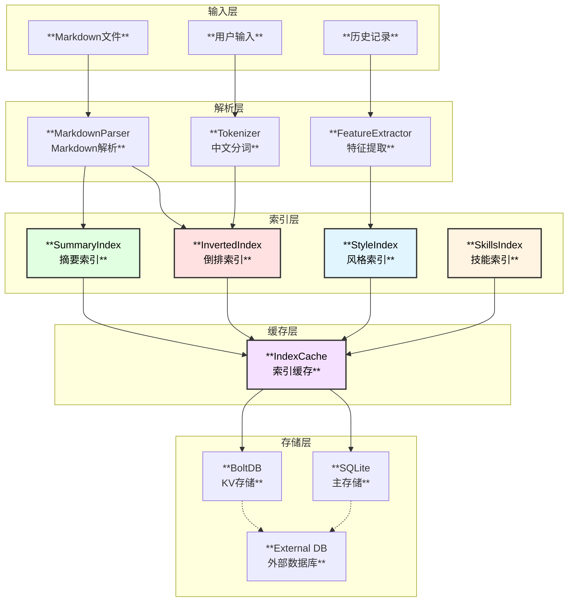
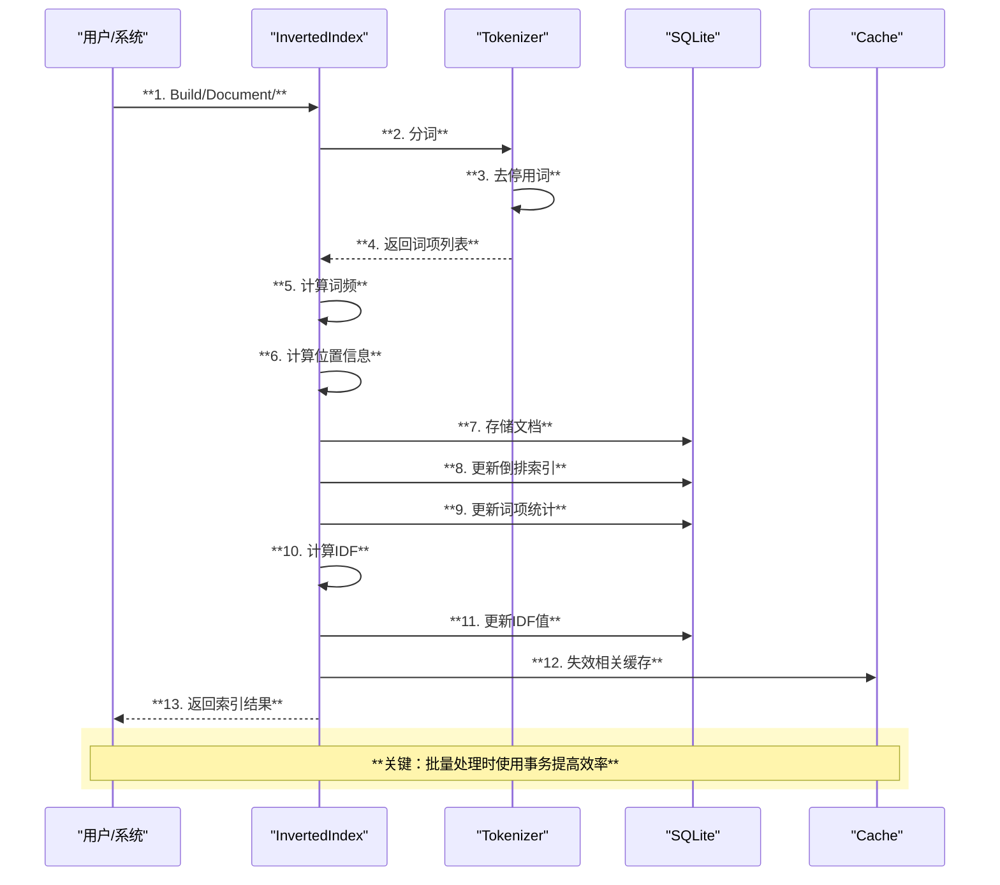
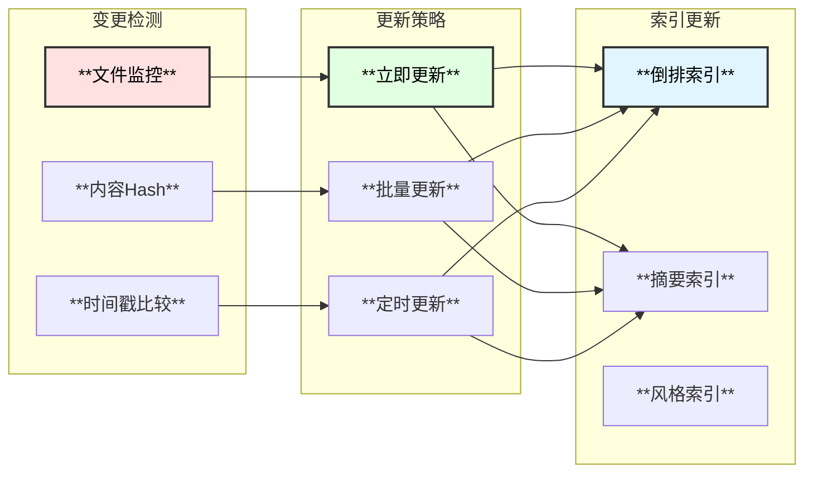

# 微信公众号文章润色专家Agent - 索引系统设计

## 1. 索引系统概述

索引系统是微信公众号文章润色专家Agent的核心组件之一，通过构建多维度索引，实现内容的快速检索和语义理解，有效减少Token消耗，加速问题处理。

### 1.1 核心能力

| 能力 | 描述 | 应用场景 |
|------|------|----------|
| **倒排索引** | 基于分词的快速文本检索 | 关键词搜索、相似内容查找 |
| **内容摘要索引** | 文章结构和摘要的快速获取 | 上下文理解、结构分析 |
| **风格索引** | 写作风格特征的快速匹配 | 风格分析、风格统一 |
| **技能索引** | 润色技能的快速检索 | 技能推荐、知识增强 |

### 1.2 系统架构



## 2. 倒排索引设计

### 2.1 数据结构

```go
// InvertedIndex 倒排索引
type InvertedIndex struct {
    db        *sql.DB           // SQLite连接
    tokenizer *Tokenizer        // 分词器
    cache     *lru.Cache        // LRU缓存
    stats     *IndexStats       // 统计信息
    mu        sync.RWMutex
}

// IndexEntry 索引条目
type IndexEntry struct {
    Term      string          `json:"term"`       // 词项
    DocID     string          `json:"doc_id"`     // 文档ID
    Frequency int             `json:"frequency"`  // 词频
    Positions []TermPosition  `json:"positions"`  // 位置列表
    TF        float64         `json:"tf"`         // 词频-逆文档频率
    IDF       float64         `json:"idf"`        // 逆文档频率
}

// TermPosition 词项位置
type TermPosition struct {
    Paragraph int `json:"paragraph"` // 段落号
    Sentence  int `json:"sentence"`  // 句子号
    Offset    int `json:"offset"`    // 字符偏移
    Length    int `json:"length"`    // 词项长度
}

// Document 文档信息
type Document struct {
    ID          string            `json:"id"`
    Path        string            `json:"path"`
    Title       string            `json:"title"`
    Content     string            `json:"content"`
    WordCount   int               `json:"word_count"`
    TermCount   int               `json:"term_count"`
    CreateTime  time.Time         `json:"create_time"`
    UpdateTime  time.Time         `json:"update_time"`
    Metadata    map[string]string `json:"metadata"`
}

// IndexStats 索引统计
type IndexStats struct {
    TotalDocs   int64     `json:"total_docs"`
    TotalTerms  int64     `json:"total_terms"`
    AvgDocLen   float64   `json:"avg_doc_len"`
    LastUpdate  time.Time `json:"last_update"`
    CacheHits   int64     `json:"cache_hits"`
    CacheMisses int64     `json:"cache_misses"`
}
```

### 2.2 SQLite表结构

```sql
-- 文档表
CREATE TABLE IF NOT EXISTS documents (
    id TEXT PRIMARY KEY,
    path TEXT NOT NULL UNIQUE,
    title TEXT,
    content TEXT,
    word_count INTEGER,
    term_count INTEGER,
    metadata TEXT,  -- JSON
    created_at TIMESTAMP DEFAULT CURRENT_TIMESTAMP,
    updated_at TIMESTAMP DEFAULT CURRENT_TIMESTAMP
);

CREATE INDEX idx_doc_path ON documents(path);
CREATE INDEX idx_doc_title ON documents(title);

-- 倒排索引表
CREATE TABLE IF NOT EXISTS inverted_index (
    term TEXT NOT NULL,
    doc_id TEXT NOT NULL,
    frequency INTEGER,
    positions TEXT,  -- JSON array
    tf REAL,
    idf REAL,
    PRIMARY KEY (term, doc_id),
    FOREIGN KEY (doc_id) REFERENCES documents(id) ON DELETE CASCADE
);

CREATE INDEX idx_term ON inverted_index(term);
CREATE INDEX idx_term_idf ON inverted_index(term, idf DESC);

-- 词项统计表
CREATE TABLE IF NOT EXISTS term_stats (
    term TEXT PRIMARY KEY,
    doc_freq INTEGER,      -- 包含该词的文档数
    total_freq INTEGER,    -- 总出现次数
    idf REAL,
    updated_at TIMESTAMP DEFAULT CURRENT_TIMESTAMP
);

-- 全文搜索虚拟表
CREATE VIRTUAL TABLE IF NOT EXISTS document_fts USING fts5(
    title, content,
    content='documents',
    content_rowid='rowid'
);

-- 触发器：同步FTS索引
CREATE TRIGGER IF NOT EXISTS docs_ai AFTER INSERT ON documents BEGIN
    INSERT INTO document_fts(rowid, title, content) 
    VALUES (new.rowid, new.title, new.content);
END;

CREATE TRIGGER IF NOT EXISTS docs_ad AFTER DELETE ON documents BEGIN
    INSERT INTO document_fts(document_fts, rowid, title, content) 
    VALUES('delete', old.rowid, old.title, old.content);
END;

CREATE TRIGGER IF NOT EXISTS docs_au AFTER UPDATE ON documents BEGIN
    INSERT INTO document_fts(document_fts, rowid, title, content) 
    VALUES('delete', old.rowid, old.title, old.content);
    INSERT INTO document_fts(rowid, title, content) 
    VALUES (new.rowid, new.title, new.content);
END;
```

### 2.3 核心接口

```go
// InvertedIndexer 倒排索引接口
type InvertedIndexer interface {
    // 索引管理
    Build(ctx context.Context, doc *Document) error
    BuildBatch(ctx context.Context, docs []*Document) error
    Delete(ctx context.Context, docID string) error
    Rebuild(ctx context.Context) error
    
    // 搜索接口
    Search(ctx context.Context, query string, opts *SearchOptions) (*SearchResult, error)
    SearchWithRank(ctx context.Context, query string, opts *SearchOptions) (*RankedResult, error)
    
    // 统计接口
    GetStats() *IndexStats
    GetTermStats(term string) (*TermStats, error)
}

// SearchOptions 搜索选项
type SearchOptions struct {
    Limit       int               // 返回数量限制
    Offset      int               // 偏移量
    Highlight   bool              // 是否高亮
    ContextLen  int               // 上下文长度
    Filters     map[string]string // 过滤条件
    SortBy      string            // 排序字段
    SortOrder   string            // 排序方向
}

// SearchResult 搜索结果
type SearchResult struct {
    Total    int             `json:"total"`
    Hits     []SearchHit     `json:"hits"`
    Duration time.Duration   `json:"duration"`
    FromCache bool           `json:"from_cache"`
}

type SearchHit struct {
    DocID      string   `json:"doc_id"`
    Path       string   `json:"path"`
    Title      string   `json:"title"`
    Score      float64  `json:"score"`
    Highlights []string `json:"highlights"`
    Positions  []TermPosition `json:"positions"`
}
```

### 2.4 索引构建流程



### 2.5 搜索算法

```go
// BM25 相关性评分
func (idx *InvertedIndex) calculateBM25(term string, docID string, docLen int) float64 {
    k1 := 1.2
    b := 0.75
    
    // 获取词项信息
    entry, err := idx.getEntry(term, docID)
    if err != nil {
        return 0
    }
    
    // 获取IDF
    idf := idx.getIDF(term)
    
    // 计算BM25
    avgDocLen := idx.stats.AvgDocLen
    tf := float64(entry.Frequency)
    
    score := idf * (tf * (k1 + 1)) / (tf + k1*(1-b+b*(float64(docLen)/avgDocLen)))
    return score
}

// Search 搜索实现
func (idx *InvertedIndex) Search(ctx context.Context, query string, opts *SearchOptions) (*SearchResult, error) {
    start := time.Now()
    
    // 检查缓存
    cacheKey := idx.buildCacheKey(query, opts)
    if cached, ok := idx.cache.Get(cacheKey); ok {
        idx.stats.CacheHits++
        result := cached.(*SearchResult)
        result.FromCache = true
        return result, nil
    }
    idx.stats.CacheMisses++
    
    // 分词
    terms := idx.tokenizer.Tokenize(query)
    
    // 查找包含所有词项的文档
    docScores := make(map[string]float64)
    
    for _, term := range terms {
        entries, err := idx.getEntriesForTerm(ctx, term)
        if err != nil {
            continue
        }
        
        for _, entry := range entries {
            doc, _ := idx.getDocument(entry.DocID)
            score := idx.calculateBM25(term, entry.DocID, doc.WordCount)
            docScores[entry.DocID] += score
        }
    }
    
    // 排序
    hits := idx.rankResults(docScores, opts)
    
    // 构建结果
    result := &SearchResult{
        Total:     len(hits),
        Hits:      hits[:min(opts.Limit, len(hits))],
        Duration:  time.Since(start),
        FromCache: false,
    }
    
    // 存入缓存
    idx.cache.Add(cacheKey, result)
    
    return result, nil
}
```

## 3. 内容摘要索引设计

### 3.1 数据结构

```go
// SummaryIndex 摘要索引
type SummaryIndex struct {
    db    *sql.DB
    cache *lru.Cache
}

// ContentSummary 内容摘要
type ContentSummary struct {
    ID           string           `json:"id"`
    DocID        string           `json:"doc_id"`
    Title        string           `json:"title"`
    Abstract     string           `json:"abstract"`      // 文章摘要
    Keywords     []string         `json:"keywords"`      // 关键词
    ArticleType  ArticleType      `json:"article_type"`  // 文章类型
    Structure    *StructureSummary `json:"structure"`    // 结构摘要
    StyleProfile *StyleProfile    `json:"style_profile"` // 风格概要
    Quality      *QualityMetrics  `json:"quality"`       // 质量指标
    CreateTime   time.Time        `json:"create_time"`
    UpdateTime   time.Time        `json:"update_time"`
}

// StructureSummary 结构摘要
type StructureSummary struct {
    TotalSections  int             `json:"total_sections"`
    MaxDepth       int             `json:"max_depth"`
    Sections       []SectionInfo   `json:"sections"`
    HasCode        bool            `json:"has_code"`
    HasImage       bool            `json:"has_image"`
    HasTable       bool            `json:"has_table"`
    CodeBlockCount int             `json:"code_block_count"`
    ImageCount     int             `json:"image_count"`
    TableCount     int             `json:"table_count"`
}

type SectionInfo struct {
    Level     int    `json:"level"`
    Title     string `json:"title"`
    WordCount int    `json:"word_count"`
    Position  int    `json:"position"`
}

// StyleProfile 风格概要
type StyleProfile struct {
    StyleType       StyleType          `json:"style_type"`
    FormLevel       FormLevel          `json:"form_level"`       // 正式程度
    TechLevel       TechLevel          `json:"tech_level"`       // 技术性程度
    AvgSentenceLen  float64            `json:"avg_sentence_len"` // 平均句长
    VocabDiversity  float64            `json:"vocab_diversity"`  // 词汇多样性
    TopWords        []WordFreq         `json:"top_words"`        // 高频词
    StyleFeatures   map[string]float64 `json:"style_features"`   // 风格特征
}

// QualityMetrics 质量指标
type QualityMetrics struct {
    ReadabilityScore float64 `json:"readability_score"` // 可读性评分
    GrammarScore     float64 `json:"grammar_score"`     // 语法评分
    LogicScore       float64 `json:"logic_score"`       // 逻辑评分
    StructureScore   float64 `json:"structure_score"`   // 结构评分
    OverallScore     float64 `json:"overall_score"`     // 综合评分
}
```

### 3.2 SQLite表结构

```sql
-- 内容摘要表
CREATE TABLE IF NOT EXISTS content_summaries (
    id TEXT PRIMARY KEY,
    doc_id TEXT NOT NULL UNIQUE,
    title TEXT,
    abstract TEXT,
    keywords TEXT,           -- JSON array
    article_type INTEGER,
    structure TEXT,          -- JSON object
    style_profile TEXT,      -- JSON object
    quality TEXT,            -- JSON object
    created_at TIMESTAMP DEFAULT CURRENT_TIMESTAMP,
    updated_at TIMESTAMP DEFAULT CURRENT_TIMESTAMP,
    FOREIGN KEY (doc_id) REFERENCES documents(id) ON DELETE CASCADE
);

CREATE INDEX idx_summary_type ON content_summaries(article_type);
CREATE INDEX idx_summary_doc ON content_summaries(doc_id);

-- 关键词索引表
CREATE TABLE IF NOT EXISTS keyword_index (
    keyword TEXT NOT NULL,
    summary_id TEXT NOT NULL,
    weight REAL,
    PRIMARY KEY (keyword, summary_id),
    FOREIGN KEY (summary_id) REFERENCES content_summaries(id) ON DELETE CASCADE
);

CREATE INDEX idx_keyword ON keyword_index(keyword);
```

### 3.3 摘要生成流程

```go
// SummaryGenerator 摘要生成器
type SummaryGenerator struct {
    tokenizer    *Tokenizer
    llm          model.ChatModel
    maxAbstract  int
    maxKeywords  int
}

func (g *SummaryGenerator) Generate(ctx context.Context, doc *Document) (*ContentSummary, error) {
    summary := &ContentSummary{
        ID:         uuid.New().String(),
        DocID:      doc.ID,
        Title:      doc.Title,
        CreateTime: time.Now(),
        UpdateTime: time.Now(),
    }
    
    // 1. 生成摘要
    abstract, err := g.generateAbstract(ctx, doc.Content)
    if err != nil {
        return nil, err
    }
    summary.Abstract = abstract
    
    // 2. 提取关键词
    keywords := g.extractKeywords(doc.Content)
    summary.Keywords = keywords
    
    // 3. 检测文章类型
    summary.ArticleType = g.detectArticleType(doc.Content)
    
    // 4. 分析结构
    summary.Structure = g.analyzeStructure(doc.Content)
    
    // 5. 分析风格
    summary.StyleProfile = g.analyzeStyle(doc.Content)
    
    // 6. 计算质量指标
    summary.Quality = g.calculateQuality(doc.Content)
    
    return summary, nil
}

func (g *SummaryGenerator) generateAbstract(ctx context.Context, content string) (string, error) {
    // 如果内容较短，直接截取
    if len(content) < g.maxAbstract*2 {
        return content[:min(g.maxAbstract, len(content))], nil
    }
    
    // 使用LLM生成摘要
    prompt := fmt.Sprintf(`请为以下文章生成一个简短的摘要（不超过%d字）：

%s

摘要：`, g.maxAbstract, content)
    
    response, err := g.llm.Generate(ctx, []*schema.Message{
        schema.UserMessage(prompt),
    })
    if err != nil {
        // 降级：提取前几段
        return g.extractFirstParagraphs(content), nil
    }
    
    return response.Content, nil
}
```

## 4. 风格索引设计

### 4.1 数据结构

```go
// StyleIndex 风格索引
type StyleIndex struct {
    db    *sql.DB
    cache *lru.Cache
}

// StyleType 风格类型
type StyleType int
const (
    StyleTypeFormal      StyleType = iota // 正式
    StyleTypeCasual                        // 休闲
    StyleTypeProfessional                  // 专业
    StyleTypeEngaging                      // 互动
    StyleTypeNarrative                     // 叙事
    StyleTypeTutorial                      // 教程
)

// FormLevel 正式程度
type FormLevel int
const (
    FormLevelCasual FormLevel = iota
    FormLevelSemiFormal
    FormLevelFormal
)

// TechLevel 技术性程度
type TechLevel int
const (
    TechLevelNone TechLevel = iota
    TechLevelLight
    TechLevelMedium
    TechLevelHeavy
)

// StyleFeatures 风格特征
type StyleFeatures struct {
    // 词汇特征
    VocabRichness     float64 `json:"vocab_richness"`      // 词汇丰富度
    TechTermRatio     float64 `json:"tech_term_ratio"`     // 技术术语比例
    FirstPersonRatio  float64 `json:"first_person_ratio"`  // 第一人称比例
    QuestionRatio     float64 `json:"question_ratio"`      // 疑问句比例
    ExclamationRatio  float64 `json:"exclamation_ratio"`   // 感叹句比例
    
    // 句子特征
    AvgSentenceLength float64 `json:"avg_sentence_length"` // 平均句长
    SentenceLengthVar float64 `json:"sentence_length_var"` // 句长方差
    LongSentenceRatio float64 `json:"long_sentence_ratio"` // 长句比例
    
    // 段落特征
    AvgParagraphLen   float64 `json:"avg_paragraph_len"`   // 平均段落长度
    ParagraphCount    int     `json:"paragraph_count"`     // 段落数量
    
    // 结构特征
    HeadingRatio      float64 `json:"heading_ratio"`       // 标题比例
    ListRatio         float64 `json:"list_ratio"`          // 列表比例
    CodeRatio         float64 `json:"code_ratio"`          // 代码比例
}
```

### 4.2 风格分析实现

```go
// StyleAnalyzer 风格分析器
type StyleAnalyzer struct {
    tokenizer    *Tokenizer
    techTermDict map[string]bool
}

func (a *StyleAnalyzer) Analyze(content string) *StyleFeatures {
    features := &StyleFeatures{}
    
    // 分词
    tokens := a.tokenizer.Tokenize(content)
    sentences := a.splitSentences(content)
    paragraphs := a.splitParagraphs(content)
    
    // 词汇特征
    uniqueTokens := make(map[string]bool)
    techTermCount := 0
    firstPersonCount := 0
    
    for _, token := range tokens {
        uniqueTokens[token] = true
        if a.techTermDict[token] {
            techTermCount++
        }
        if a.isFirstPerson(token) {
            firstPersonCount++
        }
    }
    
    features.VocabRichness = float64(len(uniqueTokens)) / float64(len(tokens))
    features.TechTermRatio = float64(techTermCount) / float64(len(tokens))
    features.FirstPersonRatio = float64(firstPersonCount) / float64(len(tokens))
    
    // 句子特征
    var totalSentenceLen int
    var sentenceLengths []int
    questionCount := 0
    exclamationCount := 0
    
    for _, sentence := range sentences {
        length := len([]rune(sentence))
        sentenceLengths = append(sentenceLengths, length)
        totalSentenceLen += length
        
        if strings.HasSuffix(sentence, "?") || strings.HasSuffix(sentence, "？") {
            questionCount++
        }
        if strings.HasSuffix(sentence, "!") || strings.HasSuffix(sentence, "！") {
            exclamationCount++
        }
    }
    
    features.AvgSentenceLength = float64(totalSentenceLen) / float64(len(sentences))
    features.QuestionRatio = float64(questionCount) / float64(len(sentences))
    features.ExclamationRatio = float64(exclamationCount) / float64(len(sentences))
    features.SentenceLengthVar = a.calculateVariance(sentenceLengths)
    features.LongSentenceRatio = a.countLongSentences(sentenceLengths, 50) / float64(len(sentences))
    
    // 段落特征
    features.ParagraphCount = len(paragraphs)
    features.AvgParagraphLen = float64(len(content)) / float64(len(paragraphs))
    
    // 结构特征
    headings := a.countHeadings(content)
    lists := a.countLists(content)
    codeBlocks := a.countCodeBlocks(content)
    
    features.HeadingRatio = float64(headings) / float64(len(paragraphs))
    features.ListRatio = float64(lists) / float64(len(paragraphs))
    features.CodeRatio = float64(codeBlocks) / float64(len(paragraphs))
    
    return features
}

// DetermineStyleType 确定风格类型
func (a *StyleAnalyzer) DetermineStyleType(features *StyleFeatures) StyleType {
    // 基于特征判断风格类型
    if features.TechTermRatio > 0.1 && features.CodeRatio > 0.05 {
        return StyleTypeTutorial
    }
    if features.TechTermRatio > 0.05 {
        return StyleTypeProfessional
    }
    if features.QuestionRatio > 0.1 || features.FirstPersonRatio > 0.05 {
        return StyleTypeEngaging
    }
    if features.AvgSentenceLength > 30 && features.SentenceLengthVar < 10 {
        return StyleTypeFormal
    }
    if features.AvgParagraphLen < 100 && features.ExclamationRatio > 0.05 {
        return StyleTypeCasual
    }
    return StyleTypeNarrative
}
```

## 5. 技能索引设计

### 5.1 数据结构

```go
// SkillsIndex 技能索引
type SkillsIndex struct {
    db       *sql.DB
    cache    *lru.Cache
    skills   map[string]*Skill
    inverted *InvertedIndex  // 技能内容的倒排索引
}

// Skill 技能定义
type Skill struct {
    ID          string            `json:"id"`
    Name        string            `json:"name"`
    Category    SkillCategory     `json:"category"`
    Description string            `json:"description"`
    Content     string            `json:"content"`
    Keywords    []string          `json:"keywords"`
    ArticleTypes []ArticleType    `json:"article_types"`
    Priority    int               `json:"priority"`
    Examples    []string          `json:"examples"`
    Metadata    map[string]string `json:"metadata"`
}

// SkillCategory 技能分类
type SkillCategory string
const (
    SkillCategoryTitle     SkillCategory = "title"      // 标题技巧
    SkillCategoryOpening   SkillCategory = "opening"    // 开头技巧
    SkillCategoryStructure SkillCategory = "structure"  // 结构技巧
    SkillCategoryTransition SkillCategory = "transition" // 过渡技巧
    SkillCategoryStyle     SkillCategory = "style"      // 风格技巧
    SkillCategoryEnding    SkillCategory = "ending"     // 结尾技巧
    SkillCategoryCode      SkillCategory = "code"       // 代码技巧
    SkillCategoryTech      SkillCategory = "tech"       // 技术写作
)

// SkillQuery 技能查询
type SkillQuery struct {
    Keywords     []string
    Category     SkillCategory
    ArticleType  ArticleType
    MaxResults   int
}

// SkillMatch 技能匹配结果
type SkillMatch struct {
    Skill      *Skill
    Score      float64
    MatchedOn  []string  // 匹配的关键词
}
```

### 5.2 技能检索实现

```go
// SkillsIndexer 技能索引器
type SkillsIndexer interface {
    // 索引管理
    AddSkill(skill *Skill) error
    RemoveSkill(id string) error
    UpdateSkill(skill *Skill) error
    
    // 检索接口
    Search(ctx context.Context, query *SkillQuery) ([]SkillMatch, error)
    GetByCategory(category SkillCategory) ([]*Skill, error)
    GetRecommended(content string, articleType ArticleType) ([]*Skill, error)
}

func (idx *SkillsIndex) GetRecommended(content string, articleType ArticleType) ([]*Skill, error) {
    // 1. 提取内容关键词
    keywords := idx.extractKeywords(content)
    
    // 2. 分析内容缺陷
    issues := idx.analyzeIssues(content)
    
    // 3. 根据缺陷推荐技能
    recommendations := make([]*Skill, 0)
    
    for _, issue := range issues {
        // 查找相关技能
        matches, err := idx.Search(context.Background(), &SkillQuery{
            Keywords:    []string{issue.Type},
            ArticleType: articleType,
            MaxResults:  3,
        })
        if err != nil {
            continue
        }
        
        for _, match := range matches {
            recommendations = append(recommendations, match.Skill)
        }
    }
    
    // 4. 去重和排序
    recommendations = idx.deduplicateAndSort(recommendations)
    
    return recommendations, nil
}
```

## 6. 存储层设计

### 6.1 存储接口抽象

```go
// Storage 存储接口
type Storage interface {
    // 基础操作
    Get(key string) ([]byte, error)
    Set(key string, value []byte) error
    Delete(key string) error
    Exists(key string) bool
    
    // 批量操作
    BatchGet(keys []string) (map[string][]byte, error)
    BatchSet(items map[string][]byte) error
    
    // 事务
    Begin() (Transaction, error)
    
    // 关闭
    Close() error
}

// Transaction 事务接口
type Transaction interface {
    Get(key string) ([]byte, error)
    Set(key string, value []byte) error
    Delete(key string) error
    Commit() error
    Rollback() error
}
```

### 6.2 SQLite实现

```go
// SQLiteStorage SQLite存储实现
type SQLiteStorage struct {
    db   *sql.DB
    path string
}

func NewSQLiteStorage(path string) (*SQLiteStorage, error) {
    db, err := sql.Open("sqlite3", path+"?_journal_mode=WAL&_busy_timeout=5000")
    if err != nil {
        return nil, err
    }
    
    // 初始化表
    if err := initSchema(db); err != nil {
        return nil, err
    }
    
    return &SQLiteStorage{db: db, path: path}, nil
}

func (s *SQLiteStorage) Get(key string) ([]byte, error) {
    var value []byte
    err := s.db.QueryRow("SELECT value FROM kv_store WHERE key = ?", key).Scan(&value)
    if err == sql.ErrNoRows {
        return nil, ErrNotFound
    }
    return value, err
}

func (s *SQLiteStorage) Set(key string, value []byte) error {
    _, err := s.db.Exec(`
        INSERT OR REPLACE INTO kv_store (key, value, updated_at)
        VALUES (?, ?, CURRENT_TIMESTAMP)
    `, key, value)
    return err
}
```

### 6.3 外部数据库适配

```go
// ExternalStorage 外部数据库存储
type ExternalStorage struct {
    driver string
    db     *sql.DB
    dsn    string
}

func NewExternalStorage(driver, dsn string) (*ExternalStorage, error) {
    db, err := sql.Open(driver, dsn)
    if err != nil {
        return nil, err
    }
    
    // 验证连接
    if err := db.Ping(); err != nil {
        return nil, err
    }
    
    return &ExternalStorage{
        driver: driver,
        db:     db,
        dsn:    dsn,
    }, nil
}

// StorageFactory 存储工厂
func NewStorage(config *StorageConfig) (Storage, error) {
    switch config.Type {
    case "sqlite":
        return NewSQLiteStorage(config.Path)
    case "mysql":
        return NewExternalStorage("mysql", config.DSN)
    case "postgres":
        return NewExternalStorage("postgres", config.DSN)
    default:
        return NewSQLiteStorage(config.Path) // 默认使用SQLite
    }
}
```

## 7. 索引同步策略

### 7.1 增量更新



### 7.2 并行索引构建

```go
// ParallelIndexBuilder 并行索引构建器
type ParallelIndexBuilder struct {
    workers     int
    taskQueue   chan *IndexTask
    resultQueue chan *IndexResult
    wg          sync.WaitGroup
}

type IndexTask struct {
    Doc      *Document
    TaskType IndexTaskType
}

type IndexTaskType int
const (
    TaskTypeBuild IndexTaskType = iota
    TaskTypeUpdate
    TaskTypeDelete
)

func (b *ParallelIndexBuilder) Build(ctx context.Context, docs []*Document) error {
    // 启动worker
    for i := 0; i < b.workers; i++ {
        b.wg.Add(1)
        go b.worker(ctx)
    }
    
    // 分发任务
    go func() {
        for _, doc := range docs {
            select {
            case b.taskQueue <- &IndexTask{Doc: doc, TaskType: TaskTypeBuild}:
            case <-ctx.Done():
                return
            }
        }
        close(b.taskQueue)
    }()
    
    // 等待完成
    b.wg.Wait()
    close(b.resultQueue)
    
    // 收集结果
    var errs []error
    for result := range b.resultQueue {
        if result.Error != nil {
            errs = append(errs, result.Error)
        }
    }
    
    if len(errs) > 0 {
        return fmt.Errorf("index build errors: %v", errs)
    }
    return nil
}
```

## 8. 性能优化

### 8.1 索引压缩

```go
// 使用varint编码压缩位置信息
func encodePositions(positions []TermPosition) []byte {
    buf := make([]byte, 0, len(positions)*8)
    
    var lastOffset int
    for _, pos := range positions {
        // Delta encoding
        delta := pos.Offset - lastOffset
        lastOffset = pos.Offset
        
        buf = binary.AppendVarint(buf, int64(pos.Paragraph))
        buf = binary.AppendVarint(buf, int64(pos.Sentence))
        buf = binary.AppendVarint(buf, int64(delta))
        buf = binary.AppendVarint(buf, int64(pos.Length))
    }
    
    return buf
}
```

### 8.2 查询优化

```go
// 使用Bloom Filter快速判断词项是否存在
type BloomFilter struct {
    bits    []uint64
    numHash int
}

func (idx *InvertedIndex) mayContainTerm(term string) bool {
    return idx.bloomFilter.MayContain(term)
}
```

### 8.3 性能指标

| 指标 | 目标值 | 说明 |
|------|--------|------|
| 索引构建速度 | > 100 docs/s | 批量构建 |
| 单次查询延迟 | < 10ms | 简单查询 |
| 复杂查询延迟 | < 50ms | 多条件查询 |
| 缓存命中率 | > 80% | 热点查询 |
| 内存占用 | < 100MB | 索引缓存 |
