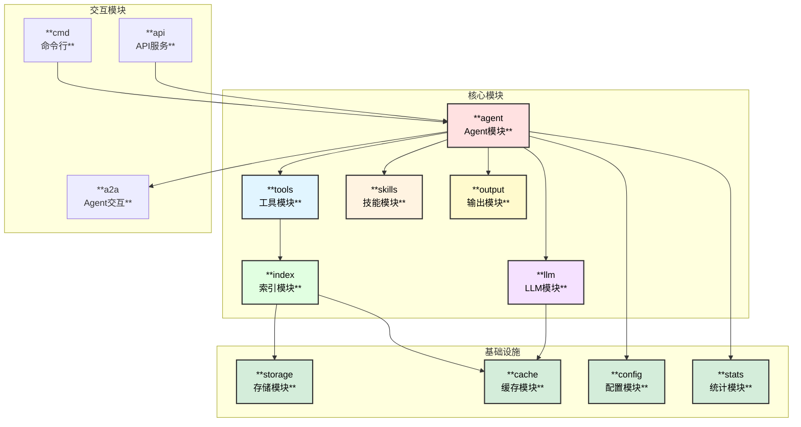
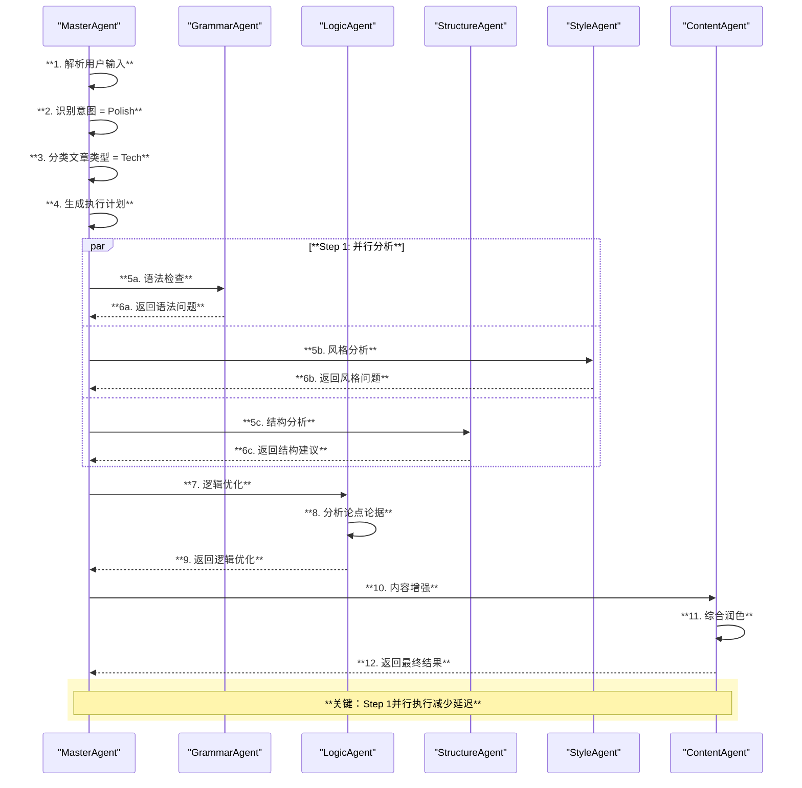
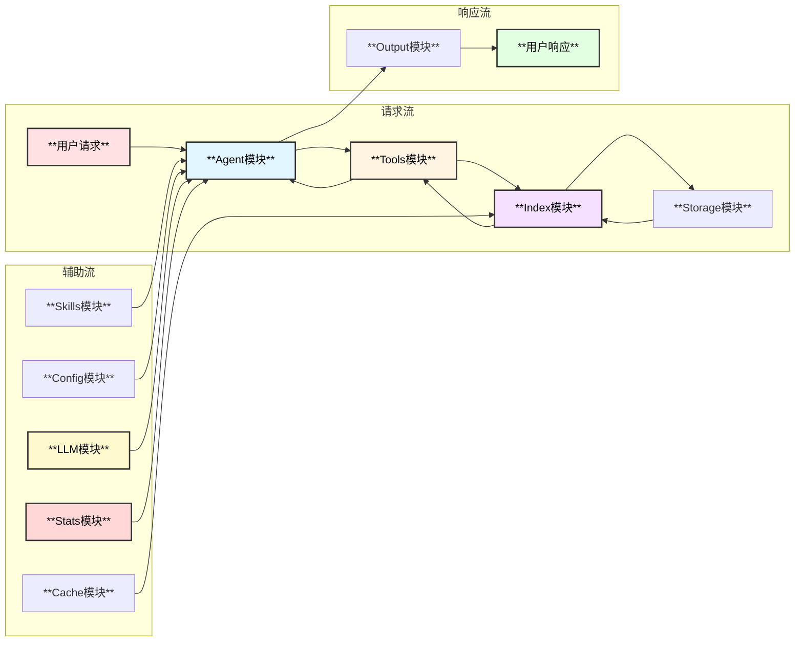

# 微信公众号文章润色专家Agent - 模块设计

## 1. 模块总览



## 2. Agent模块 (`agent/`)

### 2.1 模块结构

```
agent/
├── master/                 # 主控Agent
│   ├── master.go           # MasterAgent实现
│   ├── intent.go           # 意图识别
│   └── planner.go          # 任务规划
├── grammar/                # 语法检查Agent
│   └── grammar_agent.go
├── logic/                  # 逻辑优化Agent
│   └── logic_agent.go
├── structure/              # 结构调整Agent
│   └── structure_agent.go
├── style/                  # 风格统一Agent
│   └── style_agent.go
├── tech/                   # 技术文章Agent
│   └── tech_agent.go
├── content/                # 内容增强Agent
│   └── content_agent.go
└── factory.go              # Agent工厂
```

### 2.2 MasterAgent 设计

```go
// MasterAgent 主控Agent，协调所有子Agent
type MasterAgent struct {
    name        string
    description string
    chatModel   model.ToolCallingChatModel
    subAgents   []adk.Agent
    config      *MasterConfig
    router      *ModelRouter
    stats       *StatsCollector
}

type MasterConfig struct {
    WorkPath      string                    // 工作路径
    InputPath     string                    // 输入路径
    OutputPath    string                    // 输出路径
    OutputMode    OutputMode                // 输出模式
    MaxConcurrent int                       // 最大并发数
    Middlewares   []adk.AgentMiddleware     // 中间件
}

// 意图类型
type IntentType int
const (
    IntentPolishTech      IntentType = iota  // 技术文章润色
    IntentPolishGeneral                       // 通用文章润色
    IntentGrammarCheck                        // 语法检查
    IntentLogicOptimize                       // 逻辑优化
    IntentStyleUnify                          // 风格统一
    IntentStructureAdjust                     // 结构调整
    IntentMultiRound                          // 多轮交互
)

// 文章类型
type ArticleType int
const (
    ArticleTypeTech     ArticleType = iota  // 技术类文章
    ArticleTypeGeneral                       // 非技术类文章
    ArticleTypeMixed                         // 混合类型
)

// 规划结果
type ExecutionPlan struct {
    Intent      IntentType
    ArticleType ArticleType
    Steps       []PlanStep
    Parallel    bool           // 是否可并行
    Priority    int
}

type PlanStep struct {
    AgentName   string
    Task        string
    DependsOn   []string       // 依赖的步骤
    Timeout     time.Duration
    Model       string         // 指定使用的模型
}
```

### 2.3 SubAgent 接口设计

```go
// SubAgent 子Agent接口
type SubAgent interface {
    adk.Agent
    
    // CanHandle 判断是否能处理该任务
    CanHandle(ctx context.Context, articleType ArticleType, intent IntentType) bool
    
    // GetCapabilities 返回Agent能力描述
    GetCapabilities() []string
    
    // GetPriority 返回处理优先级
    GetPriority() int
}

// GrammarAgent 语法检查Agent
type GrammarAgent struct {
    *adk.ChatModelAgent
    grammarTool    *GrammarCheckTool
    spellChecker   *SpellCheckTool
}

// LogicAgent 逻辑优化Agent
type LogicAgent struct {
    *adk.ChatModelAgent
    logicAnalyzer  *LogicAnalyzeTool
    coherenceCheck *CoherenceCheckTool
}

// StructureAgent 结构调整Agent
type StructureAgent struct {
    *adk.ChatModelAgent
    structureTool  *StructureAnalyzeTool
    outlineTool    *OutlineGenerateTool
}

// StyleAgent 风格统一Agent
type StyleAgent struct {
    *adk.ChatModelAgent
    styleAnalyzer  *StyleAnalyzeTool
    wechatNormTool *WeChatNormTool
}

// TechAgent 技术文章Agent
type TechAgent struct {
    *adk.ChatModelAgent
    codeFormatter  *CodeFormatTool
    techTermTool   *TechTermCheckTool
}

// ContentAgent 内容增强Agent
type ContentAgent struct {
    *adk.ChatModelAgent
    enhanceTool    *ContentEnhanceTool
    readabilityTool *ReadabilityCheckTool
}
```

### 2.4 Agent协作流程



## 3. 索引模块 (`index/`)

### 3.1 模块结构

```
index/
├── builder/                # 索引构建器
│   ├── builder.go          # 主构建器
│   ├── parser.go           # 内容解析器
│   └── worker.go           # 并行Worker
├── inverted/               # 倒排索引
│   ├── index.go            # 倒排索引实现
│   └── tokenizer.go        # 分词器
├── summary/                # 内容摘要
│   ├── extractor.go        # 摘要提取器
│   └── summary.go          # 摘要存储
├── style/                  # 风格索引
│   ├── analyzer.go         # 风格分析器
│   └── index.go            # 风格索引
├── skills/                 # 技能索引
│   └── index.go            # 技能索引
└── storage/                # 存储适配
    ├── sqlite.go           # SQLite存储
    ├── boltdb.go           # BoltDB存储
    └── external.go         # 外部数据库
```

### 3.2 倒排索引设计

```go
// InvertedIndex 倒排索引
type InvertedIndex struct {
    db        *sql.DB
    tokenizer Tokenizer
    cache     *IndexCache
}

// 索引记录
type IndexRecord struct {
    Term      string      // 词项
    DocID     string      // 文档ID
    Positions []Position  // 出现位置
    TF        float64     // 词频
    IDF       float64     // 逆文档频率
}

type Position struct {
    Paragraph int
    Sentence  int
    Offset    int
    Length    int
}

// 查询接口
func (idx *InvertedIndex) Search(query string, opts SearchOptions) ([]SearchResult, error)
func (idx *InvertedIndex) SearchWithContext(query string, contextLines int) ([]SearchResult, error)
func (idx *InvertedIndex) SearchByStyle(style StyleType) ([]SearchResult, error)
```

### 3.3 内容摘要设计

```go
// ContentSummary 内容摘要
type ContentSummary struct {
    ID          string            // 唯一标识
    Title       string            // 文章标题
    FilePath    string            // 文件路径
    WordCount   int               // 字数统计
    Summary     string            // 内容摘要
    Keywords    []string          // 关键词
    ArticleType ArticleType       // 文章类型
    StyleType   StyleType         // 风格类型
    Structure   *ArticleStructure // 结构信息
    Metadata    map[string]string // 元数据
    CreatedAt   time.Time
    UpdatedAt   time.Time
}

type ArticleStructure struct {
    Sections    []Section
    HasCode     bool              // 是否包含代码
    HasImage    bool              // 是否包含图片
    HasTable    bool              // 是否包含表格
    Complexity  int               // 复杂度评分
}

type Section struct {
    Level    int               // 标题级别
    Title    string            // 标题内容
    Content  string            // 段落内容
    WordCount int              // 字数
}

// ContentSummaryStore 内容摘要存储
type ContentSummaryStore interface {
    Add(summary *ContentSummary) error
    Get(id string) (*ContentSummary, error)
    Search(query SummaryQuery) ([]*ContentSummary, error)
    ListByType(articleType ArticleType) ([]*ContentSummary, error)
    Update(summary *ContentSummary) error
    Delete(id string) error
}

// SummaryQuery 摘要查询
type SummaryQuery struct {
    Keyword     string
    ArticleType ArticleType
    StyleType   StyleType
    MinWords    int
    MaxWords    int
    HasCode     *bool
    Limit       int
    Offset      int
}
```

## 4. 工具模块 (`tools/`)

### 4.1 模块结构

```
tools/
├── grammar/                # 语法检查工具
│   ├── grammar.go          # 语法检查
│   └── spell.go            # 拼写检查
├── style/                  # 风格分析工具
│   ├── analyzer.go         # 风格分析
│   └── wechat_norm.go      # 微信规范
├── structure/              # 结构分析工具
│   ├── analyzer.go         # 结构分析
│   └── outline.go          # 大纲生成
├── content/                # 内容处理工具
│   ├── enhance.go          # 内容增强
│   └── readability.go      # 可读性分析
├── markdown/               # Markdown工具
│   ├── parser.go           # Markdown解析
│   └── formatter.go        # 格式化
├── file/                   # 文件操作工具
│   ├── reader.go           # 文件读取
│   └── writer.go           # 文件写入
└── factory.go              # 工具工厂
```

### 4.2 GrammarCheckTool 设计

```go
// GrammarCheckTool 语法检查工具
type GrammarCheckTool struct {
    rules       []GrammarRule
    dictPath    string
    cache       *ToolCache
}

type GrammarRule struct {
    ID          string
    Name        string
    Pattern     *regexp.Regexp
    Suggestion  string
    Severity    Severity
}

type GrammarIssue struct {
    RuleID      string
    Position    Position
    Original    string
    Suggestion  string
    Severity    Severity
    Confidence  float64
}

func (t *GrammarCheckTool) Info(ctx context.Context) (*schema.ToolInfo, error) {
    return &schema.ToolInfo{
        Name: "grammar_check",
        Desc: "检查文章中的语法错误、错别字和标点问题",
        ParamsOneOf: schema.NewParamsOneOfByParams(map[string]*schema.ParameterInfo{
            "content": {Type: schema.String, Required: true, Desc: "待检查的文章内容"},
            "check_types": {Type: schema.Array, Desc: "检查类型: grammar, spell, punctuation"},
            "language": {Type: schema.String, Desc: "语言: zh, en"},
        }),
    }, nil
}
```

### 4.3 WeChatNormTool 设计

```go
// WeChatNormTool 微信公众号规范检查工具
type WeChatNormTool struct {
    norms       []WeChatNorm
    skillsIndex *SkillsIndex
}

type WeChatNorm struct {
    ID          string
    Category    NormCategory
    Rule        string
    Description string
    Example     string
    AutoFix     bool
}

type NormCategory string
const (
    NormCategoryTitle       NormCategory = "title"        // 标题规范
    NormCategoryStructure   NormCategory = "structure"    // 结构规范
    NormCategoryParagraph   NormCategory = "paragraph"    // 段落规范
    NormCategoryImage       NormCategory = "image"        // 图片规范
    NormCategoryCode        NormCategory = "code"         // 代码规范
    NormCategoryStyle       NormCategory = "style"        // 风格规范
    NormCategoryReadability NormCategory = "readability"  // 可读性规范
)

func (t *WeChatNormTool) Info(ctx context.Context) (*schema.ToolInfo, error) {
    return &schema.ToolInfo{
        Name: "wechat_norm_check",
        Desc: `检查文章是否符合微信公众号的写作规范。
        
规范包括：
- 标题规范：字数、吸引力、关键词
- 结构规范：开头、正文、结尾
- 段落规范：长度、过渡、重点
- 图片规范：数量、质量、位置
- 代码规范：格式、注释、可读性
- 风格规范：语言风格、用词习惯`,
        ParamsOneOf: schema.NewParamsOneOfByParams(map[string]*schema.ParameterInfo{
            "content": {Type: schema.String, Required: true, Desc: "待检查的文章内容"},
            "article_type": {Type: schema.String, Desc: "文章类型: tech, general"},
            "check_categories": {Type: schema.Array, Desc: "检查类别"},
        }),
    }, nil
}
```

### 4.4 MarkdownTool 设计

```go
// MarkdownTool Markdown处理工具
type MarkdownTool struct {
    parser    *MarkdownParser
    formatter *MarkdownFormatter
}

func (t *MarkdownTool) Info(ctx context.Context) (*schema.ToolInfo, error) {
    return &schema.ToolInfo{
        Name: "markdown_process",
        Desc: `处理Markdown格式文件。

支持操作：
- parse: 解析Markdown为结构化数据
- format: 格式化Markdown
- extract: 提取指定部分
- merge: 合并多个Markdown
- convert: 格式转换`,
        ParamsOneOf: schema.NewParamsOneOfByParams(map[string]*schema.ParameterInfo{
            "operation": {Type: schema.String, Required: true, Desc: "操作类型"},
            "content": {Type: schema.String, Desc: "Markdown内容"},
            "file_path": {Type: schema.String, Desc: "文件路径"},
            "options": {Type: schema.Object, Desc: "操作选项"},
        }),
    }, nil
}

// MarkdownParser Markdown解析器
type MarkdownParser struct{}

type ParsedMarkdown struct {
    Title       string
    Metadata    map[string]string   // YAML Front Matter
    Sections    []MarkdownSection
    CodeBlocks  []CodeBlock
    Images      []ImageRef
    Links       []LinkRef
    Tables      []TableData
}

type MarkdownSection struct {
    Level    int
    Title    string
    Content  string
    Children []MarkdownSection
}

type CodeBlock struct {
    Language string
    Code     string
    Line     int
}
```

## 5. 技能模块 (`skills/`)

### 5.1 模块结构

```
skills/
├── backend.go              # Skill Backend实现
├── loader.go               # Skill加载器
├── wechat/                 # 微信公众号Skills
│   ├── title.md            # 标题写作技巧
│   ├── structure.md        # 结构组织技巧
│   ├── opening.md          # 开头写作技巧
│   ├── ending.md           # 结尾写作技巧
│   ├── transition.md       # 过渡衔接技巧
│   └── style.md            # 风格把控技巧
├── tech/                   # 技术文章Skills
│   ├── code_explain.md     # 代码解释技巧
│   ├── architecture.md     # 架构图描述
│   └── tutorial.md         # 教程写作技巧
└── templates/              # 模板Skills
    ├── polish.md           # 润色模板
    └── review.md           # 审校模板
```

### 5.2 Skill 定义格式

```yaml
---
name: wechat_title_skill
description: 微信公众号标题写作技巧
article_type: general
---

## 核心原则
1. 标题字数控制在20字以内
2. 包含数字或具体数据更吸引人
3. 使用疑问句或祈使句增加互动感
4. 避免标题党，但要有吸引力

## 常用技巧
- 数字法：5个方法、3分钟学会
- 对比法：从XX到XX的转变
- 问题法：为什么XX？如何XX？
- 利益法：帮你XX、教你XX

## 标题模式
- 干货类：《XX的N个核心要点》
- 故事类：《从XX到XX：我的XX之路》
- 方法类：《手把手教你XX》
- 观点类：《为什么我认为XX》

## 避免问题
- 避免过长标题影响显示
- 避免使用生僻词汇
- 避免使用过于夸张的词语
```

### 5.3 SkillBackend 实现

```go
// WeChatSkillBackend 微信公众号专用Skill后端
type WeChatSkillBackend struct {
    skillDir  string
    cache     map[string]*skill.Skill
    templates map[string]*template.Template
    index     *SkillsIndex
}

func (b *WeChatSkillBackend) List(ctx context.Context) ([]skill.FrontMatter, error) {
    // 返回所有可用的微信公众号Skills
}

func (b *WeChatSkillBackend) Get(ctx context.Context, name string) (skill.Skill, error) {
    // 返回指定的Skill内容
}

func (b *WeChatSkillBackend) Search(ctx context.Context, query SkillQuery) ([]skill.Skill, error) {
    // 搜索相关Skills
}

// Skill中间件配置
func NewWeChatSkillMiddleware(ctx context.Context, skillDir string) (adk.AgentMiddleware, error) {
    backend := &WeChatSkillBackend{skillDir: skillDir}
    return skill.New(ctx, &skill.Config{
        Backend:    backend,
        UseChinese: true,
    })
}
```

## 6. LLM模块 (`llm/`)

### 6.1 模块结构

```
llm/
├── provider/               # LLM提供者
│   ├── openai.go           # OpenAI
│   ├── anthropic.go        # Claude
│   ├── qwen.go             # 通义千问
│   ├── ernie.go            # 文心一言
│   ├── deepseek.go         # DeepSeek
│   ├── glm.go              # 智谱AI
│   ├── moonshot.go         # 月之暗面
│   ├── gemini.go           # Google Gemini
│   └── ollama.go           # 本地Ollama
├── router/                 # 模型路由
│   ├── router.go           # 路由器
│   └── strategy.go         # 路由策略
├── manager.go              # LLM管理器
└── factory.go              # LLM工厂
```

### 6.2 模型路由设计

```go
// ModelRouter 模型路由器
type ModelRouter struct {
    providers   map[string]model.ChatModel
    strategies  map[TaskType]*RoutingStrategy
    fallbacks   []string
    stats       *ModelStats
}

type RoutingStrategy struct {
    Primary    string            // 主模型
    Fallback   string            // 备用模型
    Conditions []RouteCondition  // 路由条件
}

type RouteCondition struct {
    Metric    string    // 指标: token_count, complexity, type
    Operator  string    // 操作: gt, lt, eq
    Value     interface{}
    Target    string    // 目标模型
}

// TaskType 任务类型
type TaskType string
const (
    TaskTypeSimple   TaskType = "simple"   // 简单任务: 语法检查、格式修正
    TaskTypeMedium   TaskType = "medium"   // 中等任务: 逻辑优化、风格统一
    TaskTypeComplex  TaskType = "complex"  // 复杂任务: 内容重构、深度润色
)

// Route 路由到合适的模型
func (r *ModelRouter) Route(ctx context.Context, task *PolishTask) (model.ChatModel, error) {
    strategy := r.strategies[task.Type]
    if strategy == nil {
        strategy = r.strategies[TaskTypeSimple]
    }
    
    // 检查条件
    for _, cond := range strategy.Conditions {
        if r.matchCondition(task, cond) {
            if provider, ok := r.providers[cond.Target]; ok {
                return provider, nil
            }
        }
    }
    
    // 返回主模型
    if provider, ok := r.providers[strategy.Primary]; ok {
        return provider, nil
    }
    
    // 使用备用模型
    return r.providers[strategy.Fallback], nil
}
```

### 6.3 模型提供者配置

```go
// LLMConfig LLM配置
type LLMConfig struct {
    // 国内模型
    Qwen     *QwenConfig     `yaml:"qwen"`
    Ernie    *ErnieConfig    `yaml:"ernie"`
    DeepSeek *DeepSeekConfig `yaml:"deepseek"`
    GLM      *GLMConfig      `yaml:"glm"`
    Moonshot *MoonshotConfig `yaml:"moonshot"`
    
    // 国外模型
    OpenAI    *OpenAIConfig    `yaml:"openai"`
    Anthropic *AnthropicConfig `yaml:"anthropic"`
    Gemini    *GeminiConfig    `yaml:"gemini"`
    
    // 本地模型
    Ollama *OllamaConfig `yaml:"ollama"`
    VLLM   *VLLMConfig   `yaml:"vllm"`
    
    // 路由配置
    Router *RouterConfig `yaml:"router"`
}

type RouterConfig struct {
    DefaultModel string                       `yaml:"default_model"`
    Strategies   map[string]*StrategyConfig   `yaml:"strategies"`
    Fallbacks    []string                     `yaml:"fallbacks"`
}

type StrategyConfig struct {
    Primary    string              `yaml:"primary"`
    Fallback   string              `yaml:"fallback"`
    Conditions []ConditionConfig   `yaml:"conditions"`
}
```

## 7. 输出模块 (`output/`)

### 7.1 模块结构

```
output/
├── formatter/              # 格式化器
│   ├── summary.go          # 总结格式
│   ├── document.go         # 文档格式
│   └── diff.go             # 差异对比
├── diagram/                # 图表生成
│   ├── mermaid.go          # Mermaid图表
│   └── structure.go        # 结构图
├── template/               # 模板
│   ├── summary.tmpl
│   ├── document.tmpl
│   └── diff.tmpl
└── renderer.go             # 渲染器
```

### 7.2 输出格式器设计

```go
// OutputFormatter 输出格式化器接口
type OutputFormatter interface {
    Format(ctx context.Context, result *PolishResult) (string, error)
}

// PolishResult 润色结果
type PolishResult struct {
    Original    string                // 原文
    Polished    string                // 润色后
    Changes     []Change              // 修改列表
    Stats       *PolishStats          // 统计信息
    Suggestions []Suggestion          // 建议列表
}

type Change struct {
    Type        ChangeType
    Position    Position
    Original    string
    Modified    string
    Reason      string
    Agent       string              // 由哪个Agent处理
}

type ChangeType string
const (
    ChangeTypeGrammar   ChangeType = "grammar"
    ChangeTypeLogic     ChangeType = "logic"
    ChangeTypeStructure ChangeType = "structure"
    ChangeTypeStyle     ChangeType = "style"
    ChangeTypeContent   ChangeType = "content"
)

// SummaryFormatter 总结格式化器
type SummaryFormatter struct {
    maxLength int
}

func (f *SummaryFormatter) Format(ctx context.Context, result *PolishResult) (string, error) {
    // 生成简短总结
}

// DocumentFormatter 文档格式化器
type DocumentFormatter struct {
    diagramGenerator *MermaidGenerator
    templateEngine   *template.Template
    diffGenerator    *DiffGenerator
}

func (f *DocumentFormatter) Format(ctx context.Context, result *PolishResult) (string, error) {
    // 生成完整文档，包含差异对比和图表
}
```

## 8. 统计模块 (`stats/`)

### 8.1 模块结构

```
stats/
├── collector.go            # 统计收集器
├── token.go                # Token统计
├── cache.go                # 缓存统计
├── model.go                # 模型统计
└── exporter.go             # 数据导出
```

### 8.2 统计收集器设计

```go
// StatsCollector 统计收集器
type StatsCollector struct {
    tokenStats  *TokenStats
    cacheStats  *CacheStats
    modelStats  *ModelStats
    agentStats  *AgentStats
    mu          sync.RWMutex
}

// TokenStats Token统计
type TokenStats struct {
    TotalInput   int64            // 总输入Token
    TotalOutput  int64            // 总输出Token
    ByModel      map[string]int64 // 按模型统计
    ByAgent      map[string]int64 // 按Agent统计
    ByRequest    map[string]int64 // 按请求统计
}

// CacheStats 缓存统计
type CacheStats struct {
    TotalHits    int64            // 总命中次数
    TotalMisses  int64            // 总未命中次数
    HitRate      float64          // 命中率
    ByType       map[string]*CacheTypeStats // 按类型统计
}

type CacheTypeStats struct {
    Hits    int64
    Misses  int64
    Size    int64
}

// ModelStats 模型统计
type ModelStats struct {
    Requests     map[string]int64          // 请求次数
    Latency      map[string]time.Duration  // 平均延迟
    Errors       map[string]int64          // 错误次数
    TokenUsage   map[string]*TokenUsage    // Token使用
}

type TokenUsage struct {
    Input       int64
    Output      int64
    TotalCost   float64  // 成本估算
}

// 统计接口
func (c *StatsCollector) RecordTokenUsage(model, agent string, input, output int64)
func (c *StatsCollector) RecordCacheHit(cacheType string, hit bool)
func (c *StatsCollector) RecordModelRequest(model string, latency time.Duration, err error)
func (c *StatsCollector) GetSummary() *StatsSummary
func (c *StatsCollector) Export(format string) ([]byte, error)
```

## 9. 模块间交互


