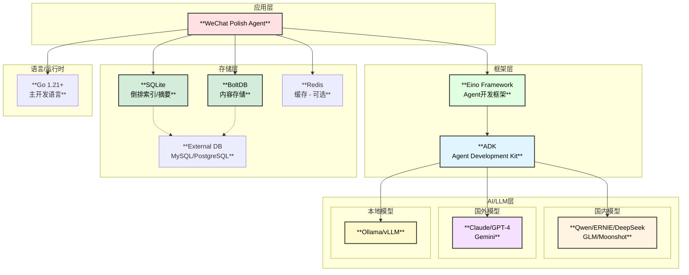

# 微信公众号文章润色专家Agent - 技术选型

## 1. 技术栈总览



## 2. 核心技术选型详解

### 2.1 Agent框架 - Eino

| 特性 | 说明 | 优势 |
|------|------|------|
| **ChatModelAgent** | 基于LLM的Agent实现 | 成熟的ReAct循环实现 |
| **Supervisor模式** | 多Agent协作 | 支持层级Agent管理 |
| **Skill机制** | 技能扩展 | 动态加载专业知识 |
| **Tool抽象** | 工具接口 | 统一的工具调用规范 |
| **Checkpoint** | 状态持久化 | 支持中断恢复 |
| **Workflow** | 工作流编排 | 复杂任务编排 |

**选择理由**：
- 原生Go实现，与项目技术栈一致
- 丰富的Agent模式支持 (ReAct, Supervisor, Deep)
- 完善的中间件机制
- 支持流式输出
- 活跃的社区维护

### 2.2 LLM Provider

#### 2.2.1 国内大模型

| Provider | 模型 | 特点 | 推荐场景 |
|----------|------|------|----------|
| **通义千问** | qwen-max | 中文理解强、性价比高 | 通用润色 |
| **文心一言** | ernie-4.0 | 中文表达好、创意能力强 | 内容创作 |
| **DeepSeek** | deepseek-chat | 推理能力强、代码理解好 | 技术文章 |
| **智谱AI** | glm-4 | 知识丰富、长文本支持好 | 长文章处理 |
| **月之暗面** | moonshot-v1 | 超长上下文、价格低 | 大文档处理 |

#### 2.2.2 国外大模型

| Provider | 模型 | 特点 | 推荐场景 |
|----------|------|------|----------|
| **Claude** | claude-3-opus | 长上下文、理解能力强 | 复杂润色 |
| **GPT-4** | gpt-4-turbo | 通用能力强、稳定性高 | 备用模型 |
| **Gemini** | gemini-1.5-pro | 多模态、长上下文 | 图文混合 |

#### 2.2.3 本地模型

| Provider | 模型 | 特点 | 推荐场景 |
|----------|------|------|----------|
| **Ollama** | qwen2.5:14b | 部署简单、隐私保护 | 敏感内容 |
| **vLLM** | 各类开源模型 | 高性能推理、批量处理 | 大批量处理 |

**推荐配置**：
```go
// 主分析模型配置
type ModelConfig struct {
    // 国内模型 - 默认
    PrimaryModel   string // deepseek-chat
    
    // 国内模型 - 备用
    FallbackModel  string // qwen-max
    
    // 本地模型 - 隐私场景
    LocalModel     string // ollama:qwen2.5
    
    // 国外模型 - 复杂任务
    AdvancedModel  string // claude-3-opus
}
```

### 2.3 NLP工具

| 工具 | 用途 | 实现方式 |
|------|------|----------|
| **jieba** | 中文分词 | Go binding |
| **gse** | 高性能分词 | 纯Go实现 |
| **prose** | 英文NLP | Go库 |
| **gojieba** | 中文分词 | CGO binding |

**选择策略**：
```go
// 分词器配置
type TokenizerConfig struct {
    Type        string // gse | jieba | prose
    DictPath    string // 自定义词典路径
    EnableHMM   bool   // 是否启用HMM
    EnableDAG   bool   // 是否启用DAG
}

// 推荐使用gse（纯Go实现，无CGO依赖）
func NewDefaultTokenizer() *Tokenizer {
    return &Tokenizer{
        Type:      "gse",
        EnableHMM: true,
        EnableDAG: true,
    }
}
```

### 2.4 存储方案

#### 2.4.1 SQLite - 倒排索引/内容摘要

| 特性 | 说明 |
|------|------|
| **嵌入式** | 无需独立部署 |
| **事务支持** | ACID事务 |
| **全文搜索** | FTS5扩展 |
| **JSON支持** | JSON1扩展 |

**表结构设计**：
```sql
-- 倒排索引表
CREATE TABLE inverted_index (
    term TEXT NOT NULL,
    doc_id TEXT NOT NULL,
    positions TEXT,  -- JSON array of positions
    tf REAL,
    idf REAL,
    PRIMARY KEY (term, doc_id)
);

CREATE INDEX idx_term ON inverted_index(term);

-- 内容摘要表
CREATE TABLE content_summary (
    id TEXT PRIMARY KEY,
    title TEXT,
    file_path TEXT NOT NULL,
    word_count INTEGER,
    summary TEXT,
    keywords TEXT,          -- JSON array
    article_type INTEGER,
    style_type INTEGER,
    structure TEXT,         -- JSON object
    metadata TEXT,          -- JSON object
    created_at TIMESTAMP DEFAULT CURRENT_TIMESTAMP,
    updated_at TIMESTAMP DEFAULT CURRENT_TIMESTAMP
);

CREATE INDEX idx_summary_path ON content_summary(file_path);
CREATE INDEX idx_summary_type ON content_summary(article_type);

-- 全文搜索
CREATE VIRTUAL TABLE content_fts USING fts5(
    title, summary, keywords,
    content='content_summary',
    content_rowid='rowid'
);
```

#### 2.4.2 BoltDB - 内容存储

| 特性 | 说明 |
|------|------|
| **KV存储** | 高效的键值存储 |
| **嵌入式** | 纯Go实现 |
| **B+树** | 有序遍历 |
| **事务** | 支持ACID |

**数据模型**：
```go
// BoltDB Buckets
const (
    BucketContent    = "content"     // 原始内容存储
    BucketPolished   = "polished"    // 润色结果存储
    BucketHistory    = "history"     // 历史记录
    BucketSession    = "session"     // 会话数据
    BucketCache      = "cache"       // 缓存数据
)

// 内容存储格式
type ContentData struct {
    ID        string    `json:"id"`
    Content   string    `json:"content"`
    Metadata  map[string]interface{} `json:"metadata"`
    Version   int       `json:"version"`
    CreatedAt time.Time `json:"created_at"`
}
```

#### 2.4.3 外部数据库 - 可选

| 数据库 | 用途 | 场景 |
|--------|------|------|
| **MySQL** | 结构化数据 | 企业部署 |
| **PostgreSQL** | 复杂查询 | 大规模部署 |
| **Redis** | 分布式缓存 | 高并发场景 |

### 2.5 缓存方案

| 场景 | 方案 | TTL |
|------|------|-----|
| **索引查询** | 内存LRU | 30min |
| **内容摘要** | SQLite + 内存 | 持久化 |
| **LLM响应** | 可选Redis | 1h |
| **会话状态** | BoltDB | 24h |

**Go实现**：
```go
// 多级缓存
type MultiLevelCache struct {
    l1 *lru.Cache        // L1: 内存LRU
    l2 *bolt.DB          // L2: BoltDB
    l3 *redis.Client     // L3: Redis (可选)
}

func (c *MultiLevelCache) Get(key string) (interface{}, bool) {
    // L1 lookup
    if v, ok := c.l1.Get(key); ok {
        return v, true
    }
    
    // L2 lookup
    if v, err := c.getFromBolt(key); err == nil {
        c.l1.Add(key, v)
        return v, true
    }
    
    // L3 lookup (if enabled)
    if c.l3 != nil {
        if v, err := c.l3.Get(ctx, key).Result(); err == nil {
            c.l1.Add(key, v)
            return v, true
        }
    }
    
    return nil, false
}
```

## 3. 并发模型

### 3.1 Go并发原语选择

| 场景 | 方案 | 理由 |
|------|------|------|
| **多段落并行检查** | `errgroup.Group` | 统一错误处理 |
| **生产者-消费者** | Channel | 解耦处理流程 |
| **结果聚合** | `sync.WaitGroup` | 简单同步 |
| **共享状态** | `sync.RWMutex` | 读多写少场景 |
| **单例初始化** | `sync.Once` | 线程安全初始化 |

### 3.2 Worker Pool实现

```go
// WorkerPool 工作池
type WorkerPool struct {
    workers   int
    taskQueue chan Task
    results   chan Result
    wg        sync.WaitGroup
}

type Task struct {
    ID      string
    Type    string
    Input   interface{}
    Execute func(ctx context.Context, input interface{}) (interface{}, error)
}

type Result struct {
    TaskID string
    Type   string
    Value  interface{}
    Error  error
}

func (p *WorkerPool) Start(ctx context.Context) {
    for i := 0; i < p.workers; i++ {
        p.wg.Add(1)
        go p.worker(ctx)
    }
}

func (p *WorkerPool) worker(ctx context.Context) {
    defer p.wg.Done()
    for {
        select {
        case task, ok := <-p.taskQueue:
            if !ok {
                return
            }
            val, err := task.Execute(ctx, task.Input)
            p.results <- Result{TaskID: task.ID, Type: task.Type, Value: val, Error: err}
        case <-ctx.Done():
            return
        }
    }
}
```

## 4. 依赖管理

### 4.1 Go模块依赖

```go
// go.mod
module github.com/cloudwego/eino/vdocswx

go 1.21

require (
    github.com/cloudwego/eino v0.x.x        // Eino框架
    github.com/bytedance/sonic v1.x.x       // JSON处理
    github.com/mattn/go-sqlite3 v1.x.x      // SQLite
    go.etcd.io/bbolt v1.x.x                 // BoltDB
    github.com/hashicorp/golang-lru v0.x.x  // LRU缓存
    golang.org/x/sync v0.x.x                // errgroup
    gopkg.in/yaml.v3 v3.x.x                 // YAML配置
    github.com/go-ego/gse v0.x.x            // 中文分词
    github.com/redis/go-redis/v9 v9.x.x     // Redis客户端
)
```

### 4.2 外部工具依赖

| 工具 | 版本 | 安装方式 |
|------|------|----------|
| Go | 1.21+ | 官方安装 |
| SQLite | 3.x | 系统自带 |
| Redis | 7.x (可选) | `brew install redis` |

## 5. 配置管理

```yaml
# config.yaml
wechat_polish:
  # 工作路径配置
  paths:
    work_path: "/path/to/workspace"
    input_path: "/path/to/input"
    output_path: "/path/to/output"
  
  # 索引配置
  index:
    type: "sqlite"                # sqlite | external
    path: "/path/to/index.db"
    rebuild_on_start: false
    parallel_workers: 8
    external:
      driver: "mysql"             # mysql | postgres
      dsn: ""
  
  # LLM配置
  llm:
    # 国内模型
    deepseek:
      enabled: true
      api_key_env: "DEEPSEEK_API_KEY"
      base_url: "https://api.deepseek.com/v1"
      model: "deepseek-chat"
      max_tokens: 4096
      temperature: 0.3
    
    qwen:
      enabled: true
      api_key_env: "QWEN_API_KEY"
      base_url: "https://dashscope.aliyuncs.com/api/v1"
      model: "qwen-max"
      max_tokens: 4096
    
    ernie:
      enabled: false
      api_key_env: "ERNIE_API_KEY"
      secret_key_env: "ERNIE_SECRET_KEY"
      model: "ernie-4.0"
    
    glm:
      enabled: false
      api_key_env: "GLM_API_KEY"
      model: "glm-4"
    
    moonshot:
      enabled: false
      api_key_env: "MOONSHOT_API_KEY"
      model: "moonshot-v1-32k"
    
    # 国外模型
    anthropic:
      enabled: false
      api_key_env: "ANTHROPIC_API_KEY"
      model: "claude-3-opus-20240229"
      max_tokens: 8192
    
    openai:
      enabled: false
      api_key_env: "OPENAI_API_KEY"
      base_url: "https://api.openai.com/v1"
      model: "gpt-4-turbo"
    
    gemini:
      enabled: false
      api_key_env: "GOOGLE_API_KEY"
      model: "gemini-1.5-pro"
    
    # 本地模型
    ollama:
      enabled: true
      base_url: "http://localhost:11434"
      model: "qwen2.5:14b"
    
    vllm:
      enabled: false
      base_url: "http://localhost:8000"
      model: "qwen2.5-14b"
  
  # 模型路由配置
  router:
    default_model: "deepseek"
    strategies:
      simple:
        primary: "ollama"
        fallback: "qwen"
      medium:
        primary: "deepseek"
        fallback: "qwen"
      complex:
        primary: "anthropic"
        fallback: "deepseek"
    fallbacks:
      - "qwen"
      - "ollama"
  
  # Agent配置
  agent:
    max_iterations: 20
    max_concurrent_agents: 5
    timeout: 300s
    agents:
      - grammar
      - logic
      - structure
      - style
      - tech
      - content
  
  # 输出配置
  output:
    mode: "document"          # summary | document
    include_diff: true
    include_stats: true
    include_suggestions: true
  
  # 缓存配置
  cache:
    enabled: true
    type: "memory"            # memory | redis
    ttl: 30m
    max_size: 1000
    redis:
      url: "redis://localhost:6379"
      db: 0
      password_env: "REDIS_PASSWORD"
  
  # 统计配置
  stats:
    enabled: true
    export_interval: 60s
    export_format: "json"     # json | prometheus
    export_path: "/path/to/stats"
  
  # A2A配置
  a2a:
    enabled: false
    server_port: 8080
    discovery:
      type: "static"          # static | consul | etcd
      endpoints: []
```

## 6. 部署方案

### 6.1 本地部署

```bash
# 构建
go build -o wechat-polish ./cmd/main.go

# 初始化索引
./wechat-polish init --config=config.yaml

# 启动服务
./wechat-polish serve --config=config.yaml

# 命令行使用
./wechat-polish polish --input=article.md --output=polished.md
```

### 6.2 Docker部署

```dockerfile
FROM golang:1.21-alpine AS builder

WORKDIR /app
COPY . .
RUN go build -o wechat-polish ./cmd/main.go

FROM alpine:3.18

# 安装依赖
RUN apk add --no-cache ca-certificates tzdata

COPY --from=builder /app/wechat-polish /usr/local/bin/
COPY config.yaml /etc/wechat-polish/

# 创建工作目录
RUN mkdir -p /data/workspace /data/index /data/output

ENTRYPOINT ["wechat-polish"]
CMD ["serve", "--config=/etc/wechat-polish/config.yaml"]
```

### 6.3 Kubernetes部署

```yaml
# deployment.yaml
apiVersion: apps/v1
kind: Deployment
metadata:
  name: wechat-polish
spec:
  replicas: 2
  selector:
    matchLabels:
      app: wechat-polish
  template:
    metadata:
      labels:
        app: wechat-polish
    spec:
      containers:
      - name: wechat-polish
        image: wechat-polish:latest
        ports:
        - containerPort: 8080
        env:
        - name: DEEPSEEK_API_KEY
          valueFrom:
            secretKeyRef:
              name: llm-secrets
              key: deepseek-api-key
        - name: QWEN_API_KEY
          valueFrom:
            secretKeyRef:
              name: llm-secrets
              key: qwen-api-key
        volumeMounts:
        - name: config
          mountPath: /etc/wechat-polish
        - name: data
          mountPath: /data
      volumes:
      - name: config
        configMap:
          name: wechat-polish-config
      - name: data
        persistentVolumeClaim:
          claimName: wechat-polish-pvc
```

## 7. 性能指标

| 指标 | 目标值 | 测量方式 |
|------|--------|----------|
| **索引构建时间** | < 10s | 1000篇文章 |
| **单篇润色延迟** | < 30s | 3000字文章 |
| **索引查询延迟** | < 10ms | 倒排索引查询 |
| **缓存命中率** | > 70% | 重复请求 |
| **并发处理能力** | 10 req/s | 同时处理请求数 |
| **Token效率** | < 50% | 缓存+索引减少 |

## 8. 安全考虑

### 8.1 敏感信息处理

| 类型 | 处理方式 |
|------|----------|
| **API密钥** | 环境变量 / K8s Secrets |
| **敏感内容** | 本地模型处理 |
| **用户数据** | 加密存储 |

### 8.2 访问控制

```go
// 敏感内容检测
type ContentFilter struct {
    patterns    []*regexp.Regexp
    localModel  model.ChatModel
}

func (f *ContentFilter) IsSensitive(content string) bool {
    for _, p := range f.patterns {
        if p.MatchString(content) {
            return true
        }
    }
    return false
}

func (f *ContentFilter) Route(content string) model.ChatModel {
    if f.IsSensitive(content) {
        return f.localModel  // 使用本地模型
    }
    return nil  // 使用配置的模型
}
```
