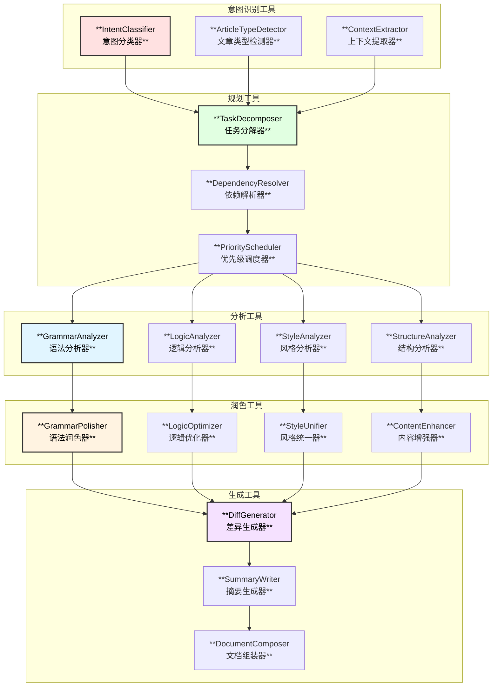
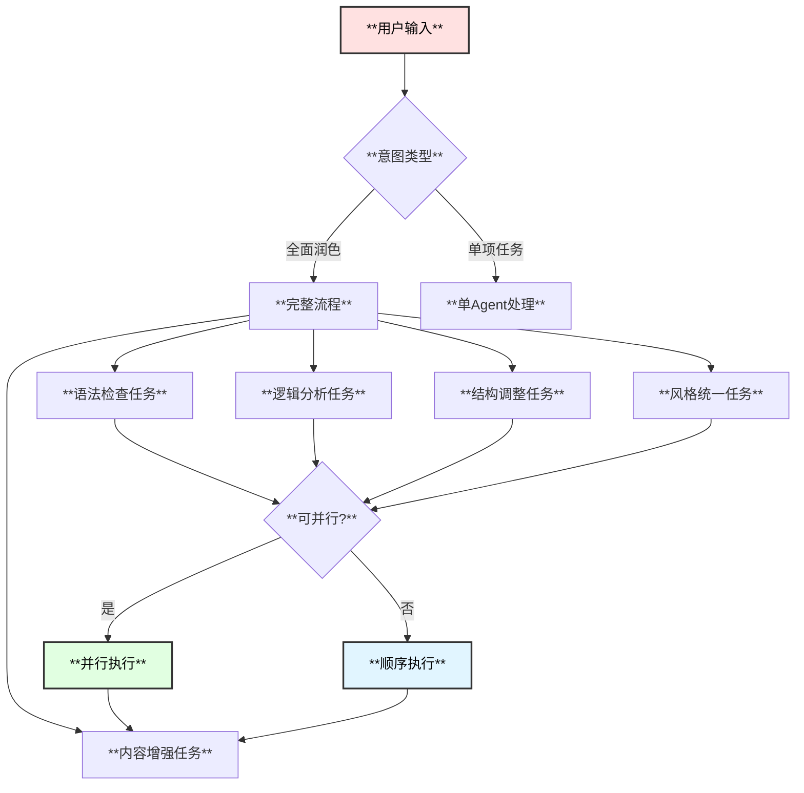
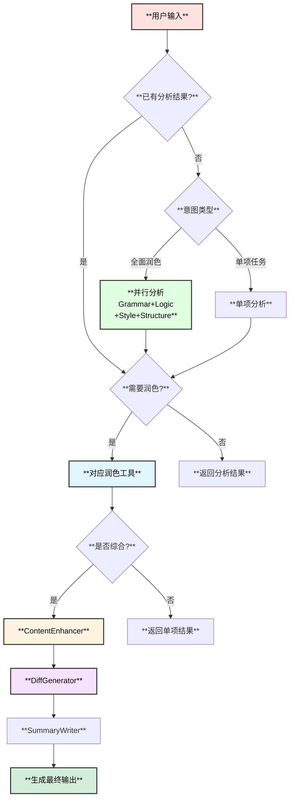

# 微信公众号文章润色专家Agent - 思维工具使用方案

## 1. 思维工具总览



## 2. 意图识别工具

### 2.1 IntentClassifier - 意图分类器

**功能**：识别用户的润色意图，确定处理策略

**意图分类**：

| 意图类型 | 描述 | 示例输入 | 处理策略 |
|----------|------|----------|----------|
| `FULL_POLISH` | 全面润色 | "帮我润色这篇文章" | 所有Agent并行 |
| `GRAMMAR_CHECK` | 语法检查 | "检查文章的语法错误" | GrammarAgent单独 |
| `LOGIC_OPTIMIZE` | 逻辑优化 | "优化文章逻辑" | LogicAgent单独 |
| `STYLE_UNIFY` | 风格统一 | "统一写作风格" | StyleAgent单独 |
| `STRUCTURE_ADJUST` | 结构调整 | "调整文章结构" | StructureAgent单独 |
| `MULTI_ROUND` | 多轮修改 | "继续修改上次的文章" | 恢复会话状态 |

**实现**：

```go
// IntentClassifier 意图分类器
type IntentClassifier struct {
    llm        model.ChatModel
    rules      []IntentRule
    confidence float64
}

type IntentRule struct {
    Keywords    []string
    Patterns    []*regexp.Regexp
    Intent      IntentType
    Confidence  float64
}

// 意图分类流程
func (c *IntentClassifier) Classify(ctx context.Context, input string) (*IntentResult, error) {
    // Step 1: 规则匹配 (快速路径)
    if result := c.ruleBasedClassify(input); result != nil && result.Confidence > 0.8 {
        return result, nil
    }
    
    // Step 2: LLM分类 (准确路径)
    prompt := buildIntentPrompt(input)
    response, err := c.llm.Generate(ctx, []*schema.Message{
        schema.SystemMessage(intentSystemPrompt),
        schema.UserMessage(prompt),
    })
    if err != nil {
        return nil, err
    }
    
    return parseIntentResponse(response.Content)
}

// 意图分类提示词
const intentSystemPrompt = `你是一个微信公众号文章润色专家的意图识别器。
根据用户输入，识别以下意图类型：
1. FULL_POLISH - 需要全面润色文章
2. GRAMMAR_CHECK - 只需检查语法错误
3. LOGIC_OPTIMIZE - 只需优化逻辑结构
4. STYLE_UNIFY - 只需统一写作风格
5. STRUCTURE_ADJUST - 只需调整文章结构
6. MULTI_ROUND - 继续上次的修改

返回JSON格式：{"intent": "类型", "confidence": 0.9, "details": {...}}`
```

### 2.2 ArticleTypeDetector - 文章类型检测器

**功能**：自动检测文章类型（技术类/非技术类）

**检测指标**：

| 指标 | 技术类特征 | 非技术类特征 |
|------|------------|--------------|
| **代码块** | 有代码片段 | 无或极少 |
| **技术术语** | 高频技术词汇 | 通用词汇为主 |
| **图表类型** | 架构图、流程图 | 普通配图 |
| **结构** | 教程式、文档式 | 叙事式、散文式 |
| **语言风格** | 客观、精确 | 感性、生动 |

**实现**：

```go
// ArticleTypeDetector 文章类型检测器
type ArticleTypeDetector struct {
    techTerms    map[string]float64  // 技术术语权重
    codePatterns []*regexp.Regexp    // 代码块模式
}

type DetectionResult struct {
    ArticleType    ArticleType
    Confidence     float64
    TechScore      float64
    GeneralScore   float64
    Features       map[string]interface{}
}

func (d *ArticleTypeDetector) Detect(ctx context.Context, content string) (*DetectionResult, error) {
    result := &DetectionResult{
        Features: make(map[string]interface{}),
    }
    
    // 检测代码块
    codeBlocks := d.detectCodeBlocks(content)
    result.Features["code_blocks"] = len(codeBlocks)
    
    // 检测技术术语
    techTermCount := d.countTechTerms(content)
    result.Features["tech_terms"] = techTermCount
    
    // 计算评分
    result.TechScore = d.calculateTechScore(result.Features)
    result.GeneralScore = 1.0 - result.TechScore
    
    if result.TechScore > 0.6 {
        result.ArticleType = ArticleTypeTech
        result.Confidence = result.TechScore
    } else if result.TechScore < 0.3 {
        result.ArticleType = ArticleTypeGeneral
        result.Confidence = result.GeneralScore
    } else {
        result.ArticleType = ArticleTypeMixed
        result.Confidence = 0.5
    }
    
    return result, nil
}
```

### 2.3 ContextExtractor - 上下文提取器

**功能**：从文章中提取关键上下文信息

```go
// ContextExtractor 上下文提取器
type ContextExtractor struct {
    tokenizer  *Tokenizer
    summarizer *Summarizer
}

type ArticleContext struct {
    Title       string
    Keywords    []string
    MainTopics  []string
    Sections    []SectionInfo
    WordCount   int
    Complexity  int
    Style       StyleType
}

type SectionInfo struct {
    Title      string
    Level      int
    StartPos   int
    EndPos     int
    WordCount  int
    HasCode    bool
}

func (e *ContextExtractor) Extract(ctx context.Context, content string) (*ArticleContext, error) {
    context := &ArticleContext{}
    
    // 提取标题
    context.Title = e.extractTitle(content)
    
    // 提取关键词
    context.Keywords = e.extractKeywords(content)
    
    // 提取章节
    context.Sections = e.extractSections(content)
    
    // 统计字数
    context.WordCount = e.countWords(content)
    
    // 评估复杂度
    context.Complexity = e.evaluateComplexity(content)
    
    // 识别风格
    context.Style = e.identifyStyle(content)
    
    return context, nil
}
```

## 3. 规划工具

### 3.1 TaskDecomposer - 任务分解器

**功能**：将润色任务分解为可执行的子任务

**分解策略**：



**实现**：

```go
// TaskDecomposer 任务分解器
type TaskDecomposer struct {
    templates map[IntentType]*TaskTemplate
}

type TaskTemplate struct {
    Intent     IntentType
    Steps      []StepTemplate
    Parallel   [][]int  // 可并行的步骤组
}

type StepTemplate struct {
    Name        string
    Agent       string   // 执行的Agent
    Tool        string   // 使用的工具
    InputFrom   []string // 输入来源
    Required    bool     // 是否必需
}

// 分解示例 - FULL_POLISH意图
var fullPolishTemplate = &TaskTemplate{
    Intent: IntentFullPolish,
    Steps: []StepTemplate{
        {Name: "grammar_check", Agent: "GrammarAgent", Tool: "GrammarCheckTool"},
        {Name: "logic_analyze", Agent: "LogicAgent", Tool: "LogicAnalyzeTool"},
        {Name: "structure_analyze", Agent: "StructureAgent", Tool: "StructureAnalyzeTool"},
        {Name: "style_analyze", Agent: "StyleAgent", Tool: "StyleAnalyzeTool"},
        {Name: "content_enhance", Agent: "ContentAgent", Tool: "ContentEnhanceTool", InputFrom: []string{"grammar_check", "logic_analyze", "structure_analyze", "style_analyze"}},
    },
    Parallel: [][]int{{0, 1, 2, 3}}, // 前4步可并行
}

func (d *TaskDecomposer) Decompose(intent IntentType, context *ArticleContext) (*ExecutionPlan, error) {
    template := d.templates[intent]
    if template == nil {
        return nil, fmt.Errorf("no template for intent: %v", intent)
    }
    
    plan := &ExecutionPlan{
        Intent: intent,
        Steps:  make([]PlanStep, 0),
    }
    
    for i, st := range template.Steps {
        step := PlanStep{
            ID:        fmt.Sprintf("step_%d", i),
            Name:      st.Name,
            Agent:     st.Agent,
            Tool:      st.Tool,
            InputFrom: st.InputFrom,
        }
        // 注入上下文参数
        step.Params = d.injectParams(st, context)
        plan.Steps = append(plan.Steps, step)
    }
    
    plan.ParallelGroups = template.Parallel
    return plan, nil
}
```

### 3.2 DependencyResolver - 依赖解析器

**功能**：解析任务间的依赖关系，确定执行顺序

```go
// DependencyResolver 依赖解析器
type DependencyResolver struct{}

type TaskGraph struct {
    Nodes map[string]*TaskNode
    Edges map[string][]string  // from -> [to1, to2, ...]
}

type TaskNode struct {
    ID          string
    Task        *PlanStep
    InDegree    int
    OutDegree   int
    Dependencies []string
}

func (r *DependencyResolver) Resolve(plan *ExecutionPlan) (*TaskGraph, error) {
    graph := &TaskGraph{
        Nodes: make(map[string]*TaskNode),
        Edges: make(map[string][]string),
    }
    
    // 构建图
    for _, step := range plan.Steps {
        node := &TaskNode{
            ID:   step.ID,
            Task: &step,
        }
        graph.Nodes[step.ID] = node
        
        for _, dep := range step.InputFrom {
            graph.Edges[dep] = append(graph.Edges[dep], step.ID)
            node.InDegree++
        }
    }
    
    // 验证无环
    if r.hasCycle(graph) {
        return nil, errors.New("circular dependency detected")
    }
    
    return graph, nil
}

// 拓扑排序获取执行顺序
func (r *DependencyResolver) TopologicalSort(graph *TaskGraph) ([][]string, error) {
    // 返回可并行执行的层级
    layers := make([][]string, 0)
    inDegree := make(map[string]int)
    
    for id, node := range graph.Nodes {
        inDegree[id] = node.InDegree
    }
    
    for len(inDegree) > 0 {
        layer := make([]string, 0)
        for id, deg := range inDegree {
            if deg == 0 {
                layer = append(layer, id)
            }
        }
        
        if len(layer) == 0 {
            return nil, errors.New("cannot resolve dependencies")
        }
        
        for _, id := range layer {
            delete(inDegree, id)
            for _, next := range graph.Edges[id] {
                inDegree[next]--
            }
        }
        
        layers = append(layers, layer)
    }
    
    return layers, nil
}
```

## 4. 分析工具

### 4.1 GrammarAnalyzer - 语法分析器

**功能**：分析文章中的语法问题

**Tool定义**：

```go
// GrammarAnalyzer Schema
var GrammarAnalyzerToolInfo = &schema.ToolInfo{
    Name: "grammar_analyze",
    Desc: `分析文章中的语法问题，包括：
- 错别字检测
- 标点符号错误
- 句子结构问题
- 主谓宾不一致
- 用词不当

返回问题列表和修改建议。`,
    ParamsOneOf: schema.NewParamsOneOfByParams(map[string]*schema.ParameterInfo{
        "content": {
            Type:     schema.String,
            Required: true,
            Desc:     "待分析的文章内容",
        },
        "language": {
            Type: schema.String,
            Desc: "语言类型：zh（中文）、en（英文）、mixed（混合）",
        },
        "check_types": {
            Type: schema.Array,
            Desc: "检查类型：spell, punctuation, grammar, structure",
        },
    }),
}
```

### 4.2 LogicAnalyzer - 逻辑分析器

**功能**：分析文章的逻辑结构和论证链

```go
// LogicAnalyzer Schema
var LogicAnalyzerToolInfo = &schema.ToolInfo{
    Name: "logic_analyze",
    Desc: `分析文章的逻辑结构，包括：
- 论点是否清晰
- 论据是否充分
- 论证过程是否严密
- 段落间的逻辑关系
- 前后是否矛盾

返回逻辑问题和优化建议。`,
    ParamsOneOf: schema.NewParamsOneOfByParams(map[string]*schema.ParameterInfo{
        "content": {
            Type:     schema.String,
            Required: true,
            Desc:     "待分析的文章内容",
        },
        "article_type": {
            Type: schema.String,
            Desc: "文章类型：tech（技术类）、general（非技术类）",
        },
    }),
}
```

### 4.3 StyleAnalyzer - 风格分析器

**功能**：分析文章的写作风格

```go
// StyleAnalyzer Schema
var StyleAnalyzerToolInfo = &schema.ToolInfo{
    Name: "style_analyze",
    Desc: `分析文章的写作风格，包括：
- 语言风格识别（正式/非正式/专业）
- 用词习惯分析
- 句式特点分析
- 风格一致性检查
- 与微信公众号规范的符合度

返回风格分析报告和统一建议。`,
    ParamsOneOf: schema.NewParamsOneOfByParams(map[string]*schema.ParameterInfo{
        "content": {
            Type:     schema.String,
            Required: true,
            Desc:     "待分析的文章内容",
        },
        "target_style": {
            Type: schema.String,
            Desc: "目标风格：professional, casual, engaging",
        },
    }),
}
```

### 4.4 StructureAnalyzer - 结构分析器

**功能**：分析文章的结构组织

```go
// StructureAnalyzer Schema
var StructureAnalyzerToolInfo = &schema.ToolInfo{
    Name: "structure_analyze",
    Desc: `分析文章的结构组织，包括：
- 标题层次结构
- 段落组织方式
- 开头/正文/结尾比例
- 信息密度分布
- 与最佳实践的差距

返回结构分析报告和调整建议。`,
    ParamsOneOf: schema.NewParamsOneOfByParams(map[string]*schema.ParameterInfo{
        "content": {
            Type:     schema.String,
            Required: true,
            Desc:     "待分析的文章内容",
        },
        "article_type": {
            Type: schema.String,
            Desc: "文章类型：tech, general",
        },
    }),
}
```

## 5. 润色工具

### 5.1 GrammarPolisher - 语法润色器

**使用场景**：
- 修正语法错误
- 纠正错别字
- 规范标点符号

```go
// GrammarPolisher Schema
var GrammarPolisherToolInfo = &schema.ToolInfo{
    Name: "grammar_polish",
    Desc: `修正文章中的语法问题。
    
输入分析结果后，生成修正后的内容。
保持原文含义不变，仅修正语法问题。`,
    ParamsOneOf: schema.NewParamsOneOfByParams(map[string]*schema.ParameterInfo{
        "content": {
            Type:     schema.String,
            Required: true,
            Desc:     "原始文章内容",
        },
        "issues": {
            Type:     schema.Array,
            Required: true,
            Desc:     "语法问题列表（来自grammar_analyze）",
        },
        "auto_fix": {
            Type: schema.Boolean,
            Desc: "是否自动修复所有问题，默认true",
        },
    }),
}
```

### 5.2 LogicOptimizer - 逻辑优化器

**使用场景**：
- 优化论证结构
- 增强论据说服力
- 改善段落过渡

```go
// LogicOptimizer Schema
var LogicOptimizerToolInfo = &schema.ToolInfo{
    Name: "logic_optimize",
    Desc: `优化文章的逻辑结构。
    
根据分析结果，优化论点论据，改善论证过程。
确保逻辑严密，前后一致。`,
    ParamsOneOf: schema.NewParamsOneOfByParams(map[string]*schema.ParameterInfo{
        "content": {
            Type:     schema.String,
            Required: true,
            Desc:     "原始文章内容",
        },
        "analysis": {
            Type:     schema.Object,
            Required: true,
            Desc:     "逻辑分析结果",
        },
        "optimization_level": {
            Type: schema.String,
            Desc: "优化级别：light, medium, deep",
        },
    }),
}
```

### 5.3 StyleUnifier - 风格统一器

**使用场景**：
- 统一写作风格
- 规范用词习惯
- 适配目标风格

```go
// StyleUnifier Schema
var StyleUnifierToolInfo = &schema.ToolInfo{
    Name: "style_unify",
    Desc: `统一文章的写作风格。
    
根据分析结果和目标风格，调整文章用词和表达方式。
确保全文风格一致，符合微信公众号写作规范。`,
    ParamsOneOf: schema.NewParamsOneOfByParams(map[string]*schema.ParameterInfo{
        "content": {
            Type:     schema.String,
            Required: true,
            Desc:     "原始文章内容",
        },
        "analysis": {
            Type:     schema.Object,
            Required: true,
            Desc:     "风格分析结果",
        },
        "target_style": {
            Type:     schema.String,
            Required: true,
            Desc:     "目标风格",
        },
    }),
}
```

### 5.4 ContentEnhancer - 内容增强器

**使用场景**：
- 综合所有优化结果
- 增强可读性
- 提升整体质量

```go
// ContentEnhancer Schema
var ContentEnhancerToolInfo = &schema.ToolInfo{
    Name: "content_enhance",
    Desc: `综合增强文章内容。
    
整合语法、逻辑、结构、风格等方面的优化，
生成最终润色后的文章。`,
    ParamsOneOf: schema.NewParamsOneOfByParams(map[string]*schema.ParameterInfo{
        "original": {
            Type:     schema.String,
            Required: true,
            Desc:     "原始文章内容",
        },
        "grammar_result": {
            Type: schema.Object,
            Desc: "语法润色结果",
        },
        "logic_result": {
            Type: schema.Object,
            Desc: "逻辑优化结果",
        },
        "structure_result": {
            Type: schema.Object,
            Desc: "结构调整结果",
        },
        "style_result": {
            Type: schema.Object,
            Desc: "风格统一结果",
        },
    }),
}
```

## 6. 生成工具

### 6.1 DiffGenerator - 差异生成器

**功能**：生成原文与润色后的差异对比

```go
// DiffGenerator Schema
var DiffGeneratorToolInfo = &schema.ToolInfo{
    Name: "generate_diff",
    Desc: `生成原文与润色后文章的差异对比。
    
支持输出格式：
- unified: 统一差异格式
- inline: 行内差异标注
- sidebyside: 左右对照`,
    ParamsOneOf: schema.NewParamsOneOfByParams(map[string]*schema.ParameterInfo{
        "original": {
            Type:     schema.String,
            Required: true,
            Desc:     "原始文章",
        },
        "polished": {
            Type:     schema.String,
            Required: true,
            Desc:     "润色后文章",
        },
        "format": {
            Type: schema.String,
            Desc: "输出格式：unified, inline, sidebyside",
        },
    }),
}
```

### 6.2 SummaryWriter - 摘要生成器

**功能**：生成润色报告摘要

```go
// SummaryWriter Schema
var SummaryWriterToolInfo = &schema.ToolInfo{
    Name: "write_summary",
    Desc: `生成润色报告摘要。
    
包含信息：
- 主要修改点
- 修改统计
- 建议列表`,
    ParamsOneOf: schema.NewParamsOneOfByParams(map[string]*schema.ParameterInfo{
        "changes": {
            Type:     schema.Array,
            Required: true,
            Desc:     "修改记录列表",
        },
        "stats": {
            Type: schema.Object,
            Desc: "统计信息",
        },
    }),
}
```

## 7. 工具选择决策树



## 8. 工具组合模式

### 8.1 全面润色模式

```
1. IntentClassifier(input) -> 识别意图 = FULL_POLISH
2. ArticleTypeDetector(content) -> 检测类型 = TECH
3. ContextExtractor(content) -> 提取上下文
4. TaskDecomposer(intent, context) -> 生成执行计划
5. [并行执行]
   - GrammarAnalyzer(content) -> grammar_issues
   - LogicAnalyzer(content) -> logic_issues
   - StyleAnalyzer(content) -> style_issues
   - StructureAnalyzer(content) -> structure_issues
6. [并行润色]
   - GrammarPolisher(content, grammar_issues) -> grammar_result
   - LogicOptimizer(content, logic_issues) -> logic_result
   - StyleUnifier(content, style_issues) -> style_result
7. ContentEnhancer(original, results) -> polished
8. DiffGenerator(original, polished) -> diff
9. SummaryWriter(changes, stats) -> summary
```

### 8.2 快速检查模式

```
1. IntentClassifier(input) -> 识别意图 = GRAMMAR_CHECK
2. GrammarAnalyzer(content) -> grammar_issues
3. [返回检查结果，不自动修复]
```

### 8.3 多轮交互模式

```
1. IntentClassifier(input) -> 识别意图 = MULTI_ROUND
2. LoadSession(session_id) -> 恢复上下文
3. [根据用户反馈执行对应操作]
   - "继续优化" -> 再次执行润色流程
   - "只修改XX部分" -> 针对性润色
   - "撤销上次修改" -> 回退到上一版本
4. SaveSession(session_id, state) -> 保存状态
```

## 9. 微信公众号规范检查工具

### 9.1 WeChatNormChecker - 公众号规范检查器

**功能**：检查文章是否符合微信公众号的最佳实践

```go
// WeChatNormChecker Schema
var WeChatNormCheckerToolInfo = &schema.ToolInfo{
    Name: "wechat_norm_check",
    Desc: `检查文章是否符合微信公众号写作规范。

检查项目：
1. 标题规范
   - 字数控制（建议15-20字）
   - 关键词包含
   - 吸引力评估
   
2. 结构规范
   - 开头引导（前3行关键）
   - 小标题设置
   - 段落长度（手机屏幕考虑）
   - 结尾引导（关注、点赞、转发）
   
3. 格式规范
   - 空行使用
   - 强调标记
   - 图文比例
   - 代码块格式（技术文章）
   
4. 可读性规范
   - 句子长度
   - 专业术语解释
   - 举例说明`,
    ParamsOneOf: schema.NewParamsOneOfByParams(map[string]*schema.ParameterInfo{
        "content": {
            Type:     schema.String,
            Required: true,
            Desc:     "待检查的文章内容",
        },
        "article_type": {
            Type: schema.String,
            Desc: "文章类型：tech, general",
        },
        "check_items": {
            Type: schema.Array,
            Desc: "要检查的项目：title, structure, format, readability",
        },
    }),
}

// 规范规则示例
var WeChatNorms = []WeChatNorm{
    {
        ID:          "title_length",
        Category:    NormCategoryTitle,
        Rule:        "标题字数应在15-20字之间",
        Description: "过长的标题在手机端会被截断，过短则信息量不足",
        AutoFix:     false,
    },
    {
        ID:          "opening_hook",
        Category:    NormCategoryStructure,
        Rule:        "开头3行应包含吸引读者继续阅读的钩子",
        Description: "微信文章折叠后只显示前几行，需要快速抓住读者",
        AutoFix:     false,
    },
    {
        ID:          "paragraph_length",
        Category:    NormCategoryStructure,
        Rule:        "段落长度建议3-5行（手机端）",
        Description: "过长的段落在手机上阅读体验差",
        AutoFix:     true,
    },
    {
        ID:          "code_block_explain",
        Category:    NormCategoryFormat,
        Rule:        "代码块前后应有解释说明",
        Description: "帮助读者理解代码的作用和逻辑",
        AutoFix:     false,
    },
}
```

## 10. 技术文章专用工具

### 10.1 TechTermChecker - 技术术语检查器

```go
// TechTermChecker Schema
var TechTermCheckerToolInfo = &schema.ToolInfo{
    Name: "tech_term_check",
    Desc: `检查技术文章中的术语使用。

功能：
- 术语一致性检查
- 首次出现术语解释
- 中英文术语规范
- 缩写说明检查`,
    ParamsOneOf: schema.NewParamsOneOfByParams(map[string]*schema.ParameterInfo{
        "content": {
            Type:     schema.String,
            Required: true,
            Desc:     "文章内容",
        },
    }),
}
```

### 10.2 CodeBlockFormatter - 代码块格式化器

```go
// CodeBlockFormatter Schema
var CodeBlockFormatterToolInfo = &schema.ToolInfo{
    Name: "code_block_format",
    Desc: `格式化文章中的代码块。

功能：
- 语法高亮标记
- 代码缩进规范
- 行号添加
- 关键行标注`,
    ParamsOneOf: schema.NewParamsOneOfByParams(map[string]*schema.ParameterInfo{
        "content": {
            Type:     schema.String,
            Required: true,
            Desc:     "包含代码块的文章内容",
        },
        "highlight_lines": {
            Type: schema.Array,
            Desc: "需要高亮的行号",
        },
    }),
}
```
